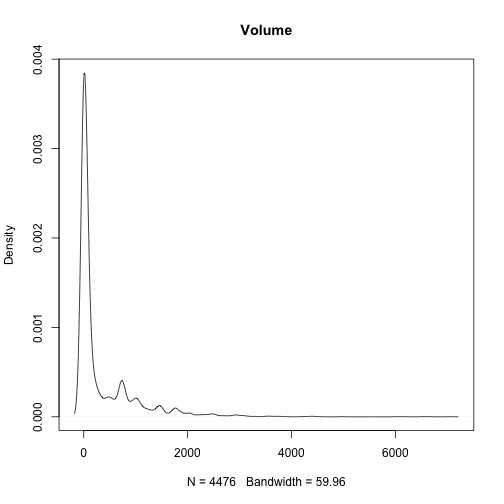

This document was built in Markdown in R 4.0.2, and covers package `lefko3` version 2.3.0.

## CASE STUDIES OF SWEDISH *Lathyrus vernus* POPULATION

### ORGANISM AND POPULATION

  <p style="text-indent: 20px">*Lathyrus vernus* (family Fabaceae) is a long-lived forest herb, native to Europe and large parts of northern Asia. Individuals increase slowly in size and usually flower only after 10-15 years of vegetative growth. Flowering individuals have an average conditional life span of 44.3 years [@ehrlen_how_2002]. *Lathyrus vernus* lacks organs for vegetative spread and individuals are well delimited [@ehrlen_assessing_2002]. One or several erect shoots of up to 40 cm height emerge from a subterranean rhizome in March-April. Flowering occurs about four weeks after shoot emergence. Shoot growth is determinate, and the number of flowers is determined in the previous year [@ehrlen_storage_2001]. Individuals may not produce above-ground structures every year but can remain dormant in one season. *Lathyrus vernus* is self-compatible but requires visits from bumble-bees to produce seeds. Individuals produce few, large seeds and establishment from seeds is relatively frequent [@ehrlen_seedling_1996,]. The pre-dispersal seed predator *Bruchus atomarius* often consumes a large fraction of developing seeds, and roe deer (*Capreolus capreolus*) sometimes consume the shoots [@ehrlen_timing_2009].</p>
  
  <p style="text-indent: 20px">Data for this study were collected from six permanent plots in a population of *L. vernus* located in a deciduous forest in the Tullgarn area, SE Sweden (58.9496 N, 17.6097 E), during 1988–1991 [@ehrlen_demography_1995]. The six plots were relatively similar with regard to soil type, elevation, slope, and canopy cover. Within each plot, all individuals were marked with numbered tags that remained over the study period, and their locations were carefully mapped. New individuals were included in the study in each year. Individuals were recorded at least three times every growth season. At the time of shoot emergence, we recorded whether individuals were alive and produced above-ground shoots, and if shoots had been grazed. During flowering, we recorded flower number and the height and diameter of all shoots. At fruit maturation, we counted the number of intact and damaged seeds. To derive a measure of above-ground size for each individual, we calculated the volume of each shoot as $\pi$ × ($\frac{1}{2}$diameter)<sup>2</sup> × height, and summed the volumes of all shoots. This measure is closely correlated with the dry mass of aboveground tissues (r<sup>2</sup> = 0.924, <i>P</i> < 0.001, n = 50, log-transformed values; Ehrlen 1995). Size of individuals that had been grazed was estimated based on measures of shoot diameter in grazed shoots, and the relationship between shoot diameter and shoot height in non-grazed individuals. Only individuals with an aboveground volume of more than 230 mm<sup>3</sup> flowered and produced fruits during this study. Individuals that lacked aboveground structures in one season but reappeared in the following year were considered dormant. Individuals that lacked aboveground structures in two subsequent seasons were considered dead from the year in which they first lacked aboveground structures. Probabilities of seeds surviving to the next year, and of being present as seedlings or seeds in the soil seed bank, were derived from separate yearly sowing experiments in separate plots adjacent to each subplot [@ehrlen_seedling_1996].</p>

### ANALYSES WITH *LATHYRUS* DATA

  <p style="text-indent: 20px">We will analyze these data in three different ways to illustrate the ways in which package `lefko3` can be used:</p> 
  
  1) through the estimation of **raw MPMs**, with the intention of producing matrices similar to those published in Ehrlén [-@ehrlen_dynamics_2000]; 
  
  2) through the estimation of **function-derived MPMs** using a stage classification different from Ehrlén [-@ehrlen_dynamics_2000], developed using the natural logarithm of the size measure used in that study; and
  
  3) through the construction of a complex **integral projection model**.
  
### Analysis 1: Raw MPM estimation

  <p style="text-indent: 20px">Here we will attempt to estimate matrices similar to and based on the dataset used in Ehrlén [-@ehrlen_dynamics_2000]. These matrices will not be the same, as the dataset currently includes more individuals for those years as well as an extra year of data. It also includes differences in classification due to different assumptions regarding transitions to and from vegetative dormancy, which is an unobservable life history stage. However, the matrices will be very similar.</p>
  
#### Step 1. Data characterization and reorganization

  <p style="text-indent: 20px">The dataset that we have provided is organized in horizontal format, meaning that rows correspond to unique individuals and columns correspond to individual condition in particular years. Looking at the original Excel spreadsheet, you will note a repeating pattern in the names of the columns. Package `lefko3` includes functions to handle data in horizontal format based on these patterns, as well as functions to handle vertically formatted data (i.e. data for individuals is broken up across rows, where each row is a unique combination of individual and year in time *t*).</p>

</img>

  <p style="text-indent: 20px">This dataset includes information on 1119 individuals, so there are 1119 rows with data (not counting the header). There are 38 columns. The first two columns are variables giving identifying information about each individual, with each individual's data entirely restricted to one row. This is followed by four sets of nine columns, each named `VolumeXX`, `lnVolXX`, `FCODEXX`, `FlowXX`, `IntactseedXX`, `Dead19XX`, `DormantXX`, `Missing19XX`, and `SeedlingXX`, with the `XX` in each case corresponding to the year of observation and with years organized consecutively. Thus, columns 3-11 refer to year 1988, columns 12-20 refer to year 1989, etc. To properly conduct this exercise, we need to know the exact number of years used, which is 4 years here (includes all years from and including 1988 to 1991), we need the columns to be repeated in the same order in each year, and we need the years in consecutive order with no extra columns between them.</p>

  <p style="text-indent: 20px">First, we load the dataset, and look at its dimensions.</p>

```r
rm(list=ls(all=TRUE))

library(lefko3)

data(lathyrus)
dim(lathyrus)
#> [1] 1119   38
```

  <p style="text-indent: 20px">After looking over the dataset, we need to create a **stageframe** describing the life history of the species and linking it to the data. A stageframe is a data frame that describes all stages in the life history of the organism, in a way usable by the functions in this package and using stage names and classifications that match the data. It needs to include complete descriptions of all stages that occur in the dataset, with each stage defined uniquely. Since this object can be used for automated classification of individuals, all sizes, reproductive states, and other characteristics defining each stage in the dataset need to be accounted for explicitly. This can be difficult if a few data points exist outside the range of sizes specified in the stageframe, so great care must be taken to include all size values and values of other descriptor variables occurring within the dataset. The final description of each stage occurring in the dataset may not overlap completely with any other stage also found in the dataset, although partial overlap is expected.</p>
  
  <p style="text-indent: 20px">Here, we create a stageframe named `lathframe` based on the classification used in Ehrlén [-@ehrlen_dynamics_2000]. We build this by creating vectors of the values describing each stage, always in the same order. Of particular note are the vectors input as `sizes` and `binhalfwidth` in the `sf_create` function. In the case where sizes are binned, the values input in the former are the central values of each bin, while the latter represents one-half of the width of the bin. If size values are not to be binned, then narrow binwidths can be used. For example, in this dataset, vegetatively dormant individuals necessarily have a size of 0, and so we can set the `halfbinwidth` for this stage to 0.5.</p>

```r
sizevector <- c(0, 100, 13, 127, 3730, 3800, 0)
stagevector <- c("Sd", "Sdl", "VSm", "Sm", "VLa", "Flo", "Dorm")
repvector <- c(0, 0, 0, 0, 0, 1, 0)
obsvector <- c(0, 1, 1, 1, 1, 1, 0)
matvector <- c(0, 0, 1, 1, 1, 1, 1)
immvector <- c(1, 1, 0, 0, 0, 0, 0)
propvector <- c(1, 0, 0, 0, 0, 0, 0)
indataset <- c(0, 1, 1, 1, 1, 1, 1)
binvec <- c(0, 100, 11, 103, 3500, 3800, 0.5)

lathframe <- sf_create(sizes = sizevector, stagenames = stagevector, repstatus = repvector, 
                       obsstatus = obsvector, matstatus = matvector, immstatus = immvector, 
                       indataset = indataset, binhalfwidth = binvec, propstatus = propvector)
```

To be useful to others reading your work, or to yourself in the future, it helps to add text descriptions of the stages. Here, we also add some descriptions to this stageframe as comments. Type `lathframe` after running the following to see the structure.

```r
lathframe$comments <- c("Dormant seed", "Seedling", "Very small vegetative", 
                        "Small vegetative", "Very large vegetative", 
                        "Flowering", "Dormant")
```
  
  <p style="text-indent: 20px">A further important point has to do with the meaning of 0 sizes. In most cases, a size of 0 will mean that the individual is alive but unobservable. However, a size of 0 may have different meanings in other cases, such as when the size metric used is a logarithm and so values of 0 and lower are possible in observable individuals in the dataset. The dataset should be explored carefully for these situations, particularly in the case of the creation of a function-based matrix, such as an IPM, in order to make sure that the stageframe accurately describes and matches the values actually occurring in the dataset.</p>
  
  <p style="text-indent: 20px">Once the stageframe is created, we can reorganize the dataset into *vertical format*. Here, vertical format is a way of organizing demogaphic data in which each row corresponds to the state of a single individual in two (if ahistorical) or three (if historical) consecutive time steps. We use the `verticalize3()` function to handle this and create a *historical vertical dataset*, as below.</p>

```r
lathvert <- verticalize3(lathyrus, noyears = 4, firstyear = 1988, patchidcol = "SUBPLOT", 
                         individcol = "GENET", blocksize = 9, juvcol = "Seedling1988", 
                         size1col = "Volume88", repstr1col = "FCODE88", 
                         fec1col = "Intactseed88", dead1col = "Dead1988", 
                         nonobs1col = "Dormant1988", stageassign = lathframe, 
                         stagesize = "sizea", censorcol = "Missing1988", 
                         censorkeep = NA, censor = TRUE)

summary(lathvert)
#>      rowid        popid   patchid   individ              year2        firstseen       lastseen        obsage      
#>  Min.   :   1.0   :2527   1:673   Length:2527        Min.   :1988   Min.   :   0   Min.   :   0   Min.   :0.0000  
#>  1st Qu.: 237.0           2:202   Class :character   1st Qu.:1988   1st Qu.:1988   1st Qu.:1991   1st Qu.:0.0000  
#>  Median : 522.0           3:556   Mode  :character   Median :1989   Median :1988   Median :1991   Median :1.0000  
#>  Mean   : 537.3           4:469                      Mean   :1989   Mean   :1979   Mean   :1981   Mean   :0.8219  
#>  3rd Qu.: 820.5           5:308                      3rd Qu.:1990   3rd Qu.:1988   3rd Qu.:1991   3rd Qu.:1.0000  
#>  Max.   :1118.0           6:319                      Max.   :1990   Max.   :1990   Max.   :1991   Max.   :2.0000  
#>                                                                                                                   
#>   obslifespan        sizea1          repstra1          feca1          fec1added         juvgiven1         obsstatus1    
#>  Min.   :0.000   Min.   :   0.0   Min.   :0.0000   Min.   : 0.000   Min.   : 0.0000   Min.   :0.00000   Min.   :0.0000  
#>  1st Qu.:2.000   1st Qu.:   0.0   1st Qu.:0.0000   1st Qu.: 0.000   1st Qu.: 0.0000   1st Qu.:0.00000   1st Qu.:0.0000  
#>  Median :3.000   Median :   9.0   Median :0.0000   Median : 0.000   Median : 0.0000   Median :0.00000   Median :1.0000  
#>  Mean   :2.437   Mean   : 387.3   Mean   :0.2161   Mean   : 2.145   Mean   : 0.9889   Mean   :0.06292   Mean   :0.5548  
#>  3rd Qu.:3.000   3rd Qu.: 624.6   3rd Qu.:0.0000   3rd Qu.: 0.000   3rd Qu.: 0.0000   3rd Qu.:0.00000   3rd Qu.:1.0000  
#>  Max.   :3.000   Max.   :7032.0   Max.   :1.0000   Max.   :66.000   Max.   :66.0000   Max.   :1.00000   Max.   :1.0000  
#>                                   NA's   :417      NA's   :1362                                                         
#>    repstatus1       fecstatus1        matstatus1         alive1          stage1           stage1index        sizea2      
#>  Min.   :0.0000   Min.   :0.00000   Min.   :0.0000   Min.   :0.0000   Length:2527        Min.   :0.000   Min.   :   0.0  
#>  1st Qu.:0.0000   1st Qu.:0.00000   1st Qu.:0.0000   1st Qu.:0.0000   Class :character   1st Qu.:0.000   1st Qu.:  12.6  
#>  Median :0.0000   Median :0.00000   Median :1.0000   Median :1.0000   Mode  :character   Median :2.000   Median : 105.6  
#>  Mean   :0.1805   Mean   :0.08983   Mean   :0.5204   Mean   :0.5833                      Mean   :2.135   Mean   : 480.8  
#>  3rd Qu.:0.0000   3rd Qu.:0.00000   3rd Qu.:1.0000   3rd Qu.:1.0000                      3rd Qu.:4.000   3rd Qu.: 732.5  
#>  Max.   :1.0000   Max.   :1.00000   Max.   :1.0000   Max.   :1.0000                      Max.   :6.000   Max.   :7032.0  
#>                                                                                                                          
#>     repstra2          feca2          fec2added       juvgiven2        obsstatus2       repstatus2      fecstatus2    
#>  Min.   :0.0000   Min.   : 0.000   Min.   : 0.00   Min.   :0.0000   Min.   :0.0000   Min.   :0.000   Min.   :0.0000  
#>  1st Qu.:0.0000   1st Qu.: 0.000   1st Qu.: 0.00   1st Qu.:0.0000   1st Qu.:1.0000   1st Qu.:0.000   1st Qu.:0.0000  
#>  Median :0.0000   Median : 0.000   Median : 0.00   Median :0.0000   Median :1.0000   Median :0.000   Median :0.0000  
#>  Mean   :0.2508   Mean   : 4.802   Mean   : 1.14   Mean   :0.1112   Mean   :0.9454   Mean   :0.237   Mean   :0.1053  
#>  3rd Qu.:1.0000   3rd Qu.: 6.000   3rd Qu.: 0.00   3rd Qu.:0.0000   3rd Qu.:1.0000   3rd Qu.:0.000   3rd Qu.:0.0000  
#>  Max.   :1.0000   Max.   :66.000   Max.   :66.00   Max.   :1.0000   Max.   :1.0000   Max.   :1.000   Max.   :1.0000  
#>  NA's   :139      NA's   :1927                                                                                       
#>    matstatus2         alive2     stage2           stage2index        sizea3          repstra3          feca3       
#>  Min.   :0.0000   Min.   :1   Length:2527        Min.   :1.000   Min.   :   0.0   Min.   :0.0000   Min.   : 0.000  
#>  1st Qu.:1.0000   1st Qu.:1   Class :character   1st Qu.:2.000   1st Qu.:  10.0   1st Qu.:0.0000   1st Qu.: 0.000  
#>  Median :1.0000   Median :1   Mode  :character   Median :3.000   Median :  72.0   Median :0.0000   Median : 2.000  
#>  Mean   :0.8888   Mean   :1                      Mean   :3.424   Mean   : 389.7   Mean   :0.2614   Mean   : 5.969  
#>  3rd Qu.:1.0000   3rd Qu.:1                      3rd Qu.:5.000   3rd Qu.: 543.4   3rd Qu.:1.0000   3rd Qu.: 9.000  
#>  Max.   :1.0000   Max.   :1                      Max.   :6.000   Max.   :6645.8   Max.   :1.0000   Max.   :66.000  
#>                                                                                   NA's   :419      NA's   :1981    
#>    fec3added       juvgiven3   obsstatus3       repstatus3      fecstatus3       matstatus3     alive3      
#>  Min.   : 0.00   Min.   :0   Min.   :0.0000   Min.   :0.000   Min.   :0.0000   Min.   :1    Min.   :0.0000  
#>  1st Qu.: 0.00   1st Qu.:0   1st Qu.:1.0000   1st Qu.:0.000   1st Qu.:0.0000   1st Qu.:1    1st Qu.:1.0000  
#>  Median : 0.00   Median :0   Median :1.0000   Median :0.000   Median :0.0000   Median :1    Median :1.0000  
#>  Mean   : 1.29   Mean   :0   Mean   :0.8346   Mean   :0.218   Mean   :0.1116   Mean   :1    Mean   :0.9224  
#>  3rd Qu.: 0.00   3rd Qu.:0   3rd Qu.:1.0000   3rd Qu.:0.000   3rd Qu.:0.0000   3rd Qu.:1    3rd Qu.:1.0000  
#>  Max.   :66.00   Max.   :0   Max.   :1.0000   Max.   :1.000   Max.   :1.0000   Max.   :1    Max.   :1.0000  
#>                                                                                                             
#>     stage3           stage3index   
#>  Length:2527        Min.   :0.000  
#>  Class :character   1st Qu.:2.000  
#>  Mode  :character   Median :3.000  
#>                     Mean   :3.398  
#>                     3rd Qu.:5.000  
#>                     Max.   :6.000  
#> 
dim(lathvert)
#> [1] 2527   45
```
  
  <p style="text-indent: 20px">It generally pays to explore a dataset thoroughly prior to full analysis. One way to do this is to look at summaries of the dataset after it has been subset to specific cases of interest. For example, after subsetting to only cases in which individuals are vegetatively dormant in time *t*, we can see that this particular stage is actually designated by a size of 0. We can also see, looking at the stage designations and at the dimensions of the aforementioned subset, that vegetative dormancy is reasonably plentiful in this dataset.</p>

```r
summary(lathvert[which(lathvert$stage2 == "Dorm"),])
#>      rowid        popid  patchid   individ              year2        firstseen       lastseen        obsage     
#>  Min.   :   1.0   :138   1:29    Length:138         Min.   :1989   Min.   :   0   Min.   :   0   Min.   :0.000  
#>  1st Qu.: 303.2          2:14    Class :character   1st Qu.:1989   1st Qu.:1988   1st Qu.:1991   1st Qu.:1.000  
#>  Median : 493.5          3:42    Mode  :character   Median :1989   Median :1988   Median :1991   Median :1.000  
#>  Mean   : 526.7          4:13                       Mean   :1989   Mean   :1815   Mean   :1818   Mean   :1.239  
#>  3rd Qu.: 861.8          5:31                       3rd Qu.:1990   3rd Qu.:1988   3rd Qu.:1991   3rd Qu.:2.000  
#>  Max.   :1079.0          6: 9                       Max.   :1990   Max.   :1989   Max.   :1991   Max.   :2.000  
#>                                                                                                                 
#>   obslifespan        sizea1           repstra1          feca1          fec1added        juvgiven1        obsstatus1    
#>  Min.   :0.000   Min.   :   0.00   Min.   :0.0000   Min.   : 0.000   Min.   : 0.000   Min.   :0.0000   Min.   :0.0000  
#>  1st Qu.:2.000   1st Qu.:  87.45   1st Qu.:0.0000   1st Qu.: 0.000   1st Qu.: 0.000   1st Qu.:0.0000   1st Qu.:1.0000  
#>  Median :3.000   Median : 477.20   Median :0.0000   Median : 0.000   Median : 0.000   Median :0.0000   Median :1.0000  
#>  Mean   :2.551   Mean   : 595.48   Mean   :0.3178   Mean   : 4.561   Mean   : 1.355   Mean   :0.0942   Mean   :0.9348  
#>  3rd Qu.:3.000   3rd Qu.: 732.50   3rd Qu.:1.0000   3rd Qu.: 7.000   3rd Qu.: 0.000   3rd Qu.:0.0000   3rd Qu.:1.0000  
#>  Max.   :3.000   Max.   :2941.00   Max.   :1.0000   Max.   :30.000   Max.   :30.000   Max.   :1.0000   Max.   :1.0000  
#>                                    NA's   :9        NA's   :97                                                         
#>    repstatus1       fecstatus1       matstatus1         alive1     stage1           stage1index        sizea2     repstra2  
#>  Min.   :0.0000   Min.   :0.0000   Min.   :0.0000   Min.   :1   Length:138         Min.   :1.000   Min.   :0   Min.   : NA  
#>  1st Qu.:0.0000   1st Qu.:0.0000   1st Qu.:1.0000   1st Qu.:1   Class :character   1st Qu.:3.000   1st Qu.:0   1st Qu.: NA  
#>  Median :0.0000   Median :0.0000   Median :1.0000   Median :1   Mode  :character   Median :4.000   Median :0   Median : NA  
#>  Mean   :0.2971   Mean   :0.1232   Mean   :0.9058   Mean   :1                      Mean   :3.833   Mean   :0   Mean   :NaN  
#>  3rd Qu.:1.0000   3rd Qu.:0.0000   3rd Qu.:1.0000   3rd Qu.:1                      3rd Qu.:5.000   3rd Qu.:0   3rd Qu.: NA  
#>  Max.   :1.0000   Max.   :1.0000   Max.   :1.0000   Max.   :1                      Max.   :6.000   Max.   :0   Max.   : NA  
#>                                                                                                                NA's   :138  
#>      feca2       fec2added   juvgiven2   obsstatus2   repstatus2   fecstatus2   matstatus2     alive2     stage2         
#>  Min.   : NA   Min.   :0   Min.   :0   Min.   :0    Min.   :0    Min.   :0    Min.   :1    Min.   :1   Length:138        
#>  1st Qu.: NA   1st Qu.:0   1st Qu.:0   1st Qu.:0    1st Qu.:0    1st Qu.:0    1st Qu.:1    1st Qu.:1   Class :character  
#>  Median : NA   Median :0   Median :0   Median :0    Median :0    Median :0    Median :1    Median :1   Mode  :character  
#>  Mean   :NaN   Mean   :0   Mean   :0   Mean   :0    Mean   :0    Mean   :0    Mean   :1    Mean   :1                     
#>  3rd Qu.: NA   3rd Qu.:0   3rd Qu.:0   3rd Qu.:0    3rd Qu.:0    3rd Qu.:0    3rd Qu.:1    3rd Qu.:1                     
#>  Max.   : NA   Max.   :0   Max.   :0   Max.   :0    Max.   :0    Max.   :0    Max.   :1    Max.   :1                     
#>  NA's   :138                                                                                                             
#>   stage2index     sizea3           repstra3          feca3       fec3added         juvgiven3   obsstatus3    
#>  Min.   :6    Min.   :   0.00   Min.   :0.0000   Min.   : 0    Min.   : 0.0000   Min.   :0   Min.   :0.0000  
#>  1st Qu.:6    1st Qu.:  16.02   1st Qu.:0.0000   1st Qu.: 0    1st Qu.: 0.0000   1st Qu.:0   1st Qu.:1.0000  
#>  Median :6    Median :  88.45   Median :0.0000   Median : 0    Median : 0.0000   Median :0   Median :1.0000  
#>  Mean   :6    Mean   : 242.33   Mean   :0.1111   Mean   : 3    Mean   : 0.2826   Mean   :0   Mean   :0.8478  
#>  3rd Qu.:6    3rd Qu.: 300.90   3rd Qu.:0.0000   3rd Qu.: 4    3rd Qu.: 0.0000   3rd Qu.:0   3rd Qu.:1.0000  
#>  Max.   :6    Max.   :2637.60   Max.   :1.0000   Max.   :17    Max.   :17.0000   Max.   :0   Max.   :1.0000  
#>                                 NA's   :21       NA's   :125                                                 
#>    repstatus3       fecstatus3        matstatus3     alive3     stage3           stage3index   
#>  Min.   :0.0000   Min.   :0.00000   Min.   :1    Min.   :1   Length:138         Min.   :2.000  
#>  1st Qu.:0.0000   1st Qu.:0.00000   1st Qu.:1    1st Qu.:1   Class :character   1st Qu.:3.000  
#>  Median :0.0000   Median :0.00000   Median :1    Median :1   Mode  :character   Median :3.000  
#>  Mean   :0.0942   Mean   :0.02899   Mean   :1    Mean   :1                      Mean   :3.746  
#>  3rd Qu.:0.0000   3rd Qu.:0.00000   3rd Qu.:1    3rd Qu.:1                      3rd Qu.:4.000  
#>  Max.   :1.0000   Max.   :1.00000   Max.   :1    Max.   :1                      Max.   :6.000  
#> 
dim(lathvert[which(lathvert$stage2 == "Dorm"),])
#> [1] 138  45
```

The fact that dormant individuals have been assigned 0 for size does not affect us in this exercise, because the construction of raw matrices depends on the stage designations rather than on the size classifications. However, if we wished to build function-derived matrices, as in Analyses 2 and 3, then we would need to change any NAs to 0 to proceed.

  <p style="text-indent: 20px">Voilá! Now we will move on to creating a few extra objects that will help us estimate full population projection matrices.</p>
  
#### Step 2. Provide supplemental information for matrix estimation

  <p style="text-indent: 20px">For our next step, we need to create a **reproductive matrix**. This matrix shows which stages are reproductive, which stages they lead to the production of, and at what level reproduction occurs. This matrix is mostly composed of 0s, but fecundity is noted as non-zero entries equal to a scalar multiplier to the full fecundity estimated by `lefko3`. This matrix has rows and columns equal to the number of stages described in the stageframe for this dataset, and the rows and columns refer to these stages in the same order as in the stageframe. In many ways, this matrix looks like a nearly empty population matrix, but notes the per-individual mean modifiers on fecundity for each stage that actually reproduces.</p>
  
  <p style="text-indent: 20px">First, we create a 0 matrix with dimensionality equal to the number of rows in `lathframe`. Then we modify elements corresponding to fecundity by the expected mean seed dormancy probability (row 1), and by the germination rate (row 2). Since only stage 6 (flowering, or Flo) is reproductive, and since reproduction leads to the production of individuals in stage 1 (dormant seed, or Sd) and stage 2 (seedlings, or Sdl), we will alter matrix elements [1, 6] and [2, 6].</p>

```r
lathrepm <- matrix(0, 7, 7)
lathrepm[1, 6] <- 0.345
lathrepm[2, 6] <- 0.054
```

  <p style="text-indent: 20px">Next we will provide some given transitions via an **overwrite table**. In this case, we are providing the seed dormancy probability and germination rate, which in this case are provided as transitions from the dormant seed stage to another year of seed dormancy or a germinated seedling, respectively. Let's start with the ahistorical case.</p>

```r
lathover2 <- overwrite(stage3 = c("Sd", "Sdl"), stage2 = c("Sd", "Sd"), 
                       givenrate = c(0.345, 0.054))
```

And now the historical case. Here we need to show the stages in time step *t*-1 for this to work properly. Note the use of the `"rep"` designation for `Stage1` - this is shorthand telling R to use all reproductive stages for the time interval. Here, there is only one reproductive stage, but in other cases, such as in an IPM, this shorthand notation can represent many stages in a single statement.

```r
lathover3 <- overwrite(stage3 = c("Sd", "Sd", "Sdl"), stage2 = c("Sd", "Sd", "Sd"), 
                       stage1 = c("Sd", "rep", "rep"), givenrate = c(0.345, 0.345, 0.054))
```

  <p style="text-indent: 20px">These two overwrite tables show us that we have survival-transition probabilities (`convtype = 1`), that the given transitions originate from the dormant seed stage (Sd) in time *t* (and reproductive stages in time *t*-1 in the historical case), and the specific values to be used in overwriting: 0.345 and 0.054. If we wished, we could have used the values of transitions to be estimated within this matrix as proxies for these values, in which case the `eststageX` columns would have entries and the `givenrate` column would be blank (see the *Cypripedium candidum* vignette for examples).</p>

  <p style="text-indent: 20px">Now we are read to create some MPMs!</p>
  
#### Step 3. Estimate matrices

  <p style="text-indent: 20px">Now let's create some raw Lefkovitch MPMs starting with the ahistorical case, based on Ehrlén [-@ehrlen_dynamics_2000]. That study shows a mean matrix covering years 1989 and 1990 as time *t*. We will utilize the entire dataset instead, covering 1988 to 1991, as follows.</p>

```r
ehrlen2 <- rlefko2(data = lathvert, stageframe = lathframe, year = "all", 
                   stages = c("stage3", "stage2"), repmatrix = lathrepm, 
                   overwrite = lathover2, yearcol = "year2", 
                   indivcol = "individ")
ehrlen2
#> $A
#> $A[[1]]
#>       [,1]       [,2]    [,3]       [,4]      [,5]       [,6] [,7]
#> [1,] 0.345 0.00000000 0.00000 0.00000000 0.0000000 1.02941848    0
#> [2,] 0.054 0.00000000 0.00000 0.00000000 0.0000000 0.16112637    0
#> [3,] 0.000 0.61855670 0.78125 0.07692308 0.0000000 0.00000000    0
#> [4,] 0.000 0.03092784 0.12500 0.67307692 0.2044199 0.07024793    0
#> [5,] 0.000 0.00000000 0.00000 0.03205128 0.3535912 0.21487603    0
#> [6,] 0.000 0.00000000 0.00000 0.03846154 0.2928177 0.61983471    0
#> [7,] 0.000 0.10309278 0.03125 0.12179487 0.1160221 0.09090909    0
#> 
#> $A[[2]]
#>       [,1]       [,2]       [,3]       [,4]       [,5]       [,6]       [,7]
#> [1,] 0.345 0.00000000 0.00000000 0.00000000 0.00000000 2.83876712 0.00000000
#> [2,] 0.054 0.00000000 0.00000000 0.00000000 0.00000000 0.44432877 0.00000000
#> [3,] 0.000 0.70085470 0.78461538 0.17592593 0.02205882 0.00000000 0.15068493
#> [4,] 0.000 0.02564103 0.06923077 0.61574074 0.32352941 0.18721461 0.50684932
#> [5,] 0.000 0.00000000 0.00000000 0.02314815 0.29411765 0.28767123 0.09589041
#> [6,] 0.000 0.00000000 0.00000000 0.02314815 0.21323529 0.42922374 0.12328767
#> [7,] 0.000 0.02564103 0.01538462 0.08333333 0.10294118 0.08675799 0.12328767
#> 
#> $A[[3]]
#>       [,1]       [,2]        [,3]       [,4]       [,5]       [,6]       [,7]
#> [1,] 0.345 0.00000000 0.000000000 0.00000000 0.00000000 0.86750000 0.00000000
#> [2,] 0.054 0.00000000 0.000000000 0.00000000 0.00000000 0.13578261 0.00000000
#> [3,] 0.000 0.67164179 0.606299213 0.03533569 0.00000000 0.00000000 0.09230769
#> [4,] 0.000 0.00000000 0.173228346 0.45229682 0.05785124 0.04347826 0.29230769
#> [5,] 0.000 0.00000000 0.003937008 0.17667845 0.28925620 0.19565217 0.36923077
#> [6,] 0.000 0.00000000 0.000000000 0.15901060 0.52892562 0.66666667 0.06153846
#> [7,] 0.000 0.05970149 0.039370079 0.12367491 0.09917355 0.07971014 0.18461538
#> 
#> 
#> $U
#> $U[[1]]
#>       [,1]       [,2]    [,3]       [,4]      [,5]       [,6] [,7]
#> [1,] 0.345 0.00000000 0.00000 0.00000000 0.0000000 0.00000000    0
#> [2,] 0.054 0.00000000 0.00000 0.00000000 0.0000000 0.00000000    0
#> [3,] 0.000 0.61855670 0.78125 0.07692308 0.0000000 0.00000000    0
#> [4,] 0.000 0.03092784 0.12500 0.67307692 0.2044199 0.07024793    0
#> [5,] 0.000 0.00000000 0.00000 0.03205128 0.3535912 0.21487603    0
#> [6,] 0.000 0.00000000 0.00000 0.03846154 0.2928177 0.61983471    0
#> [7,] 0.000 0.10309278 0.03125 0.12179487 0.1160221 0.09090909    0
#> 
#> $U[[2]]
#>       [,1]       [,2]       [,3]       [,4]       [,5]       [,6]       [,7]
#> [1,] 0.345 0.00000000 0.00000000 0.00000000 0.00000000 0.00000000 0.00000000
#> [2,] 0.054 0.00000000 0.00000000 0.00000000 0.00000000 0.00000000 0.00000000
#> [3,] 0.000 0.70085470 0.78461538 0.17592593 0.02205882 0.00000000 0.15068493
#> [4,] 0.000 0.02564103 0.06923077 0.61574074 0.32352941 0.18721461 0.50684932
#> [5,] 0.000 0.00000000 0.00000000 0.02314815 0.29411765 0.28767123 0.09589041
#> [6,] 0.000 0.00000000 0.00000000 0.02314815 0.21323529 0.42922374 0.12328767
#> [7,] 0.000 0.02564103 0.01538462 0.08333333 0.10294118 0.08675799 0.12328767
#> 
#> $U[[3]]
#>       [,1]       [,2]        [,3]       [,4]       [,5]       [,6]       [,7]
#> [1,] 0.345 0.00000000 0.000000000 0.00000000 0.00000000 0.00000000 0.00000000
#> [2,] 0.054 0.00000000 0.000000000 0.00000000 0.00000000 0.00000000 0.00000000
#> [3,] 0.000 0.67164179 0.606299213 0.03533569 0.00000000 0.00000000 0.09230769
#> [4,] 0.000 0.00000000 0.173228346 0.45229682 0.05785124 0.04347826 0.29230769
#> [5,] 0.000 0.00000000 0.003937008 0.17667845 0.28925620 0.19565217 0.36923077
#> [6,] 0.000 0.00000000 0.000000000 0.15901060 0.52892562 0.66666667 0.06153846
#> [7,] 0.000 0.05970149 0.039370079 0.12367491 0.09917355 0.07971014 0.18461538
#> 
#> 
#> $F
#> $F[[1]]
#>      [,1] [,2] [,3] [,4] [,5]      [,6] [,7]
#> [1,]    0    0    0    0    0 1.0294185    0
#> [2,]    0    0    0    0    0 0.1611264    0
#> [3,]    0    0    0    0    0 0.0000000    0
#> [4,]    0    0    0    0    0 0.0000000    0
#> [5,]    0    0    0    0    0 0.0000000    0
#> [6,]    0    0    0    0    0 0.0000000    0
#> [7,]    0    0    0    0    0 0.0000000    0
#> 
#> $F[[2]]
#>      [,1] [,2] [,3] [,4] [,5]      [,6] [,7]
#> [1,]    0    0    0    0    0 2.8387671    0
#> [2,]    0    0    0    0    0 0.4443288    0
#> [3,]    0    0    0    0    0 0.0000000    0
#> [4,]    0    0    0    0    0 0.0000000    0
#> [5,]    0    0    0    0    0 0.0000000    0
#> [6,]    0    0    0    0    0 0.0000000    0
#> [7,]    0    0    0    0    0 0.0000000    0
#> 
#> $F[[3]]
#>      [,1] [,2] [,3] [,4] [,5]      [,6] [,7]
#> [1,]    0    0    0    0    0 0.8675000    0
#> [2,]    0    0    0    0    0 0.1357826    0
#> [3,]    0    0    0    0    0 0.0000000    0
#> [4,]    0    0    0    0    0 0.0000000    0
#> [5,]    0    0    0    0    0 0.0000000    0
#> [6,]    0    0    0    0    0 0.0000000    0
#> [7,]    0    0    0    0    0 0.0000000    0
#> 
#> 
#> $hstages
#> NULL
#> 
#> $ahstages
#>   new_stage_id orig_stage_id original_size bin_size_ctr bin_size_min bin_size_max repstatus obsstatus propstatus immstatus
#> 1            1            Sd             0            0          0.0          0.0         0         0          1         1
#> 2            2           Sdl           100          100          0.0        200.0         0         1          0         1
#> 3            3           VSm            13           13          2.0         24.0         0         1          0         0
#> 4            4            Sm           127          127         24.0        230.0         0         1          0         0
#> 5            5           VLa          3730         3730        230.0       7230.0         0         1          0         0
#> 6            6           Flo          3800         3800          0.0       7600.0         1         1          0         0
#> 7            7          Dorm             0            0         -0.5          0.5         0         0          0         0
#>   matstatus indataset bin_size_width bin_raw_halfwidth alive              comments stageno
#> 1         0         0              0               0.0     1          Dormant seed       1
#> 2         0         1            200             100.0     1              Seedling       2
#> 3         1         1             22              11.0     1 Very small vegetative       3
#> 4         1         1            206             103.0     1      Small vegetative       4
#> 5         1         1           7000            3500.0     1 Very large vegetative       5
#> 6         1         1           7600            3800.0     1             Flowering       6
#> 7         1         1              1               0.5     1               Dormant       7
#> 
#> $labels
#>   pop patch year2
#> 1  NA    NA  1988
#> 2  NA    NA  1989
#> 3  NA    NA  1990
#> 
#> $matrixqc
#> [1] 74  6  3
#> 
#> $dataqc
#> [1]  276 2527
#> 
#> attr(,"class")
#> [1] "lefkoMat"
```
  <p style="text-indent: 20px">The output from this analysis includes is a `lefkoMat` object, which is a list object with the following elements:</p>
  
  **A**: a list of full population projection matrices, in order of population, patch, and year
  
  **U**: a list of matrices showing only survival-transition elements, in the same order as A
  
  **F**: a list of matrices showing only fecundity elements, in the same order as A
  
  **hstages**: a data frame showing the order of paired stages (given if matrices are historical, otherwise NA)
  
  **ahstages**: this is the stageframe used in analysis, with stages reordered and edited as they occur in the matrix
  
  **labels**: a table showing the order of matrices, according to population, patch, and year
  
  **matrixqc**: a short vector used in `summary` statements to describe the overall quality of each matrix
  
  **dataqc**: a short vector used in `summary` statements to describe key sampling aspects of the dataset
  
  <p style="text-indent: 20px">The input for the `rlefko2()` function includes `year = "all"`, which can be changed to `year = c(1989, 1990)` to focus just on years 1989 and 1990, as in the paper, or `year = 1989` to focus exclusively on the transition from 1989 to 1990 (the year entered is the year in time *t*). Package `lefko3` includes a great deal of flexibility here, and can quickly estimate many matrices covering all of the populations, patches, and years occurring in a specific dataset. The function-based matrix approach in the next section will showcase more of this flexibility.</p>

  <p style="text-indent: 20px">We can understand `lefkoMat` objects in greater detail through the summary `summary` function.</p>

```r
summary(ehrlen2)
#> 
#> This lefkoMat object contains 3 matrices.
#> 
#> Each matrix is a square matrix with 7 rows and columns, and a total of 49 elements.
#> A total of 74 survival transitions were estimated, with 24.6666666666667 per matrix.
#> A total of 6 fecundity transitions were estimated, with 2 per matrix.
#> 
#> The dataset contains a total of 276 unique individuals and 2527 unique transitions.
#> NULL
```

  <p style="text-indent: 20px">We start off learning that 3 matrices were estimated. The following line notes the dimensionality of those matrices. The third, fourth, and fifth lines of the summary are particularly important: they show how many elements were actually estimated, both overall and per matrix, and the number of individuals and transitions the matrices are based on. Matrices are often overparameterized in population ecology, meaning that the number of elements estimated is quite high given the size of the dataset. It is typical for population ecologists to consider the total number of transitions in a dataset as an indication of the statistical power going into the creation of the MPM. However, the number of individuals used is just as important because each transition that an individual experiences is dependent on the other transitions that it also experiences. Indeed, this is the fundamental point that led to the development of historical matrices and of this package - **the assumption that the status of an individual in the next time step is dependent only on its current state is too simplistic and leads to pseudoreplication, among other problems**. So, this output can be very helpful to understand the degree to which estimated matrices might be overparameterized or pseudoreplicated. With roughly 27 elements estimated per matrix, and the dataset containing 276 individuals long-lived enough to yield over 2500 transitions, overparameterization does not appear to be a problem, although pseudoreplication might certainly be.</p>

  <p style="text-indent: 20px">Now let's look at historical matrices. Because of the size of historical matrices, we will only show the summary.</p>

```r
ehrlen3 <- rlefko3(data = lathvert, stageframe = lathframe, year = c(1989, 1990), 
                   stages = c("stage3", "stage2", "stage1"), repmatrix = lathrepm, 
                   overwrite = lathover3, yearcol = "year2", 
                   indivcol = "individ")

summary(ehrlen3)
#> 
#> This lefkoMat object contains 2 matrices.
#> 
#> Each matrix is a square matrix with 49 rows and columns, and a total of 2401 elements.
#> A total of 151 survival transitions were estimated, with 75.5 per matrix.
#> A total of 14 fecundity transitions were estimated, with 7 per matrix.
#> 
#> The dataset contains a total of 276 unique individuals and 2527 unique transitions.
#> NULL
```

  <p style="text-indent: 20px">The summary output shows a number of fundamental differences here. First, there is one less matrix estimated in the historical case than in the ahistorical case because, in the case of raw historical matrices, three consecutive time steps of data are needed to estimate each transition instead of two. Second, these matrices are quite a bit bigger than ahistorical matrices, with the number of rows and columns generally equaling the number of ahistorical rows and columns squared (although this number is sometimes smaller). Finally, a much greater proportion of each matrix is composed of 0s in the historical case than in the ahistorical case. This is because historical matrices are primarily composed of structural 0s, which works against overparameterization and helps make more realistic matrices.</p>

  <p style="text-indent: 20px">We can see the impact of structural zeroes by eliminating some of them in the process of matrix estimation. The easy way to do that is to set `reduce = TRUE` within the `rlefko3()` call, which eliminates stage pairs in which both column and row are zero vectors. This will end up giving us matrices with 19 fewer rows and columns.</p>

```r
ehrlen3red <- rlefko3(data = lathvert, stageframe = lathframe, year = c(1989, 1990), 
                   stages = c("stage3", "stage2", "stage1"), repmatrix = lathrepm, 
                   overwrite = lathover3, yearcol = "year2", 
                   indivcol = "individ", reduce = TRUE)

summary(ehrlen3red)
#> 
#> This lefkoMat object contains 2 matrices.
#> 
#> Each matrix is a square matrix with 30 rows and columns, and a total of 900 elements.
#> A total of 151 survival transitions were estimated, with 75.5 per matrix.
#> A total of 14 fecundity transitions were estimated, with 7 per matrix.
#> 
#> The dataset contains a total of 276 unique individuals and 2527 unique transitions.
#> NULL
```
  <p style="text-indent: 20px">Next we will create a mean ahistorical matrix. 

```r
ehrlen2mean <- lmean(ehrlen2)
ehrlen2mean
#> $A
#> $A[[1]]
#>       [,1]       [,2]        [,3]       [,4]        [,5]       [,6]       [,7]
#> [1,] 0.345 0.00000000 0.000000000 0.00000000 0.000000000 1.57856187 0.00000000
#> [2,] 0.054 0.00000000 0.000000000 0.00000000 0.000000000 0.24707925 0.00000000
#> [3,] 0.000 0.66368440 0.724054866 0.09606156 0.007352941 0.00000000 0.08099754
#> [4,] 0.000 0.01885629 0.122486372 0.58037149 0.195266847 0.10031360 0.26638567
#> [5,] 0.000 0.00000000 0.001312336 0.07729263 0.312321669 0.23273315 0.15504039
#> [6,] 0.000 0.00000000 0.000000000 0.07354010 0.344992865 0.57190837 0.06160871
#> [7,] 0.000 0.06281177 0.028668231 0.10960104 0.106045610 0.08579241 0.10263435
#> 
#> $A[[2]]
#>       [,1]       [,2]        [,3]       [,4]        [,5]       [,6]       [,7]
#> [1,] 0.345 0.00000000 0.000000000 0.00000000 0.000000000 1.57856187 0.00000000
#> [2,] 0.054 0.00000000 0.000000000 0.00000000 0.000000000 0.24707925 0.00000000
#> [3,] 0.000 0.66368440 0.724054866 0.09606156 0.007352941 0.00000000 0.08099754
#> [4,] 0.000 0.01885629 0.122486372 0.58037149 0.195266847 0.10031360 0.26638567
#> [5,] 0.000 0.00000000 0.001312336 0.07729263 0.312321669 0.23273315 0.15504039
#> [6,] 0.000 0.00000000 0.000000000 0.07354010 0.344992865 0.57190837 0.06160871
#> [7,] 0.000 0.06281177 0.028668231 0.10960104 0.106045610 0.08579241 0.10263435
#> 
#> 
#> $U
#> $U[[1]]
#>       [,1]       [,2]        [,3]       [,4]        [,5]       [,6]       [,7]
#> [1,] 0.345 0.00000000 0.000000000 0.00000000 0.000000000 0.00000000 0.00000000
#> [2,] 0.054 0.00000000 0.000000000 0.00000000 0.000000000 0.00000000 0.00000000
#> [3,] 0.000 0.66368440 0.724054866 0.09606156 0.007352941 0.00000000 0.08099754
#> [4,] 0.000 0.01885629 0.122486372 0.58037149 0.195266847 0.10031360 0.26638567
#> [5,] 0.000 0.00000000 0.001312336 0.07729263 0.312321669 0.23273315 0.15504039
#> [6,] 0.000 0.00000000 0.000000000 0.07354010 0.344992865 0.57190837 0.06160871
#> [7,] 0.000 0.06281177 0.028668231 0.10960104 0.106045610 0.08579241 0.10263435
#> 
#> $U[[2]]
#>       [,1]       [,2]        [,3]       [,4]        [,5]       [,6]       [,7]
#> [1,] 0.345 0.00000000 0.000000000 0.00000000 0.000000000 0.00000000 0.00000000
#> [2,] 0.054 0.00000000 0.000000000 0.00000000 0.000000000 0.00000000 0.00000000
#> [3,] 0.000 0.66368440 0.724054866 0.09606156 0.007352941 0.00000000 0.08099754
#> [4,] 0.000 0.01885629 0.122486372 0.58037149 0.195266847 0.10031360 0.26638567
#> [5,] 0.000 0.00000000 0.001312336 0.07729263 0.312321669 0.23273315 0.15504039
#> [6,] 0.000 0.00000000 0.000000000 0.07354010 0.344992865 0.57190837 0.06160871
#> [7,] 0.000 0.06281177 0.028668231 0.10960104 0.106045610 0.08579241 0.10263435
#> 
#> 
#> $F
#> $F[[1]]
#>      [,1] [,2] [,3] [,4] [,5]      [,6] [,7]
#> [1,]    0    0    0    0    0 1.5785619    0
#> [2,]    0    0    0    0    0 0.2470792    0
#> [3,]    0    0    0    0    0 0.0000000    0
#> [4,]    0    0    0    0    0 0.0000000    0
#> [5,]    0    0    0    0    0 0.0000000    0
#> [6,]    0    0    0    0    0 0.0000000    0
#> [7,]    0    0    0    0    0 0.0000000    0
#> 
#> $F[[2]]
#>      [,1] [,2] [,3] [,4] [,5]      [,6] [,7]
#> [1,]    0    0    0    0    0 1.5785619    0
#> [2,]    0    0    0    0    0 0.2470792    0
#> [3,]    0    0    0    0    0 0.0000000    0
#> [4,]    0    0    0    0    0 0.0000000    0
#> [5,]    0    0    0    0    0 0.0000000    0
#> [6,]    0    0    0    0    0 0.0000000    0
#> [7,]    0    0    0    0    0 0.0000000    0
#> 
#> 
#> $hstages
#> NULL
#> 
#> $ahstages
#>   new_stage_id orig_stage_id original_size bin_size_ctr bin_size_min bin_size_max repstatus obsstatus propstatus immstatus
#> 1            1            Sd             0            0          0.0          0.0         0         0          1         1
#> 2            2           Sdl           100          100          0.0        200.0         0         1          0         1
#> 3            3           VSm            13           13          2.0         24.0         0         1          0         0
#> 4            4            Sm           127          127         24.0        230.0         0         1          0         0
#> 5            5           VLa          3730         3730        230.0       7230.0         0         1          0         0
#> 6            6           Flo          3800         3800          0.0       7600.0         1         1          0         0
#> 7            7          Dorm             0            0         -0.5          0.5         0         0          0         0
#>   matstatus indataset bin_size_width bin_raw_halfwidth alive              comments stageno
#> 1         0         0              0               0.0     1          Dormant seed       1
#> 2         0         1            200             100.0     1              Seedling       2
#> 3         1         1             22              11.0     1 Very small vegetative       3
#> 4         1         1            206             103.0     1      Small vegetative       4
#> 5         1         1           7000            3500.0     1 Very large vegetative       5
#> 6         1         1           7600            3800.0     1             Flowering       6
#> 7         1         1              1               0.5     1               Dormant       7
#> 
#> $labels
#>   pop patch
#> 1   1     1
#> 2   1   All
#> 
#> $matrixqc
#> [1] 56  4  2
#> 
#> $dataqc
#> [1]  276 2527
#> 
#> attr(,"class")
#> [1] "lefkoMat"
```
  
  <p style="text-indent: 20px">First of all, let's take a look at the structure of the above output. Function `lmean()` creates a `lefkoMat` object, just as `rlefko()` does, and so we have the main composite mean matrix (shown in element `A`), as well as the mean survival-transition matrix (`U`) and the mean fecundity matrix (`F`), followed by a section outlining the definitions and order of historical paired stages (`hstages`, shown here as `NA` because the matrices are ahistorical), a section outlining the actual stages as outlined in the `stageframe` object used to create these matrices (`ahstages`), a section outlining the definitions and order of the matrices (`labels`), and then two quality control sections used in output for the `summary()` function (`matrixqc` and `dataqc`). So, all necessary information is retained for ease of use, and to focus in on just the main mean matrix itself, we can call the first matrix of object `A`.</p>

```r
ehrlen2mean$A[[1]]
#>       [,1]       [,2]        [,3]       [,4]        [,5]       [,6]       [,7]
#> [1,] 0.345 0.00000000 0.000000000 0.00000000 0.000000000 1.57856187 0.00000000
#> [2,] 0.054 0.00000000 0.000000000 0.00000000 0.000000000 0.24707925 0.00000000
#> [3,] 0.000 0.66368440 0.724054866 0.09606156 0.007352941 0.00000000 0.08099754
#> [4,] 0.000 0.01885629 0.122486372 0.58037149 0.195266847 0.10031360 0.26638567
#> [5,] 0.000 0.00000000 0.001312336 0.07729263 0.312321669 0.23273315 0.15504039
#> [6,] 0.000 0.00000000 0.000000000 0.07354010 0.344992865 0.57190837 0.06160871
#> [7,] 0.000 0.06281177 0.028668231 0.10960104 0.106045610 0.08579241 0.10263435
```

  <p style="text-indent: 20px">Matrix designations make an impact on what we see in the output to `lmean`. Here, we see two matrices, but they are actually completely equal, because the first matrix is the mean matrix for the first patch, and the second matrix is a grand mean of patch-level means. Since there is only one patch analyzed, the patch-level mean matrix and the grand mean matrix are equal. We would see additional matrices if we had split our data by population and/or patch and asked for means for each. To see the exact specifications for each matrix, we can look at the `labels` component of our mean `lefkoMat` object.</p>

```r
ehrlen2mean$labels
#>   pop patch
#> 1   1     1
#> 2   1   All
```

The designations A and 1 are the default symbols used for population and patch, respectively, when no designations are supplied. This scenario is generally the case when no such division is made in the dataset.

  <p style="text-indent: 20px">We may wish to check for errors by assessing the survival of ahistorical stages. We can try the following, which shows us stage survival as the column sum for the main survival-transition matrix.</p>

```r
colSums(ehrlen2mean$U[[1]])
#> [1] 0.3990000 0.7453525 0.8765218 0.9368668 0.9659799 0.9907475 0.6666667
```

All of the values are within the realm of possibility for probabilities, and they are also reasonably similar to values published in Ehrlén [-@ehrlen_dynamics_2000] so this matrix appears to be fine.

  <p style="text-indent: 20px">And now the historical mean matrix. We will use the reduced matrix to simplify later analyses, and show only the top-left corner of the rather large matrix.</p>

```r
ehrlen3mean <- lmean(ehrlen3red)
ehrlen3mean$A[[1]][1:20,1:8]
#>        [,1] [,2]       [,3]      [,4] [,5]        [,6]      [,7] [,8]
#>  [1,] 0.345    0 0.00000000 0.0000000    0 0.000000000 0.0000000    0
#>  [2,] 0.000    0 0.00000000 0.0000000    0 0.000000000 0.0000000    0
#>  [3,] 0.000    0 0.00000000 0.0000000    0 0.000000000 0.0000000    0
#>  [4,] 0.000    0 0.00000000 0.0000000    0 0.000000000 0.0000000    0
#>  [5,] 0.000    0 0.00000000 0.0000000    0 0.000000000 0.0000000    0
#>  [6,] 0.000    0 0.68796296 0.0000000    0 0.793737374 0.0000000    0
#>  [7,] 0.000    0 0.03302469 0.0000000    0 0.075555556 0.0000000    0
#>  [8,] 0.000    0 0.00000000 0.0000000    0 0.000000000 0.0000000    0
#>  [9,] 0.000    0 0.02685185 0.0000000    0 0.005050505 0.0000000    0
#> [10,] 0.000    0 0.00000000 0.3333333    0 0.000000000 0.5416667    0
#> [11,] 0.000    0 0.00000000 0.4166667    0 0.000000000 0.4583333    0
#> [12,] 0.000    0 0.00000000 0.0000000    0 0.000000000 0.0000000    0
#> [13,] 0.000    0 0.00000000 0.0000000    0 0.000000000 0.0000000    0
#> [14,] 0.000    0 0.00000000 0.0000000    0 0.000000000 0.0000000    0
#> [15,] 0.000    0 0.00000000 0.0000000    0 0.000000000 0.0000000    0
#> [16,] 0.000    0 0.00000000 0.0000000    0 0.000000000 0.0000000    0
#> [17,] 0.000    0 0.00000000 0.0000000    0 0.000000000 0.0000000    0
#> [18,] 0.000    0 0.00000000 0.0000000    0 0.000000000 0.0000000    0
#> [19,] 0.000    0 0.00000000 0.0000000    0 0.000000000 0.0000000    0
#> [20,] 0.000    0 0.00000000 0.0000000    0 0.000000000 0.0000000    0
```

Do not fear the prevalence of 0's in this matrix - this is normal, both because most elements are structural 0s and so cannot equal anything else, and because this is a raw matrix, meaning that transitions that do not actually occur in the dataset cannot equal anything other than 0.

  <p style="text-indent: 20px">To understand the dominance of structural 0s in the historical case, let's take a look at the `hstages` object associated with this mean matrix.</p>

```r
ehrlen3mean$hstages
#>    stcod3 stcod2 stage3 stage2
#> 1      Sd     Sd      1      1
#> 2     Sdl     Sd      2      1
#> 11    VSm    Sdl      3      2
#> 12     Sm    Sdl      4      2
#> 15   Dorm    Sdl      7      2
#> 19    VSm    VSm      3      3
#> 20     Sm    VSm      4      3
#> 21    VLa    VSm      5      3
#> 23   Dorm    VSm      7      3
#> 27    VSm     Sm      3      4
#> 28     Sm     Sm      4      4
#> 29    VLa     Sm      5      4
#> 30    Flo     Sm      6      4
#> 31   Dorm     Sm      7      4
#> 35    VSm    VLa      3      5
#> 36     Sm    VLa      4      5
#> 37    VLa    VLa      5      5
#> 38    Flo    VLa      6      5
#> 39   Dorm    VLa      7      5
#> 41     Sd    Flo      1      6
#> 42    Sdl    Flo      2      6
#> 44     Sm    Flo      4      6
#> 45    VLa    Flo      5      6
#> 46    Flo    Flo      6      6
#> 47   Dorm    Flo      7      6
#> 51    VSm   Dorm      3      7
#> 52     Sm   Dorm      4      7
#> 53    VLa   Dorm      5      7
#> 54    Flo   Dorm      6      7
#> 55   Dorm   Dorm      7      7
```

  <p style="text-indent: 20px">There are 30 pairs of ahistorical stages. These pairs correspond to the rows and columns of the historical matrices output by `rlefko3` in this case. The pairs are interpreted so that matrix columns represent the states of individual in times *t*-1 and *t*, and the rows represent states in times *t* and *t*+1. For an element in the matrix to contain a number other than 0, it must represent the same stage at time *t* in both the column stage pairs and the row stage pairs. The element [1, 1], for example, represents the transition probability from dormant seed at times *t*-1 and *t* (column pair), to dormant seed at times *t* and *t*+1 (row pair) - the time *t* stages match, and so this element is possible. However, element [1, 2] represents the transition probability from seedling in time *t*-1 and very small adult in time *t* (column pair), to dormant seed in time *t* and in time *t*+1 (row pair). Clearly [1, 2] is a structural 0 because it is impossible for an individual to be both a dormant seed and a very small adult at once in time *t*!</p>

  <p style="text-indent: 20px">Error-checking is more difficult with historical matrices because they are typically one or two orders of magnitude bigger than their ahistorical counterparts. Take a look at the column sums here to see the difficulty.</p>

```r
colSums(ehrlen3mean$U[[1]])
#>  [1] 0.3450000 0.0000000 0.7478395 0.7500000 1.0000000 0.8743434 1.0000000 0.0000000 1.0000000 0.9057018 0.9391775 1.0000000
#> [13] 1.0000000 1.0000000 0.5000000 0.9722222 0.9677419 0.9638907 1.0000000 0.3990000 0.0000000 1.0000000 0.9822596 0.9946809
#> [25] 1.0000000 0.5000000 0.4459459 0.4285714 0.5000000 0.5000000
```

While not too bad here, other historical matrices often have more than 100 columns, sometimes many, many more (some historical matrices used in Shefferson et al. [-@shefferson_life_2014] had dimensions of over 2500 x 2500!). In these cases we can assess the distribution of survival estimates for historical stages, which is given as the set of column sums in the survival-transition matrix, as below.

```r
summary(colSums(ehrlen3mean$U[[1]]))
#>    Min. 1st Qu.  Median    Mean 3rd Qu.    Max. 
#>  0.0000  0.5000  0.9224  0.7239  1.0000  1.0000
```

As long as all of the numbers are between 0 and 1, then all is probably well. Fine-scale error-checking would require outputting the matrix into a spreadsheet and assessing it using the `hstages` output as a guide to what the elements refer to. Non-zero elements should only exist where biologically and logically possible.

#### Step 4. Analyses

  <p style="text-indent: 20px">We may wish to conduct all sorts of analyses with these matrices, and some are possible with `lefko3` itself. Let's estimate the deterministic population growth rate in each case via eigen analysis. We will start by estimating the annual population growth rate from the ahistorical analyses, followed by the population growth rate associated with the mean matrix from that analysis. Note that each lambda estimate also includes a data frame describing the matrices in order (this is the `labels` object within the output list). Here is the set of ahistorical annual lambda estimates.</p>

```r
lambda3(ehrlen2)
#>   pop patch year2    lambda
#> 1  NA    NA  1988 0.8952585
#> 2  NA    NA  1989 0.9235493
#> 3  NA    NA  1990 1.0096490
```

Here is the lambda associated with the mean matrix.

```r
lambda3(ehrlen2mean)
#>   pop patch    lambda
#> 1   1     1 0.9574162
#> 2   1   All 0.9574162
```

Readers may be surprised to see that lambda for the mean matrix is on the high side relative to the annual matrices. This is most likely a result of the fact that some elements are 0's due simply to a lack of individuals transitioning through them. You may consider this a likely artefact of low sample size.

  <p style="text-indent: 20px">We will now look at the same numbers for the historical analyses. First the annual matrices.</p>

```r
lambda3(ehrlen3red)
#>   pop patch year2    lambda
#> 1  NA    NA  1989 0.8859389
#> 2  NA    NA  1990 0.9743043
```

Now the mean matrix.

```r
lambda3(ehrlen3mean)
#>   pop patch    lambda
#> 1   1     1 0.9045179
#> 2   1   All 0.9045179
```

  <p style="text-indent: 20px">Readers will likely observe both that there are fewer lambda estimates in the historical case, and that the mean lambda is lower. Both are expected. First, because there are 4 years of data, there are three ahistorical transitions possible for estimation: year 1 to 2, year 2 to 3, and year 3 to 4. However, in the historical case, only two are possible: from years 1 and 2 to years 2 and 3, and from years 2 and 3 to years 3 and 4. Second, historical matrices integrate temporal autocorrelation in vital rates in ways that ahistorical matrices generally cannot, and these autocorrelations are likely to be most strongly impacted by trade-offs operating across years [@shefferson_longitudinal_2010]. One particularly common such trade-off is the cost of growth: an individual that grows a great deal in one time step due to great environmental conditions in that year might pay a large cost of survival, growth, or reproduction in the next if those environmental conditions deteriorate [@shefferson_life_2014]. While we do not argue that the drop in lambda must be due to this specific trade-off, and it is certainly possible for historical matrix analysis to lead to higher lambda estimates, we do believe that this lambda is likely to be more realistic than the higher lambda estimated in the ahistorical case.</p>

  <p style="text-indent: 20px">We can also take a peek at the stable stage distributions, as follows for the ahistorical case. Our numbers here match those produced by package `popbio`'s `stable.stage()` function.</p>

```r
stablestage3(ehrlen2mean)
#>    matrix new_stage_id orig_stage_id original_size    ss_prop
#> 1       1            1            Sd             0 0.29261073
#> 2       1            2           Sdl           100 0.04579994
#> 3       1            3           VSm            13 0.22875634
#> 4       1            4            Sm           127 0.18625615
#> 5       1            5           VLa          3730 0.07716890
#> 6       1            6           Flo          3800 0.11352079
#> 7       1            7          Dorm             0 0.05588714
#> 8       2            1            Sd             0 0.29261073
#> 9       2            2           Sdl           100 0.04579994
#> 10      2            3           VSm            13 0.22875634
#> 11      2            4            Sm           127 0.18625615
#> 12      2            5           VLa          3730 0.07716890
#> 13      2            6           Flo          3800 0.11352079
#> 14      2            7          Dorm             0 0.05588714
```

  <p style="text-indent: 20px">The data frame output shows us the stages themselves, which matrix they refer to, and the stable stage distribution (in the `ss_prop` column). We can do this for the historical case as well. Because historical output for the `stablestage3()` function is a list with two data frames, let's take a look at each of these data frames. The first will be the stage-pair output.</p>

```r
ehrlen3mss <- stablestage3(ehrlen3mean)
ehrlen3mss$hist[,c(1,2,3,5)]
#>    matrix orig_stage_id_2 orig_stage_id_1 new_stage_id_1
#> 1       1              Sd              Sd              1
#> 2       1             Sdl              Sd              1
#> 3       1             VSm             Sdl              2
#> 4       1              Sm             Sdl              2
#> 5       1            Dorm             Sdl              2
#> 6       1             VSm             VSm              3
#> 7       1              Sm             VSm              3
#> 8       1             VLa             VSm              3
#> 9       1            Dorm             VSm              3
#> 10      1             VSm              Sm              4
#> 11      1              Sm              Sm              4
#> 12      1             VLa              Sm              4
#> 13      1             Flo              Sm              4
#> 14      1            Dorm              Sm              4
#> 15      1             VSm             VLa              5
#> 16      1              Sm             VLa              5
#> 17      1             VLa             VLa              5
#> 18      1             Flo             VLa              5
#> 19      1            Dorm             VLa              5
#> 20      1              Sd             Flo              6
#> 21      1             Sdl             Flo              6
#> 22      1              Sm             Flo              6
#> 23      1             VLa             Flo              6
#> 24      1             Flo             Flo              6
#> 25      1            Dorm             Flo              6
#> 26      1             VSm            Dorm              7
#> 27      1              Sm            Dorm              7
#> 28      1             VLa            Dorm              7
#> 29      1             Flo            Dorm              7
#> 30      1            Dorm            Dorm              7
#> 31      2              Sd              Sd              1
#> 32      2             Sdl              Sd              1
#> 33      2             VSm             Sdl              2
#> 34      2              Sm             Sdl              2
#> 35      2            Dorm             Sdl              2
#> 36      2             VSm             VSm              3
#> 37      2              Sm             VSm              3
#> 38      2             VLa             VSm              3
#> 39      2            Dorm             VSm              3
#> 40      2             VSm              Sm              4
#> 41      2              Sm              Sm              4
#> 42      2             VLa              Sm              4
#> 43      2             Flo              Sm              4
#> 44      2            Dorm              Sm              4
#> 45      2             VSm             VLa              5
#> 46      2              Sm             VLa              5
#> 47      2             VLa             VLa              5
#> 48      2             Flo             VLa              5
#> 49      2            Dorm             VLa              5
#> 50      2              Sd             Flo              6
#> 51      2             Sdl             Flo              6
#> 52      2              Sm             Flo              6
#> 53      2             VLa             Flo              6
#> 54      2             Flo             Flo              6
#> 55      2            Dorm             Flo              6
#> 56      2             VSm            Dorm              7
#> 57      2              Sm            Dorm              7
#> 58      2             VLa            Dorm              7
#> 59      2             Flo            Dorm              7
#> 60      2            Dorm            Dorm              7
```

This is hard to read because it is by stage pair. It may make more sense if we look at the `$ahist` portion, which shows us the stable stage distribtuion according to the original stages given in our stageframe.

```r
ehrlen3mss$ahist
#>    matrix new_stage_id    ss_prop
#> 1       1            1 0.33863782
#> 2       1            2 0.04529314
#> 3       1            3 0.17760532
#> 4       1            4 0.19395458
#> 5       1            5 0.08062848
#> 6       1            6 0.11381145
#> 7       1            7 0.05006921
#> 8       2            1 0.33863782
#> 9       2            2 0.04529314
#> 10      2            3 0.17760532
#> 11      2            4 0.19395458
#> 12      2            5 0.08062848
#> 13      2            6 0.11381145
#> 14      2            7 0.05006921
```

  <p style="text-indent: 20px">Notice that this stable stage distribution is different from the ahistorical case, suggesting a strong influence of individual history.</p>
  
  <p style="text-indent: 20px">Let's take a look at the reproductive values now, in similar order to the stable stage distribution case.</p>

```r
repvalue3(ehrlen2mean)
#>    matrix new_stage_id orig_stage_id original_size left_vector rep_value
#> 1       1            1            Sd             0   0.0165109   1.00000
#> 2       1            2           Sdl           100   0.1872506  11.34103
#> 3       1            3           VSm            13   0.2331356  14.12010
#> 4       1            4            Sm           127   0.3734467  22.61819
#> 5       1            5           VLa          3730   0.5124378  31.03633
#> 6       1            6           Flo          3800   0.6561831  39.74242
#> 7       1            7          Dorm             0   0.2787137  16.88059
#> 8       2            1            Sd             0   0.0165109   1.00000
#> 9       2            2           Sdl           100   0.1872506  11.34103
#> 10      2            3           VSm            13   0.2331356  14.12010
#> 11      2            4            Sm           127   0.3734467  22.61819
#> 12      2            5           VLa          3730   0.5124378  31.03633
#> 13      2            6           Flo          3800   0.6561831  39.74242
#> 14      2            7          Dorm             0   0.2787137  16.88059
```

These values are also the same as those produced by `popbio`'s `reproductive.value()` function. But there are differences when we look at the historical case. Note that `popbio` typically fails in the historical case, as that package is not generally made to handle extremely large matrices.

```r
ehrlen3mrv <- repvalue3(ehrlen3mean)
ehrlen3mrv$hist[,c(1,2,3,5,6)]
#>    matrix orig_stage_id_2 orig_stage_id_1 new_stage_id_1 left_vector
#> 1       1              Sd              Sd              1   0.0000000
#> 2       1             Sdl              Sd              1   0.0000000
#> 3       1             VSm             Sdl              2   0.1211539
#> 4       1              Sm             Sdl              2   0.1575277
#> 5       1            Dorm             Sdl              2   0.0942968
#> 6       1             VSm             VSm              3   0.1452644
#> 7       1              Sm             VSm              3   0.2058943
#> 8       1             VLa             VSm              3   0.0000000
#> 9       1            Dorm             VSm              3   0.1061292
#> 10      1             VSm              Sm              4   0.1685702
#> 11      1              Sm              Sm              4   0.2071118
#> 12      1             VLa              Sm              4   0.2708996
#> 13      1             Flo              Sm              4   0.3209769
#> 14      1            Dorm              Sm              4   0.1128908
#> 15      1             VSm             VLa              5   0.0758763
#> 16      1              Sm             VLa              5   0.2517637
#> 17      1             VLa             VLa              5   0.2827789
#> 18      1             Flo             VLa              5   0.3061106
#> 19      1            Dorm             VLa              5   0.1172431
#> 20      1              Sd             Flo              6   0.0000000
#> 21      1             Sdl             Flo              6   0.0000000
#> 22      1              Sm             Flo              6   0.2627826
#> 23      1             VLa             Flo              6   0.2983678
#> 24      1             Flo             Flo              6   0.3455908
#> 25      1            Dorm             Flo              6   0.1300279
#> 26      1             VSm            Dorm              7   0.0848390
#> 27      1              Sm            Dorm              7   0.1068625
#> 28      1             VLa            Dorm              7   0.1221476
#> 29      1             Flo            Dorm              7   0.1669090
#> 30      1            Dorm            Dorm              7   0.0633956
#> 31      2              Sd              Sd              1   0.0000000
#> 32      2             Sdl              Sd              1   0.0000000
#> 33      2             VSm             Sdl              2   0.1211539
#> 34      2              Sm             Sdl              2   0.1575277
#> 35      2            Dorm             Sdl              2   0.0942968
#> 36      2             VSm             VSm              3   0.1452644
#> 37      2              Sm             VSm              3   0.2058943
#> 38      2             VLa             VSm              3   0.0000000
#> 39      2            Dorm             VSm              3   0.1061292
#> 40      2             VSm              Sm              4   0.1685702
#> 41      2              Sm              Sm              4   0.2071118
#> 42      2             VLa              Sm              4   0.2708996
#> 43      2             Flo              Sm              4   0.3209769
#> 44      2            Dorm              Sm              4   0.1128908
#> 45      2             VSm             VLa              5   0.0758763
#> 46      2              Sm             VLa              5   0.2517637
#> 47      2             VLa             VLa              5   0.2827789
#> 48      2             Flo             VLa              5   0.3061106
#> 49      2            Dorm             VLa              5   0.1172431
#> 50      2              Sd             Flo              6   0.0000000
#> 51      2             Sdl             Flo              6   0.0000000
#> 52      2              Sm             Flo              6   0.2627826
#> 53      2             VLa             Flo              6   0.2983678
#> 54      2             Flo             Flo              6   0.3455908
#> 55      2            Dorm             Flo              6   0.1300279
#> 56      2             VSm            Dorm              7   0.0848390
#> 57      2              Sm            Dorm              7   0.1068625
#> 58      2             VLa            Dorm              7   0.1221476
#> 59      2             Flo            Dorm              7   0.1669090
#> 60      2            Dorm            Dorm              7   0.0633956
```

  <p style="text-indent: 20px">The final column is the reproductive value of the stage pair. Once again, this is hard to interpret, so we can take a look at the ahistorical summary.</p>

```r
ehrlen3mrv$ahist
#>    matrix new_stage_id rep_value
#> 1       1            1 0.0000000
#> 2       1            2 0.0000000
#> 3       1            3 1.0000000
#> 4       1            4 1.3746302
#> 5       1            5 1.7852086
#> 6       1            6 2.2086184
#> 7       1            7 0.7465806
#> 8       2            1 0.0000000
#> 9       2            2 0.0000000
#> 10      2            3 1.0000000
#> 11      2            4 1.3746302
#> 12      2            5 1.7852086
#> 13      2            6 2.2086184
#> 14      2            7 0.7465806
```

Notice that the reproductive values are quite different here, once again suggesting a strong importance to individual history.

  <p style="text-indent: 20px">Further analytical tools are being planned for `lefko3`, but packages that handle projection matrices can typically handle the individual matrices produced and saved in `lefkoMat` objects in this package. Differences sometimes arise when packages are not made to handle large and/or sparse matrices - historical matrices are both, and so care must be taken with their analysis.</p>
  
#### Other issues

  <p style="text-indent: 20px">The `lmean()` function gives the option of choosing the geometric or arithmetic mean, and also of treating 0s slightly differently depending on the situation. In principle, we advocate taking the geometric mean across time because survival and reproduction are geometric processes. Indeed, projecting an arithmetic mean matrix forward will lead to a higher projected population size over time than projecting the matrices themselves would, while the geometric mean does not suffer from this upward bias. However, a number of issues do arise when geometric mean matrices are estimated, and these need to be considered prior to a decision as to which method to take.</p>
  
  <p style="text-indent: 20px">In datasets sparse enough to yield many constituent matrices with 0s caused by individuals being entirely but temporarily absent from a particular stage, the use of the geometric mean may result in a downward bias since a single 0 entry will yield a geometric mean element equal to 0, regardless of the other values being averaged. Here, the dataset is sufficiently large and the stage definitions are sufficiently broad that we generally avoid this problem. Conversely, it is possible that some mean probabilities estimated through arithmetic rather geometric approaches will end up greater than 1.0, leading to problems with analysis. Though literature does not currently exist on this, one of us (RPS) suspects that relationships with time might account for the tendency of matrix projection models to overestimate lambda and future population size [@crone_ability_2013].</p>
  
  <p style="text-indent: 20px">Here, we create a geometric mean matrix using the `sparse` option.</p>

```r
ehrlen2geomean <- lmean(ehrlen2, time = "geometric", sparse = TRUE)
ehrlen2geomean$A[[1]]
#>       [,1]       [,2]        [,3]       [,4]       [,5]       [,6]       [,7]
#> [1,] 0.345 0.00000000 0.000000000 0.00000000 0.00000000 1.36352698 0.00000000
#> [2,] 0.054 0.00000000 0.000000000 0.00000000 0.00000000 0.21342162 0.00000000
#> [3,] 0.000 0.66279884 0.718970853 0.07819879 0.02205882 0.00000000 0.11793803
#> [4,] 0.000 0.02816064 0.114448308 0.57230654 0.15640472 0.08300071 0.38491032
#> [5,] 0.000 0.00000000 0.003937008 0.05079821 0.31100573 0.22953894 0.18816400
#> [6,] 0.000 0.00000000 0.000000000 0.05211823 0.32083642 0.56185311 0.08710301
#> [7,] 0.000 0.05404012 0.026650231 0.10787226 0.10580558 0.08566632 0.15086683
```
  
  <p style="text-indent: 20px">The `sparse = TRUE` option is vital to these matrices. This option tells R how to interpret 0s occurring within matrices. It is quite typical for raw matrices to include 0s in some elements simply because individuals did not exist in some stages within a particular year. In such cases, a 0 is a misrepresentation of that transition, because it reflects a lack of data (including low sample size) rather than a genuine transition impossibility. In the extreme case, treating a 0 just like another transition may make the mean element 0 as well when `time = "geometric"`. Thus, setting `sparse = TRUE` tells R to ignore 0's except when they are structural, and structural 0s are those elements that are 0 in every matrix. This will be particularly useful in large matrices such as historical matrices, but we can still see the effects by comparing the last mean matrix above to one in which the `sparse` option is set to `FALSE` (the default), as below.</p>

```r
ehrlen2geomeanns <- lmean(ehrlen2, time = "geometric")
ehrlen2geomeanns$A[[1]]
#>       [,1]       [,2]       [,3]       [,4]      [,5]       [,6] [,7]
#> [1,] 0.345 0.00000000 0.00000000 0.00000000 0.0000000 1.36352698    0
#> [2,] 0.054 0.00000000 0.00000000 0.00000000 0.0000000 0.21342162    0
#> [3,] 0.000 0.66279884 0.71897085 0.07819879 0.0000000 0.00000000    0
#> [4,] 0.000 0.00000000 0.11444831 0.57230654 0.1564047 0.08300071    0
#> [5,] 0.000 0.00000000 0.00000000 0.05079821 0.3110057 0.22953894    0
#> [6,] 0.000 0.00000000 0.00000000 0.05211823 0.3208364 0.56185311    0
#> [7,] 0.000 0.05404012 0.02665023 0.10787226 0.1058056 0.08566632    0
```

  <p style="text-indent: 20px">With `sparse = FALSE`, which is the default, 8 transitions dropped to 0 in the mean matrix. This includes all of the transitions to and from vegetative dormancy, the transition from seedling to small vegetative, the transition from very small vegetative to large vegetative, and others with typically lower probabilities due to fewer individuals experiencing them. We will use the former mean matrix, with `sparse = TRUE`. Note, however, that the sparseness of data used in most situations leading to the construction of raw matrices will likely lead to the use of arithmetic means.

  <p style="text-indent: 20px">As a comparison, let's now check the survival probabilities estimated using the geometric approach, and compare with the original arithmetic mean estimates as well as with the `sparse` option off.

```r
colSums(ehrlen2geomean$U[[1]])
#> [1] 0.3990000 0.7449996 0.8640064 0.8612940 0.9161113 0.9600591 0.9289822
colSums(ehrlen2mean$U[[1]])
#> [1] 0.3990000 0.7453525 0.8765218 0.9368668 0.9659799 0.9907475 0.6666667
colSums(ehrlen2geomeanns$U[[1]])
#> [1] 0.3990000 0.7168390 0.8600694 0.8612940 0.8940525 0.9600591 0.0000000
```

  <p style="text-indent: 20px">This is an interesting, though not unexpected, comparison. The lowest estimates come from the true geometric mean, which turns all elements to 0 if a single 0 exists. The highest is the arithmetic approach, where all survival estimates are higher except for the dormant seed stage (equal everywhere), and vegetative dormancy (highest in the geometric sparse case). The sparse geometric mean leads to estimates in between these.</p>
  
  <p style="text-indent: 20px">Let's compare lambda in each case. First, the geometric sparse case.</p>

```r
lambda3(ehrlen2geomean)
#>   pop patch   lambda
#> 1   1     1 0.932975
#> 2   1   All 0.932975
```

Now the arithmetic case.

```r
lambda3(ehrlen2mean)
#>   pop patch    lambda
#> 1   1     1 0.9574162
#> 2   1   All 0.9574162
```

Finally, the true geometric case.

```r
lambda3(ehrlen2geomeanns)
#>   pop patch    lambda
#> 1   1     1 0.8542391
#> 2   1   All 0.8542391
```

The true geometric mean has the lowest lambda, while the highest is the true arithmetic case, and the sparse geometric mean is in the middle. We leave it to the reader to choose the mean they view as most appropriate.


### Analysis 2: Function-derived MPM estimation

  <p style="text-indent: 20px">In this analysis, we will build function-derived MPMs using the *Lathyrus* dataset. To spice things up, we will use a slightly different approach to size classification, using the natural log of size instead of the normal size shown in the dataset. This has to do with the fact that volume is used as the size metric here, and so should have an allometric relationship to some vital rates (note that all size metrics have allometric relationships by default, but this is clearer when size is based on something more strongly related to mass, as is volume). We will also categorize individuals as reproductive vs. non-reproductive.</p>

#### Step 1. Data characterization and reorganization

  <p style="text-indent: 20px">First, we will create a stageframe for the dataset. For this purpose, let's look back at a summary of the main dataset, focusing at the distribution of log sizes.</p>

```r
summary(c(lathyrus$Volume88, lathyrus$Volume89, lathyrus$Volume90, lathyrus$Volume91))
#>    Min. 1st Qu.  Median    Mean 3rd Qu.    Max. 
#>     0.0     0.0    27.2   349.2   479.6  7032.0
summary(c(lathyrus$lnVol88, lathyrus$lnVol89, lathyrus$lnVol90, lathyrus$lnVol91))
#>    Min. 1st Qu.  Median    Mean 3rd Qu.    Max.    NA's 
#>   0.600   2.700   4.800   4.777   6.600   8.900    1248
```
  
  <p style="text-indent: 20px">It is important to note the size minima and maxima, because we have been using 0 as the size of vegetatively dormant individuals. What we note here is that apart from the many NAs that occur in the dataset, the smallest log sizes are still above 0, meaning that we are still able to use the value 0 as an indicator of vegetative dormancy. This would not be the case if the smallest size were negative, as might happen when the volume (not log volume) is between 0 and 1.</p>
  
  <p style="text-indent: 20px">It can also help to take a look at plots of these distributions. First we will look at the raw volume data.</p>

```r
plot(density(c(lathyrus$Volume88, lathyrus$Volume89, lathyrus$Volume90, lathyrus$Volume91), 
             na.rm = TRUE), main = "Volume")
```



Next we will look at the log volume data.

```r
plot(density(c(lathyrus$lnVol88, lathyrus$lnVol89, lathyrus$lnVol90, lathyrus$lnVol91), 
             na.rm = TRUE), main = "Log volume")
```


  <p style="text-indent: 20px">We see two very differently shaped distributions. The log volume distribution looks 'better' than the volume distribution, in the sense that it is closer to some semblance of normality. This is helpful since our size metrics are decimals, and so cannot be treated as integers (in the latter case, we could try modeling them as either Poisson- or negative binomial-distributed). We will work with log volume in this example, and treat it as Gaussian-distributed.</p>
  
  <p style="text-indent: 20px">We need to cover all log volumes actually occurring in the dataset, because our approach will include developing estimates of vital rates given inputs including all possible sizes, reproductive status, and so forth. We will build this by creating vectors of the values describing each stage, always in the same order.</p>

```r
sizevector <- c(0, 4.6, 0, 1, 2, 3, 4, 5, 6, 7, 8, 9, 1, 2, 3, 4, 5, 6, 7, 8, 9)
stagevector <- c("Sd", "Sdl", "Dorm", "Sz1nr", "Sz2nr", "Sz3nr", "Sz4nr", "Sz5nr",
                 "Sz6nr", "Sz7nr", "Sz8nr", "Sz9nr", "Sz1r", "Sz2r", "Sz3r", "Sz4r",
                 "Sz5r", "Sz6r", "Sz7r", "Sz8r", "Sz9r")
repvector <- c(0, 0, 0, 0, 0, 0, 0, 0, 0, 0, 0, 0, 1, 1, 1, 1, 1, 1, 1, 1, 1)
obsvector <- c(0, 1, 0, 1, 1, 1, 1, 1, 1, 1, 1, 1, 1, 1, 1, 1, 1, 1, 1, 1, 1)
matvector <- c(0, 0, 1, 1, 1, 1, 1, 1, 1, 1, 1, 1, 1, 1, 1, 1, 1, 1, 1, 1, 1)
immvector <- c(1, 1, 0, 0, 0, 0, 0, 0, 0, 0, 0, 0, 0, 0, 0, 0, 0, 0, 0, 0, 0)
propvector <- c(1, 0, 0, 0, 0, 0, 0, 0, 0, 0, 0, 0, 0, 0, 0, 0, 0, 0, 0, 0, 0)
indataset <- c(0, 1, 1, 1, 1, 1, 1, 1, 1, 1, 1, 1, 1, 1, 1, 1, 1, 1, 1, 1, 1)
binvec <- c(0, 4.6, 0.5, 0.5, 0.5, 0.5, 0.5, 0.5, 0.5, 0.5, 0.5, 0.5, 0.5, 0.5, 
            0.5, 0.5, 0.5, 0.5, 0.5, 0.5, 0.5)

lathframeln <- sf_create(sizes = sizevector, stagenames = stagevector, repstatus = repvector, 
                       obsstatus = obsvector, matstatus = matvector, immstatus = immvector, 
                       indataset = indataset, binhalfwidth = binvec, propstatus = propvector)
```

  <p style="text-indent: 20px">To be useful to others trying to understand your work, or to yourself in the future, it helps to add text descriptions of the stages. Here, we also add some descriptions to this stageframe as comments.</p>

```r
lathframeln$comments <- c("Dormant seed", "Seedling", "Dormant", "Size 1 Non-reprod", "Size 2 Non-reprod",
                        "Size 3 Non-reprod", "Size 4 Non-reprod", "Size 5 Non-reprod", "Size 6 Non-reprod",
                        "Size 7 Non-reprod", "Size 8 Non-reprod", "Size 9 Non-reprod", "Size 1 Reprod",
                        "Size 2 Reprod", "Size 3 Reprod", "Size 4 Reprod", "Size 5 Reprod", "Size 6 Reprod",
                        "Size 7 Reprod", "Size 8 Reprod", "Size 9 Reprod")
```

  <p style="text-indent: 20px">Once the stageframe is created, we can reorganize the dataset into vertical format. Here, 'vertical' format is a way of organizing demographic data in which each row corresponds to the state of a single individual in two (if ahistorical) or three (if historical) consecutive time steps. To handle this, we use the `verticalize3` function, which creates historically-formatted vertical datasets, as below. We also need to get rid of NAs for `modelsearch` to work properly when we actually build models of vital rates, so we will now use the `NAas0 = TRUE` option.</p>

```r
lathvertln <- verticalize3(lathyrus, noyears = 4, firstyear = 1988, patchidcol = "SUBPLOT", 
                         individcol = "GENET", blocksize = 9, juvcol = "Seedling1988", 
                         size1col = "lnVol88", repstr1col = "FCODE88", 
                         fec1col = "Intactseed88", dead1col = "Dead1988", 
                         nonobs1col = "Dormant1988", stageassign = lathframeln, 
                         stagesize = "sizea", censorcol = "Missing1988", 
                         censorkeep = NA, NAas0 = TRUE, censor = TRUE)
```
  
  <p style="text-indent: 20px">Something to note here is that fecundity is typically but not always an integer. We can see this below, where we show each non-integer in the dataset. These are not errors - they are due to the fact that fecundity was estimated in two ways in this dataset, one way leading to integers, and one leading to decimals.</p>

```r
lathvertln$feca2[which(lathvertln$feca2 != round(lathvertln$feca2))]
#> [1] 12.500000  3.818182 26.600000 23.333333  5.333333 24.500000
length(lathvertln$feca2)
#> [1] 2527
```
  
  <p style="text-indent: 20px">In this case, we can either treat fecundity as a continuous variable, or round the values and treat them as count variables. The choice of which approach to take will have major repercussions on the analysis, and may severely alter projected population dynamics. In this dataset, fecundity is mostly counts of intact seeds, and only differs in a few cases where the seed output was estimated based on other models. Indeed, only 6 of 2527 entries are not integers. So, we will round fecundity so that we can assume count variables in the analysis, as below.</p>

```r
lathvertln$feca2 <- round(lathvertln$feca2)
lathvertln$feca1 <- round(lathvertln$feca1)
lathvertln$feca3 <- round(lathvertln$feca3)
```

  <p style="text-indent: 20px">All set! Now to move on to supplemental descriptive information.</p>
  
#### Step 2. Provide supplemental information for matrix estimation

  <p style="text-indent: 20px">Next we need to create a **reproductive matrix**, which describes which stages are reproductive, which stages they lead to the reproduction of, and at what level they reproduce. This matrix is mostly composed of 0s, but fecundity is noted as non-zero entries equal to a scalar multiplier to the full fecundity estimated by `lefko3`. This matrix has rows and columns equal to the number of stages described in the stageframe for this dataset, and the rows and columns refer to these stages in the same order as in the stageframe. In many ways, it looks like a nearly empty population matrix, but notes the per-individual mean modifiers on fecundity for each stage that actually reproduces. Here, we first create a 0 matrix with dimensionality equal to the number of rows in `lathframeln`. Then we modify elements corresponding to fecundity by the expected mean seed dormancy probability (row 1), and by the germination rate (row 2).</p>

```r
lathrepmln <- matrix(0, 21, 21)
lathrepmln[1, c(13:21)] <- 0.345
lathrepmln[2, c(13:21)] <- 0.054
```

  <p style="text-indent: 20px">Next we need to provide some given transitions. However, we will use the same overwrite tables as in the last example (objects `lathover2` and `lathover3`), because these relate only to stages that are the same in both analyses. Here they are again.</p>

```r
lathover2 <- overwrite(stage3 = c("Sd", "Sdl"), stage2 = c("Sd", "Sd"), 
                      givenrate = c(0.345, 0.054))

lathover3 <- overwrite(stage3 = c("Sd", "Sd", "Sdl"), stage2 = c("Sd", "Sd", "Sd"), 
                      stage1 = c("Sd", "rep", "rep"), givenrate = c(0.345, 0.345, 0.054))
```
  
  <p style="text-indent: 20px">Next, we move to a new step: modeling vital rates.</p>

#### Step 3. Develop models of demographic parameters

  <p style="text-indent: 20px">Here, we will run the `modelsearch` function with the new vertical dataset, first for the ahistorical model set and then for the historical model set. This function will develop our models for us, provided we tell the function how this should all be handled. This function looks simple, but it is actually quite complicated in that it automates several crucial portions of demographic analysis. Specifically, it automates 1) the building of global models for each vital rate requested, 2) the exhaustive construction of all reduced models, and 3) the evaluation of models leading to the determination of the best-fit model. Let's look at some of the options that we will utilize for this purpose (please note that this list includes only some of the options actually offered by the function - further options are shown in the documentation for `modelsearch`, and further theoretical details are shown in the Basic theory vignette).</p>
  
  **historical**: Setting this to TRUE or FALSE tells R whether to include state in time *t*-1 in the global models.
  
  **approach**: This option tells R whether to use generalized linear models (`glm`), in which all factors are treated as fixed, or mixed effects models (`lme4`), in which factors are treated as either fixed or random, most notably time, patch, and individual identity. We encourage users to use the latter option, as it accounts for pseudoreplication, but the former approach is more common.
  
  **suite**: This tells R which factors to include in the global model. Possible values include `size`, which includes size only; `rep`, which includes reproductive status only; `main`, which includes both size and reproductive status as main effects only; `full`, which includes both size and reproductive status and all two-way interactions; and `const`, which includes only an intercept. These factors are in addition to individual identity and time.
  
  **vitalrates**: This option tells R which vital rates to model. The default is to model survival, size, and fecundity, but users can also model observation status and reproduction status.
  
  **juvestimate**: This optional term tells R the name of the juvenile stage transitioning to maturity, in cases where the dataset includes data on juveniles.
  
  **juvsize**: This optional term denotes whether size should be used as an independent term in models involving transition from the juvenile stage.
  
  **bestfit**: This describes whether the best-fit model should be chosen as the model with the lowest AICc (`AICc`) or as the most parsimonious model (`AICc&k`), where the latter is the model that has the fewest estimated parameters and is within 2 AICc units of the model with the lowest AICc. We encourage users to choose the latter, although many, perhaps most situations will lead to the same model.
  
  **sizedist**: This designates the distribution used for size. The options include `gaussian`, `poisson`, and `negbin`, the last of which refers to the negative binomial distribution.
  
  **fecdist**: This designates the distribution used for fecundity. The options include `gaussian`, `poisson`, and `negbin`, the last of which refers to the negative binomial distribution.
  
  **fectime**: This designates whether fecundity is estimated within time *t* (the default) or time *t*+1. Plant ecologists are likely to choose the former, since fecundity is typically measured as flowers, fruit, or seed produced. Wildlife ecologists might choose the latter, since fecundity may be best estimated as a count of actual juveniles within nests, burrows, or other family structures.
  
  **indiv**: This should include the name of the variable corresponding to individual identity in the vertical dataset.
  
  **patch**: This should include the name of the variable corresponding to patch identity in the vertical dataset.
  
  **year**: This should include the name of the variable corresponding to time *t* in the vertical dataset.
  
  **year.as.random**: This tells R whether to treat year as a random factor, and is only used when `approach = "lme4"`.
  
  **patch.as.random**: This tells R whether to treat patch identity as a random factor, and is only used when `approach = "lme4"`.
  
  **show.model.tables**: This tells R to include the full dredge model tables showing all models developed and their associated AICc values.
  
In addition, there are other options that provide flexibility in handling datasets with different designations for key variables, and allowing manual designation of stages. 

  <p style="text-indent: 20px">Here we create the ahistorical model set.</p>

```r
lathmodelsln2 <- modelsearch(lathvertln, historical = FALSE, approach = "lme4", suite = "full",
                             vitalrates = c("surv", "obs", "size", "repst", "fec"), juvestimate = "Sdl",
                             bestfit = "AICc&k", sizedist = "gaussian", fecdist = "poisson",
                             indiv = "individ", patch = "patchid", year = "year2",
                             year.as.random = TRUE, patch.as.random = TRUE, quiet = TRUE)
#> Warning in modelsearch(lathvertln, historical = FALSE, approach = "lme4", : WARNING: Fecundity in time t cannot be Poisson-distributed and include 0s. Will develop fecundity models excluding all 0s. Consider adding a reproductive status variable to absorb 0 values.
#> 
#> Developing global model of survival probability...
#> 
#> 
#> Developing global model of observation probability...
#> boundary (singular) fit: see ?isSingular
#> 
#> Developing global model of size (Gaussian)...
#> 
#> 
#> Developing global model of the probability of reproduction...
#> 
#> 
#> Developing global model of fecundity (Poisson)...
#> fixed-effect model matrix is rank deficient so dropping 2 columns / coefficients
#> 
#> Developing global model of juvenile survival probability...
#> boundary (singular) fit: see ?isSingular
#> 
#> Developing global model of juvenile observation probability...
#> boundary (singular) fit: see ?isSingular
#> 
#> Developing global model of juvenile size (Gaussian)...
#> boundary (singular) fit: see ?isSingular
#> 
#> Juvenile reproduction response is constant so will not model it.
#> 
#> All global models developed.
#> 
#> 
#> Commencing dredge of survival probability...
#> 
#> 
#> Commencing dredge of observation probability...
#> 
#> 
#> Commencing dredge of size...
#> 
#> 
#> Commencing dredge of reproduction probability...
#> 
#> 
#> Commencing dredge of fecundity...
#> 
#> 
#> Commencing dredge of juvenile survival probability...
#> 
#> 
#> Commencing dredge of juvenile observation probability...
#> 
#> 
#> Commencing dredge of juvenile size...
#> 
#> 
#> Finished dredging all vital rates.
```

  <p style="text-indent: 20px">The output can be rather verbose, and so we have limited it with the `quiet = TRUE` option. The function was developed to provide text marker posts of what the function is doing and what it has accomplished, as well as to show all warnings from all workhorse functions used. Because we used the `lme4` approach here, this includes warnings originating from estimating mixed linear models with package `lme4` [@bates_fitting_2015]. It also shows warnings originating from the `dredge` function of package `MuMIn` [@barton_mumin_2014], which is the core function used in model building and AICc estimation. We encourage users to get familiar with interpreting these warnings and assessing the degree to which they impact their own analyses.</p>

  <p style="text-indent: 20px">In developing these linear models, the `modelsearch()` function set up a series of nested datasets for use in estimating vital rates as conditional rates and probabilities. The exact subsets created depend on which parameters are called for. It is rather important to consider which are required, and particular attention needs to be paid if there are size classes with sizes of 0. In these situations, it is best to consider a size of 0 as unobservable, and so to introduce observation status as a vital rate. This sets up datasets for size estimation that do not include 0 in the response term, because all 0 responses are already absorbed by observation status.</p>
  
  <p style="text-indent: 20px">A further point of interest is in the style of model selection allowed. Package `lefko3` differs from many other approaches in that it allows a more intelligent approach to model selection. Indeed, instead of simply selecting the model with the lowest AICc, the reader can set `modelsearch()` to choose the model with fewest parameters within 2.0 AICc units of the model with the lowest AICc. This is the default setting, and is more in-line with model selection protocols preferred by information theorists [@burnham_model_2002].</p>
  
  <p style="text-indent: 20px">Let's take a peek at the summary for the model selection output. This condenses the output to the necessities.</p>

```r
summary(lathmodelsln2)
#> This LefkoMod object includes 8 linear models.
#> Best-fit model criterion used: AICc&k
#> 
#> ────────────────────────────────────────────────────────────────────────────────
#> Survival model:
#> Generalized linear mixed model fit by maximum likelihood (Laplace Approximation) ['glmerMod']
#>  Family: binomial  ( logit )
#> Formula: alive3 ~ repstatus2 + sizea2 + (1 | individ) + (1 | year2) +      (1 | patchid)
#>    Data: surv.data
#>       AIC       BIC    logLik  deviance  df.resid 
#>  916.4218  950.7233 -452.2109  904.4218      2240 
#> Random effects:
#>  Groups  Name        Std.Dev. 
#>  individ (Intercept) 0.4844333
#>  patchid (Intercept) 0.2554894
#>  year2   (Intercept) 0.0008752
#> Number of obs: 2246, groups:  individ, 257; patchid, 6; year2, 3
#> Fixed Effects:
#> (Intercept)   repstatus2       sizea2  
#>      2.0461       1.7264       0.1469  
#> 
#> ────────────────────────────────────────
#> 
#> Observation model:
#> Generalized linear mixed model fit by maximum likelihood (Laplace Approximation) ['glmerMod']
#>  Family: binomial  ( logit )
#> Formula: obsstatus3 ~ (1 | individ) + (1 | year2) + (1 | patchid)
#>    Data: obs.data
#>       AIC       BIC    logLik  deviance  df.resid 
#> 1342.9524 1365.5910 -667.4762 1334.9524      2117 
#> Random effects:
#>  Groups  Name        Std.Dev.
#>  individ (Intercept) 6.46e-05
#>  patchid (Intercept) 3.61e-01
#>  year2   (Intercept) 0.00e+00
#> Number of obs: 2121, groups:  individ, 254; patchid, 6; year2, 3
#> Fixed Effects:
#> (Intercept)  
#>        2.24  
#> convergence code 0; 0 optimizer warnings; 1 lme4 warnings 
#> 
#> ────────────────────────────────────────
#> 
#> Size model:
#> Linear mixed model fit by REML ['lmerMod']
#> Formula: sizea3 ~ repstatus2 + sizea2 + (1 | individ) + (1 | year2) +      (1 | patchid) + repstatus2:sizea2
#>    Data: size.data
#> REML criterion at convergence: 5986.416
#> Random effects:
#>  Groups   Name        Std.Dev.
#>  individ  (Intercept) 0.6378  
#>  patchid  (Intercept) 0.1651  
#>  year2    (Intercept) 0.3511  
#>  Residual             1.0576  
#> Number of obs: 1916, groups:  individ, 254; patchid, 6; year2, 3
#> Fixed Effects:
#>       (Intercept)         repstatus2             sizea2  repstatus2:sizea2  
#>            2.6531            -1.5411             0.4095             0.2967  
#> 
#> ────────────────────────────────────────
#> 
#> Reproductive status model:
#> Generalized linear mixed model fit by maximum likelihood (Laplace Approximation) ['glmerMod']
#>  Family: binomial  ( logit )
#> Formula: repstatus3 ~ repstatus2 + sizea2 + (1 | individ) + (1 | year2) +      (1 | patchid)
#>    Data: repst.data
#>       AIC       BIC    logLik  deviance  df.resid 
#> 1613.2218 1646.5698 -800.6109 1601.2218      1910 
#> Random effects:
#>  Groups  Name        Std.Dev. 
#>  individ (Intercept) 5.404e-05
#>  patchid (Intercept) 3.292e-01
#>  year2   (Intercept) 6.737e-01
#> Number of obs: 1916, groups:  individ, 254; patchid, 6; year2, 3
#> Fixed Effects:
#> (Intercept)   repstatus2       sizea2  
#>     -5.9116       0.6675       0.8264  
#> convergence code 0; 0 optimizer warnings; 1 lme4 warnings 
#> 
#> ────────────────────────────────────────
#> 
#> Fecundity model:
#> Generalized linear mixed model fit by maximum likelihood (Laplace Approximation) ['glmerMod']
#>  Family: poisson  ( log )
#> Formula: feca2 ~ sizea2 + (1 | individ) + (1 | year2) + (1 | patchid)
#>    Data: fec.data
#>       AIC       BIC    logLik  deviance  df.resid 
#>  2036.563  2054.462 -1013.282  2026.563       260 
#> Random effects:
#>  Groups  Name        Std.Dev.
#>  individ (Intercept) 0.5422  
#>  patchid (Intercept) 0.1372  
#>  year2   (Intercept) 0.1573  
#> Number of obs: 265, groups:  individ, 101; patchid, 6; year2, 3
#> Fixed Effects:
#> (Intercept)       sizea2  
#>     -2.4599       0.6374  
#> 
#> ────────────────────────────────────────────────────────────────────────────────
#> Juvenile survival model:
#> Generalized linear mixed model fit by maximum likelihood (Laplace Approximation) ['glmerMod']
#>  Family: binomial  ( logit )
#> Formula: alive3 ~ (1 | individ) + (1 | year2) + (1 | patchid)
#>    Data: juvsurv.data
#>       AIC       BIC    logLik  deviance  df.resid 
#>  323.9167  338.4701 -157.9583  315.9167       277 
#> Random effects:
#>  Groups  Name        Std.Dev.
#>  individ (Intercept) 0.0000  
#>  patchid (Intercept) 0.3623  
#>  year2   (Intercept) 0.0000  
#> Number of obs: 281, groups:  individ, 187; patchid, 6; year2, 3
#> Fixed Effects:
#> (Intercept)  
#>        1.07  
#> convergence code 0; 0 optimizer warnings; 1 lme4 warnings 
#> 
#> ────────────────────────────────────────
#> 
#> Juvenile observation model:
#> Generalized linear mixed model fit by maximum likelihood (Laplace Approximation) ['glmerMod']
#>  Family: binomial  ( logit )
#> Formula: obsstatus3 ~ (1 | individ) + (1 | year2) + (1 | patchid)
#>    Data: juvobs.data
#>      AIC      BIC   logLik deviance df.resid 
#>  93.4925 106.8809 -42.7462  85.4925      206 
#> Random effects:
#>  Groups  Name        Std.Dev.
#>  individ (Intercept) 16.009  
#>  patchid (Intercept)  0.000  
#>  year2   (Intercept)  1.221  
#> Number of obs: 210, groups:  individ, 154; patchid, 6; year2, 3
#> Fixed Effects:
#> (Intercept)  
#>       10.39  
#> convergence code 0; 0 optimizer warnings; 1 lme4 warnings 
#> 
#> ────────────────────────────────────────
#> 
#> Juvenile size model:
#> Linear mixed model fit by REML ['lmerMod']
#> Formula: sizea3 ~ (1 | individ) + (1 | year2) + (1 | patchid)
#>    Data: juvsize.data
#> REML criterion at convergence: 243.3232
#> Random effects:
#>  Groups   Name        Std.Dev.
#>  individ  (Intercept) 0.08956 
#>  patchid  (Intercept) 0.00000 
#>  year2    (Intercept) 0.09066 
#>  Residual             0.43789 
#> Number of obs: 193, groups:  individ, 144; patchid, 6; year2, 3
#> Fixed Effects:
#> (Intercept)  
#>        2.29  
#> convergence code 0; 0 optimizer warnings; 1 lme4 warnings 
#> 
#> ────────────────────────────────────────
#> 
#> Juvenile reproduction model:
#> [1] 0
#> 
#> 
#> ────────────────────────────────────────────────────────────────────────────────
#> 
#> Number of models in survival table:5
#> 
#> Number of models in observation table:5
#> 
#> Number of models in size table:5
#> 
#> Number of models in reproduction status table:5
#> 
#> Number of models in fecundity table:5
#> 
#> Number of models in juvenile survival table:1
#> 
#> Number of models in juvenile observation table:1
#> 
#> Number of models in juvenile size table:1
#> 
#> Number of models in juvenile reproduction table: 1
#> 
#> 
#> ────────────────────────────────────────────────────────────────────────────────
#> 
#> General model parameter names (column 1), and specific names used in these models (column 2):
#>    mainparams modelparams
#> 1       year2       year2
#> 2     individ     individ
#> 3       patch     patchid
#> 4       surv3      alive3
#> 5        obs3  obsstatus3
#> 6       size3      sizea3
#> 7      repst3  repstatus3
#> 8        fec3       feca3
#> 9        fec2       feca2
#> 10      size2      sizea2
#> 11      size1        <NA>
#> 12     repst2  repstatus2
#> 13     repst1        <NA>
#> 14        age        <NA>
#> 
#> 
#> ────────────────────────────────────────────────────────────────────────────────
#> 
#> Quality control:
#> 
#> Survival estimated with 257 individuals and 2246 individual transitions.
#> Observation estimated with 254 individuals and 2121 individual transitions.
#> Size estimated with 254 individuals and 1916 individual transitions.
#> Reproductive status estimated with 254 individuals and 1916 individual transitions.
#> Fecundity estimated with 101 individuals and 265 individual transitions.
#> Juvenile survival estimated with 187 individuals and 281 individual transitions.
#> Juvenile observation estimated with 154 individuals and 210 individual transitions.
#> Juvenile size estimated with 144 individuals and 193 individual transitions.
#> Juvenile reproduction probability not estimated.
#> NULL
```

  <p style="text-indent: 20px">The best-fit models vary a bit in complexity. For example, survival is influenced by size and reproductive status in the current year, as well as by patch, individual identity, and year, while observation status is not influenced by size and reproductive status. We can see these models explicitly, as well as the model tables developed, by calling them directly from the lefkoMod object. Here is the best-fit model for survival.</p>

```r
lathmodelsln2$survival_model
#> Generalized linear mixed model fit by maximum likelihood (Laplace Approximation) ['glmerMod']
#>  Family: binomial  ( logit )
#> Formula: alive3 ~ repstatus2 + sizea2 + (1 | individ) + (1 | year2) +      (1 | patchid)
#>    Data: surv.data
#>       AIC       BIC    logLik  deviance  df.resid 
#>  916.4218  950.7233 -452.2109  904.4218      2240 
#> Random effects:
#>  Groups  Name        Std.Dev. 
#>  individ (Intercept) 0.4844333
#>  patchid (Intercept) 0.2554894
#>  year2   (Intercept) 0.0008752
#> Number of obs: 2246, groups:  individ, 257; patchid, 6; year2, 3
#> Fixed Effects:
#> (Intercept)   repstatus2       sizea2  
#>      2.0461       1.7264       0.1469
```

  <p style="text-indent: 20px">And now we move on to the historical model set. Note that this search will take more time, because the inclusion of status in time *t*-1 (and all two-way interactions when `suite = "full"`) increases the number of models that the `dredge` function will build and compare. The inclusion of these terms may also create more warnings as the function proceeds. Please also note that we include `quiet = TRUE` here, which prevents the model selection protocol from issuing warnings and diagnostic messages. We do this only because model selection generates a particularly verbose list of warnings in this case. Normally it is best to stick with the default, `quiet = FALSE`.</p>

```r
lathmodelsln3 <- modelsearch(lathvertln, historical = TRUE, approach = "lme4", suite = "full", 
                          vitalrates = c("surv", "obs", "size", "repst", "fec"), juvestimate = "Sdl",
                          bestfit = "AICc&k", sizedist = "gaussian", fecdist = "poisson",
                          indiv = "individ", patch = "patchid", year = "year2",
                          year.as.random = TRUE, patch.as.random = TRUE,
                          show.model.tables = TRUE, quiet = TRUE)
#> Warning in modelsearch(lathvertln, historical = TRUE, approach = "lme4", : WARNING: Fecundity in time t cannot be Poisson-distributed and include 0s. Will develop fecundity models excluding all 0s. Consider adding a reproductive status variable to absorb 0 values.
#> 
#> Developing global model of survival probability...
#> Warning in checkConv(attr(opt, "derivs"), opt$par, ctrl = control$checkConv, : Model failed to converge with max|grad| =
#> 0.00425259 (tol = 0.002, component 1)
#> Warning in checkConv(attr(opt, "derivs"), opt$par, ctrl = control$checkConv, : Model is nearly unidentifiable: large eigenvalue ratio
#>  - Rescale variables?
#> 
#> Developing global model of observation probability...
#> Warning in checkConv(attr(opt, "derivs"), opt$par, ctrl = control$checkConv, : Model failed to converge with max|grad| =
#> 0.00529388 (tol = 0.002, component 1)
#> 
#> Developing global model of size (Gaussian)...
#> 
#> 
#> Developing global model of the probability of reproduction...
#> Warning in checkConv(attr(opt, "derivs"), opt$par, ctrl = control$checkConv, : Model failed to converge with max|grad| =
#> 0.00814052 (tol = 0.002, component 1)
#> 
#> Developing global model of fecundity (Poisson)...
#> fixed-effect model matrix is rank deficient so dropping 4 columns / coefficients
#> boundary (singular) fit: see ?isSingular
#> 
#> Developing global model of juvenile survival probability...
#> boundary (singular) fit: see ?isSingular
#> 
#> Developing global model of juvenile observation probability...
#> boundary (singular) fit: see ?isSingular
#> 
#> Developing global model of juvenile size (Gaussian)...
#> boundary (singular) fit: see ?isSingular
#> 
#> Juvenile reproduction response is constant so will not model it.
#> 
#> All global models developed.
#> 
#> 
#> Commencing dredge of survival probability...
#> 
#> 
#> Commencing dredge of observation probability...
#> 
#> 
#> Commencing dredge of size...
#> 
#> 
#> Commencing dredge of reproduction probability...
#> 
#> 
#> Commencing dredge of fecundity...
#> 
#> 
#> Commencing dredge of juvenile survival probability...
#> 
#> 
#> Commencing dredge of juvenile observation probability...
#> 
#> 
#> Commencing dredge of juvenile size...
#> 
#> 
#> Finished dredging all vital rates.
summary(lathmodelsln3)
#> This LefkoMod object includes 8 linear models.
#> Best-fit model criterion used: AICc&k
#> 
#> ────────────────────────────────────────────────────────────────────────────────
#> Survival model:
#> Generalized linear mixed model fit by maximum likelihood (Laplace Approximation) ['glmerMod']
#>  Family: binomial  ( logit )
#> Formula: alive3 ~ repstatus1 + repstatus2 + sizea1 + sizea2 + (1 | individ) +  
#>     (1 | year2) + (1 | patchid) + repstatus2:sizea2 + sizea1:sizea2
#>    Data: surv.data
#>       AIC       BIC    logLik  deviance  df.resid 
#>  877.4442  934.6133 -428.7221  857.4442      2236 
#> Random effects:
#>  Groups  Name        Std.Dev.
#>  individ (Intercept) 0.1830  
#>  patchid (Intercept) 0.2496  
#>  year2   (Intercept) 0.3926  
#> Number of obs: 2246, groups:  individ, 257; patchid, 6; year2, 3
#> Fixed Effects:
#>       (Intercept)         repstatus1         repstatus2             sizea1             sizea2  repstatus2:sizea2  
#>           1.02667            1.84052           11.69226            0.46047            0.27446           -1.43729  
#>     sizea1:sizea2  
#>          -0.06948  
#> convergence code 0; 0 optimizer warnings; 1 lme4 warnings 
#> 
#> ────────────────────────────────────────
#> 
#> Observation model:
#> Generalized linear mixed model fit by maximum likelihood (Laplace Approximation) ['glmerMod']
#>  Family: binomial  ( logit )
#> Formula: obsstatus3 ~ (1 | individ) + (1 | year2) + (1 | patchid)
#>    Data: obs.data
#>       AIC       BIC    logLik  deviance  df.resid 
#> 1342.9524 1365.5910 -667.4762 1334.9524      2117 
#> Random effects:
#>  Groups  Name        Std.Dev.
#>  individ (Intercept) 6.46e-05
#>  patchid (Intercept) 3.61e-01
#>  year2   (Intercept) 0.00e+00
#> Number of obs: 2121, groups:  individ, 254; patchid, 6; year2, 3
#> Fixed Effects:
#> (Intercept)  
#>        2.24  
#> convergence code 0; 0 optimizer warnings; 1 lme4 warnings 
#> 
#> ────────────────────────────────────────
#> 
#> Size model:
#> Linear mixed model fit by REML ['lmerMod']
#> Formula: sizea3 ~ repstatus1 + repstatus2 + sizea1 + sizea2 + (1 | individ) +  
#>     (1 | year2) + (1 | patchid) + repstatus1:repstatus2 + repstatus1:sizea1 +      sizea1:sizea2
#>    Data: size.data
#> REML criterion at convergence: 5210.081
#> Random effects:
#>  Groups   Name        Std.Dev.
#>  individ  (Intercept) 0.1645  
#>  patchid  (Intercept) 0.1144  
#>  year2    (Intercept) 0.4532  
#>  Residual             0.9168  
#> Number of obs: 1916, groups:  individ, 254; patchid, 6; year2, 3
#> Fixed Effects:
#>           (Intercept)             repstatus1             repstatus2                 sizea1                 sizea2  
#>               0.53719               -3.17885                0.46813                0.60500                0.77221  
#> repstatus1:repstatus2      repstatus1:sizea1          sizea1:sizea2  
#>              -0.37342                0.56141               -0.09019  
#> 
#> ────────────────────────────────────────
#> 
#> Reproductive status model:
#> Generalized linear mixed model fit by maximum likelihood (Laplace Approximation) ['glmerMod']
#>  Family: binomial  ( logit )
#> Formula: repstatus3 ~ repstatus1 + repstatus2 + sizea1 + sizea2 + (1 |  
#>     individ) + (1 | year2) + (1 | patchid) + repstatus1:sizea1 +      repstatus1:sizea2 + sizea1:sizea2
#>    Data: repst.data
#>       AIC       BIC    logLik  deviance  df.resid 
#> 1531.1029 1592.2409 -754.5515 1509.1029      1905 
#> Random effects:
#>  Groups  Name        Std.Dev. 
#>  individ (Intercept) 0.0001398
#>  patchid (Intercept) 0.3568577
#>  year2   (Intercept) 0.5723020
#> Number of obs: 1916, groups:  individ, 254; patchid, 6; year2, 3
#> Fixed Effects:
#>       (Intercept)         repstatus1         repstatus2             sizea1             sizea2  repstatus1:sizea1  
#>          -8.21273           -0.12981            0.61747            0.39809            1.15700            0.57077  
#> repstatus1:sizea2      sizea1:sizea2  
#>          -0.55968           -0.05781  
#> 
#> ────────────────────────────────────────
#> 
#> Fecundity model:
#> Generalized linear mixed model fit by maximum likelihood (Laplace Approximation) ['glmerMod']
#>  Family: poisson  ( log )
#> Formula: feca2 ~ repstatus1 + sizea1 + sizea2 + (1 | individ) + (1 | year2) +  
#>     (1 | patchid) + repstatus1:sizea2 + sizea1:sizea2
#>    Data: fec.data
#>       AIC       BIC    logLik  deviance  df.resid 
#>  2019.045  2051.262 -1000.522  2001.045       256 
#> Random effects:
#>  Groups  Name        Std.Dev. 
#>  individ (Intercept) 5.171e-01
#>  patchid (Intercept) 1.316e-01
#>  year2   (Intercept) 5.944e-05
#> Number of obs: 265, groups:  individ, 101; patchid, 6; year2, 3
#> Fixed Effects:
#>       (Intercept)         repstatus1             sizea1             sizea2  repstatus1:sizea2      sizea1:sizea2  
#>           -3.0773            -4.9828             0.7626             0.7020             0.7300            -0.1051  
#> convergence code 0; 0 optimizer warnings; 1 lme4 warnings 
#> 
#> ────────────────────────────────────────────────────────────────────────────────
#> Juvenile survival model:
#> Generalized linear mixed model fit by maximum likelihood (Laplace Approximation) ['glmerMod']
#>  Family: binomial  ( logit )
#> Formula: alive3 ~ (1 | individ) + (1 | year2) + (1 | patchid)
#>    Data: juvsurv.data
#>       AIC       BIC    logLik  deviance  df.resid 
#>  323.9167  338.4701 -157.9583  315.9167       277 
#> Random effects:
#>  Groups  Name        Std.Dev.
#>  individ (Intercept) 0.0000  
#>  patchid (Intercept) 0.3623  
#>  year2   (Intercept) 0.0000  
#> Number of obs: 281, groups:  individ, 187; patchid, 6; year2, 3
#> Fixed Effects:
#> (Intercept)  
#>        1.07  
#> convergence code 0; 0 optimizer warnings; 1 lme4 warnings 
#> 
#> ────────────────────────────────────────
#> 
#> Juvenile observation model:
#> Generalized linear mixed model fit by maximum likelihood (Laplace Approximation) ['glmerMod']
#>  Family: binomial  ( logit )
#> Formula: obsstatus3 ~ (1 | individ) + (1 | year2) + (1 | patchid)
#>    Data: juvobs.data
#>      AIC      BIC   logLik deviance df.resid 
#>  93.4925 106.8809 -42.7462  85.4925      206 
#> Random effects:
#>  Groups  Name        Std.Dev.
#>  individ (Intercept) 16.009  
#>  patchid (Intercept)  0.000  
#>  year2   (Intercept)  1.221  
#> Number of obs: 210, groups:  individ, 154; patchid, 6; year2, 3
#> Fixed Effects:
#> (Intercept)  
#>       10.39  
#> convergence code 0; 0 optimizer warnings; 1 lme4 warnings 
#> 
#> ────────────────────────────────────────
#> 
#> Juvenile size model:
#> Linear mixed model fit by REML ['lmerMod']
#> Formula: sizea3 ~ (1 | individ) + (1 | year2) + (1 | patchid)
#>    Data: juvsize.data
#> REML criterion at convergence: 243.3232
#> Random effects:
#>  Groups   Name        Std.Dev.
#>  individ  (Intercept) 0.08956 
#>  patchid  (Intercept) 0.00000 
#>  year2    (Intercept) 0.09066 
#>  Residual             0.43789 
#> Number of obs: 193, groups:  individ, 144; patchid, 6; year2, 3
#> Fixed Effects:
#> (Intercept)  
#>        2.29  
#> convergence code 0; 0 optimizer warnings; 1 lme4 warnings 
#> 
#> ────────────────────────────────────────
#> 
#> Juvenile reproduction model:
#> [1] 0
#> 
#> 
#> ────────────────────────────────────────────────────────────────────────────────
#> 
#> Number of models in survival table:113
#> 
#> Number of models in observation table:113
#> 
#> Number of models in size table:113
#> 
#> Number of models in reproduction status table:113
#> 
#> Number of models in fecundity table:113
#> 
#> Number of models in juvenile survival table:1
#> 
#> Number of models in juvenile observation table:1
#> 
#> Number of models in juvenile size table:1
#> 
#> Number of models in juvenile reproduction table: 1
#> 
#> 
#> ────────────────────────────────────────────────────────────────────────────────
#> 
#> General model parameter names (column 1), and specific names used in these models (column 2):
#>    mainparams modelparams
#> 1       year2       year2
#> 2     individ     individ
#> 3       patch     patchid
#> 4       surv3      alive3
#> 5        obs3  obsstatus3
#> 6       size3      sizea3
#> 7      repst3  repstatus3
#> 8        fec3       feca3
#> 9        fec2       feca2
#> 10      size2      sizea2
#> 11      size1      sizea1
#> 12     repst2  repstatus2
#> 13     repst1  repstatus1
#> 14        age        <NA>
#> 
#> 
#> ────────────────────────────────────────────────────────────────────────────────
#> 
#> Quality control:
#> 
#> Survival estimated with 257 individuals and 2246 individual transitions.
#> Observation estimated with 254 individuals and 2121 individual transitions.
#> Size estimated with 254 individuals and 1916 individual transitions.
#> Reproductive status estimated with 254 individuals and 1916 individual transitions.
#> Fecundity estimated with 101 individuals and 265 individual transitions.
#> Juvenile survival estimated with 187 individuals and 281 individual transitions.
#> Juvenile observation estimated with 154 individuals and 210 individual transitions.
#> Juvenile size estimated with 144 individuals and 193 individual transitions.
#> Juvenile reproduction probability not estimated.
#> NULL
```

  <p style="text-indent: 20px">The summary will no doubt reveal some similarities, but also many differences. Historical models incorporate a further time step back in the global model, so some of the best-fit models will have these historical terms in them. Note that model sets that include historical terms should not be used to create ahistorical matrices, since the best-fit models can only be used to predict rates and probabilities using all terms in those final models.</p>

  <p style="text-indent: 20px">Now we are ready to estimate matrices.</p>
  
#### Step 4. Estimate matrices
  
  <p style="text-indent: 20px">We will start by estimating the ahistorical set of matrices. Notice that we are matching the ahistorical matrix creation function, `flefko2`, with the appropriate ahistorical input, including the ahistorical lefkoMod object `lathmodelsln2`.</p>

```r
lathmat2ln <- flefko2(stageframe = lathframeln, modelsuite = lathmodelsln2,
                      data = lathvertln, repmatrix = lathrepmln, overwrite = lathover2,
                      year.as.random = FALSE, patch.as.random = FALSE)
summary(lathmat2ln)
#> 
#> This lefkoMat object contains 18 matrices.
#> 
#> Each matrix is a square matrix with 21 rows and columns, and a total of 441 elements.
#> A total of 6732 survival transitions were estimated, with 374 per matrix.
#> A total of 324 fecundity transitions were estimated, with 18 per matrix.
#> 
#> Vital rate modeling quality control:
#> 
#> Survival estimated with 257 individuals and 2246 individual transitions.
#> Observation estimated with 254 individuals and 2121 individual transitions.
#> Size estimated with 254 individuals and 1916 individual transitions.
#> Reproductive status estimated with 254 individuals and 1916 individual transitions.
#> Fecundity estimated with 101 individuals and 265 individual transitions.
#> Juvenile survival estimated with 187 individuals and 281 individual transitions.
#> Juvenile observation estimated with 154 individuals and 210 individual transitions.
#> Juvenile size estimated with 144 individuals and 193 individual transitions.
#> Juvenile reproductive status estimated with 0 individuals and 0 individual transitions.
#> NULL
```

  <p style="text-indent: 20px">Let's take a look at the first of these matrices.</p>

```r
lathmat2ln$A[[1]]
#>        [,1]         [,2]         [,3]         [,4]         [,5]         [,6]         [,7]         [,8]         [,9]
#>  [1,] 0.345 0.000000e+00 0.000000e+00 0.000000e+00 0.000000e+00 0.000000e+00 0.000000e+00 0.000000e+00 0.000000e+00
#>  [2,] 0.054 5.993212e-06 0.000000e+00 0.000000e+00 0.000000e+00 0.000000e+00 0.000000e+00 0.000000e+00 0.000000e+00
#>  [3,] 0.000 5.275532e-05 6.660145e-02 6.747293e-02 6.824391e-02 6.892390e-02 6.952198e-02 7.004678e-02 7.050631e-02
#>  [4,] 0.000 9.911766e-03 7.319529e-02 3.536696e-02 1.462172e-02 5.145454e-03 1.523697e-03 3.710044e-04 7.137884e-05
#>  [5,] 0.000 6.010009e-01 2.357008e-01 1.642418e-01 9.792480e-02 4.969653e-02 2.122312e-02 7.452427e-03 2.067742e-03
#>  [6,] 0.000 1.979810e-01 3.104284e-01 3.119553e-01 2.682313e-01 1.963138e-01 1.209044e-01 6.122643e-02 2.449885e-02
#>  [7,] 0.000 3.543206e-04 1.672185e-01 2.423391e-01 3.005029e-01 3.171746e-01 2.817071e-01 2.057324e-01 1.187183e-01
#>  [8,] 0.000 3.445035e-09 3.684087e-02 7.699759e-02 1.376926e-01 2.095889e-01 2.684578e-01 2.827411e-01 2.352946e-01
#>  [9,] 0.000 1.819765e-16 3.319693e-03 1.000583e-02 2.580447e-02 5.664490e-02 1.046349e-01 1.589271e-01 1.907344e-01
#> [10,] 0.000 5.222294e-26 1.223456e-04 5.318046e-04 1.977888e-03 6.261464e-03 1.668015e-02 3.653669e-02 6.323660e-02
#> [11,] 0.000 8.142014e-38 1.844173e-06 1.156041e-05 6.200564e-05 2.830828e-04 1.087541e-03 3.435446e-03 8.574931e-03
#> [12,] 0.000 6.896467e-52 1.136939e-08 1.027820e-07 7.950294e-07 5.234481e-06 2.900106e-05 1.321173e-04 4.755709e-04
#> [13,] 0.000 0.000000e+00 1.951182e-04 2.154427e-04 2.035411e-04 1.636804e-04 1.107621e-04 6.162984e-05 2.709573e-05
#> [14,] 0.000 0.000000e+00 6.283125e-04 1.000502e-03 1.363158e-03 1.580881e-03 1.542772e-03 1.237969e-03 7.849242e-04
#> [15,] 0.000 0.000000e+00 8.275154e-04 1.900319e-03 3.733903e-03 6.244878e-03 8.788904e-03 1.017070e-02 9.299875e-03
#> [16,] 0.000 0.000000e+00 4.457579e-04 1.476242e-03 4.183139e-03 1.008954e-02 2.047813e-02 3.417548e-02 4.506600e-02
#> [17,] 0.000 0.000000e+00 9.820747e-05 4.690415e-04 1.916744e-03 6.667168e-03 1.951500e-02 4.696788e-02 8.931892e-02
#> [18,] 0.000 0.000000e+00 8.849375e-06 6.095192e-05 3.592100e-04 1.801913e-03 7.606225e-03 2.640036e-02 7.240365e-02
#> [19,] 0.000 0.000000e+00 3.261393e-07 3.239561e-06 2.753312e-05 1.991815e-04 1.212530e-03 6.069336e-03 2.400490e-02
#> [20,] 0.000 0.000000e+00 4.916050e-09 7.042185e-08 8.631471e-07 9.005059e-06 7.905660e-05 5.706832e-04 3.255083e-03
#> [21,] 0.000 0.000000e+00 3.030763e-11 6.261109e-10 1.106718e-08 1.665124e-07 2.108174e-06 2.194682e-05 1.805289e-04
#>              [,10]        [,11]        [,12]        [,13]        [,14]        [,15]        [,16]        [,17]        [,18]
#>  [1,] 0.000000e+00 0.000000e+00 0.000000e+00 4.685856e-02 8.863230e-02 1.676468e-01 3.171015e-01 5.997931e-01 1.1345001737
#>  [2,] 0.000000e+00 0.000000e+00 0.000000e+00 7.334383e-03 1.387288e-02 2.624036e-02 4.963328e-02 9.388065e-02 0.1775739402
#>  [3,] 7.090794e-02 7.125841e-02 7.156380e-02 7.239488e-02 7.255136e-02 7.268701e-02 7.280453e-02 7.290631e-02 0.0729944162
#>  [4,] 1.032250e-05 1.088316e-06 8.500752e-08 2.225850e-01 9.511002e-02 2.553657e-02 4.220822e-03 4.140165e-04 0.0000229322
#>  [5,] 4.312410e-04 6.556894e-05 7.385989e-06 3.398051e-01 2.730113e-01 1.378279e-01 4.283432e-02 7.900103e-03 0.0008227751
#>  [6,] 7.368474e-03 1.615712e-03 2.624717e-04 2.121713e-01 3.205218e-01 3.042527e-01 1.777908e-01 6.165530e-02 0.0120736633
#>  [7,] 5.149412e-02 1.628366e-02 3.814862e-03 5.418335e-02 1.539065e-01 2.746972e-01 3.018209e-01 1.968025e-01 0.0724635368
#>  [8,] 1.471839e-01 6.712168e-02 2.267764e-02 5.659364e-03 3.022589e-02 1.014370e-01 2.095616e-01 2.569292e-01 0.1778781219
#>  [9,] 1.720622e-01 1.131608e-01 5.513651e-02 2.417641e-04 2.427860e-03 1.532009e-02 5.951095e-02 1.371888e-01 0.1785862781
#> [10,] 8.226841e-02 7.802827e-02 5.482811e-02 4.224144e-06 7.976101e-05 9.463430e-04 6.912011e-03 2.996033e-02 0.0733324475
#> [11,] 1.608805e-02 2.200546e-02 2.229923e-02 3.018618e-08 1.071717e-06 2.390884e-05 3.283482e-04 2.676067e-03 0.0123159188
#> [12,] 1.286756e-03 2.538232e-03 3.709360e-03 8.822670e-11 5.889691e-09 2.470534e-07 6.379509e-06 9.776195e-05 0.0008459798
#> [13,] 8.954389e-06 2.157374e-06 3.850767e-07 2.643274e-03 2.581024e-03 1.583609e-03 5.981386e-04 1.340732e-04 0.0000169703
#> [14,] 3.740856e-04 1.299776e-04 3.345789e-05 4.035305e-03 7.408776e-03 8.547175e-03 6.070112e-03 2.558333e-03 0.0006088704
#> [15,] 6.391878e-03 3.202832e-03 1.188974e-03 2.519608e-03 8.698080e-03 1.886773e-02 2.519498e-02 1.996617e-02 0.0089347573
#> [16,] 4.466924e-02 3.227918e-02 1.728099e-02 6.434461e-04 4.176600e-03 1.703489e-02 4.277146e-02 6.373161e-02 0.0536244963
#> [17,] 1.276766e-01 1.330556e-01 1.027277e-01 6.720691e-05 8.202474e-04 6.290450e-03 2.969727e-02 8.320274e-02 0.1316334408
#> [18,] 1.492575e-01 2.243192e-01 2.497636e-01 2.871033e-06 6.588543e-05 9.500501e-04 8.433379e-03 4.442659e-02 0.1321574909
#> [19,] 7.136479e-02 1.546758e-01 2.483666e-01 5.016318e-08 2.164495e-06 5.868591e-05 9.795108e-04 9.702213e-03 0.0542675079
#> [20,] 1.395578e-02 4.362152e-02 1.010136e-01 3.584714e-10 2.908346e-08 1.482667e-06 4.653067e-05 8.666050e-04 0.0091140313
#> [21,] 1.116213e-03 5.031549e-03 1.680308e-02 1.047723e-12 1.598300e-10 1.532061e-08 9.040491e-07 3.165877e-05 0.0006260423
#>              [,19]        [,20]        [,21]
#>  [1,] 2.145891e+00 4.058923e+00 7.677396e+00
#>  [2,] 3.358786e-01 6.353097e-01 1.201679e+00
#>  [3,] 7.307066e-02 7.313661e-02 7.319365e-02
#>  [4,] 6.910093e-07 1.140410e-08 1.077605e-10
#>  [5,] 4.661649e-05 1.446561e-06 2.570135e-08
#>  [6,] 1.286227e-03 7.504732e-05 2.507117e-06
#>  [7,] 1.451505e-02 1.592415e-03 1.000267e-04
#>  [8,] 6.699489e-02 1.381973e-02 1.632223e-03
#>  [9,] 1.264700e-01 4.905301e-02 1.089346e-02
#> [10,] 9.764631e-02 7.121218e-02 2.973546e-02
#> [11,] 3.083520e-02 4.228297e-02 3.319756e-02
#> [12,] 3.982540e-03 1.026831e-02 1.515863e-02
#> [13,] 1.168549e-06 4.407005e-08 9.516163e-10
#> [14,] 7.883203e-05 5.590097e-06 2.269645e-07
#> [15,] 2.175108e-03 2.900132e-04 2.213995e-05
#> [16,] 2.454605e-02 6.153735e-03 8.833197e-04
#> [17,] 1.132935e-01 5.340504e-02 1.441391e-02
#> [18,] 2.138704e-01 1.895607e-01 9.619843e-02
#> [19,] 1.651273e-01 2.751927e-01 2.625892e-01
#> [20,] 5.214467e-02 1.633985e-01 2.931624e-01
#> [21,] 6.734779e-03 3.968092e-02 1.338635e-01
```

The number of elements estimated is vastly greater now than in the previous case, because each matrix element must be estimated based on the vital rate linear models supplied. And the matrix is overwhelmingly composed of elements that are to be estimated, whereas in the raw matrix case, elements would only be estimated if individuals actually passed through that transition. These are interesting and important differences between raw and function-derived matrices.

  <p style="text-indent: 20px">Now we will estimate the historical matrices.</p>

```r
lathmat3ln <- flefko3(stageframe = lathframeln, modelsuite = lathmodelsln3,
                      data = lathvertln, repmatrix = lathrepmln, overwrite = lathover3,
                      year.as.random = FALSE, patch.as.random = FALSE)
summary(lathmat3ln)
#> 
#> This lefkoMat object contains 18 matrices.
#> 
#> Each matrix is a square matrix with 441 rows and columns, and a total of 194481 elements.
#> A total of 130500 survival transitions were estimated, with 7250 per matrix.
#> A total of 6804 fecundity transitions were estimated, with 378 per matrix.
#> 
#> Vital rate modeling quality control:
#> 
#> Survival estimated with 257 individuals and 2246 individual transitions.
#> Observation estimated with 254 individuals and 2121 individual transitions.
#> Size estimated with 254 individuals and 1916 individual transitions.
#> Reproductive status estimated with 254 individuals and 1916 individual transitions.
#> Fecundity estimated with 101 individuals and 265 individual transitions.
#> Juvenile survival estimated with 187 individuals and 281 individual transitions.
#> Juvenile observation estimated with 154 individuals and 210 individual transitions.
#> Juvenile size estimated with 144 individuals and 193 individual transitions.
#> Juvenile reproductive status estimated with 0 individuals and 0 individual transitions.
#> NULL
```

Once again, the matrices are vastly bigger. Indeed, the ahistorical matrices here are 21 x 21, so contain 441 elements each. The historical matrices are 21<sup>2</sup> x 21<sup>2</sup> (441 x 441), or 194,481 elements large. However, because of the prevalence of structural 0s in the latter, only 7,628 elements are actually estimated. Another point of interest here is that the number of **A** matrices estimated is 18, which is the same as the number of ahistorical matrices. In the raw matrix case, there would actually only be 12 historical matrices estimated, because of the lack of information for the time step previous to the start of the dataset in each of the 6 patches. Here, linear modeling allows us to make assumptions leading to estimated values for even those first transitions.

  <p style="text-indent: 20px">Because of the size of the matrices and the proliferation of structural zeroes, we may wish to analyze these matrices after removing some unneeded rows and columns. Let's re-do the above, but overwrite the models with smaller matrices using the `reduce = TRUE` option, which eliminates stages or stage-pairs with corresponding row and column vectors both equal to zero vectors.</p>

```r
lathmat3ln <- flefko3(stageframe = lathframeln, modelsuite = lathmodelsln3, 
                    data = lathvertln, repmatrix = lathrepmln, overwrite = lathover3, 
                    year.as.random = FALSE, patch.as.random = FALSE, reduce = TRUE)

summary(lathmat3ln)
#> 
#> This lefkoMat object contains 18 matrices.
#> 
#> Each matrix is a square matrix with 410 rows and columns, and a total of 168100 elements.
#> A total of 130500 survival transitions were estimated, with 7250 per matrix.
#> A total of 6804 fecundity transitions were estimated, with 378 per matrix.
#> 
#> Vital rate modeling quality control:
#> 
#> Survival estimated with 257 individuals and 2246 individual transitions.
#> Observation estimated with 254 individuals and 2121 individual transitions.
#> Size estimated with 254 individuals and 1916 individual transitions.
#> Reproductive status estimated with 254 individuals and 1916 individual transitions.
#> Fecundity estimated with 101 individuals and 265 individual transitions.
#> Juvenile survival estimated with 187 individuals and 281 individual transitions.
#> Juvenile observation estimated with 154 individuals and 210 individual transitions.
#> Juvenile size estimated with 144 individuals and 193 individual transitions.
#> Juvenile reproductive status estimated with 0 individuals and 0 individual transitions.
#> NULL
```
This exercise eliminated 31 rows and columns, so the matrices definitely got smaller.

  <p style="text-indent: 20px">Now the mean matrices. Note that these include 6 mean matrices for the patches, followed by a grand mean matrix, yielding a total of 7 matrices per lefkoMat object.</p>

```r
lathmat2lnmean <- lmean(lathmat2ln)
lathmat3lnmean <- lmean(lathmat3ln)

summary(lathmat2lnmean)
#> 
#> This lefkoMat object contains 7 matrices.
#> 
#> Each matrix is a square matrix with 21 rows and columns, and a total of 441 elements.
#> A total of 2618 survival transitions were estimated, with 374 per matrix.
#> A total of 126 fecundity transitions were estimated, with 18 per matrix.
#> 
#> Vital rate modeling quality control:
#> 
#> Survival estimated with 257 individuals and 2246 individual transitions.
#> Observation estimated with 254 individuals and 2121 individual transitions.
#> Size estimated with 254 individuals and 1916 individual transitions.
#> Reproductive status estimated with 254 individuals and 1916 individual transitions.
#> Fecundity estimated with 101 individuals and 265 individual transitions.
#> Juvenile survival estimated with 187 individuals and 281 individual transitions.
#> Juvenile observation estimated with 154 individuals and 210 individual transitions.
#> Juvenile size estimated with 144 individuals and 193 individual transitions.
#> Juvenile reproductive status estimated with 0 individuals and 0 individual transitions.
#> NULL
summary(lathmat3lnmean)
#> 
#> This lefkoMat object contains 7 matrices.
#> 
#> Each matrix is a square matrix with 410 rows and columns, and a total of 168100 elements.
#> A total of 50750 survival transitions were estimated, with 7250 per matrix.
#> A total of 2646 fecundity transitions were estimated, with 378 per matrix.
#> 
#> Vital rate modeling quality control:
#> 
#> Survival estimated with 257 individuals and 2246 individual transitions.
#> Observation estimated with 254 individuals and 2121 individual transitions.
#> Size estimated with 254 individuals and 1916 individual transitions.
#> Reproductive status estimated with 254 individuals and 1916 individual transitions.
#> Fecundity estimated with 101 individuals and 265 individual transitions.
#> Juvenile survival estimated with 187 individuals and 281 individual transitions.
#> Juvenile observation estimated with 154 individuals and 210 individual transitions.
#> Juvenile size estimated with 144 individuals and 193 individual transitions.
#> Juvenile reproductive status estimated with 0 individuals and 0 individual transitions.
#> NULL
```

And here we do some quality control. We will focus on the grand mean U matrix in each case.

```r
writeLines("Stage survival in ahistorical grand mean matrix")
#> Stage survival in ahistorical grand mean matrix
summary(colSums(lathmat2lnmean$U[[7]]))
#>    Min. 1st Qu.  Median    Mean 3rd Qu.    Max. 
#>  0.3990  0.9047  0.9529  0.9106  0.9798  0.9908

writeLines("\nStage survival in historical grand mean matrix")
#> 
#> Stage survival in historical grand mean matrix
summary(colSums(lathmat3lnmean$U[[7]]))
#>    Min. 1st Qu.  Median    Mean 3rd Qu.    Max. 
#>  0.0000  0.9335  0.9752  0.8845  0.9960  1.0000
```
Quick scans of these numbers show no real problems.

#### Step 5. Analyses

  <p style="text-indent: 20px">Now let's estimate the deterministic population growth rate in each case. First the ahistorical case.</p>

```r
lambda3(lathmat2lnmean)
#>   pop patch    lambda
#> 1   1     1 0.9781053
#> 2   1     2 0.9393794
#> 3   1     3 0.9672494
#> 4   1     4 0.9254900
#> 5   1     5 0.9163495
#> 6   1     6 0.9715421
#> 7   1   All 0.9499706
```

Relatively high lambda though still less than 1.0, suggesting a declining population. Now the historical case.

```r
lambda3(lathmat3lnmean)
#>   pop patch    lambda
#> 1   1     1 0.9538327
#> 2   1     2 0.9355245
#> 3   1     3 0.9441902
#> 4   1     4 0.9247563
#> 5   1     5 0.9114800
#> 6   1     6 0.9613652
#> 7   1   All 0.9395367
```
Note that the population growth rate values differ, and that in this case they are higher in the ahistorical case. They are nonetheless in line with the raw matrix estimates, giving extra support for our inferences.

  <p style="text-indent: 20px">Now let's look at the stable stage distributions, as follows for the ahistorical case. Our numbers here match those produced by package `popbio`'s `stable.stage()` function.</p>

```r
stablestage3(lathmat2lnmean)
#>     matrix new_stage_id orig_stage_id original_size      ss_prop
#> 1        1            1            Sd           0.0 1.881459e-01
#> 2        1            2           Sdl           4.6 2.944916e-02
#> 3        1            3          Dorm           0.0 5.584916e-02
#> 4        1            4         Sz1nr           1.0 9.371157e-03
#> 5        1            5         Sz2nr           2.0 5.903780e-02
#> 6        1            6         Sz3nr           3.0 1.176055e-01
#> 7        1            7         Sz4nr           4.0 1.783122e-01
#> 8        1            8         Sz5nr           5.0 1.577991e-01
#> 9        1            9         Sz6nr           6.0 7.348274e-02
#> 10       1           10         Sz7nr           7.0 1.769478e-02
#> 11       1           11         Sz8nr           8.0 2.240615e-03
#> 12       1           12         Sz9nr           9.0 1.584348e-04
#> 13       1           13          Sz1r           1.0 1.631850e-04
#> 14       1           14          Sz2r           2.0 1.583404e-03
#> 15       1           15          Sz3r           3.0 8.531691e-03
#> 16       1           16          Sz4r           4.0 2.431401e-02
#> 17       1           17          Sz5r           5.0 3.573112e-02
#> 18       1           18          Sz6r           6.0 2.701896e-02
#> 19       1           19          Sz7r           7.0 1.077943e-02
#> 20       1           20          Sz8r           8.0 2.406804e-03
#> 21       1           21          Sz9r           9.0 3.248681e-04
#> 22       2            1            Sd           0.0 1.587367e-01
#> 23       2            2           Sdl           4.6 2.484591e-02
#> 24       2            3          Dorm           0.0 9.185077e-02
#> 25       2            4         Sz1nr           1.0 1.429599e-02
#> 26       2            5         Sz2nr           2.0 6.879313e-02
#> 27       2            6         Sz3nr           3.0 1.363503e-01
#> 28       2            7         Sz4nr           4.0 1.871750e-01
#> 29       2            8         Sz5nr           5.0 1.495998e-01
#> 30       2            9         Sz6nr           6.0 6.337542e-02
#> 31       2           10         Sz7nr           7.0 1.387553e-02
#> 32       2           11         Sz8nr           8.0 1.588103e-03
#> 33       2           12         Sz9nr           9.0 1.004512e-04
#> 34       2           13          Sz1r           1.0 1.896212e-04
#> 35       2           14          Sz2r           2.0 1.668673e-03
#> 36       2           15          Sz3r           3.0 8.230101e-03
#> 37       2           16          Sz4r           4.0 2.152120e-02
#> 38       2           17          Sz5r           5.0 2.897043e-02
#> 39       2           18          Sz6r           6.0 1.998386e-02
#> 40       2           19          Sz7r           7.0 7.224684e-03
#> 41       2           20          Sz8r           8.0 1.449352e-03
#> 42       2           21          Sz9r           9.0 1.748930e-04
#> 43       3            1            Sd           0.0 1.837008e-01
#> 44       3            2           Sdl           4.6 2.875337e-02
#> 45       3            3          Dorm           0.0 9.048364e-02
#> 46       3            4         Sz1nr           1.0 8.952089e-03
#> 47       3            5         Sz2nr           2.0 5.365401e-02
#> 48       3            6         Sz3nr           3.0 1.038459e-01
#> 49       3            7         Sz4nr           4.0 1.614449e-01
#> 50       3            8         Sz5nr           5.0 1.571293e-01
#> 51       3            9         Sz6nr           6.0 8.359084e-02
#> 52       3           10         Sz7nr           7.0 2.339529e-02
#> 53       3           11         Sz8nr           8.0 3.475970e-03
#> 54       3           12         Sz9nr           9.0 2.904142e-04
#> 55       3           13          Sz1r           1.0 8.757601e-05
#> 56       3           14          Sz2r           2.0 9.172380e-04
#> 57       3           15          Sz3r           3.0 5.573996e-03
#> 58       3           16          Sz4r           4.0 1.833316e-02
#> 59       3           17          Sz5r           5.0 3.142528e-02
#> 60       3           18          Sz6r           6.0 2.787135e-02
#> 61       3           19          Sz7r           7.0 1.308387e-02
#> 62       3           20          Sz8r           8.0 3.443219e-03
#> 63       3           21          Sz9r           9.0 5.477693e-04
#> 64       4            1            Sd           0.0 1.314603e-01
#> 65       4            2           Sdl           4.6 2.057658e-02
#> 66       4            3          Dorm           0.0 6.929174e-02
#> 67       4            4         Sz1nr           1.0 1.673655e-02
#> 68       4            5         Sz2nr           2.0 7.885646e-02
#> 69       4            6         Sz3nr           3.0 1.629647e-01
#> 70       4            7         Sz4nr           4.0 2.162106e-01
#> 71       4            8         Sz5nr           5.0 1.587475e-01
#> 72       4            9         Sz6nr           6.0 6.027742e-02
#> 73       4           10         Sz7nr           7.0 1.165071e-02
#> 74       4           11         Sz8nr           8.0 1.159083e-03
#> 75       4           12         Sz9nr           9.0 6.238557e-05
#> 76       4           13          Sz1r           1.0 2.179491e-04
#> 77       4           14          Sz2r           2.0 1.815114e-03
#> 78       4           15          Sz3r           3.0 8.217025e-03
#> 79       4           16          Sz4r           4.0 1.934699e-02
#> 80       4           17          Sz5r           5.0 2.315451e-02
#> 81       4           18          Sz6r           6.0 1.403461e-02
#> 82       4           19          Sz7r           7.0 4.394143e-03
#> 83       4           20          Sz8r           8.0 7.497552e-04
#> 84       4           21          Sz9r           9.0 7.585271e-05
#> 85       5            1            Sd           0.0 6.814044e-02
#> 86       5            2           Sdl           4.6 1.066555e-02
#> 87       5            3          Dorm           0.0 1.355584e-01
#> 88       5            4         Sz1nr           1.0 2.760034e-02
#> 89       5            5         Sz2nr           2.0 9.985475e-02
#> 90       5            6         Sz3nr           3.0 1.875725e-01
#> 91       5            7         Sz4nr           4.0 2.170160e-01
#> 92       5            8         Sz5nr           5.0 1.411566e-01
#> 93       5            9         Sz6nr           6.0 4.817148e-02
#> 94       5           10         Sz7nr           7.0 8.395602e-03
#> 95       5           11         Sz8nr           8.0 7.498238e-04
#> 96       5           12         Sz9nr           9.0 3.577518e-05
#> 97       5           13          Sz1r           1.0 2.460243e-04
#> 98       5           14          Sz2r           2.0 1.815357e-03
#> 99       5           15          Sz3r           3.0 7.405461e-03
#> 100      5           16          Sz4r           4.0 1.582923e-02
#> 101      5           17          Sz5r           5.0 1.721812e-02
#> 102      5           18          Sz6r           6.0 9.460128e-03
#> 103      5           19          Sz7r           7.0 2.666985e-03
#> 104      5           20          Sz8r           8.0 4.052406e-04
#> 105      5           21          Sz9r           9.0 3.614822e-05
#> 106      6            1            Sd           0.0 2.087820e-01
#> 107      6            2           Sdl           4.6 3.267914e-02
#> 108      6            3          Dorm           0.0 4.883234e-02
#> 109      6            4         Sz1nr           1.0 9.156222e-03
#> 110      6            5         Sz2nr           2.0 5.731673e-02
#> 111      6            6         Sz3nr           3.0 1.134842e-01
#> 112      6            7         Sz4nr           4.0 1.672876e-01
#> 113      6            8         Sz5nr           5.0 1.424037e-01
#> 114      6            9         Sz6nr           6.0 6.359486e-02
#> 115      6           10         Sz7nr           7.0 1.472073e-02
#> 116      6           11         Sz8nr           8.0 1.806382e-03
#> 117      6           12         Sz9nr           9.0 1.254904e-04
#> 118      6           13          Sz1r           1.0 2.559741e-04
#> 119      6           14          Sz2r           2.0 2.344337e-03
#> 120      6           15          Sz3r           3.0 1.191365e-02
#> 121      6           16          Sz4r           4.0 3.211996e-02
#> 122      6           17          Sz5r           5.0 4.489186e-02
#> 123      6           18          Sz6r           6.0 3.254515e-02
#> 124      6           19          Sz7r           7.0 1.259863e-02
#> 125      6           20          Sz8r           8.0 2.769492e-03
#> 126      6           21          Sz9r           9.0 3.715820e-04
#> 127      7            1            Sd           0.0 1.569461e-01
#> 128      7            2           Sdl           4.6 2.456568e-02
#> 129      7            3          Dorm           0.0 8.050336e-02
#> 130      7            4         Sz1nr           1.0 1.356824e-02
#> 131      7            5         Sz2nr           2.0 6.785779e-02
#> 132      7            6         Sz3nr           3.0 1.353549e-01
#> 133      7            7         Sz4nr           4.0 1.891132e-01
#> 134      7            8         Sz5nr           5.0 1.539022e-01
#> 135      7            9         Sz6nr           6.0 6.666413e-02
#> 136      7           10         Sz7nr           7.0 1.504208e-02
#> 137      7           11         Sz8nr           8.0 1.790251e-03
#> 138      7           12         Sz9nr           9.0 1.186776e-04
#> 139      7           13          Sz1r           1.0 1.913729e-04
#> 140      7           14          Sz2r           2.0 1.697278e-03
#> 141      7           15          Sz3r           3.0 8.429555e-03
#> 142      7           16          Sz4r           4.0 2.227727e-02
#> 143      7           17          Sz5r           5.0 3.049765e-02
#> 144      7           18          Sz6r           6.0 2.155213e-02
#> 145      7           19          Sz7r           7.0 8.041766e-03
#> 146      7           20          Sz8r           8.0 1.675608e-03
#> 147      7           21          Sz9r           9.0 2.108510e-04
```

The output is a dataframe with stage information and stable stage distributions for each matrix, with matrix info appended. Here, we have 7 sets of stable stage distributions because there are 7 matrices. Note that the last matrix, the 7th, is the grand mean matrix.

  <p style="text-indent: 20px">Now the historical case. In this case, the historical output includes 2 data frames, so we will first create an object to hold the output and then look at the first data frame. However, because of the size of the output, we will first only inspect the summary.</p>

```r
ehrlen3ss <- stablestage3(lathmat3lnmean)
summary(ehrlen3ss$hist)
#>      matrix  orig_stage_id_2 orig_stage_id_1 new_stage_id_2  new_stage_id_1     ss_prop         
#>  Min.   :1   Sz1r   : 147    Sz1r   : 147    Min.   : 1.00   Min.   : 1.00   Min.   :0.000e+00  
#>  1st Qu.:2   Sz2r   : 147    Sz2r   : 147    1st Qu.: 7.00   1st Qu.: 6.00   1st Qu.:1.320e-06  
#>  Median :4   Sz3r   : 147    Sz3r   : 147    Median :12.00   Median :12.00   Median :5.191e-05  
#>  Mean   :4   Sz4r   : 147    Sz4r   : 147    Mean   :11.57   Mean   :11.44   Mean   :2.439e-03  
#>  3rd Qu.:6   Sz5r   : 147    Sz5r   : 147    3rd Qu.:17.00   3rd Qu.:17.00   3rd Qu.:1.049e-03  
#>  Max.   :7   Sz6r   : 147    Sz6r   : 147    Max.   :21.00   Max.   :21.00   Max.   :1.688e-01  
#>              (Other):1988    (Other):1988
```

Now the first 6 entries.

```r
head(ehrlen3ss$hist)
#>   matrix orig_stage_id_2 orig_stage_id_1 new_stage_id_2 new_stage_id_1    ss_prop
#> 1      1              Sd              Sd              1              1 0.12412466
#> 2      1             Sdl              Sd              2              1 0.01240104
#> 3      1            Sz1r              Sd             13              1 0.00000000
#> 4      1            Sz2r              Sd             14              1 0.00000000
#> 5      1            Sz3r              Sd             15              1 0.00000000
#> 6      1            Sz4r              Sd             16              1 0.00000000
```
  
Here we see the historical portion of the stable stage distribution, where the distribution of stage pairs is given. If we focus on the `$ahist` elements, then we can see the distribution in terms of the original stages shown in our stageframe.

```r
ehrlen3ss$ahist
#>     matrix new_stage_id      ss_prop
#> 1        1            1 3.431715e-01
#> 2        1            2 4.668665e-02
#> 3        1            3 4.513709e-02
#> 4        1            4 9.651740e-03
#> 5        1            5 2.669348e-02
#> 6        1            6 6.130545e-02
#> 7        1            7 1.121241e-01
#> 8        1            8 1.342637e-01
#> 9        1            9 8.643159e-02
#> 10       1           10 2.691773e-02
#> 11       1           11 3.935510e-03
#> 12       1           12 2.789421e-04
#> 13       1           13 4.995727e-05
#> 14       1           14 4.127435e-04
#> 15       1           15 2.914118e-03
#> 16       1           16 1.335918e-02
#> 17       1           17 3.148562e-02
#> 18       1           18 3.428497e-02
#> 19       1           19 1.674244e-02
#> 20       1           20 3.747452e-03
#> 21       1           21 4.060412e-04
#> 22       2            1 4.031255e-01
#> 23       2            2 5.451682e-02
#> 24       2            3 6.260283e-02
#> 25       2            4 7.917895e-03
#> 26       2            5 1.976387e-02
#> 27       2            6 4.366234e-02
#> 28       2            7 8.044311e-02
#> 29       2            8 1.079627e-01
#> 30       2            9 8.486697e-02
#> 31       2           10 3.377438e-02
#> 32       2           11 6.494813e-03
#> 33       2           12 6.210946e-04
#> 34       2           13 2.499287e-05
#> 35       2           14 1.994046e-04
#> 36       2           15 1.460872e-03
#> 37       2           16 7.889568e-03
#> 38       2           17 2.345849e-02
#> 39       2           18 3.300310e-02
#> 40       2           19 2.106493e-02
#> 41       2           20 6.240701e-03
#> 42       2           21 9.055826e-04
#> 43       3            1 3.458617e-01
#> 44       3            2 4.690723e-02
#> 45       3            3 7.214503e-02
#> 46       3            4 1.007171e-02
#> 47       3            5 2.443709e-02
#> 48       3            6 5.210453e-02
#> 49       3            7 9.280721e-02
#> 50       3            8 1.207746e-01
#> 51       3            9 9.223091e-02
#> 52       3           10 3.565047e-02
#> 53       3           11 6.645988e-03
#> 54       3           12 6.153049e-04
#> 55       3           13 3.041982e-05
#> 56       3           14 2.356143e-04
#> 57       3           15 1.675319e-03
#> 58       3           16 8.793594e-03
#> 59       3           17 2.545132e-02
#> 60       3           18 3.485105e-02
#> 61       3           19 2.161936e-02
#> 62       3           20 6.215356e-03
#> 63       3           21 8.761948e-04
#> 64       4            1 3.169047e-01
#> 65       4            2 4.269872e-02
#> 66       4            3 5.355441e-02
#> 67       4            4 1.155071e-02
#> 68       4            5 3.154841e-02
#> 69       4            6 7.121145e-02
#> 70       4            7 1.276553e-01
#> 71       4            8 1.486132e-01
#> 72       4            9 9.153368e-02
#> 73       4           10 2.665923e-02
#> 74       4           11 3.548787e-03
#> 75       4           12 2.238348e-04
#> 76       4           13 3.875210e-05
#> 77       4           14 3.218975e-04
#> 78       4           15 2.291606e-03
#> 79       4           16 1.040757e-02
#> 80       4           17 2.370438e-02
#> 81       4           18 2.429339e-02
#> 82       4           19 1.086180e-02
#> 83       4           20 2.170732e-03
#> 84       4           21 2.074103e-04
#> 85       5            1 2.202920e-01
#> 86       5            2 2.954061e-02
#> 87       5            3 1.123768e-01
#> 88       5            4 2.147564e-02
#> 89       5            5 4.793117e-02
#> 90       5            6 8.955142e-02
#> 91       5            7 1.369203e-01
#> 92       5            8 1.499277e-01
#> 93       5            9 9.408835e-02
#> 94       5           10 2.897848e-02
#> 95       5           11 4.135503e-03
#> 96       5           12 2.820268e-04
#> 97       5           13 4.215455e-05
#> 98       5           14 2.918221e-04
#> 99       5           15 1.827672e-03
#> 100      5           16 8.188096e-03
#> 101      5           17 1.962704e-02
#> 102      5           18 2.161985e-02
#> 103      5           19 1.042486e-02
#> 104      5           20 2.245736e-03
#> 105      5           21 2.327326e-04
#> 106      6            1 4.703944e-01
#> 107      6            2 6.414496e-02
#> 108      6            3 3.096174e-02
#> 109      6            4 3.627636e-03
#> 110      6            5 1.074307e-02
#> 111      6            6 2.770400e-02
#> 112      6            7 5.856033e-02
#> 113      6            8 8.540681e-02
#> 114      6            9 7.047556e-02
#> 115      6           10 2.953059e-02
#> 116      6           11 6.102855e-03
#> 117      6           12 6.342390e-04
#> 118      6           13 2.917018e-05
#> 119      6           14 2.595710e-04
#> 120      6           15 2.045080e-03
#> 121      6           16 1.124117e-02
#> 122      6           17 3.369135e-02
#> 123      6           18 4.885998e-02
#> 124      6           19 3.318696e-02
#> 125      6           20 1.071301e-02
#> 126      6           21 1.687533e-03
#> 127      7            1 3.554215e-01
#> 128      7            2 4.813001e-02
#> 129      7            3 6.033414e-02
#> 130      7            4 9.788222e-03
#> 131      7            5 2.525450e-02
#> 132      7            6 5.534302e-02
#> 133      7            7 9.933891e-02
#> 134      7            8 1.244904e-01
#> 135      7            9 8.813344e-02
#> 136      7           10 3.102957e-02
#> 137      7           11 5.226109e-03
#> 138      7           12 4.340768e-04
#> 139      7           13 3.736719e-05
#> 140      7           14 2.950122e-04
#> 141      7           15 2.081682e-03
#> 142      7           16 1.024475e-02
#> 143      7           17 2.696373e-02
#> 144      7           18 3.333651e-02
#> 145      7           19 1.866704e-02
#> 146      7           20 4.837384e-03
#> 147      7           21 6.125666e-04
```

These are quite different values, showing the impact of history once again.

  <p style="text-indent: 20px">Now let's take a peek at the reproductive values. Let's start with the ahistorical case.</p>

```r
repvalue3(lathmat2lnmean)
#>     matrix new_stage_id orig_stage_id original_size left_vector rep_value
#> 1        1            1            Sd           0.0  -0.0093086   1.00000
#> 2        1            2           Sdl           4.6  -0.1091361  11.72422
#> 3        1            3          Dorm           0.0  -0.1218352  13.08846
#> 4        1            4         Sz1nr           1.0  -0.1265912  13.59938
#> 5        1            5         Sz2nr           2.0  -0.1308276  14.05449
#> 6        1            6         Sz3nr           3.0  -0.1352596  14.53061
#> 7        1            7         Sz4nr           4.0  -0.1407320  15.11849
#> 8        1            8         Sz5nr           5.0  -0.1485907  15.96273
#> 9        1            9         Sz6nr           6.0  -0.1607791  17.27210
#> 10       1           10         Sz7nr           7.0  -0.1791343  19.24396
#> 11       1           11         Sz8nr           8.0  -0.2042151  21.93833
#> 12       1           12         Sz9nr           9.0  -0.2348132  25.22540
#> 13       1           13          Sz1r           1.0  -0.1216515  13.06872
#> 14       1           14          Sz2r           2.0  -0.1346205  14.46195
#> 15       1           15          Sz3r           3.0  -0.1440202  15.47174
#> 16       1           16          Sz4r           4.0  -0.1561432  16.77408
#> 17       1           17          Sz5r           5.0  -0.1771789  19.03389
#> 18       1           18          Sz6r           6.0  -0.2156662  23.16849
#> 19       1           19          Sz7r           7.0  -0.2839853  30.50784
#> 20       1           20          Sz8r           8.0  -0.3979948  42.75560
#> 21       1           21          Sz9r           9.0  -0.5745100  61.71820
#> 22       2            1            Sd           0.0  -0.0085603   1.00000
#> 23       2            2           Sdl           4.6  -0.0942233  11.00701
#> 24       2            3          Dorm           0.0  -0.1217071  14.21762
#> 25       2            4         Sz1nr           1.0  -0.1273014  14.87114
#> 26       2            5         Sz2nr           2.0  -0.1322164  15.44530
#> 27       2            6         Sz3nr           3.0  -0.1371606  16.02287
#> 28       2            7         Sz4nr           4.0  -0.1429382  16.69780
#> 29       2            8         Sz5nr           5.0  -0.1507929  17.61538
#> 30       2            9         Sz6nr           6.0  -0.1625369  18.98729
#> 31       2           10         Sz7nr           7.0  -0.1799528  21.02179
#> 32       2           11         Sz8nr           8.0  -0.2036953  23.79535
#> 33       2           12         Sz9nr           9.0  -0.2327676  27.19152
#> 34       2           13          Sz1r           1.0  -0.1251640  14.62145
#> 35       2           14          Sz2r           2.0  -0.1393958  16.28399
#> 36       2           15          Sz3r           3.0  -0.1494393  17.45725
#> 37       2           16          Sz4r           4.0  -0.1616564  18.88443
#> 38       2           17          Sz5r           5.0  -0.1821531  21.27882
#> 39       2           18          Sz6r           6.0  -0.2191366  25.59917
#> 40       2           19          Sz7r           7.0  -0.2847257  33.26118
#> 41       2           20          Sz8r           8.0  -0.3952030  46.16696
#> 42       2           21          Sz9r           9.0  -0.5692765  66.50193
#> 43       3            1            Sd           0.0   0.0092287   1.00000
#> 44       3            2           Sdl           4.6   0.1063434  11.52312
#> 45       3            3          Dorm           0.0   0.1323453  14.34062
#> 46       3            4         Sz1nr           1.0   0.1370689  14.85246
#> 47       3            5         Sz2nr           2.0   0.1413810  15.31971
#> 48       3            6         Sz3nr           3.0   0.1458880  15.80808
#> 49       3            7         Sz4nr           4.0   0.1513173  16.39638
#> 50       3            8         Sz5nr           5.0   0.1588757  17.21539
#> 51       3            9         Sz6nr           6.0   0.1703946  18.46355
#> 52       3           10         Sz7nr           7.0   0.1877147  20.34032
#> 53       3           11         Sz8nr           8.0   0.2114580  22.91309
#> 54       3           12         Sz9nr           9.0   0.2402843  26.03664
#> 55       3           13          Sz1r           1.0   0.1356333  14.69690
#> 56       3           14          Sz2r           2.0   0.1471408  15.94383
#> 57       3           15          Sz3r           3.0   0.1556638  16.86736
#> 58       3           16          Sz4r           4.0   0.1668619  18.08076
#> 59       3           17          Sz5r           5.0   0.1861797  20.17399
#> 60       3           18          Sz6r           6.0   0.2213535  23.98534
#> 61       3           19          Sz7r           7.0   0.2835108  30.72056
#> 62       3           20          Sz8r           8.0   0.3858049  41.80490
#> 63       3           21          Sz9r           9.0   0.5395974  58.46949
#> 64       4            1            Sd           0.0   0.0088585   1.00000
#> 65       4            2           Sdl           4.6   0.0952277  10.74987
#> 66       4            3          Dorm           0.0   0.1075667  12.14277
#> 67       4            4         Sz1nr           1.0   0.1133735  12.79827
#> 68       4            5         Sz2nr           2.0   0.1183414  13.35908
#> 69       4            6         Sz3nr           3.0   0.1231801  13.90530
#> 70       4            7         Sz4nr           4.0   0.1286661  14.52459
#> 71       4            8         Sz5nr           5.0   0.1360015  15.35266
#> 72       4            9         Sz6nr           6.0   0.1471179  16.60754
#> 73       4           10         Sz7nr           7.0   0.1643112  18.54842
#> 74       4           11         Sz8nr           8.0   0.1890406  21.34002
#> 75       4           12         Sz9nr           9.0   0.2209105  24.93769
#> 76       4           13          Sz1r           1.0   0.1102274  12.44312
#> 77       4           14          Sz2r           2.0   0.1257529  14.19573
#> 78       4           15          Sz3r           3.0   0.1366838  15.42968
#> 79       4           16          Sz4r           4.0   0.1495444  16.88146
#> 80       4           17          Sz5r           5.0   0.1710362  19.30758
#> 81       4           18          Sz6r           6.0   0.2105517  23.76832
#> 82       4           19          Sz7r           7.0   0.2828190  31.92629
#> 83       4           20          Sz8r           8.0   0.4090416  46.17504
#> 84       4           21          Sz9r           9.0   0.6157298  69.50723
#> 85       5            1            Sd           0.0   0.0109971   1.00000
#> 86       5            2           Sdl           4.6   0.1163553  10.58054
#> 87       5            3          Dorm           0.0   0.1265000  11.50303
#> 88       5            4         Sz1nr           1.0   0.1326447  12.06179
#> 89       5            5         Sz2nr           2.0   0.1375909  12.51156
#> 90       5            6         Sz3nr           3.0   0.1421082  12.92233
#> 91       5            7         Sz4nr           4.0   0.1469290  13.36070
#> 92       5            8         Sz5nr           5.0   0.1530484  13.91716
#> 93       5            9         Sz6nr           6.0   0.1620056  14.73167
#> 94       5           10         Sz7nr           7.0   0.1756537  15.97273
#> 95       5           11         Sz8nr           8.0   0.1952294  17.75281
#> 96       5           12         Sz9nr           9.0   0.2205083  20.05150
#> 97       5           13          Sz1r           1.0   0.1278988  11.63023
#> 98       5           14          Sz2r           2.0   0.1449889  13.18428
#> 99       5           15          Sz3r           3.0   0.1558450  14.17146
#> 100      5           16          Sz4r           4.0   0.1672559  15.20909
#> 101      5           17          Sz5r           5.0   0.1855927  16.87651
#> 102      5           18          Sz6r           6.0   0.2189894  19.91338
#> 103      5           19          Sz7r           7.0   0.2801751  25.47718
#> 104      5           20          Sz8r           8.0   0.3882316  35.30309
#> 105      5           21          Sz9r           9.0   0.5687726  51.72024
#> 106      6            1            Sd           0.0  -0.0086775   1.00000
#> 107      6            2           Sdl           4.6  -0.1006818  11.60263
#> 108      6            3          Dorm           0.0  -0.1293138  14.90220
#> 109      6            4         Sz1nr           1.0  -0.1349100  15.54710
#> 110      6            5         Sz2nr           2.0  -0.1399493  16.12784
#> 111      6            6         Sz3nr           3.0  -0.1452360  16.73708
#> 112      6            7         Sz4nr           4.0  -0.1517167  17.48392
#> 113      6            8         Sz5nr           5.0  -0.1607548  18.52547
#> 114      6            9         Sz6nr           6.0  -0.1739683  20.04821
#> 115      6           10         Sz7nr           7.0  -0.1924375  22.17661
#> 116      6           11         Sz8nr           8.0  -0.2159657  24.88801
#> 117      6           12         Sz9nr           9.0  -0.2432699  28.03456
#> 118      6           13          Sz1r           1.0  -0.1298007  14.95831
#> 119      6           14          Sz2r           2.0  -0.1441724  16.61451
#> 120      6           15          Sz3r           3.0  -0.1543911  17.79212
#> 121      6           16          Sz4r           4.0  -0.1670347  19.24917
#> 122      6           17          Sz5r           5.0  -0.1880006  21.66530
#> 123      6           18          Sz6r           6.0  -0.2244766  25.86881
#> 124      6           19          Sz7r           7.0  -0.2861681  32.97817
#> 125      6           20          Sz8r           8.0  -0.3853862  44.41212
#> 126      6           21          Sz9r           9.0  -0.5354320  61.70349
#> 127      7            1            Sd           0.0  -0.0092331   1.00000
#> 128      7            2           Sdl           4.6  -0.1034404  11.20321
#> 129      7            3          Dorm           0.0  -0.1228552  13.30595
#> 130      7            4         Sz1nr           1.0  -0.1282940  13.89501
#> 131      7            5         Sz2nr           2.0  -0.1330385  14.40887
#> 132      7            6         Sz3nr           3.0  -0.1378140  14.92608
#> 133      7            7         Sz4nr           4.0  -0.1434375  15.53514
#> 134      7            8         Sz5nr           5.0  -0.1511517  16.37063
#> 135      7            9         Sz6nr           6.0  -0.1627470  17.62647
#> 136      7           10         Sz7nr           7.0  -0.1799970  19.49475
#> 137      7           11         Sz8nr           8.0  -0.2035998  22.05108
#> 138      7           12         Sz9nr           9.0  -0.2326269  25.19489
#> 139      7           13          Sz1r           1.0  -0.1246999  13.50575
#> 140      7           14          Sz2r           2.0  -0.1389920  15.05367
#> 141      7           15          Sz3r           3.0  -0.1490152  16.13924
#> 142      7           16          Sz4r           4.0  -0.1611548  17.45403
#> 143      7           17          Sz5r           5.0  -0.1815559  19.66359
#> 144      7           18          Sz6r           6.0  -0.2184495  23.65939
#> 145      7           19          Sz7r           7.0  -0.2839939  30.75824
#> 146      7           20          Sz8r           8.0  -0.3944768  42.72420
#> 147      7           21          Sz9r           9.0  -0.5684214  61.56344
```

As before, these are similar to those estimated by `popbio`'s `reproductive.value()` function. Let's now see the historical case.

```r
repvalue3(lathmat3lnmean)$ahist
#>     matrix new_stage_id rep_value
#> 1        1            1 0.0000000
#> 2        1            2 0.0000000
#> 3        1            3 1.0000000
#> 4        1            4 0.7910218
#> 5        1            5 1.0746154
#> 6        1            6 1.2528820
#> 7        1            7 1.3627822
#> 8        1            8 1.4331109
#> 9        1            9 1.4858740
#> 10       1           10 1.5286939
#> 11       1           11 1.5599571
#> 12       1           12 1.5764432
#> 13       1           13 0.5750740
#> 14       1           14 1.0878492
#> 15       1           15 1.3361227
#> 16       1           16 1.4562043
#> 17       1           17 1.5410861
#> 18       1           18 1.6125352
#> 19       1           19 1.6690674
#> 20       1           20 1.6845727
#> 21       1           21 1.5716529
#> 22       2            1 0.0000000
#> 23       2            2 0.0000000
#> 24       2            3 1.0000000
#> 25       2            4 0.7356918
#> 26       2            5 1.0281724
#> 27       2            6 1.2272192
#> 28       2            7 1.3707489
#> 29       2            8 1.4694925
#> 30       2            9 1.5412040
#> 31       2           10 1.5972138
#> 32       2           11 1.6359628
#> 33       2           12 1.6512848
#> 34       2           13 0.6398936
#> 35       2           14 1.1327220
#> 36       2           15 1.3869774
#> 37       2           16 1.5285658
#> 38       2           17 1.6338745
#> 39       2           18 1.7246220
#> 40       2           19 1.7934204
#> 41       2           20 1.7964149
#> 42       2           21 1.6078216
#> 43       3            1 0.0000000
#> 44       3            2 0.0000000
#> 45       3            3 1.0000000
#> 46       3            4 0.7809720
#> 47       3            5 1.0582846
#> 48       3            6 1.2344472
#> 49       3            7 1.3554119
#> 50       3            8 1.4363396
#> 51       3            9 1.4941010
#> 52       3           10 1.5388676
#> 53       3           11 1.5699129
#> 54       3           12 1.5822983
#> 55       3           13 0.6336615
#> 56       3           14 1.1120766
#> 57       3           15 1.3488961
#> 58       3           16 1.4745877
#> 59       3           17 1.5628010
#> 60       3           18 1.6358331
#> 61       3           19 1.6903963
#> 62       3           20 1.6929726
#> 63       3           21 1.5386759
#> 64       4            1 0.0000000
#> 65       4            2 0.0000000
#> 66       4            3 1.0000000
#> 67       4            4 0.7379277
#> 68       4            5 1.0837291
#> 69       4            6 1.3366772
#> 70       4            7 1.5046732
#> 71       4            8 1.6133600
#> 72       4            9 1.6955682
#> 73       4           10 1.7655073
#> 74       4           11 1.8204607
#> 75       4           12 1.8529690
#> 76       4           13 0.6029710
#> 77       4           14 1.1961092
#> 78       4           15 1.5171367
#> 79       4           16 1.6881609
#> 80       4           17 1.8174880
#> 81       4           18 1.9332236
#> 82       4           19 2.0301875
#> 83       4           20 2.0577493
#> 84       4           21 1.8679942
#> 85       5            1 0.0000000
#> 86       5            2 0.0000000
#> 87       5            3 1.0000000
#> 88       5            4 0.7839311
#> 89       5            5 1.1491141
#> 90       5            6 1.4122916
#> 91       5            7 1.5994936
#> 92       5            8 1.7241809
#> 93       5            9 1.8136755
#> 94       5           10 1.8871640
#> 95       5           11 1.9455280
#> 96       5           12 1.9811771
#> 97       5           13 0.6512977
#> 98       5           14 1.2452280
#> 99       5           15 1.5877127
#> 100      5           16 1.7840125
#> 101      5           17 1.9280533
#> 102      5           18 2.0517701
#> 103      5           19 2.1541426
#> 104      5           20 2.1847148
#> 105      5           21 1.9819227
#> 106      6            1 0.0000000
#> 107      6            2 0.0000000
#> 108      6            3 1.0000000
#> 109      6            4 0.7343774
#> 110      6            5 0.9790652
#> 111      6            6 1.1366463
#> 112      6            7 1.2440490
#> 113      6            8 1.3172870
#> 114      6            9 1.3710932
#> 115      6           10 1.4104508
#> 116      6           11 1.4339592
#> 117      6           12 1.4392481
#> 118      6           13 0.5932177
#> 119      6           14 1.0361464
#> 120      6           15 1.2423493
#> 121      6           16 1.3491708
#> 122      6           17 1.4283311
#> 123      6           18 1.4931146
#> 124      6           19 1.5364795
#> 125      6           20 1.5299903
#> 126      6           21 1.3906730
#> 127      7            1 0.0000000
#> 128      7            2 0.0000000
#> 129      7            3 1.0000000
#> 130      7            4 0.7576028
#> 131      7            5 1.0563296
#> 132      7            6 1.2585219
#> 133      7            7 1.3968972
#> 134      7            8 1.4890043
#> 135      7            9 1.5567689
#> 136      7           10 1.6108335
#> 137      7           11 1.6497190
#> 138      7           12 1.6684094
#> 139      7           13 0.6113696
#> 140      7           14 1.1271787
#> 141      7           15 1.3922411
#> 142      7           16 1.5338667
#> 143      7           17 1.6380644
#> 144      7           18 1.7273210
#> 145      7           19 1.7970124
#> 146      7           20 1.8091411
#> 147      7           21 1.6477342
```

Once again, we see strong differences here. We leave it to the reader to consider the importance of such differences.


### Analysis 3: Integral projection models (IPMs)

  <p style="text-indent: 20px">In this analysis, we will build an integral projection model. This is essentially a form of function-derived matrix, but one in which size must be modeled as Gaussian, and in which the size distribution is broken up into many fine-scale classes or size bins. Although the number of these bins varies, package `lefko3` uses a default of 100 (this can be changed as an option). Note also that, because of the high dimensionality of IPMs, we will not create a historical version. The ahistorical version under the default setting will have at least 10,000 elements per matrix (dimensions of 100 by 100 at minimum), while a historical version would have at least 100,000,000.</p>
  
#### Step 1. Data characterization and reorganization

  <p style="text-indent: 20px">To begin, we need to create a stageframe for this dataset, in which we identify the key stages used in analysis. We will base all of this on Ehrlén [-@ehrlen_dynamics_2000], but modify the size bits to allow IPM construction and make all mature stages other than vegetative dormancy reproductive.</p>
  
  <p style="text-indent: 20px">In the stageframe code below, we show that we want an IPM by choosing two stages that serve as the size limits for IPM size classification. These two size classes should have exactly the same characteristics in the stageframe other than size. We mark these in the vector that we load into the `stagenames` option using the string `ipm`. Package `lefko3` will then rename all IPM size classes according to its own conventions. Although we leave the number of size classes to the default setting here (100 bins), we may alter that using the `ipmbins` option, for example by setting `ipmbins = 25`, which would create 25 IPM size classes rather than 100.</p>

```r
sizevector <- c(0, 100, 0, 1, 7100)
stagevector <- c("Sd", "Sdl", "Dorm", "ipm", "ipm")
repvector <- c(0, 0, 0, 1, 1)
obsvector <- c(0, 1, 0, 1, 1)
matvector <- c(0, 0, 1, 1, 1)
immvector <- c(1, 1, 0, 0, 0)
propvector <- c(1, 0, 0, 0, 0)
indataset <- c(0, 1, 1, 1, 1)
binvec <- c(0, 100, 0.5, 1, 1)

lathframeipm <- sf_create(sizes = sizevector, stagenames = stagevector, repstatus = repvector, 
                       obsstatus = obsvector, matstatus = matvector, immstatus = immvector, 
                       indataset = indataset, binhalfwidth = binvec, propstatus = propvector)
```

  <p style="text-indent: 20px">We will also add some descriptive comments to this stageframe so that we know what each of these stages is.</p>

```r
lathframeipm$comments <- c("Dormant seed", "Seedling", "Dormant", rep("ipm stage", 100))
```

  <p style="text-indent: 20px">A look at this stageframe shows that the IPM portion technically starts with the fourth stage and keeps going until the 103rd stage. Stage names within this range are concatenations of the central size (designated with "sz"), reproductive status (designated with "rp"), maturity status (designated with "mt"), and observation status (designated with "ob"). The first three stages, which fall outside of the IPM classification, are left unaltered.</p>

  <p style="text-indent: 20px">To work with this dataset, we first need to format the data into 'vertical' format, in which each row corresponds to the state of a single individual in two (if ahistorical) or three (if historical) consecutive time intervals. Because this is an IPM, we will need to estimate linear models of vital rates, and that will require that NAs are avoided in key terms used in estimation. For this purpose, we will set `NAas0 = TRUE`. We will also set `NRasRep = TRUE` because there are mature individuals that do not reproduce that we wish to include in reproductive stages (setting this option to TRUE makes sure that the reproductive status of non-reproductive individuals is set to 1, although the actual fecundity is not altered).</p>

```r
lathvertipm <- verticalize3(lathyrus, noyears = 4, firstyear = 1988, patchidcol = "SUBPLOT", 
                            individcol = "GENET", blocksize = 9, juvcol = "Seedling1988", 
                            size1col = "Volume88", repstr1col = "FCODE88",
                            fec1col = "Intactseed88", dead1col = "Dead1988", 
                            nonobs1col = "Dormant1988", stageassign = lathframeipm, 
                            stagesize = "sizea", censorcol = "Missing1988",censorkeep = NA, 
                            censor = TRUE, NAas0 = TRUE, NRasRep = TRUE)
```

  <p style="text-indent: 20px">Voila! Now we move on to create the extra bits of information needed for matrix estimation.</p>
  
#### Step 2: Develop supplemental information for matrix estimation

  <p style="text-indent: 20px">Now we will provide some given transitions. This is the same overwrite object as used before in ahistorical matrix estimation.</p>

```r
lathover2 <- overwrite(stage3 = c("Sd", "Sdl"), stage2 = c("Sd", "Sd"), givenrate = c(0.345, 0.054))
```

  <p style="text-indent: 20px">We will also create a reproductive matrix, which describes not only which stages are reproductive, but which stages they lead to the reproduction of, and at what level. This matrix is composed mostly of 0s, but fecundity is noted as non-zero entries equal to a scalar multiplier to the full fecundity estimated by R. This matrix has rows and columns equal to the number of stages described in the stageframe for this dataset, and the rows and columns refer to these stages in the same order as in the stageframe. In many ways, it looks like a nearly empty population matrix, but notes the per-individual mean modifiers on fecundity for each stage that actually reproduces. Here, we first create a 0 matrix with dimensionality equal to the number of rows in `lathframeipm`. Then we modify elements corresponding to fecundity by the expected mean seed dormancy probability (row 1), and by the germination rate (row 2).</p>

```r
lathrepmipm <- matrix(0, 103, 103)
lathrepmipm[1, 4:103] <- 0.345
lathrepmipm[2, 4:103] <- 0.054
```

  <p style="text-indent: 20px">Let's now use the same rounding procedure as in Analysis 2 for fecundity in our vertical dataset, since we know that fecundity is all integers except for 6 data points that were estimated differently from the rest. Then we will take a peek at the degree to which 0's exist in fecundity.</p>

```r
lathvertipm$feca2 <- round(lathvertipm$feca2)
lathvertipm$feca1 <- round(lathvertipm$feca1)
lathvertipm$feca3 <- round(lathvertipm$feca3)

summary(subset(lathvertipm, repstatus2 == 1)$feca2)
#>    Min. 1st Qu.  Median    Mean 3rd Qu.    Max. 
#>   0.000   0.000   0.000   4.791   6.000  66.000
length(subset(lathvertipm, repstatus2 == 1)$feca2)
#> [1] 599
length(which(subset(lathvertipm, repstatus2 == 1)$feca2 > 0))
#> [1] 265
```
Over half of reproductive individuals do not actually reproduce in this example. Under the circumstance, we will not be able to use the Poisson or negative binomial distribution to model fecundity, and so must rely on the Gaussian.

#### Step 3: Develop models of demographic parameters

  <p style="text-indent: 20px">Integral projection models (IPMs) require functions of vital rates to populate them. Here, we will create these models using `modelsearch`. This looks similar to the `modelsearch` call in the last example, but differs in that we are not including models of reproductive status. Note that we will only create ahistorical models, since IPMs already have high dimensionality.</p>

```r
lathmodels2ipm <- modelsearch(lathvertipm, historical = FALSE, approach = "lme4", suite = "size",
                              vitalrates = c("surv", "obs", "size", "fec"), juvestimate = "Sdl",
                              bestfit = "AICc&k", sizedist = "gaussian", fecdist = "gaussian",
                              indiv = "individ", patch = "patchid", year = "year2",
                              year.as.random = TRUE, patch.as.random = TRUE,
                              show.model.tables = TRUE)
#> 
#> Developing global model of survival probability...
#> boundary (singular) fit: see ?isSingular
#> 
#> Developing global model of observation probability...
#> boundary (singular) fit: see ?isSingular
#> 
#> Developing global model of size (Gaussian)...
#> boundary (singular) fit: see ?isSingular
#> 
#> Developing global model of fecundity (Gaussian)...
#> 
#> 
#> Developing global model of juvenile survival probability...
#> boundary (singular) fit: see ?isSingular
#> 
#> Developing global model of juvenile observation probability...
#> boundary (singular) fit: see ?isSingular
#> 
#> Developing global model of juvenile size (Gaussian)...
#> 
#> 
#> All global models developed.
#> 
#> 
#> Commencing dredge of survival probability...
#> Fixed term is "(Intercept)"
#> boundary (singular) fit: see ?isSingular
#> 
#> Commencing dredge of observation probability...
#> Fixed term is "(Intercept)"
#> boundary (singular) fit: see ?isSingular
#> boundary (singular) fit: see ?isSingular
#> 
#> Commencing dredge of size...
#> Warning in dredge(size.global.model, rank = used.criterion): comparing models fitted by REML
#> Fixed term is "(Intercept)"
#> boundary (singular) fit: see ?isSingular
#> 
#> Commencing dredge of fecundity...
#> Warning in dredge(fec.global.model, rank = used.criterion): comparing models fitted by REML
#> Fixed term is "(Intercept)"
#> 
#> Commencing dredge of juvenile survival probability...
#> Fixed term is "(Intercept)"
#> boundary (singular) fit: see ?isSingular
#> 
#> Commencing dredge of juvenile observation probability...
#> Fixed term is "(Intercept)"
#> boundary (singular) fit: see ?isSingular
#> 
#> Commencing dredge of juvenile size...
#> Warning in dredge(juv.size.global.model, rank = used.criterion): comparing models fitted by REML
#> Fixed term is "(Intercept)"
#> 
#> Finished dredging all vital rates.
#> boundary (singular) fit: see ?isSingular
#> boundary (singular) fit: see ?isSingular
#> boundary (singular) fit: see ?isSingular
#> boundary (singular) fit: see ?isSingular
#> boundary (singular) fit: see ?isSingular
```

  <p style="text-indent: 20px">Now we can take a look at the summary of these models.</p>

```r
summary(lathmodels2ipm)
#> This LefkoMod object includes 7 linear models.
#> Best-fit model criterion used: AICc&k
#> 
#> ────────────────────────────────────────────────────────────────────────────────
#> Survival model:
#> Generalized linear mixed model fit by maximum likelihood (Laplace Approximation) ['glmerMod']
#>  Family: binomial  ( logit )
#> Formula: alive3 ~ sizea2 + (1 | individ) + (1 | year2) + (1 | patchid)
#>    Data: surv.data
#>       AIC       BIC    logLik  deviance  df.resid 
#>  932.6720  961.2565 -461.3360  922.6720      2241 
#> Random effects:
#>  Groups  Name        Std.Dev. 
#>  individ (Intercept) 5.335e-01
#>  patchid (Intercept) 2.526e-01
#>  year2   (Intercept) 4.008e-05
#> Number of obs: 2246, groups:  individ, 257; patchid, 6; year2, 3
#> Fixed Effects:
#> (Intercept)       sizea2  
#>    2.492457     0.001195  
#> convergence code 0; 0 optimizer warnings; 1 lme4 warnings 
#> 
#> ────────────────────────────────────────
#> 
#> Observation model:
#> Generalized linear mixed model fit by maximum likelihood (Laplace Approximation) ['glmerMod']
#>  Family: binomial  ( logit )
#> Formula: obsstatus3 ~ (1 | individ) + (1 | year2) + (1 | patchid)
#>    Data: obs.data
#>       AIC       BIC    logLik  deviance  df.resid 
#> 1342.9524 1365.5910 -667.4762 1334.9524      2117 
#> Random effects:
#>  Groups  Name        Std.Dev.
#>  individ (Intercept) 6.46e-05
#>  patchid (Intercept) 3.61e-01
#>  year2   (Intercept) 0.00e+00
#> Number of obs: 2121, groups:  individ, 254; patchid, 6; year2, 3
#> Fixed Effects:
#> (Intercept)  
#>        2.24  
#> convergence code 0; 0 optimizer warnings; 1 lme4 warnings 
#> 
#> ────────────────────────────────────────
#> 
#> Size model:
#> Linear mixed model fit by REML ['lmerMod']
#> Formula: sizea3 ~ sizea2 + (1 | individ) + (1 | year2) + (1 | patchid)
#>    Data: size.data
#> REML criterion at convergence: 29285.58
#> Random effects:
#>  Groups   Name        Std.Dev.
#>  individ  (Intercept)   0.00  
#>  patchid  (Intercept)  57.13  
#>  year2    (Intercept) 210.37  
#>  Residual             502.47  
#> Number of obs: 1916, groups:  individ, 254; patchid, 6; year2, 3
#> Fixed Effects:
#> (Intercept)       sizea2  
#>    176.0197       0.6113  
#> convergence code 0; 0 optimizer warnings; 1 lme4 warnings 
#> 
#> ────────────────────────────────────────
#> 
#> Reproductive status model:
#> [1] 1
#> 
#> ────────────────────────────────────────
#> 
#> Fecundity model:
#> Linear mixed model fit by REML ['lmerMod']
#> Formula: feca2 ~ sizea2 + (1 | individ) + (1 | year2) + (1 | patchid)
#>    Data: fec.data
#> REML criterion at convergence: 12785.56
#> Random effects:
#>  Groups   Name        Std.Dev.
#>  individ  (Intercept) 0.7014  
#>  patchid  (Intercept) 0.1560  
#>  year2    (Intercept) 0.9831  
#>  Residual             4.0913  
#> Number of obs: 2246, groups:  individ, 257; patchid, 6; year2, 3
#> Fixed Effects:
#> (Intercept)       sizea2  
#>   -0.500957     0.003189  
#> 
#> ────────────────────────────────────────────────────────────────────────────────
#> Juvenile survival model:
#> Generalized linear mixed model fit by maximum likelihood (Laplace Approximation) ['glmerMod']
#>  Family: binomial  ( logit )
#> Formula: alive3 ~ (1 | individ) + (1 | year2) + (1 | patchid)
#>    Data: juvsurv.data
#>       AIC       BIC    logLik  deviance  df.resid 
#>  323.9167  338.4701 -157.9583  315.9167       277 
#> Random effects:
#>  Groups  Name        Std.Dev.
#>  individ (Intercept) 0.0000  
#>  patchid (Intercept) 0.3623  
#>  year2   (Intercept) 0.0000  
#> Number of obs: 281, groups:  individ, 187; patchid, 6; year2, 3
#> Fixed Effects:
#> (Intercept)  
#>        1.07  
#> convergence code 0; 0 optimizer warnings; 1 lme4 warnings 
#> 
#> ────────────────────────────────────────
#> 
#> Juvenile observation model:
#> Generalized linear mixed model fit by maximum likelihood (Laplace Approximation) ['glmerMod']
#>  Family: binomial  ( logit )
#> Formula: obsstatus3 ~ (1 | individ) + (1 | year2) + (1 | patchid)
#>    Data: juvobs.data
#>      AIC      BIC   logLik deviance df.resid 
#>  93.4925 106.8809 -42.7462  85.4925      206 
#> Random effects:
#>  Groups  Name        Std.Dev.
#>  individ (Intercept) 16.009  
#>  patchid (Intercept)  0.000  
#>  year2   (Intercept)  1.221  
#> Number of obs: 210, groups:  individ, 154; patchid, 6; year2, 3
#> Fixed Effects:
#> (Intercept)  
#>       10.39  
#> convergence code 0; 0 optimizer warnings; 1 lme4 warnings 
#> 
#> ────────────────────────────────────────
#> 
#> Juvenile size model:
#> Linear mixed model fit by REML ['lmerMod']
#> Formula: sizea3 ~ (1 | individ) + (1 | year2) + (1 | patchid)
#>    Data: juvsize.data
#> REML criterion at convergence: 1303.003
#> Random effects:
#>  Groups   Name        Std.Dev.
#>  individ  (Intercept) 0.988829
#>  patchid  (Intercept) 0.001148
#>  year2    (Intercept) 1.182503
#>  Residual             6.997522
#> Number of obs: 193, groups:  individ, 144; patchid, 6; year2, 3
#> Fixed Effects:
#> (Intercept)  
#>       11.02  
#> 
#> ────────────────────────────────────────
#> 
#> Juvenile reproduction model:
#> [1] 1
#> 
#> 
#> ────────────────────────────────────────────────────────────────────────────────
#> 
#> Number of models in survival table:2
#> 
#> Number of models in observation table:2
#> 
#> Number of models in size table:2
#> 
#> Number of models in reproduction status table: 1
#> 
#> Number of models in fecundity table:2
#> 
#> Number of models in juvenile survival table:1
#> 
#> Number of models in juvenile observation table:1
#> 
#> Number of models in juvenile size table:1
#> 
#> Number of models in juvenile reproduction table: 1
#> 
#> 
#> ────────────────────────────────────────────────────────────────────────────────
#> 
#> General model parameter names (column 1), and specific names used in these models (column 2):
#>    mainparams modelparams
#> 1       year2       year2
#> 2     individ     individ
#> 3       patch     patchid
#> 4       surv3      alive3
#> 5        obs3  obsstatus3
#> 6       size3      sizea3
#> 7      repst3  repstatus3
#> 8        fec3       feca3
#> 9        fec2       feca2
#> 10      size2      sizea2
#> 11      size1        <NA>
#> 12     repst2  repstatus2
#> 13     repst1        <NA>
#> 14        age        <NA>
#> 
#> 
#> ────────────────────────────────────────────────────────────────────────────────
#> 
#> Quality control:
#> 
#> Survival estimated with 257 individuals and 2246 individual transitions.
#> Observation estimated with 254 individuals and 2121 individual transitions.
#> Size estimated with 254 individuals and 1916 individual transitions.
#> Reproduction probability not estimated.
#> Fecundity estimated with 257 individuals and 2246 individual transitions.
#> Juvenile survival estimated with 187 individuals and 281 individual transitions.
#> Juvenile observation estimated with 154 individuals and 210 individual transitions.
#> Juvenile size estimated with 144 individuals and 193 individual transitions.
#> Juvenile reproduction probability not estimated.
#> NULL
```

  <p style="text-indent: 20px">Let's move on now to the matrices themselves.</p>

#### Step 4. Estimate matrices

  <p style="text-indent: 20px">We will now create the suite of matrices covering the patches and years of study. Note that we will use the `negfec = TRUE` option. This option prevents fecundity estimates added to the matrix to be negative - a situation that can happen when fecundity is treated as Gaussian.</p>

```r
lathmat2ipm <- flefko2(stageframe = lathframeipm, repmatrix = lathrepmipm, 
                       modelsuite = lathmodels2ipm, overwrite = lathover2,
                       data = lathvertipm, year.as.random = FALSE, 
                       patch.as.random = FALSE, reduce = FALSE, negfec = TRUE)
summary(lathmat2ipm)
#> 
#> This lefkoMat object contains 18 matrices.
#> 
#> Each matrix is a square matrix with 103 rows and columns, and a total of 10609 elements.
#> A total of 183744 survival transitions were estimated, with 10208 per matrix.
#> A total of 3500 fecundity transitions were estimated, with 194.444444444444 per matrix.
#> 
#> Vital rate modeling quality control:
#> 
#> Survival estimated with 257 individuals and 2246 individual transitions.
#> Observation estimated with 254 individuals and 2121 individual transitions.
#> Size estimated with 254 individuals and 1916 individual transitions.
#> Reproductive status estimated with 0 individuals and 0 individual transitions.
#> Fecundity estimated with 257 individuals and 2246 individual transitions.
#> Juvenile survival estimated with 187 individuals and 281 individual transitions.
#> Juvenile observation estimated with 154 individuals and 210 individual transitions.
#> Juvenile size estimated with 144 individuals and 193 individual transitions.
#> Juvenile reproductive status estimated with 0 individuals and 0 individual transitions.
#> NULL
```

  <p style="text-indent: 20px">One thing to note is that the IPM is a large matrix with most elements estimated. This makes it likely to become overparameterized if the total sample size in the dataset and the number of stages needed are not properly considered. For example, here survival is estimated based on data for 257 individuals, yielding 2234 individual transitions actually used in modeling, while each matrix includes over 10,000 estimated elements, most of which are survival-transitions. Caution is advised.</p>
  
  <p style="text-indent: 20px">Let's take a look at the top-left corner of the first matrix (the matrix is too huge to inspect in full here).</p>

```r
lathmat2ipm$A[[1]][1:25,1:5]
#>        [,1]          [,2]        [,3]        [,4]        [,5]
#>  [1,] 0.345  0.000000e+00 0.000000000 0.000000000 0.000000000
#>  [2,] 0.054  0.000000e+00 0.000000000 0.000000000 0.000000000
#>  [3,] 0.000  5.275532e-05 0.068921955 0.069104601 0.069448221
#>  [4,] 0.000  6.460949e-03 0.044432976 0.043642179 0.041859393
#>  [5,] 0.000  3.809264e-41 0.046893560 0.046345169 0.045003371
#>  [6,] 0.000 1.557213e-124 0.048502331 0.048232982 0.047417512
#>  [7,] 0.000 4.413636e-253 0.049164752 0.049195526 0.048963711
#>  [8,] 0.000  0.000000e+00 0.048841243 0.049175491 0.049550894
#>  [9,] 0.000  0.000000e+00 0.047551192 0.048174104 0.049144001
#> [10,] 0.000  0.000000e+00 0.045370932 0.046250900 0.047767347
#> [11,] 0.000  0.000000e+00 0.042426367 0.043517965 0.045502324
#> [12,] 0.000  0.000000e+00 0.038880836 0.040129021 0.042479329
#> [13,] 0.000  0.000000e+00 0.034920237 0.036265227 0.038865436
#> [14,] 0.000  0.000000e+00 0.030736922 0.032119135 0.034849060
#> [15,] 0.000  0.000000e+00 0.026514621 0.027879124 0.030623894
#> [16,] 0.000  0.000000e+00 0.022415687 0.023715704 0.026373719
#> [17,] 0.000  0.000000e+00 0.018572080 0.019771278 0.022259949
#> [18,] 0.000  0.000000e+00 0.015080323 0.016153814 0.018412747
#> [19,] 0.000  0.000000e+00 0.012000587 0.012934725 0.014926389
#> [20,] 0.000  0.000000e+00 0.009359145 0.010150352 0.011858581
#> [21,] 0.000  0.000000e+00 0.007153382 0.007806324 0.009233201
#> [22,] 0.000  0.000000e+00 0.005358319 0.005883746 0.007045531
#> [23,] 0.000  0.000000e+00 0.003933573 0.004346132 0.005268861
#> [24,] 0.000  0.000000e+00 0.002830009 0.003146253 0.003861550
#> [25,] 0.000  0.000000e+00 0.001995400 0.002232164 0.002773627
```

This matrix is very large, of course, so is difficult to read properly. We can get another handle on quality control by checking the column sums of the first U matrix, to make sure that all column sums look like survival probabilities.

```r
summary(colSums(lathmat2ipm$U[[1]]))
#>     Min.  1st Qu.   Median     Mean  3rd Qu.     Max. 
#> 0.006514 0.985215 0.998926 0.955025 0.999878 0.999986
```

Everything looks OK, with stage survival probabilities within the realm of possibility.

  <p style="text-indent: 20px">Let's estimate the mean IPM matrices. This code will estimate mean matrices for each of the 6 patches, followed by a grand mean, yielding 7 matrices in ther lefkoMat object.</p>

```r
lathipmmean <- lmean(lathmat2ipm)
summary(lathipmmean)
#> 
#> This lefkoMat object contains 7 matrices.
#> 
#> Each matrix is a square matrix with 103 rows and columns, and a total of 10609 elements.
#> A total of 71456 survival transitions were estimated, with 10208 per matrix.
#> A total of 1400 fecundity transitions were estimated, with 200 per matrix.
#> 
#> Vital rate modeling quality control:
#> 
#> Survival estimated with 257 individuals and 2246 individual transitions.
#> Observation estimated with 254 individuals and 2121 individual transitions.
#> Size estimated with 254 individuals and 1916 individual transitions.
#> Reproductive status estimated with 0 individuals and 0 individual transitions.
#> Fecundity estimated with 257 individuals and 2246 individual transitions.
#> Juvenile survival estimated with 187 individuals and 281 individual transitions.
#> Juvenile observation estimated with 154 individuals and 210 individual transitions.
#> Juvenile size estimated with 144 individuals and 193 individual transitions.
#> Juvenile reproductive status estimated with 0 individuals and 0 individual transitions.
#> NULL
```

  <p style="text-indent: 20px">As a final check, let's take a look at the column sums of the grand mean survival-transition matrix.</p>

```r
colSums(lathipmmean$U[[7]])
#>   [1] 0.399000000 0.005977678 0.613658417 0.628472850 0.657372823 0.685359009 0.712283439 0.738018790 0.762459857 0.785524309
#>  [11] 0.807152859 0.827308770 0.845976883 0.863162122 0.878887668 0.893192808 0.906130623 0.917765549 0.928170944 0.937426695
#>  [21] 0.945616968 0.952828119 0.959146838 0.964658526 0.969445937 0.973588076 0.977159361 0.980229019 0.982860707 0.985112323
#>  [31] 0.987035995 0.988678200 0.990079995 0.991277339 0.992301459 0.993179270 0.993933794 0.994584594 0.995148187 0.995638442
#>  [41] 0.996066943 0.996443329 0.996775592 0.997070344 0.997333046 0.997568210 0.997779568 0.997970214 0.998142723 0.998299249
#>  [51] 0.998441606 0.998571331 0.998689737 0.998797956 0.998896971 0.998987642 0.999070729 0.999146906 0.999216778 0.999280885
#>  [61] 0.999339717 0.999393718 0.999443291 0.999488803 0.999530591 0.999568960 0.999604191 0.999636542 0.999666249 0.999693528
#>  [71] 0.999718578 0.999741580 0.999762703 0.999782099 0.999799910 0.999816266 0.999831285 0.999845077 0.999857741 0.999869370
#>  [81] 0.999880049 0.999889854 0.999898859 0.999907127 0.999914719 0.999921691 0.999928092 0.999933971 0.999939368 0.999944325
#>  [91] 0.999948876 0.999953055 0.999956891 0.999960414 0.999963648 0.999966616 0.999969339 0.999971835 0.999974122 0.999976213
#> [101] 0.999978119 0.999979848 0.999981402
summary(colSums(lathipmmean$U[[7]]))
#>     Min.  1st Qu.   Median     Mean  3rd Qu.     Max. 
#> 0.005978 0.975374 0.998571 0.945247 0.999838 0.999981
```

All looks fine!

#### Step 5. Analyses

  <p style="text-indent: 20px">Now let's estimate the deterministic population growth rate for the IPM analysis.</p>

```r
lambda3(lathipmmean)
#>   pop patch    lambda
#> 1   1     1 0.8220400
#> 2   1     2 0.8232120
#> 3   1     3 0.8145404
#> 4   1     4 0.7820070
#> 5   1     5 0.7796077
#> 6   1     6 0.8720003
#> 7   1   All 0.8165723
```

These lambda estimates are in line with those already estimated, though certainly on the low side. Indeed, the combination of these 3 analyses suggests that the *Lathyrus* population is probably in trouble, at least in the course of the years studied.

  <p style="text-indent: 20px">Let's also compare against lambda estimates evaluated with the geometric mean matrix, since there should not be any singleton 0s causing mean matrix elements to equal 0.</p>

```r
lambda3(lmean(lathmat2ipm, time = "geometric"))
#>   pop patch    lambda
#> 1   1     1 0.7823027
#> 2   1     2 0.7852642
#> 3   1     3 0.7769411
#> 4   1     4 0.7432725
#> 5   1     5 0.7438506
#> 6   1     6 0.8306340
#> 7   1   All 0.7780906
```

The geometric mean matrix lambdas are lower, suggesting a strong influence of our assumptions about time. Though we are aware that the typical population matrix study would not use the geometric mean approach, we would encourage its consideration in this case, because of the strong chance that inference of population viability would be too 'rosy' using the arithmetic approach.

  <p style="text-indent: 20px">Now let's look at the stable stage distribution. We will only look at the summary and first 6 entries, given the size of the output.</p>

```r
summary(stablestage3(lathipmmean))
#>      matrix   new_stage_id orig_stage_id      original_size     ss_prop         
#>  Min.   :1   Min.   :  1   Length:721         Min.   :   0   Min.   :0.0000000  
#>  1st Qu.:2   1st Qu.: 26   Class :character   1st Qu.:1606   1st Qu.:0.0000000  
#>  Median :4   Median : 52   Mode  :character   Median :3461   Median :0.0000008  
#>  Mean   :4   Mean   : 52                      Mean   :3465   Mean   :0.0097087  
#>  3rd Qu.:6   3rd Qu.: 78                      3rd Qu.:5316   3rd Qu.:0.0051016  
#>  Max.   :7   Max.   :103                      Max.   :7100   Max.   :0.5546522
head(stablestage3(lathipmmean))
#>   matrix new_stage_id           orig_stage_id original_size    ss_prop
#> 1      1            1                      Sd       0.00000 0.53067472
#> 2      1            2                     Sdl     100.00000 0.08306213
#> 3      1            3                    Dorm       0.00000 0.03344793
#> 4      1            4  sz35.85354 rp1 mt1 ob1      35.85354 0.01362008
#> 5      1            5 sz107.20855 rp1 mt1 ob1     107.20855 0.01428832
#> 6      1            6 sz178.56356 rp1 mt1 ob1     178.56356 0.01553735
```

The stable stage distribution appears to be dominated by dormant seeds, followed by seedlings, and adults get progressively less common as they get larger. The importance of the seed bank to the population is quite clear!

  <p style="text-indent: 20px">Finally, the reproductive values.</p>

```r
summary(repvalue3(lathipmmean))
#>      matrix   new_stage_id orig_stage_id      original_size   left_vector         rep_value   
#>  Min.   :1   Min.   :  1   Length:721         Min.   :   0   Min.   :-0.13439   Min.   :   1  
#>  1st Qu.:2   1st Qu.: 26   Class :character   1st Qu.:1606   1st Qu.:-0.11129   1st Qu.:2415  
#>  Median :4   Median : 52   Mode  :character   Median :3461   Median :-0.08421   Median :3121  
#>  Mean   :4   Mean   : 52                      Mean   :3465   Mean   :-0.04033   Mean   :2921  
#>  3rd Qu.:6   3rd Qu.: 78                      3rd Qu.:5316   3rd Qu.: 0.06039   3rd Qu.:3584  
#>  Max.   :7   Max.   :103                      Max.   :7100   Max.   : 0.12604   Max.   :4481
head(repvalue3(lathipmmean))
#>   matrix new_stage_id           orig_stage_id original_size left_vector   rep_value
#> 1      1            1                      Sd       0.00000 -0.00003397    1.000000
#> 2      1            2                     Sdl     100.00000 -0.00030006    8.833088
#> 3      1            3                    Dorm       0.00000 -0.03623054 1066.545187
#> 4      1            4  sz35.85354 rp1 mt1 ob1      35.85354 -0.03734351 1099.308508
#> 5      1            5 sz107.20855 rp1 mt1 ob1     107.20855 -0.03955389 1164.377097
#> 6      1            6 sz178.56356 rp1 mt1 ob1     178.56356 -0.04176376 1229.430674
```

A quick scan through these values shows that the highest reproductive values are for the largest adults, all the way at the bottom of the data frame output. Since these values have been scaled to the contribution of dormant seed, the reproductive values show the important contribution of large adults to the maintenance of the population.

## Acknowledgements

  The project resulting in this package and this tutorial was funded by Grant-In-Aid 19H03298 from the Japan Society for the Promotion of Science.
  
  
## Literature cited

<div id="refs"></div>
