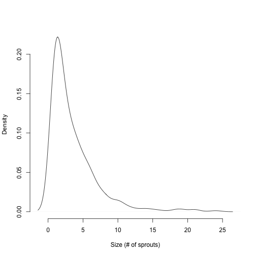
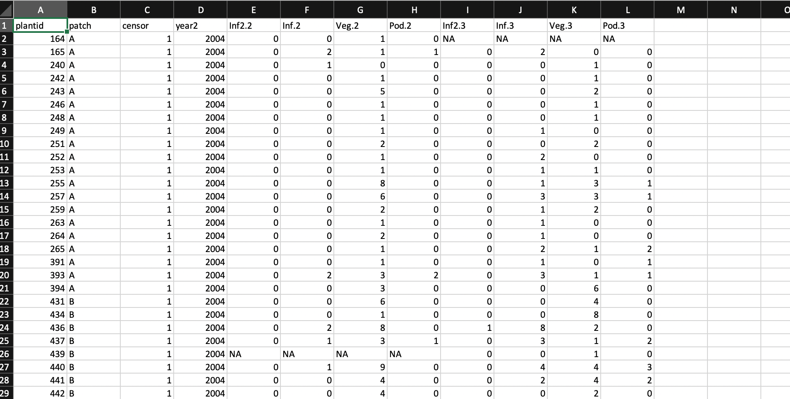
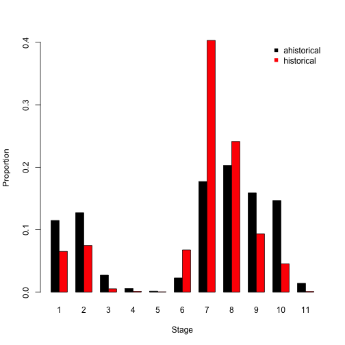
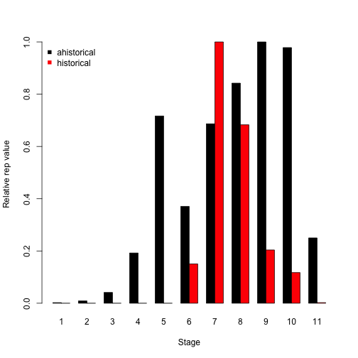
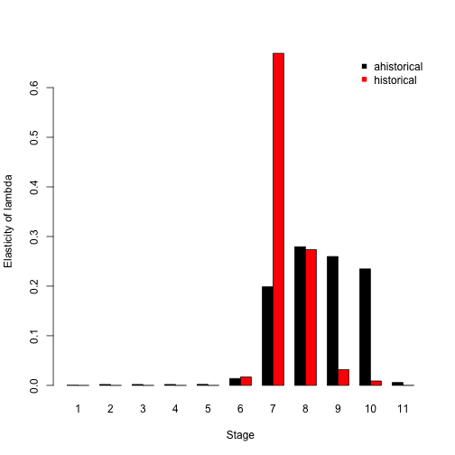
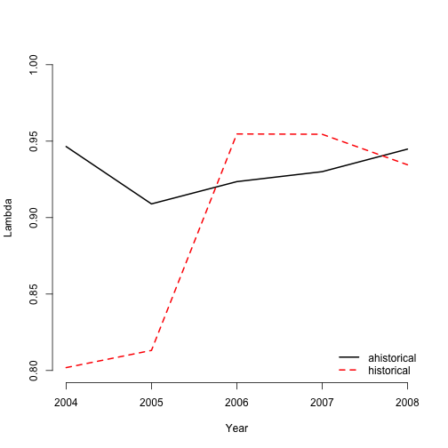
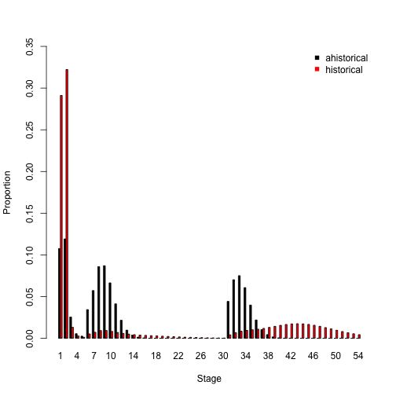
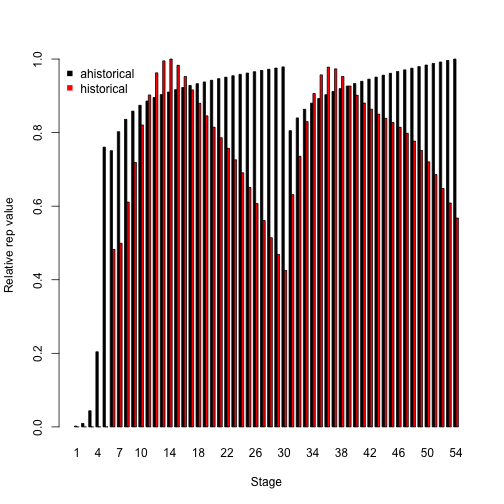
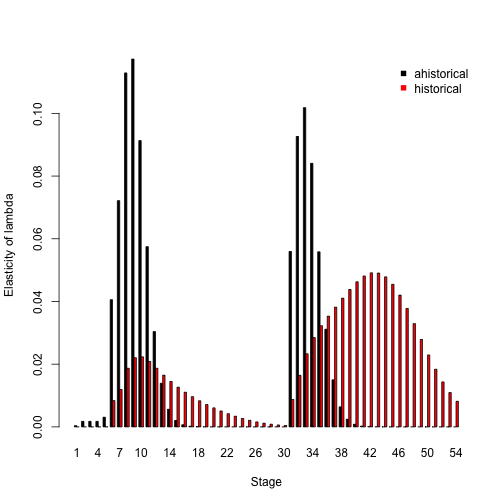

This document was built in Markdown in R 4.0.3, and covers package `lefko3` version 3.0.0.

## CASE STUDIES OF AMERICAN *Cypripedium candidum* POPULATION

### ORGANISM AND POPULATION

  <p style="text-indent: 20px">In this vignette, we will focus on a demographic dataset for a North American population of the white lady's slipper, *Cypripedium candidum*. This species is an herbaceous perennial in the orchid family, and is very long-lived. It is also of conservation concern, and the population is located within a state nature preserve located in northeastern Illinois, USA. The population was monitored annually from 2004 to 2009, with two monitoring sessions per year. More information about this population and its characteristics is given in Shefferson et al. [-@shefferson_estimating_2001] and Shefferson et al. [-@shefferson_predicting_2017].</p>
  
  <p style="text-indent: 20px">Population matrix projection modeling requires an appropriate life history model showing how all stages and transitions are related. The figure below shows a very general life history model detailing these relationships in *Cypripedium candidum*. The first stage of life is a dormant seed stage, although an individual may germinate in the year following seed production. The first germinated stage is a protocorm, which is an underground, mycoheterotrophic stage unique to the families Orchidaceae and Pyrolaceae. There are three years of protocorm stages, followed by a seedling stage, and finally a set of stages that comprise the size-classified adult portion of life. The figure shows 49 such stages, each for a different number of stems (including 0 for vegetative dormancy) and one of two reproductive statuses. These stages may be compressed for different circumstances (more on this later).</p>
  
</img>
**Figure 1.** Life history model of *Cypripedium candidum*.

  <p style="text-indent: 20px">We can see a variety of transitions within this figure. The juvenile stages have fairly simple transitions. New recruits may enter the population directly from germination of a seed produced the previous year, in which case they start in the protocorm 1 stage, or they may begin as dormant seed. Dormant seed may remain dormant, die, or germinate into the protocorm 1 stage. Protocorms exist for up to 3 years, yielding the protocorm 1, 2, and 3 stages, without any possibility of staying within each of these stages for more than a single year. Protocorm 3 leads to a seedling stage, in which the plant may persist for many years before becoming mature. Here, maturity does not really refer to reproduction *per se*, but rather to a morphology indistinguishable from a reproductive plant except for the lack of a flower. The first mature stage is usually either vegetative dormancy (dorm), during which time the plant does not sprout, or a small, non-flowering adult (1V). Once in this portion of the life history, the plant may transition among 49 mature stages, including vegetative dormancy, 1-24 shoots without flowers, or 1-24 shoots with at least one flower.</p>
  
  <p style="text-indent: 20px">The horizontal dataset `cypdata`, and the ahistorical vertical dataset `cypvert` which is the same as `cypdata` but is structured differently, both include only data for the adult stages, and so later we will need to set juvenile transitions to constants.</p>
  
### ANALYSES WITH *CYPRIPEDIUM* DATA

  <p style="text-indent: 20px">We will analyze these data in two different ways to illustrate the utility of package `lefko3`:</p> 
  
  1) through the estimation of **raw MPMs** using a simplified life history; and
  
  2) through the estimation of **function-based MPMs** using a count-based size metric and the general life history model shown above.
  
  <p style="text-indent: 20px">We will not estimate an IPM because size is measured as a count variable in this case.</p>
  
  
### Analysis 1. Raw matrix estimation

  <p style="text-indent: 20px">In this example, we will create raw matrices with these data. Here, we use the term 'raw' to refer to the fact that we will estimate matrix elements as exact proportions of individuals surviving and transitioning to different stages. This requires us to develop a life history model that is both biologically realistic, statistically meaningful, and parsimonious. The first requirement means that stages need to be defined in biologically meaningful ways. The second requirement means that stages should correlate strongly with the underlying demography. The final requirement means that we need to design our life stages in such a way that most years include some individuals in each stage. We also need to consider the fact that very low numbers of stages appear to result in biased matrix analyses, so we want to make sure that we have at least 7 stages in the final model [@salguero-gomez_matrix_2010].</p>

#### Steps 1 and 2a. Life history model development, and horizontal dataset organization

  <p style="text-indent: 20px">First let's wipe the memory, load `lefko3`, and then load the data.</p>

```r
rm(list=ls(all=TRUE))

library(lefko3)
data(cypdata)
```

  <p style="text-indent: 20px">The dataset that we have provided is organized in horizontal format, meaning that rows correspond to unique individuals and columns correspond to stage in particular years. Looking at the original Excel spreadsheet (below), you will note a repeating pattern in the names of the columns. Package `lefko3` includes functions to handle data in horizontal format, as well as functions to handle vertically formatted data (i.e. data for individuals is broken up across rows, where each row is a unique combination of individual and year in time *t*).</p>

</img>
**Figure 2.** Organization of the *Cypripedium* dataset, as viewed in Microsoft Excel.


  <p style="text-indent: 20px">In this dataset, there are 77 individuals, so there are 77 rows with data (not counting the header). There are 27 columns. Note that the first 3 columns are variables giving identifying information about each individual, with each individual's data entirely restricted to one row. This is followed by a number of sets of 4 columns, each named `Inf2.XX`, `Inf.XX`, `Veg.XX`, and `Pod.XX`. The XX in each case corresponds to a specific year, which are organized consecutively. Thus, columns 4-7 refer to year 04 (short for 2004), columns 8-11 refer to year 05, columns 12-15 refer to year 06, columns 16-19 refer to year 07, columns 20-23 refer to year 08, and columns 24-27 refer to year 09. To properly conduct this exercise, we need to know the exact number of years used, which is six years here (includes all years from 2004 to 2009). Note that each year MUST utilize exactly the same number and pattern of columns.</p>

  <p style="text-indent: 20px">Now we will move on to the assessment of size. The full sizes of individuals are actually the sums of columns (representing sprouts) within years. We will take these sums, and then assess the distribution of individual sizes across years. We will look at all years and look for general patterns and abnormalities.</p>

```r
size.04 <- cypdata$Inf2.04 + cypdata$Inf.04 + cypdata$Veg.04
size.05 <- cypdata$Inf2.05 + cypdata$Inf.05 + cypdata$Veg.05
size.06 <- cypdata$Inf2.06 + cypdata$Inf.06 + cypdata$Veg.06
size.07 <- cypdata$Inf2.07 + cypdata$Inf.07 + cypdata$Veg.07
size.08 <- cypdata$Inf2.08 + cypdata$Inf.08 + cypdata$Veg.08
size.09 <- cypdata$Inf2.09 + cypdata$Inf.09 + cypdata$Veg.09

summary(c(size.04, size.05, size.06, size.07, size.08, size.09))
#>    Min. 1st Qu.  Median    Mean 3rd Qu.    Max.    NA's 
#>   1.000   1.000   2.000   3.581   5.000  24.000      97
```

The minimum size noted is 1, while the maximum is 24. There are 97 NAs, which includes cases in which plants were not alive as well as cases in which plants were vegetatively dormant. In the latter case, the individual is alive but not observable, which can be interpreted as an aboveground size of 0. Let's quickly plot the size distribution of sprouting individuals.

```r
plot(density(c(size.04, size.05, size.06, size.07, size.08, size.09), na.rm = TRUE), 
     main = "", xlab = "Size (# of sprouts)", bty = "n")
```



  <p style="text-indent: 20px">This exercise gives us a reasonable idea of size classes to use for adult stages. We will have a dormant class (size = 0 shoots), extra small class (1 shoot), small class (2-3 shoots), medium class (4-5 shoots), large class (6-10 shoots), and extra large class (>10 shoots). Let's define a stageframe summarizing this.</p>

```r
sizevector <- c(0, 0, 0, 0, 0, 0, 1, 2.5, 4.5, 8, 17.5)
stagevector <- c("SD", "P1", "P2", "P3", "SL", "D", "XSm", "Sm", "Md", "Lg", "XLg")
repvector <- c(0, 0, 0, 0, 0, 0, 1, 1, 1, 1, 1)
obsvector <- c(0, 0, 0, 0, 0, 0, 1, 1, 1, 1, 1)
matvector <- c(0, 0, 0, 0, 0, 1, 1, 1, 1, 1, 1)
immvector <- c(0, 1, 1, 1, 1, 0, 0, 0, 0, 0, 0)
propvector <- c(1, 0, 0, 0, 0, 0, 0, 0, 0, 0, 0)
indataset <- c(0, 0, 0, 0, 0, 1, 1, 1, 1, 1, 1)
binvec <- c(0, 0, 0, 0, 0, 0.5, 0.5, 1, 1, 2.5, 7)

cypframe_raw <- sf_create(sizes = sizevector, stagenames = stagevector, 
                      repstatus = repvector, obsstatus = obsvector, 
                      matstatus = matvector, propstatus = propvector, 
                      immstatus = immvector, indataset = indataset, 
                      binhalfwidth = binvec)
```

  <p style="text-indent: 20px">Now we will add some comments to the stageframe for our later use in interpretation.</p>

```r
cypframe_raw$comments[(cypframe_raw$stagenames == "SD")] <- "Dormant seed"
cypframe_raw$comments[(cypframe_raw$stagenames == "P1")] <- "1st yr protocorm"
cypframe_raw$comments[(cypframe_raw$stagenames == "P2")] <- "2nd yr protocorm"
cypframe_raw$comments[(cypframe_raw$stagenames == "P3")] <- "3rd yr protocorm"
cypframe_raw$comments[(cypframe_raw$stagenames == "SL")] <- "Seedling"
cypframe_raw$comments[(cypframe_raw$stagenames == "D")] <- "Dormant adult"
cypframe_raw$comments[(cypframe_raw$stagenames == "XSm")] <- "Extra small adult (1 shoot)"
cypframe_raw$comments[(cypframe_raw$stagenames == "Sm")] <- "Small adult (2-3 shoots)"
cypframe_raw$comments[(cypframe_raw$stagenames == "Md")] <- "Medium adult (4-5 shoots)"
cypframe_raw$comments[(cypframe_raw$stagenames == "Lg")] <- "Large adult (6-10 shoots)"
cypframe_raw$comments[(cypframe_raw$stagenames == "XLg")] <- "Extra large adult (>10 shoots)"
```

  <p style="text-indent: 20px">Type `cypframe_raw` at the R prompt to see what this structure looks like.</p>
  
  <p style="text-indent: 20px">Next we will create the vertical dataset. Because we are lumping reproductive and non-reproductive individuals into the non-dormant adult classes, we need to set `NRasRep = TRUE`. Otherwise, `verticalize3()` will attempt to use the reproductive status of individuals in classification, and will fail due to the presence of non-reproductive adults. We also need to set `NAas0 = TRUE` to make sure that NA values in size are turned into 0 entries where necessary, and so aid in the assignment of the vegetative dormancy stage. After this runs, type `summary(cypraw_v1)` to get a summary of the new dataset.</p>

```r
cypraw_v1 <- verticalize3(data = cypdata, noyears = 6, firstyear = 2004, 
                         patchidcol = "patch", individcol = "plantid", 
                         blocksize = 4, size1col = "Inf2.04", size2col = "Inf.04", 
                         size3col = "Veg.04", repstr1col = "Inf.04", 
                         repstr2col = "Inf2.04", fec1col = "Pod.04", 
                         stageassign = cypframe_raw, stagesize = "sizeadded", 
                         NAas0 = TRUE, NRasRep = TRUE)
```

#### Step 2b. Vertical dataset organization

  <p style="text-indent: 20px">We may also wish to see how to proceed if our original dataset is already in vertical, but ahistorical, format. This package also includes dataset `cypvert`, which is the same dataset as `cypdata` but set in ahistorical vertical format. The structure of the dataset can be seen below. Note that individual histories are split across multiple rows.</p>

</img>
**Figure 4.** Organization of the ahistorical vertical version of the *Cypripedium* dataset, as viewed in Microsoft Excel.

  <p style="text-indent: 20px">Here, we use the `historicalize3()` function to deal with this dataset. First, let's load the ahistorical vertical raw data file.</p>

```r
data(cypvert)
```

And let's also look at its dimensions, relative to the original horizontal dataset.

```r
dim(cypdata)
#> [1] 77 27
dim(cypvert)
#> [1] 331  12
```
  
  <p style="text-indent: 20px">This dataset is longer and narrower, with more rows and fewer columns. This is because we now split data for each individual across multiple columns. After three columns of identifying information (`plantid`, `patch`, and `censor`), a single column designates time in year *t*, given as `year2`. This dataset then includes columns showing individual state in pairs of consecutive years corresponding to times *t* and *t*+1. State in time *t*-1 is not presented because this is an ahistorical dataset. Fortunately, this dataset includes the `plantid` variable, which is an individual identity term and must be supplied for conversion. The `historicalize3()` function uses individual identity to reorganize datasets into historical vertical format. After this runs, type `summary(cypraw_v2)` to get a summary of this dataset.</p>

```r
cypraw_v2 <- historicalize3(data = cypvert, patchidcol = "patch", individcol = "plantid",
                           year2col = "year2", sizea2col = "Inf2.2", sizea3col = "Inf2.3",
                           sizeb2col = "Inf.2", sizeb3col = "Inf.3", sizec2col = "Veg.2",
                           sizec3col = "Veg.3", repstra2col = "Inf2.2", repstra3col = "Inf2.3",
                           repstrb2col = "Inf.2", repstrb3col = "Inf.3", feca2col = "Pod.2",
                           feca3col = "Pod.3", repstrrel = 2, stageassign = cypframe_raw,
                           stagesize = "sizeadded", censorcol = "censor", censor = FALSE,
                           NAas0 = TRUE, NRasRep = TRUE, reduce = TRUE)
```

  <p style="text-indent: 20px">We can compare the dimensions of these datasets.</p>

```r
dim(cypraw_v1)
#> [1] 320  54
dim(cypraw_v2)
#> [1] 320  54
```

The lengths of the datasets are the same in terms of rows and columns, and the variables and data are the same although the order of the columns and rows might not match (see the summaries for comparison).

#### Step 2c. Provide supplemental information for matrix estimation

  <p style="text-indent: 20px">For our next step, we need to create a **reproductive matrix**, which tells R not only which stages are reproductive, but which stages they lead to the reproduction of, and at what level. This matrix is mostly composed of 0s, but fecundity is noted as non-zero entries equal to a scalar multiplier to the full fecundity estimated by R. This square matrix has as many rows and columns as the number of stages described in the stageframe for this dataset, and the rows and columns refer to these stages in the same order as in the stageframe. It looks like a nearly empty population matrix, but notes the per-individual mean modifiers on fecundity for each stage that actually reproduces. Here, we first create a 0 matrix with dimensions equal to the number of rows in `cypframe_raw`. Then we modify elements corresponding to fecundity by dividing fecundity evenly between dormant seeds (row 1) and germinating seeds (row 2).</p>

```r
rep_cyp_raw <- matrix(0, 11, 11)
rep_cyp_raw[1:2,7:11] <- 0.5
```

  <p style="text-indent: 20px">Next we will provide some given transitions. In this case, we provide the seed dormancy probability and germination rate, which in this case are provided as transitions from the dormant seed stage to another year of seed dormancy or to a first-year protocorm, respectively. We also provide the survival-transition probabilities between different year protocorm stages (P1, P2, and P3), to the seedling stage (SL), and from the seedling stage to some of the adult stages (XSm, Sm, and D). Let's start with the ahistorical case.</p>

```r
cypover2r <- overwrite(stage3 = c("SD", "P1", "P2", "P3", "SL", "SL", "D", "XSm", "Sm"),
                       stage2 = c("SD", "SD", "P1", "P2", "P3", "SL", "SL", "SL", "SL"),
                       eststage3 = c(NA, NA, NA, NA, NA, NA, "D", "XSm", "Sm"),
                       eststage2 = c(NA, NA, NA, NA, NA, NA, "XSm", "XSm", "XSm"),
                       givenrate = c(0.1, 0.2, 0.2, 0.2, 0.25, 0.1, NA, NA, NA),
                       type = c("S", "S", "S", "S", "S", "S", "S", "S", "S"))
```

  <p style="text-indent: 20px">This overwrite table shows us that we have survival-transition probabilities (`type = "S"`), that the given transitions are ahistorical, and outlines probabilities for transitions that we cannot estimate with our dataset, which in this case involve the immature stages of life. While six of these survival-transitions are given in the `givenrate` column, we also mark 3 of them as survival-transitions that we wish to use other estimates as proxies for. This is indicated via the `eststageX` columns, which have entries corresponding the stages to use as proxies (note that the `givenrate` entries are NA for these cases).</p>

  <p style="text-indent: 20px">And now the historical case. Here we need to show the stages in time *t*-1 for this to work properly. Because of the extra complexity, we will use the short-hand term `"rep"` to code for reproductive stages leading to the seeds and first-year protocorms that must survive to the next year.</p>

```r
cypover3r <- overwrite(stage3 = c("SD", "SD", "P1", "P1", "P2", "P3", "SL", "SL", "SL", "D", 
                        "XSm", "Sm", "D", "XSm", "Sm"), stage2 = c("SD", "SD", "SD", "SD", 
                        "P1", "P2", "P3", "SL", "SL", "SL", "SL", "SL", "SL", "SL", "SL"),
                       stage1 = c("SD", "rep", "SD", "rep", "SD", "P1", "P2", "P3", "SL", 
                        "P3", "P3", "P3", "SL", "SL", "SL"), eststage3 = c(NA, NA, NA, NA, 
                        NA, NA, NA, NA, NA, "D", "XSm", "Sm", "D", "XSm", "Sm"), 
                       eststage2 = c(NA, NA, NA, NA, NA, NA, NA, NA, NA, "XSm", "XSm",
                        "XSm", "XSm", "XSm", "XSm"), eststage1 = c(NA, NA, NA, NA, NA, NA,
                        NA, NA, NA, "XSm", "XSm", "XSm", "XSm", "XSm", "XSm"), 
                       givenrate = c(0.1, 0.1, 0.2, 0.2, 0.2, 0.2, 0.25, 0.1, 0.1, NA, NA,
                        NA, NA, NA, NA), type = c("S", "S", "S", "S", "S", "S", "S", "S",
                        "S", "S", "S", "S", "S", "S", "S"))
```

  <p style="text-indent: 20px">Type `cypover3r` at the prompt to note the increased dimensions here - there are 15 total transitions incorporated into this overwrite table, compared to 9 for the ahistorical version.</p>
  
  <p style="text-indent: 20px">Now we are read to create some matrices!</p>

#### Step 3. Tests of history

  <p style="text-indent: 20px">Let's now test whether individual history is important here. Let's build a historical set of vital rates models with modelsearch(), and see if any of the best-fit models include state in time *t*-1. The first 5 elements of the class `lefkoMod` object  that is output are the linear models. However, since the last 4 are focused on juveniles, and we did not include any juvenile data, we will look only at the first 5 elements.</p>

```r
histtest <- modelsearch(cypraw_v1, historical = TRUE, approach = "lme4", 
                        vitalrates = c("surv", "obs", "size", "repst", "fec"), 
                        sizedist = "poisson", fecdist = "poisson", suite = "size", 
                        size = c("size3added", "size2added", "size1added"),
                        show.model.tables = FALSE, quiet = TRUE)
#> Warning in modelsearch(cypraw_v1, historical = TRUE, approach = "lme4", : WARNING: Fecundity in time t cannot be Poisson-distributed and include 0s. Will develop fecundity models excluding all 0s. Consider adding a reproductive status variable to absorb 0 values, or using a fecundity variable to denote reproductive status.
#> boundary (singular) fit: see ?isSingular
#> Warning in checkConv(attr(opt, "derivs"), opt$par, ctrl = control$checkConv, : Model failed to converge with max|grad| = 0.0104304 (tol =
#> 0.002, component 1)
#> Warning in checkConv(attr(opt, "derivs"), opt$par, ctrl = control$checkConv, : Model is nearly unidentifiable: very large eigenvalue
#>  - Rescale variables?
#> boundary (singular) fit: see ?isSingular
histtest[1:5]
#> $survival_model
#> Generalized linear mixed model fit by maximum likelihood (Laplace Approximation) ['glmerMod']
#>  Family: binomial  ( logit )
#> Formula: alive3 ~ size2added + (1 | individ) + (1 | year2)
#>    Data: surv.data
#>      AIC      BIC   logLik deviance df.resid 
#> 128.1324 143.2057 -60.0662 120.1324      316 
#> Random effects:
#>  Groups  Name        Std.Dev.
#>  individ (Intercept) 1.198371
#>  year2   (Intercept) 0.008826
#> Number of obs: 320, groups:  individ, 74; year2, 5
#> Fixed Effects:
#> (Intercept)   size2added  
#>      2.0352       0.6344  
#> convergence code 0; 0 optimizer warnings; 1 lme4 warnings 
#> 
#> $observation_model
#> Generalized linear mixed model fit by maximum likelihood (Laplace Approximation) ['glmerMod']
#>  Family: binomial  ( logit )
#> Formula: obsstatus3 ~ size2added + (1 | individ) + (1 | year2)
#>    Data: obs.data
#>      AIC      BIC   logLik deviance df.resid 
#> 118.2567 133.1117 -55.1284 110.2567      299 
#> Random effects:
#>  Groups  Name        Std.Dev. 
#>  individ (Intercept) 1.078e-05
#>  year2   (Intercept) 8.776e-01
#> Number of obs: 303, groups:  individ, 70; year2, 5
#> Fixed Effects:
#> (Intercept)   size2added  
#>      2.4904       0.3134  
#> convergence code 0; 0 optimizer warnings; 1 lme4 warnings 
#> 
#> $size_model
#> Generalized linear mixed model fit by maximum likelihood (Laplace Approximation) ['glmerMod']
#>  Family: poisson  ( log )
#> Formula: size3added ~ size1added + size2added + (1 | individ) + (1 | year2) +      size1added:size2added
#>    Data: size.data
#>       AIC       BIC    logLik  deviance  df.resid 
#> 1086.8306 1108.8084 -537.4153 1074.8306       282 
#> Random effects:
#>  Groups  Name        Std.Dev.
#>  individ (Intercept) 0.1211  
#>  year2   (Intercept) 0.1931  
#> Number of obs: 288, groups:  individ, 70; year2, 5
#> Fixed Effects:
#>           (Intercept)             size1added             size2added  size1added:size2added  
#>              0.303992               0.139204               0.156235              -0.009423  
#> convergence code 0; 0 optimizer warnings; 2 lme4 warnings 
#> 
#> $repstatus_model
#> Generalized linear mixed model fit by maximum likelihood (Laplace Approximation) ['glmerMod']
#>  Family: binomial  ( logit )
#> Formula: repstatus3 ~ size2added + (1 | individ) + (1 | year2)
#>    Data: repst.data
#>       AIC       BIC    logLik  deviance  df.resid 
#>  346.9352  361.5870 -169.4676  338.9352       284 
#> Random effects:
#>  Groups  Name        Std.Dev.
#>  individ (Intercept) 1.2838  
#>  year2   (Intercept) 0.7164  
#> Number of obs: 288, groups:  individ, 70; year2, 5
#> Fixed Effects:
#> (Intercept)   size2added  
#>     -1.2489       0.2698  
#> 
#> $fecundity_model
#> Generalized linear mixed model fit by maximum likelihood (Laplace Approximation) ['glmerMod']
#>  Family: poisson  ( log )
#> Formula: feca2 ~ size2added + (1 | individ) + (1 | year2)
#>    Data: fec.data
#>      AIC      BIC   logLik deviance df.resid 
#> 156.8531 164.5012 -74.4266 148.8531       46 
#> Random effects:
#>  Groups  Name        Std.Dev.
#>  individ (Intercept) 0.000   
#>  year2   (Intercept) 0.172   
#> Number of obs: 50, groups:  individ, 26; year2, 5
#> Fixed Effects:
#> (Intercept)   size2added  
#>     0.21931      0.04429  
#> convergence code 0; 0 optimizer warnings; 1 lme4 warnings
```

We can see that historical size is included as a factor in the model of size. This suggests that the raw historical MPM is the most parsimonious choice. Please see the section on historical vital rate modeling in the next analysis, or in Analysis 2 of the Lathyrus vignette for more information on the modeling conducted here.

  <p style="text-indent: 20px">Readers looking over the output above will also note a warning message saying that fecundity includes 0s, and that this cannot be handled via a Poisson distribution without dropping those 0s from analysis. This is due to the fact that we are considering all flowering plants reproductive, regardless of whether they actually produced fruits. In raw matrix estimation, this is not a problem because fecundity is estimated using the raw data without any assumption of underlying statistical distributions. However, if we were building function-based models, then this approach would need to be changed so that 0s are not dropped. See Analysis 2 for more details.</p>

#### Step 4. MPM estimation

  <p style="text-indent: 20px">We will begin with the creation of a set of ahistorical matrices for the *Cypripedium candidum* dataset. The `rlefko2` function was created to deal with the construction of ahistorical MPMs using raw data. Matrices may strongly differ, particularly if the demographic dataset is somewhat sparse. This happens because there may not be enough individuals per year to encounter all possible transitions, leading to seemingly random shifts in the location of non-zero elements within matrices across time. We strongly advise readers to build life history models that reflect the sample size that they are working with to prevent this issue from causing odd results in MPM analysis.</p>

```r
cypmatrix2r <- rlefko2(data = cypraw_v1, stageframe = cypframe_raw, year = "all", 
                       patch = "all", stages = c("stage3", "stage2"),
                       size = c("size3added", "size2added"), 
                       repmatrix = rep_cyp_raw, overwrite = cypover2r, 
                       yearcol = "year2", patchcol = "patchid", indivcol = "individ")
```

  <p style="text-indent: 20px">The input for the `rlefko2()` function includes `year = "all"`, but can be set to focus on any set of years included within the data. Package `lefko3` includes a great deal of flexibility here, and can estimate many matrices covering all of the populations, patches, and years occurring in a specific dataset. The function-based matrix approach in the next section will showcase some more of this flexibility.</p>

  <p style="text-indent: 20px">The output from this analysis is a `lefkoMat` object, which is a list object with the following elements:</p>
  
  **A**: a list of full population projection matrices, in order of population, patch, and year
  
  **U**: a list of matrices showing only survival-transition elements, in the same order as A
  
  **F**: a list of matrices showing only fecundity elements, in the same order as A
  
  **hstages**: a data frame showing the order of paired stages (given if matrices are historical, otherwise NA)
  
  **ahstages**: this is the stageframe used in analysis, with stages reordered and edited as they occur in the matrix
  
  **labels**: a table showing the order of matrices, according to population, patch, and year
  
  **matrixqc**: a short vector used in `summary` statements to describe the overall quality of each matrix
  
  **dataqc**: a short vector used in `summary` statements to describe key sampling aspects of the dataset
  
  
  <p style="text-indent: 20px">Objects of class `lefkoMat` have their own `summary` statements, which we can use to understand more about them.</p>

```r
summary(cypmatrix2r)
#> 
#> This ahistorical lefkoMat object contains 15 matrices.
#> 
#> Each matrix is a square matrix with 11 rows and columns, and a total of 121 elements.
#> A total of 280 survival transitions were estimated, with 18.6666666666667 per matrix.
#> A total of 66 fecundity transitions were estimated, with 4.4 per matrix.
#> 
#> The dataset contains a total of 74 unique individuals and 320 unique transitions.
#> NULL
```

  <p style="text-indent: 20px">We start off learning that 15 matrices were estimated, and we learn the dimensionality of those matrices. Of note here is the output telling us how many elements were actually estimated, both overall and per matrix, and the number of individuals and transitions the matrices are based on. It is typical for population ecologists to consider the total number of transitions in a dataset as a measure of the statistical power of a matrix, but the number of individuals used is just as important because each transition that an individual experiences is dependent on the other transitions that it also experiences. Indeed, this is the fundamental point that led to the development of historical matrices and of this package - the assumption that the status of an individual in the next time is dependent only on its current state is too simplistic, and may lead to both overparameterization and pseudoreplication.</p>
  
  <p style="text-indent: 20px">Let's look at a sample matrix here.</p>

```r
print(cypmatrix2r$A[[1]], digits = 3)
#>       [,1] [,2] [,3] [,4]  [,5] [,6]  [,7] [,8] [,9] [,10] [,11]
#>  [1,]  0.1  0.0  0.0 0.00 0.000    0 0.000  0.1  0.5   0.0     0
#>  [2,]  0.2  0.0  0.0 0.00 0.000    0 0.000  0.1  0.5   0.0     0
#>  [3,]  0.0  0.2  0.0 0.00 0.000    0 0.000  0.0  0.0   0.0     0
#>  [4,]  0.0  0.0  0.2 0.00 0.000    0 0.000  0.0  0.0   0.0     0
#>  [5,]  0.0  0.0  0.0 0.25 0.100    0 0.000  0.0  0.0   0.0     0
#>  [6,]  0.0  0.0  0.0 0.00 0.000    0 0.000  0.0  0.0   0.0     0
#>  [7,]  0.0  0.0  0.0 0.00 0.636    0 0.636  0.2  0.0   0.0     0
#>  [8,]  0.0  0.0  0.0 0.00 0.273    0 0.273  0.6  0.5   0.0     0
#>  [9,]  0.0  0.0  0.0 0.00 0.000    0 0.000  0.0  0.5   0.5     0
#> [10,]  0.0  0.0  0.0 0.00 0.000    0 0.000  0.2  0.0   0.5     0
#> [11,]  0.0  0.0  0.0 0.00 0.000    0 0.000  0.0  0.0   0.0     0
```

The reader will note that although this is an ahistorical matrix, it is predominantly composed of 0 elements. This is a result of the sparseness of the data, and will likely lead to different elements shifting between 0 and positive elements across time.

  <p style="text-indent: 20px">Now we will create some historical matrices. Historical matrix construction parses the data much more finely across many more stages than ahistorical matrix construction, so historical matrices are even more likely to differ strongly across time, particularly as the number of individuals in a dataset decreases. Let's see what these matrices look like.</p>

```r
cypmatrix3r <- rlefko3(data = cypraw_v1, stageframe = cypframe_raw, year = "all", 
                       patch = "all", stages = c("stage3", "stage2", "stage1"), 
                       size = c("size3added", "size2added", "size1added"), 
                       repmatrix = rep_cyp_raw, overwrite = cypover3r, 
                       yearcol = "year2", patchcol = "patchid", indivcol = "individ")

summary(cypmatrix3r)
#> 
#> This historical lefkoMat object contains 12 matrices.
#> 
#> Each matrix is a square matrix with 121 rows and columns, and a total of 14641 elements.
#> A total of 433 survival transitions were estimated, with 36.0833333333333 per matrix.
#> A total of 70 fecundity transitions were estimated, with 5.83333333333333 per matrix.
#> 
#> The dataset contains a total of 74 unique individuals and 320 unique transitions.
#> NULL
```

  <p style="text-indent: 20px">There are at least two things to note here. First, there are 3 fewer matrices here than in the ahistorical case. There are 3 patches that we are estimating matrices for, and 6 years of data for each patch, leading to 5 possible ahistorical time transitions and 15 possible ahistorical matrices. Since historical matrices require 3 years of transitions, only 4 historical transitions are possible per patch, leading to 12 total historical matrices. Second, the dimensionality of the matrices is the square of the dimensions of the ahistorical matrices. This leads to vastly more matrix elements within each matrix, although it turns out that most of these matrix elements are structural 0s because they reflect impossible transitions. Indeed, in this case, although there are 14,641 elements in each matrix, on average only 41.917 are actually estimated at being greater than 0.</p>
  
  <p style="text-indent: 20px">Let's look at the first matrix, corresponding to the transition from 2004 and 2005 to 2006 in the first patch. Because this is a huge matrix, we will only look at the top corner, followed by a middle section.</p>

```r
cypmatrix3r$A[[1]][1:20,1:10]
#>       [,1] [,2] [,3] [,4] [,5] [,6] [,7] [,8] [,9] [,10]
#>  [1,]  0.1  0.0    0    0    0    0    0    0    0     0
#>  [2,]  0.2  0.0    0    0    0    0    0    0    0     0
#>  [3,]  0.0  0.0    0    0    0    0    0    0    0     0
#>  [4,]  0.0  0.0    0    0    0    0    0    0    0     0
#>  [5,]  0.0  0.0    0    0    0    0    0    0    0     0
#>  [6,]  0.0  0.0    0    0    0    0    0    0    0     0
#>  [7,]  0.0  0.0    0    0    0    0    0    0    0     0
#>  [8,]  0.0  0.0    0    0    0    0    0    0    0     0
#>  [9,]  0.0  0.0    0    0    0    0    0    0    0     0
#> [10,]  0.0  0.0    0    0    0    0    0    0    0     0
#> [11,]  0.0  0.0    0    0    0    0    0    0    0     0
#> [12,]  0.0  0.0    0    0    0    0    0    0    0     0
#> [13,]  0.0  0.0    0    0    0    0    0    0    0     0
#> [14,]  0.0  0.2    0    0    0    0    0    0    0     0
#> [15,]  0.0  0.0    0    0    0    0    0    0    0     0
#> [16,]  0.0  0.0    0    0    0    0    0    0    0     0
#> [17,]  0.0  0.0    0    0    0    0    0    0    0     0
#> [18,]  0.0  0.0    0    0    0    0    0    0    0     0
#> [19,]  0.0  0.0    0    0    0    0    0    0    0     0
#> [20,]  0.0  0.0    0    0    0    0    0    0    0     0
print(cypmatrix3r$A[[1]][66:85,73:81], digits = 3)
#>         [,1]  [,2] [,3] [,4] [,5] [,6] [,7] [,8] [,9]
#>  [1,] 0.0000 0.000    0    0    0    0    0    0    0
#>  [2,] 0.0714 0.000    0    0    0    0    0    0    0
#>  [3,] 0.0714 0.000    0    0    0    0    0    0    0
#>  [4,] 0.0000 0.000    0    0    0    0    0    0    0
#>  [5,] 0.0000 0.000    0    0    0    0    0    0    0
#>  [6,] 0.0000 0.000    0    0    0    0    0    0    0
#>  [7,] 0.1429 0.000    0    0    0    0    0    0    0
#>  [8,] 0.7143 0.000    0    0    0    0    0    0    0
#>  [9,] 0.0000 0.000    0    0    0    0    0    0    0
#> [10,] 0.0000 0.000    0    0    0    0    0    0    0
#> [11,] 0.0000 0.000    0    0    0    0    0    0    0
#> [12,] 0.0000 0.000    0    0    0    0    0    0    0
#> [13,] 0.0000 0.333    0    0    0    0    0    0    0
#> [14,] 0.0000 0.333    0    0    0    0    0    0    0
#> [15,] 0.0000 0.000    0    0    0    0    0    0    0
#> [16,] 0.0000 0.000    0    0    0    0    0    0    0
#> [17,] 0.0000 0.000    0    0    0    0    0    0    0
#> [18,] 0.0000 0.000    0    0    0    0    0    0    0
#> [19,] 0.0000 0.667    0    0    0    0    0    0    0
#> [20,] 0.0000 0.333    0    0    0    0    0    0    0
```
The full matrix is not shown here, but we can focus on portions of it if we wish. These matrices may also be exported to Excel or another spreadsheet program to look over in detail.

  <p style="text-indent: 20px">Next we will create a mean ahistorical matrix using the `lmean()` function.</p>

```r
cypr2mean <- lmean(cypmatrix2r)
print(cypr2mean$A[[4]], digits = 3)
#>       [,1] [,2] [,3] [,4]   [,5]   [,6]    [,7]   [,8]   [,9]  [,10]  [,11]
#>  [1,]  0.1  0.0  0.0 0.00 0.0000 0.0000 0.00787 0.0717 0.1890 0.2924 0.4667
#>  [2,]  0.2  0.0  0.0 0.00 0.0000 0.0000 0.00787 0.0717 0.1890 0.2924 0.4667
#>  [3,]  0.0  0.2  0.0 0.00 0.0000 0.0000 0.00000 0.0000 0.0000 0.0000 0.0000
#>  [4,]  0.0  0.0  0.2 0.00 0.0000 0.0000 0.00000 0.0000 0.0000 0.0000 0.0000
#>  [5,]  0.0  0.0  0.0 0.25 0.1000 0.0000 0.00000 0.0000 0.0000 0.0000 0.0000
#>  [6,]  0.0  0.0  0.0 0.00 0.0673 0.0222 0.06726 0.0281 0.0194 0.0000 0.0000
#>  [7,]  0.0  0.0  0.0 0.00 0.5197 0.2111 0.51975 0.2291 0.0694 0.0667 0.0000
#>  [8,]  0.0  0.0  0.0 0.00 0.2547 0.1556 0.25474 0.4031 0.1961 0.1822 0.0222
#>  [9,]  0.0  0.0  0.0 0.00 0.0000 0.0556 0.00741 0.2135 0.4881 0.1679 0.0000
#> [10,]  0.0  0.0  0.0 0.00 0.0000 0.0000 0.03704 0.0650 0.2269 0.5435 0.0889
#> [11,]  0.0  0.0  0.0 0.00 0.0000 0.0222 0.00000 0.0000 0.0000 0.0397 0.4889

writeLines("\nColumn sums (stage survival probabilities) for grand arithmetic mean matrix")
#> 
#> Column sums (stage survival probabilities) for grand arithmetic mean matrix
summary(colSums(cypr2mean$U[[4]]))
#>    Min. 1st Qu.  Median    Mean 3rd Qu.    Max. 
#>  0.2000  0.2750  0.6000  0.6167  0.9403  1.0000
```
  
The column sums represent the survival probabilities of stages, and so can be used for error-checking purposes. Here, all values look to be within the realm of possibility.

  <p style="text-indent: 20px">And now the historical grand mean matrix, with a peek at a middle portion with some non-zero values.</p>

```r
cypr3mean <- lmean(cypmatrix3r)
print(cypr3mean$A[[4]][66:85,73:80], digits = 3)
#>          [,1]   [,2] [,3] [,4] [,5] [,6] [,7] [,8]
#>  [1,] 0.00000 0.0000    0    0    0    0    0    0
#>  [2,] 0.00595 0.0000    0    0    0    0    0    0
#>  [3,] 0.00595 0.0000    0    0    0    0    0    0
#>  [4,] 0.00000 0.0000    0    0    0    0    0    0
#>  [5,] 0.00000 0.0000    0    0    0    0    0    0
#>  [6,] 0.00000 0.0000    0    0    0    0    0    0
#>  [7,] 0.13690 0.0000    0    0    0    0    0    0
#>  [8,] 0.53730 0.0000    0    0    0    0    0    0
#>  [9,] 0.22500 0.0000    0    0    0    0    0    0
#> [10,] 0.00000 0.0000    0    0    0    0    0    0
#> [11,] 0.00000 0.0000    0    0    0    0    0    0
#> [12,] 0.00000 0.0000    0    0    0    0    0    0
#> [13,] 0.00000 0.0278    0    0    0    0    0    0
#> [14,] 0.00000 0.0278    0    0    0    0    0    0
#> [15,] 0.00000 0.0000    0    0    0    0    0    0
#> [16,] 0.00000 0.0000    0    0    0    0    0    0
#> [17,] 0.00000 0.0000    0    0    0    0    0    0
#> [18,] 0.00000 0.0000    0    0    0    0    0    0
#> [19,] 0.00000 0.3014    0    0    0    0    0    0
#> [20,] 0.00000 0.0986    0    0    0    0    0    0
```

Do not fear the prevalence of 0s in this matrix - this is normal, both because many elements are structural 0s and so cannot equal anything else, and because this is a raw matrix, meaning that transitions that do not actually occur in the dataset cannot equal anything other than 0.

  <p style="text-indent: 20px">To understand the dominance of structural 0s in the historical case, let's take a look at the `hstages` object associated with this mean matrix.</p>

```r
cypr3mean$hstages
#>     stage_id_2 stage_id_1 stage_2 stage_1
#> 1            1          1      SD      SD
#> 2            2          1      P1      SD
#> 3            3          1      P2      SD
#> 4            4          1      P3      SD
#> 5            5          1      SL      SD
#> 6            6          1       D      SD
#> 7            7          1     XSm      SD
#> 8            8          1      Sm      SD
#> 9            9          1      Md      SD
#> 10          10          1      Lg      SD
#> 11          11          1     XLg      SD
#> 12           1          2      SD      P1
#> 13           2          2      P1      P1
#> 14           3          2      P2      P1
#> 15           4          2      P3      P1
#> 16           5          2      SL      P1
#> 17           6          2       D      P1
#> 18           7          2     XSm      P1
#> 19           8          2      Sm      P1
#> 20           9          2      Md      P1
#> 21          10          2      Lg      P1
#> 22          11          2     XLg      P1
#> 23           1          3      SD      P2
#> 24           2          3      P1      P2
#> 25           3          3      P2      P2
#> 26           4          3      P3      P2
#> 27           5          3      SL      P2
#> 28           6          3       D      P2
#> 29           7          3     XSm      P2
#> 30           8          3      Sm      P2
#> 31           9          3      Md      P2
#> 32          10          3      Lg      P2
#> 33          11          3     XLg      P2
#> 34           1          4      SD      P3
#> 35           2          4      P1      P3
#> 36           3          4      P2      P3
#> 37           4          4      P3      P3
#> 38           5          4      SL      P3
#> 39           6          4       D      P3
#> 40           7          4     XSm      P3
#> 41           8          4      Sm      P3
#> 42           9          4      Md      P3
#> 43          10          4      Lg      P3
#> 44          11          4     XLg      P3
#> 45           1          5      SD      SL
#> 46           2          5      P1      SL
#> 47           3          5      P2      SL
#> 48           4          5      P3      SL
#> 49           5          5      SL      SL
#> 50           6          5       D      SL
#> 51           7          5     XSm      SL
#> 52           8          5      Sm      SL
#> 53           9          5      Md      SL
#> 54          10          5      Lg      SL
#> 55          11          5     XLg      SL
#> 56           1          6      SD       D
#> 57           2          6      P1       D
#> 58           3          6      P2       D
#> 59           4          6      P3       D
#> 60           5          6      SL       D
#> 61           6          6       D       D
#> 62           7          6     XSm       D
#> 63           8          6      Sm       D
#> 64           9          6      Md       D
#> 65          10          6      Lg       D
#> 66          11          6     XLg       D
#> 67           1          7      SD     XSm
#> 68           2          7      P1     XSm
#> 69           3          7      P2     XSm
#> 70           4          7      P3     XSm
#> 71           5          7      SL     XSm
#> 72           6          7       D     XSm
#> 73           7          7     XSm     XSm
#> 74           8          7      Sm     XSm
#> 75           9          7      Md     XSm
#> 76          10          7      Lg     XSm
#> 77          11          7     XLg     XSm
#> 78           1          8      SD      Sm
#> 79           2          8      P1      Sm
#> 80           3          8      P2      Sm
#> 81           4          8      P3      Sm
#> 82           5          8      SL      Sm
#> 83           6          8       D      Sm
#> 84           7          8     XSm      Sm
#> 85           8          8      Sm      Sm
#> 86           9          8      Md      Sm
#> 87          10          8      Lg      Sm
#> 88          11          8     XLg      Sm
#> 89           1          9      SD      Md
#> 90           2          9      P1      Md
#> 91           3          9      P2      Md
#> 92           4          9      P3      Md
#> 93           5          9      SL      Md
#> 94           6          9       D      Md
#> 95           7          9     XSm      Md
#> 96           8          9      Sm      Md
#> 97           9          9      Md      Md
#> 98          10          9      Lg      Md
#> 99          11          9     XLg      Md
#> 100          1         10      SD      Lg
#> 101          2         10      P1      Lg
#> 102          3         10      P2      Lg
#> 103          4         10      P3      Lg
#> 104          5         10      SL      Lg
#> 105          6         10       D      Lg
#> 106          7         10     XSm      Lg
#> 107          8         10      Sm      Lg
#> 108          9         10      Md      Lg
#> 109         10         10      Lg      Lg
#> 110         11         10     XLg      Lg
#> 111          1         11      SD     XLg
#> 112          2         11      P1     XLg
#> 113          3         11      P2     XLg
#> 114          4         11      P3     XLg
#> 115          5         11      SL     XLg
#> 116          6         11       D     XLg
#> 117          7         11     XSm     XLg
#> 118          8         11      Sm     XLg
#> 119          9         11      Md     XLg
#> 120         10         11      Lg     XLg
#> 121         11         11     XLg     XLg
```
There are 121 pairs of ahistorical stages, and these pairs correspond to the rows and columns of the historical matrices output by `rlefko3()`. These stage-pairs are interpreted so that matrix columns represent the stages of the individual in times *t*-1 and *t*, and matrix rows represent stages in times *t* and *t*+1. For an element in the matrix to contain a number other than 0, it must represent the same stage at time *t* in both the column stage pairs and the row stage pairs. The element [1, 1], for example, represents the transition probability from dormant seed at times *t*-1 and *t* (column pair) to times *t* and *t*+1 (row pair) - the time *t* stages match, and so this element is possible. However, element [1, 2] represents the transition probability from seed in time *t*-1 and protocorm 1 in time *t* (column pair), to dormant seed in time *t* and in time *t*+1 (row pair). Clearly [1, 2] is a structural 0 because it is impossible for an individual to be both a protocorm 1 and a dormant seed in time *t*.

  <p style="text-indent: 20px">Error-checking is more difficult with historical matrices because they are typically one or two orders of magnitude bigger than their ahistorical counterparts. There are 121 column sums to assess, and while not too bad here, other historical matrices often have many more than 100 columns (some historical matrices used in Shefferson et al. [-@shefferson_life_2014] had dimensions of over 2500 x 2500!). So, it makes more sense to look at a summary than to look at all values.</p>

```r
summary(colSums(cypr3mean$U[[4]]))
#>    Min. 1st Qu.  Median    Mean 3rd Qu.    Max. 
#>  0.0000  0.0000  0.0000  0.1229  0.1667  0.9992
```


As long as all of the numbers above are between 0 and 1, then all is probably well. Fine-scale error-checking would require outputting the matrix into a spreadsheet and assessing it using the `hstages` output as a guide to what the elements refer to.

#### Step 5. MPM analysis

  <p style="text-indent: 20px">Now let's estimate the deterministic population growth rate in each case. We will start by looking at the annual population growth rate estimated from the ahistorical analyses, followed by the population growth rate associated with the mean matrix from that analysis. We will assess these with a plot.</p>

```r
cyplam2 <- lambda3(cypmatrix2r)
cyplam3 <- lambda3(cypmatrix3r)

plot(lambda ~ year2, data = subset(cyplam2, patch == "A"), ylim = c(0.65, 1.05), type = "l", lwd = 2, bty = "n")
lines(lambda ~ year2, data = subset(cyplam2, patch == "B"), type = "l", lwd = 2, lty = 2)
lines(lambda ~ year2, data = subset(cyplam2, patch == "C"), type = "l", lwd = 2, lty = 3)
lines(lambda ~ year2, data = subset(cyplam3, patch == "A"), type = "l", lwd = 2, lty = 1, col = "red")
lines(lambda ~ year2, data = subset(cyplam3, patch == "B"), type = "l", lwd = 2, lty = 2, col = "red")
lines(lambda ~ year2, data = subset(cyplam3, patch == "C"), type = "l", lwd = 2, lty = 3, col = "red")
legend("bottomright", c("A ahist", "B ahist", "C ahist", "A hist", "B hist", "C hist"), 
       lty = c(1, 2, 3, 1, 2, 3), col = c("black", "black", "black", "red", "red", "red"), lwd = 2, bty = "n")
```


In this case, readers will likely observe both that there are fewer $\lambda$ estimates in the historical case, and that the mean $\lambda$ is substantially lower. Because there are 6 years of data, there are three ahistorical transitions possible for estimation: year 1 to 2, year 2 to 3, and year 3 to 4. However, in the historical case, only two are possible: from years 1 and 2 to years 2 and 3, and from years 2 and 3 to years 3 and 4. Let's also compare the patch-level and overall population means.

```r
lambda3(cypr2mean)
#>   pop patch    lambda
#> 1   1     1 0.8987428
#> 2   1     2 0.9271072
#> 3   1     3 0.9584473
#> 4   1     0 0.9322154
lambda3(cypr3mean)
#>   pop patch    lambda
#> 1   1     1 0.7802134
#> 2   1     2 0.7601081
#> 3   1     3 1.0000000
#> 4   1     0 0.6905696
```

  <p style="text-indent: 20px">Historical matrices can be impacted by trade-offs operating across years [@shefferson_longitudinal_2010]. One particularly common such trade-off is the cost of growth: an individual that grows a great deal in one time due to great environmental conditions in that year might pay a large cost of survival, growth, or reproduction in the next if those environmental conditions deteriorate [@shefferson_life_2014]. While we do not argue that the drop in lambda is due to this specific trade-off, we do argue that this lambda is likely to be more realistic than the higher lambda estimated in the ahistorical case. In this case, of course, there is a third issue, which is that some of the prevalence of 0s in both ahistorical and historical matrices will be due to the sparseness of the data. This may be one additional reason accounting for the rather dramatic drop in population-level lambda associated with the historical case, which is substantially lower than the ahistorical lambda. In this circumstance, the function-based matrix approach is more likely to yield a realistic understanding of population dynamics.</p>

  <p style="text-indent: 20px">We can also take a peek at the stable stage distributions. Let's compare the stable stage distributions of the grand mean matrix, which is the 4th matrix in each case (the first 3 are patch-level means).</p>

```r
cypr2ss <- stablestage3(cypr2mean)
cypr3ss <- stablestage3(cypr3mean)

ss_put_together <- cbind.data.frame(subset(cypr2ss, matrix == 4)$ss_prop, subset(cypr3ss$ahist, matrix == 4)$ss_prop)
names(ss_put_together) <- c("ahist", "hist")
rownames(ss_put_together) <- subset(cypr2ss, matrix == 4)$stage_id

barplot(t(ss_put_together), beside=T, ylab = "Proportion", xlab = "Stage",
        col = c("black", "red"), bty = "n")
legend("topright", c("ahistorical", "historical"), col = c("black", "red"), pch = 15, bty = "n")
```



These two analyses suggest different stable stage distributions. The ahistorical analysis suggests that the population should be dominated by small adults, followed by very small adults, followed by medium and then large adults. The historically-corrected analysis suggests that the population should be dominated by very small adults, followed by small adults, medium adults, and protocorms. Individual history seems to have important impacts on inference here.

  <p style="text-indent: 20px">Let's look at the reproductive values next.</p>

```r
cypr2rv <- repvalue3(cypr2mean)
cypr3rv <- repvalue3(cypr3mean)

rv_put_together <- cbind.data.frame(subset(cypr2rv, matrix == 4)$rep_value, subset(cypr3rv$ahist, matrix == 4)$rep_value)
names(rv_put_together) <- c("ahist", "hist")
rv_put_together$ahist <- rv_put_together$ahist / max(rv_put_together$ahist)
rv_put_together$hist <- rv_put_together$hist / max(rv_put_together$hist)
rownames(rv_put_together) <- subset(cypr2rv, matrix == 4)$stage_id

barplot(t(rv_put_together), beside=T, ylab = "Relative rep value", xlab = "Stage", 
        col = c("black", "red"), bty = "n")
legend("topleft", c("ahistorical", "historical"), col = c("black", "red"), pch = 15, bty = "n")
```



Ahistorical analysis suggests that adults have the highest reproductive value, particularly medium and large adults. Historically-corrected analysis agrees that adults have the highest reproductive value, but shows the highest reproductive value to be associated with extra small adults. It also shows the contribution of extra large adults to drop to almost 0, while ahistorical analysis still suggested a modest contribution.

  <p style="text-indent: 20px">Next we will move on to sensitivity analysis. We will only work with the population-level mean matrices from here out.</p>

```r
cypr2sens <- sensitivity3(cypr2mean)
cypr3sens <- sensitivity3(cypr3mean)

writeLines("\nGreatest sensitivity value in ahistorical matrix associated with element: ")
#> 
#> Greatest sensitivity value in ahistorical matrix associated with element:
which(cypr2sens$sensmats[[4]] == max(cypr2sens$sensmats[[4]]))
#> [1] 86

writeLines("\nGreatest sensitivity value in historical matrix associated with element: ")
#> 
#> Greatest sensitivity value in historical matrix associated with element:
which(cypr3sens$h_sensmats[[4]] == max(cypr3sens$h_sensmats[[4]][which(cypr3mean$A[[4]] > 0)]))
#> [1] 8785

writeLines("\nGreatest sensitivity value in historically-corrected matrix associated with element: ")
#> 
#> Greatest sensitivity value in historically-corrected matrix associated with element:
which(cypr3sens$ah_sensmats[[4]] == max(cypr3sens$ah_sensmats[[4]]))
#> [1] 76
```

The highest sensitivity value in the ahistorical mean is associated with the transition from stage 8 (small adult) to stage 9 (medium adult). The historically-corrected case, however, shows the highest elasticity value associated with the transition from stage 7 (extra small adult) to stage 10 (large adult). However, the highest sensitivity among historical transitions is associated with stasis in stage 7 (extra small adult).

  <p style="text-indent: 20px">Now let's take a look at the elasticity matrices.</p>

```r
cypr2elas <- elasticity3(cypr2mean)
cypr3elas <- elasticity3(cypr3mean)

writeLines("\nGreatest elasticity value in ahistorical matrix associated with element: ")
#> 
#> Greatest elasticity value in ahistorical matrix associated with element:
which(cypr2elas$elasmats[[4]] == max(cypr2elas$elasmats[[4]]))
#> [1] 109

writeLines("\nGreatest elasticity value in historical matrix associated with element: ")
#> 
#> Greatest elasticity value in historical matrix associated with element:
which(cypr3elas$h_elasmats[[4]] == max(cypr3elas$h_elasmats[[4]]))
#> [1] 8785

writeLines("\nGreatest elasticity value in historically-corrected matrix associated with element: ")
#> 
#> Greatest elasticity value in historically-corrected matrix associated with element:
which(cypr3elas$ah_elasmats[[4]] == max(cypr3elas$ah_elasmats[[4]]))
#> [1] 73
```

Interestingly, the greatest elasticity values in the historical and historically-corrected mean matrices are associated with the same elements as the highest sensitivity values are associated with. This gives greater support to the inference that shifts in the survival of extra small adults, and of transitions from this stage to the large adult, have great impacts on $\lambda$. Ahistorical analysis, in contrast, supports the stasis of extra large adults as the element that $\lambda$ is most elastic to.

  <p style="text-indent: 20px">Let's compare the overall elasticity of $\lambda$ to life history stages from both analysis.</p>

```r
elas_put_together <- cbind.data.frame(colSums(cypr2elas$elasmats[[4]]), colSums(cypr3elas$ah_elasmats[[4]]))
names(elas_put_together) <- c("ahist", "hist")
rownames(elas_put_together) <- cypr2elas$stages$stage_id

barplot(t(elas_put_together), beside=T, ylab = "Elasticity of lambda", xlab = "Stage", 
        col = c("black", "red"), bty = "n")
legend("topright", c("ahistorical", "historical"), col = c("black", "red"), pch = 15, bty = "n")
```



Overall, we see that both analyses support the inference that $\lambda$ is most elastic to changes in adult stages, but historically-corrected analyses suggest that it is critically affected by changes in extra small adult survival, while ahistorical analysis suggests simply that all adult stages other than vegetative dormancy and extra large adult have large impacts.

  <p style="text-indent: 20px">Now on to function-based matrices!</p>


### Analysis 2. Function-based MPM estimation

### Step 1. Life history model development

  <p style="text-indent: 20px">We will first need to describe the life history characterizing the dataset, matching it to our analyses properly with a `stageframe` for our *Cypripedium candidum* dataset. This stageframe will be different from the one that we created for the raw matrix example. Since this analysis will be function-based, we will include all possible size classes here. If constructing raw matrices, as in the previous example, all sizes that occur in the dataset need to be accounted for in a way that is both natural and parsimonious with respect to transition estimation. If constructing function-based matrices, such as IPMs, then representative sizes at systematic increments will be satisfactory. Since size is count-based in the *Cypripedium candidum* case, we will use all numbers of stems that might occur from 0 to the maximum in the dataset, representing the life history diagram shown in the beginning of this chapter.</p>

```r
rm(list=ls(all=TRUE))

data(cypdata)

sizevector <- c(0, 0, 0, 0, 0, seq(from = 0, t = 24), seq(from = 1, to = 24))
stagevector <- c("SD", "P1", "P2", "P3", "SL", "D", "V1", "V2", "V3", "V4", "V5", 
                 "V6", "V7", "V8", "V9", "V10", "V11", "V12", "V13", "V14", "V15", 
                 "V16", "V17", "V18", "V19", "V20", "V21", "V22", "V23", "V24", 
                 "F1", "F2", "F3", "F4", "F5", "F6", "F7", "F8", "F9", "F10", 
                 "F11", "F12", "F13", "F14", "F15", "F16", "F17", "F18", "F19", 
                 "F20", "F21", "F22", "F23", "F24")
repvector <- c(0, 0, 0, 0, 0, rep(0, 25), rep(1, 24))
obsvector <- c(0, 0, 0, 0, 0, 0, rep(1, 48))
matvector <- c(0, 0, 0, 0, 0, rep(1, 49))
immvector <- c(0, 1, 1, 1, 1, rep(0, 49))
propvector <- c(1, rep(0, 53))
indataset <- c(0, 0, 0, 0, 0, rep(1, 49))

cypframe <- sf_create(sizes = sizevector, stagenames = stagevector, 
                      repstatus = repvector, obsstatus = obsvector, 
                      matstatus = matvector, propstatus = propvector, 
                      immstatus = immvector, indataset = indataset)
```
  
  <p style="text-indent: 20px">A close look at the output object, `cypframe`, shows a data frame that includes in order for each stage: the stage's name, the associated size, its reproductive status, its status as an observable stage, its status as a propagule stage, its status as an immature stage, its status as a mature stage, whether it occurs in the dataset, the half-width of a size class bin, the minima and maxima of size class bins, the centroid of the size class bin, the full size class bin width, and comments. Stage names and combinations of characteristics must be unique to prevent estimation errors, and the comments field may be edited to include any information deemed pertinent. We may edit the comments field as below.</p>

```r
cypframe$comments[(cypframe$stagenames == "SD")] <- "Dormant seed"
cypframe$comments[(cypframe$stagenames == "P1")] <- "1st yr protocorm"
cypframe$comments[(cypframe$stagenames == "P2")] <- "2nd yr protocorm"
cypframe$comments[(cypframe$stagenames == "P3")] <- "3rd yr protocorm"
cypframe$comments[(cypframe$stagenames == "SL")] <- "Seedling"
cypframe$comments[(cypframe$stagenames == "D")] <- "Dormant mature"
cypframe$comments[(cypframe$stagenames == "V1")] <- "Non-reproductive mature individual with 1 stem"
cypframe$comments[(cypframe$stagenames == "V2")] <- "Non-reproductive mature individual with 2 stems"
cypframe$comments[(cypframe$stagenames == "V3")] <- "Non-reproductive mature individual with 3 stems"
cypframe$comments[(cypframe$stagenames == "V4")] <- "Non-reproductive mature individual with 4 stems"
cypframe$comments[(cypframe$stagenames == "V5")] <- "Non-reproductive mature individual with 5 stems"
cypframe$comments[(cypframe$stagenames == "V6")] <- "Non-reproductive mature individual with 6 stems"
cypframe$comments[(cypframe$stagenames == "V7")] <- "Non-reproductive mature individual with 7 stems"
cypframe$comments[(cypframe$stagenames == "V8")] <- "Non-reproductive mature individual with 8 stems"
cypframe$comments[(cypframe$stagenames == "V9")] <- "Non-reproductive mature individual with 9 stems"
cypframe$comments[(cypframe$stagenames == "V10")] <- "Non-reproductive mature individual with 10 stems"
cypframe$comments[(cypframe$stagenames == "V11")] <- "Non-reproductive mature individual with 11 stems"
cypframe$comments[(cypframe$stagenames == "V12")] <- "Non-reproductive mature individual with 12 stems"
cypframe$comments[(cypframe$stagenames == "V13")] <- "Non-reproductive mature individual with 13 stems"
cypframe$comments[(cypframe$stagenames == "V14")] <- "Non-reproductive mature individual with 14 stems"
cypframe$comments[(cypframe$stagenames == "V15")] <- "Non-reproductive mature individual with 15 stems"
cypframe$comments[(cypframe$stagenames == "V16")] <- "Non-reproductive mature individual with 16 stems"
cypframe$comments[(cypframe$stagenames == "V17")] <- "Non-reproductive mature individual with 17 stems"
cypframe$comments[(cypframe$stagenames == "V18")] <- "Non-reproductive mature individual with 18 stems"
cypframe$comments[(cypframe$stagenames == "V19")] <- "Non-reproductive mature individual with 19 stems"
cypframe$comments[(cypframe$stagenames == "V20")] <- "Non-reproductive mature individual with 20 stems"
cypframe$comments[(cypframe$stagenames == "V21")] <- "Non-reproductive mature individual with 21 stems"
cypframe$comments[(cypframe$stagenames == "V22")] <- "Non-reproductive mature individual with 22 stems"
cypframe$comments[(cypframe$stagenames == "V23")] <- "Non-reproductive mature individual with 23 stems"
cypframe$comments[(cypframe$stagenames == "V24")] <- "Non-reproductive mature individual with 24 stems"
cypframe$comments[(cypframe$stagenames == "F1")] <- "Flowering mature individual with 1 stem"
cypframe$comments[(cypframe$stagenames == "F2")] <- "Flowering mature individual with 2 stems"
cypframe$comments[(cypframe$stagenames == "F3")] <- "Flowering mature individual with 3 stems"
cypframe$comments[(cypframe$stagenames == "F4")] <- "Flowering mature individual with 4 stems"
cypframe$comments[(cypframe$stagenames == "F5")] <- "Flowering mature individual with 5 stems"
cypframe$comments[(cypframe$stagenames == "F6")] <- "Flowering mature individual with 6 stems"
cypframe$comments[(cypframe$stagenames == "F7")] <- "Flowering mature individual with 7 stems"
cypframe$comments[(cypframe$stagenames == "F8")] <- "Flowering mature individual with 8 stems"
cypframe$comments[(cypframe$stagenames == "F9")] <- "Flowering mature individual with 9 stems"
cypframe$comments[(cypframe$stagenames == "F10")] <- "Flowering mature individual with 10 stems"
cypframe$comments[(cypframe$stagenames == "F11")] <- "Flowering mature individual with 11 stems"
cypframe$comments[(cypframe$stagenames == "F12")] <- "Flowering mature individual with 12 stems"
cypframe$comments[(cypframe$stagenames == "F13")] <- "Flowering mature individual with 13 stems"
cypframe$comments[(cypframe$stagenames == "F14")] <- "Flowering mature individual with 14 stems"
cypframe$comments[(cypframe$stagenames == "F15")] <- "Flowering mature individual with 15 stems"
cypframe$comments[(cypframe$stagenames == "F16")] <- "Flowering mature individual with 16 stems"
cypframe$comments[(cypframe$stagenames == "F17")] <- "Flowering mature individual with 17 stems"
cypframe$comments[(cypframe$stagenames == "F18")] <- "Flowering mature individual with 18 stems"
cypframe$comments[(cypframe$stagenames == "F19")] <- "Flowering mature individual with 19 stems"
cypframe$comments[(cypframe$stagenames == "F20")] <- "Flowering mature individual with 20 stems"
cypframe$comments[(cypframe$stagenames == "F21")] <- "Flowering mature individual with 21 stems"
cypframe$comments[(cypframe$stagenames == "F22")] <- "Flowering mature individual with 22 stems"
cypframe$comments[(cypframe$stagenames == "F23")] <- "Flowering mature individual with 23 stems"
cypframe$comments[(cypframe$stagenames == "F24")] <- "Flowering mature individual with 24 stems"
```

  <p style="text-indent: 20px">This object is quite large, and so we do not show what it looks like here. Type `cypframe` at the prompt to see the full object.</p>

### Step 2a. Data organization

  <p style="text-indent: 20px">Now we will transform our vertical dataset into a historically-formatted vertical file. The resulting dataset will have each individual's observed life history broken up into states corresponding to three consecutive years per row, with plant identity marked in each row. To handle this, we use the `verticalize3()` function, as below. We also use the `str()` function to show us both the variables that constitute the reorganized dataset, and its dimensions.</p>

```r
vertdata <- verticalize3(data = cypdata, noyears = 6, firstyear = 2004, patchidcol = "patch", 
                         individcol = "plantid", blocksize = 4, size1col = "Inf2.04", 
                         size2col = "Inf.04", size3col = "Veg.04", repstr1col = "Inf.04", 
                         repstr2col = "Inf2.04", fec1col = "Pod.04", stageassign = cypframe, 
                         stagesize = "sizeadded", NAas0 = TRUE)
str(vertdata)
#> Classes 'hfvdata' and 'data.frame':	320 obs. of  54 variables:
#>  $ rowid      : num  1 2 3 4 5 6 7 8 9 10 ...
#>  $ popid      : Factor w/ 1 level "": 1 1 1 1 1 1 1 1 1 1 ...
#>  $ patchid    : Factor w/ 3 levels "A","B","C": 1 1 1 1 1 1 1 1 1 1 ...
#>  $ individ    : chr  "164" "165" "240" "242" ...
#>  $ year2      : num  2004 2004 2004 2004 2004 ...
#>  $ firstseen  : num  2004 2004 2004 2004 2004 ...
#>  $ lastseen   : num  2004 2009 2005 2009 2009 ...
#>  $ obsage     : num  0 0 0 0 0 0 0 0 0 0 ...
#>  $ obslifespan: num  0 5 1 5 5 3 5 5 5 5 ...
#>  $ sizea1     : num  0 0 0 0 0 0 0 0 0 0 ...
#>  $ sizeb1     : num  0 0 0 0 0 0 0 0 0 0 ...
#>  $ sizec1     : num  0 0 0 0 0 0 0 0 0 0 ...
#>  $ size1added : num  0 0 0 0 0 0 0 0 0 0 ...
#>  $ repstra1   : num  0 0 0 0 0 0 0 0 0 0 ...
#>  $ repstrb1   : num  0 0 0 0 0 0 0 0 0 0 ...
#>  $ feca1      : num  0 0 0 0 0 0 0 0 0 0 ...
#>  $ juvgiven1  : num  0 0 0 0 0 0 0 0 0 0 ...
#>  $ obsstatus1 : num  0 0 0 0 0 0 0 0 0 0 ...
#>  $ repstatus1 : num  0 0 0 0 0 0 0 0 0 0 ...
#>  $ fecstatus1 : num  0 0 0 0 0 0 0 0 0 0 ...
#>  $ matstatus1 : num  0 0 0 0 0 0 0 0 0 0 ...
#>  $ alive1     : num  0 0 0 0 0 0 0 0 0 0 ...
#>  $ stage1     : chr  "NotAlive" "NotAlive" "NotAlive" "NotAlive" ...
#>  $ stage1index: num  0 0 0 0 0 0 0 0 0 0 ...
#>  $ sizea2     : num  0 0 0 0 0 0 0 0 0 0 ...
#>  $ sizeb2     : num  0 2 1 0 0 0 0 0 0 0 ...
#>  $ sizec2     : num  1 1 0 1 5 1 1 1 2 1 ...
#>  $ size2added : num  1 3 1 1 5 1 1 1 2 1 ...
#>  $ repstra2   : num  0 2 1 0 0 0 0 0 0 0 ...
#>  $ repstrb2   : num  0 0 0 0 0 0 0 0 0 0 ...
#>  $ feca2      : num  0 1 0 0 0 0 0 0 0 0 ...
#>  $ juvgiven2  : num  0 0 0 0 0 0 0 0 0 0 ...
#>  $ obsstatus2 : num  1 1 1 1 1 1 1 1 1 1 ...
#>  $ repstatus2 : num  0 1 1 0 0 0 0 0 0 0 ...
#>  $ fecstatus2 : num  0 1 0 0 0 0 0 0 0 0 ...
#>  $ matstatus2 : num  1 1 1 1 1 1 1 1 1 1 ...
#>  $ alive2     : num  1 1 1 1 1 1 1 1 1 1 ...
#>  $ stage2     : chr  "V1" "F3" "F1" "V1" ...
#>  $ stage2index: num  7 33 31 7 11 7 7 7 8 7 ...
#>  $ sizea3     : num  0 0 0 0 0 0 0 0 0 0 ...
#>  $ sizeb3     : num  0 2 0 0 0 0 0 1 0 2 ...
#>  $ sizec3     : num  0 0 1 1 2 1 1 0 2 0 ...
#>  $ size3added : num  0 2 1 1 2 1 1 1 2 2 ...
#>  $ repstra3   : num  0 2 0 0 0 0 0 1 0 2 ...
#>  $ repstrb3   : num  0 0 0 0 0 0 0 0 0 0 ...
#>  $ feca3      : num  0 0 0 0 0 0 0 0 0 0 ...
#>  $ juvgiven3  : num  0 0 0 0 0 0 0 0 0 0 ...
#>  $ obsstatus3 : num  0 1 1 1 1 1 1 1 1 1 ...
#>  $ repstatus3 : num  0 1 0 0 0 0 0 1 0 1 ...
#>  $ fecstatus3 : num  0 0 0 0 0 0 0 0 0 0 ...
#>  $ matstatus3 : num  1 1 1 1 1 1 1 1 1 1 ...
#>  $ alive3     : num  0 1 1 1 1 1 1 1 1 1 ...
#>  $ stage3     : chr  "NotAlive" "F2" "V1" "V1" ...
#>  $ stage3index: num  0 32 7 7 8 7 7 31 8 32 ...
```
  
  <p style="text-indent: 20px">In the above code, we described the input dataset in a way that allows R to reorganize it appropriately. For the reorganization to proceed properly, the input dataset needs to be arranged in blocks of columns for each year, with variables in the same order every year. The output dataset includes a number of summary variables, but the data is essentially broken down into groups of three consecutive monitoring occasions each (time *t*+1, *t*, and *t*-1, corresponding to `year3`, `year2`, and `year1` in the output, respectively), with individuals spread across multiple rows. The output dataset is further limited to those entries in which the individual is alive in time *t* (`year2`), meaning that all rows in which an individual is dead or not yet recruited in time *t* are dropped. Thus, we have 320 rows of data and 54 variables.</p>

  <p style="text-indent: 20px">This reorganized dataset includes a set of interesting terms, the `sizeadded` group of three variables. These are sums of the size variables for each time, such that `size1added` is calculated as `sizea1 + sizeb1 + sizec1`. This may or may not make sense depending on the dataset. In this particular dataset, the full size of the individual in each time is this sum, because size is determined as the number of stems per plant, and these columns give the number of 3 different kinds of stems. `Veg` gives the number of non-reproductive stems, `Inf` gives the number of single-flowered inflorescences, and `Inf2` gives the number of double-flowered inflorescences per plant per time-step (an inflorescence takes a single stem, and no inflorescence has more than two flowers). Since size is given by the total number of shoots in this example, we will use the `sizeadded` group of variables to code individual size in our analyses.</p>
  
  <p style="text-indent: 20px">Another important consideration here is in how we choose to define reproductive individuals. In the previous analysis, we defined flowering individuals as reproductive. We will do so here as well, but this will cause some problems because fecundity is a count variable that includes 0 entries. We may see the scale of the problem by looking at fruit production in plants in a particular year, such as 2005. This happens because this species relies on deceptive pollination, yielding flowers that often die without producing viable seed.</p>

```r
table(subset(cypdata, Inf.05 > 0)$Pod.05)
#> 
#>  0  1  2  3  4  5  7 
#> 13  8  5  2  2  1  1
```

In total, approximately 41% (13 / 32 = 0.406) of flowering plants in 2005 did not produce any fruits. Because we need to incorporate these 0s into fecundity calculation to prevent bias, we will use a Gaussian distribution to underlie fecundity in vital rate model estimation, later in this analysis.

### Step 2b. Provide supplemental information for matrix estimation

  <p style="text-indent: 20px">The next steps involve the creation of a reproduction matrix and an `overwrite` data frame. These are optional, and only need to be set if the life history of the organism calls for it. The reproduction matrix tells where where fecundity rates need to be set, and at what level. *Cypripedium candidum* produces seeds that germinate by the following growing season (stage P1, or a first year protocorm), or that remain dormant for the next year (stage SD). In the following matrix, we detail that the fecundity of each reproductive stage needs to be split into two between each of these output stages. The actual split places 50% of the fecundity of a stage into each category of recruit, where the full fecundity is estimated by linear models that we will create.</p>

```r
rep.assumptions <- matrix(0, 54, 54)
rep.assumptions[1:2,31:54] <- 0.5
```

  <p style="text-indent: 20px">Next we create a data frame that outlines transitions that cannot be estimated from the data set and need to be set by other means. For this task, we will use the `overwrite` function. The function will handle two kinds of given transitions:</p>
  
  1) transitions that will be set to specific probabilities or rates that we specify, and 
  
  2) transitions that will be set to the values of other transitions that are to be estimated and will serve as proxies.
  
  <p style="text-indent: 20px">Here is an example for the *Cypripedium candidum* analysis. Each row refers to a specific transition, and there are codes for 17 given transitions. Most of these transitions are set to specific probabilities, but 8 are transitions that will be set to other, estimated transitions (these are the non-NA transitions in `eststage` set below). Also, the proxy transitions used in this case are a little different from the raw matrix case. Based on the literature, the proxies for entry into the adult classes are transitions from dormancy, as below. However, in the raw dataset, dormancy is not common enough to use as an effective proxy in raw matrix creation. Hence, we can use different proxies for function-based matrix estimation than for raw matrix estimation. We also use `rep` as shorthand to code for all reproductive stages where necessary.</p>

```r
cypover <- overwrite(stage3 = c("SD", "SD", "P1", "P1", "P2", "P3", "SL", "SL", "SL", "D", "V1", "V2", "V3", "D", "V1", "V2", "V3"), 
                     stage2 = c("SD", "SD", "SD", "SD", "P1", "P2", "P3", "SL", "SL", "SL", "SL", "SL", "SL", "SL", "SL", "SL", "SL"), 
                     stage1 = c("SD", "rep", "SD", "rep", "SD", "P1", "P2", "P3", "SL", "P3", "P3", "P3", "P3", "SL", "SL", "SL", "SL"), 
                     eststage3 = c(NA, NA, NA, NA, NA, NA, NA, NA, NA, "D", "V1", "V2", "V3", "D", "V1", "V2", "V3"), 
                     eststage2 = c(NA, NA, NA, NA, NA, NA, NA, NA, NA, "D", "D", "D", "D", "D", "D", "D", "D"), 
                     eststage1 = c(NA, NA, NA, NA, NA, NA, NA, NA, NA, "D", "D", "D", "D", "D", "D", "D", "D"), 
                     givenrate = c(0.1, 0.1, 0.2, 0.2, 0.2, 0.2, 0.25, 0.4, 0.4, NA, NA, NA, NA, NA, NA, NA, NA), 
                     type = c("S", "S", "S", "S", "S", "S", "S", "S", "S", "S", "S", "S", "S", "S", "S", "S", "S"))
```

  <p style="text-indent: 20px">We can now proceed with matrix estimation.</p>

### Step 3. Tests of history, and vital rate modeling

  <p style="text-indent: 20px">Matrix creation can proceed either as raw matrix creation, as initially outlined in Ehrlén [-@ehrlen_dynamics_2000], or via the creation of function-based matrices, in many ways equivalent to complex integral projection models per Ellner and Rees [-@ellner_integral_2006] and as further described in the non-Gaussian case in Shefferson et al. [-@shefferson_life_2014]. In the raw MPM case, no vital rate models are estimated. In the function-based MPM case, vital rates are first analyzed via linear or non-linear models of the raw demographic dataset, and functions are created that estimate these vital rates according the inputs given. Matrices are then estimated using these functions, as opposed to the raw data.</p>
  
  <p style="text-indent: 20px">Prior to vital rate estimation, a number of key decisions need to be made regarding the assumptions underlying the vital rates, and their relationships with the factors under investigation. These decisions include the **general modeling strategy**, and the **size and fecundity distributions**.</p>
  
#### Step 3a. General modeling strategy

  <p style="text-indent: 20px">Most function-based matrices, whether integral projection models or otherwise, use either a generalized linear modeling (GLM) strategy, or a generalized linear mixed modeling (GLMM) strategy. The former is more common because of its simplicity, but the latter is theoretically more correct because it allows the analyst to correct for the lack of independence inherent in datasets incorporating multiple data points per sampled individual. The difference between the two with regards to vital rate modeling is strongly related to assumptions regarding the individual and the nature of spatiotemporal variation in vital rates.</p>
  
  <p style="text-indent: 20px">In both cases, the underlying dataset utilized is a vertical dataset. Here, each row of data gives the state of the individual in either two consecutive times (the ahistorical case), or three consecutive times (the historical case). Under a GLM framework, time is a fixed categorical variable, and individual identity is ignored. Using time as a fixed categorical variable implies that the monitoring occasions worked with are the only times for which inference is wanted. Thus, it would not be correct to infer future population dynamics after 2009 for a dataset collected between 2004 and 2009, if year is treated as fixed. Ignoring individual identity treats all transitions as independent, even though data originating from the same sampled individual is clearly not independent. This may be interpreted as a form of pseudoreplication because strongly related data is used to create matrices that are assumed to be statistically independent. In the case of linear modeling of vital rates, some of the data being used to estimate specific vital rates would originate from the same individual and so be related, even though all data points are assumed to be independent in the construction of linear models. This might impact demographic modeling by inflating Type 1 error, yielding more significant terms in the chosen best-fit model.</p>
  
  <p style="text-indent: 20px">Under a GLMM framework, both time and individual identity can be treated as random categorical terms. This has two major implications. First, both time and individuals can be assumed to be random samples from a broader population of times and individuals for which we want to make inferences. Thus, sampled years represent a greater universe of years for which inference can be made, and so their associated coefficients are assumed to come from a normal distribution with $mean = 0$. Second, treating individual as a random categorical term eliminates the pseudoreplication that is inherent in the GLM approach to vital rate estimation when individuals are monitored potentially many times. Additionally, patch may be considered random, in which case it is assumed to have been sampled from all possible spaces that the species might occupy. We encourage researchers to use the GLMM approach in their demographic work, but we have also included easy-to-use GLM functionality, since many will find the GLM approach particularly useful in cases where mixed modeling breaks down.</p>
  
#### Step 3b. Size and fecundity distributions

  <p style="text-indent: 20px">Once a general approach is decided upon, the next step is to decide the underlying distributions. The probabilities of survival, observation, and reproductive status are automatically set to the binomial distribution, and this cannot be altered. However, the probability of size transition and fecundity rate can be set to the Gaussian, Poisson, or negative binomial distributions. In general, if size or fecundity rate is a continuous variable (i.e., not an integer or count variable), then it should be set to the Gaussian distribution. In contrast, if size or fecundity rate is a count, then it should be set to the Poisson distribution. The negative binomial distribution is also provided in cases where the Poisson distribution's assumptions, such as the mean equaling the variance, are clearly broken. We do not encourage the use of the negative binomial except in such extreme cases, as the extra parameters estimated for the negative binomial distribution reduce the power of the modeling exercises conducted.</p>
  
  <p style="text-indent: 20px">Neither the Poisson nor the negative binomial distribution handle 0s. We do not include zero-inflated versions of these distributions because such distributions are technically incorrect, or theoretically sloppy. If 0s occur within the dataset, then the best option is to utilize the probability of observation or the probability of reproduction as vital rates that will also be modeled. This will allow the 0s to be analyzed within these binomial models, and leave the non-zero values for rate estimation under the Poisson or negative binomial distributions. If 0s still exist after doing this, then it is likely that some individuals assigned to visible classes are likely not observable, size class might be determined logarithmically, or reproductive classes are not really entirely reproductive. Further exploration of the dataset will help to determine the proper strategy.</p>
  
#### Step 3c. Model building and selection

  <p style="text-indent: 20px">In *lefko3*, the `modelsearch` function is the main workhorse function that conducts vital rate estimation. Here, we will create a full suite of vital rate models for the *Cypripedium candidum* dataset. Before proceeding, we need to decide on the linear model building strategy, the correct vital rates to model, the proper statistical distributions for estimated vital rates, the proper parameterizations for each vital rate, and the strategy for determination of the best-fit models.</p>
  
  <p style="text-indent: 20px">First, we must determine the model building strategy. In most cases, the best procedure will be through linear mixed models in which monitoring occasion and individual identity are random terms. We set monitoring occasion as random because we wish to make inferences for the population as a whole and not restrict ourselves to inference only for the years monitored (i.e. our distribution of years sampled is itself a sample of the population in time). We set individual identity to random because many or most of the individuals that we have sampled to produce our dataset yield multiple observation data points across time. Thus, we will use `approach = "lme4"` in the parameterization for `modelsearch`, and keep the defaults for `year.as.random`, `indiv`, and `year`, which are set to the default output for whether monitoring occasion is a random or fixed term (random by default), which variable corresponds to individual identity (`individ` by default), and which variable corresponds to time *t*(`year2` by default).</p>
  
  <p style="text-indent: 20px">The mixed modeling approach is usually better, particularly because it allows us to handle data points originating from the same individual as related. However, a mixed modeling strategy results in lower statistical power and a greater time used in estimating models. `Lefko3` users wishing to use a standard generalized linear modeling strategy can set `approach = "glm"`. In this case, individual identity is not used and all observed transitions are treated as independent.</p>
  
  <p style="text-indent: 20px">Second, we must determine which vital rates to model. The function `modelsearch()` estimates up to 9 vital rate models:</p>
  
  1) survival probability from time *t* to time *t*+1,
  
  2) observation probability in time *t*+1 assuming survival until that time, 
  
  3) size in time *t*+1 assuming survival and observation in that time, 
  
  4) reproduction status in time *t*+1 assuming survival and observation until that time,
  
  5) fecundity rate assuming survival in time *t* and observation and reproduction in time *t*+1 (mature only),
  
  6) juvenile survival probability from time *t* to time *t*+1,
  
  7) juvenile observation probability in time *t*+1 assuming survival until that time, 
  
  8) juveile size in time *t*+1 assuming survival and observation in that time, and
  
  9) reproduction status in time *t*+1 assuming survival and observation until that time of a juvenile in time *t* that is becoming mature in time *t*+1.
  
  <p style="text-indent: 20px">The default settings for `modelsearch` involve the estimation of 1) survival probability, 3) size distribution, and 5) fecundity, which are the minimum required for a full projection matrix. Observation probability (option `obs` in `vitalrates`) should only be included when a life history stage or size exists that cannot be observed. For example, in the case of a plant with vegetative dormancy, the observation probability can be thought of as the sprouting probability, which is a biologically meaningful vital rate [@shefferson_estimating_2001]. Further, reproduction status (option `repst` in `vitalrates`) should only be modeled if size classification needs to be stratified by the ability to reproduce, as when 0 fecundity occurs within the dataset. In this latter case, we can imagine that reproductive and non-reproductive individuals of each size class might theoretically exist, and we wish to parameterize transitions allowing individuals to be reproductive or non-reproductive. Since *Cypripedium candidum* is capable of long bouts of vegetative dormancy, since we wish to stratify the population into reproductive and non-reproductive adults, and since we have no data derived from juvenile individuals, we will set `vitalrates = c("surv", "obs", "size", "repst", "fec")`.</p>
  
  <p style="text-indent: 20px">Third, we need to set the proper statistical distribution for each parameter. Survival probability, observation probability, and reproductive status are all modeled as binomial variables, and this cannot be changed. In the case of this population of *Cypripedium candidum*, size was measured as the number of stems and so is a count variable. Likewise, fecundity is actually estimated as the number of fruits produced per plant, and so is also a count variable. Thus, we are inclined to use the Poisson distribution for both variables. However, the presence of 0s in reproductive individuals as classified here means that we will use the Poisson distribution only for size. Fecundity will be modeled as Gaussian.</p>
  
  <p style="text-indent: 20px">Users of `lefko3` who wish to use a Poisson or negative binomial distribution should note that 0s are not allowed, because zero-inflated models are essentially conditional models with different statistical properties at 0 than elsewhere. The `modelsearch` function will subset the dataset used to parameterize size and fecundity to only rows without zeroes in time *t*+1. If some data points are dropped as a result, then the resulting models of size or fecundity might be biased. If size is potentially 0, then consider using observation probability to catch the probability of becoming size 0 vs. other observable sizes. Likewise, consider using reproduction status to catch the probability of 0 fecundity where that might occur. If it cannot be avoided, then the Gaussian distribution is the back-up that we have included in this package.</p>
  
  <p style="text-indent: 20px">Fourth, we need the proper model parameterizations for each vital rate, using the `suite` option. The default, `suite = "main"`, under the mixed model setting (`approach = "lme4"`) is for `modelsearch` to estimate a global model that includes sizes in times *t* and *t*-1, and reproductive status in times *t* and *t*-1, as fixed factors, with individual identity and time *t* set as random terms in a mixed model framework using R package `lme4` [@bates_fitting_2015]. Setting `suite = "full"` will yield a global model that also includes all two-way interactions. We will set it to the latter.  The default under the GLM setting (`approach = "glm"`) makes time *t* a fixed term and drops individual identity from consideration. The global model under `suite = "full"` then includes all fixed factors noted before, plus time *t* and all two-way interactions with it. To eliminate all interactions from the model and only analyze main effects, use `suite = "main"`. If the population is not stratified by reproductive status, then `suite = "size"` will eliminate reproductive status terms and use all others in the global model. If size is not important, then `suite = "rep"` will eliminate size but keep reproductive status and all other terms. Finally, `suite = "cons"` will result in a global model in which both reproductive status and size are not considered.</p>
  
  <p style="text-indent: 20px">Fifth, and finally, we need to determine the proper strategy for the determination of the best-fit model. Model building proceeds through the `dredge` function in package `MuMIn` [@barton_mumin_2014], and each model has an associated AICc value. The default setting in `lefko3` (`bestfit = "AICc&k"`) will compare all models within 2.0 AICc units of the model with $\Delta AICc=0$, and choose the one with the lowest degrees of freedom. This approach is generally better than the alternative, which simply uses the model with $\Delta AICc=0$ (`bestfit = "AICc"`), as all models within 2.0 AICc units of that model are equally parsimonious and so fewer degrees of freedom result from fewer parameters estimated [@burnham_model_2002].</p>
  
  <p style="text-indent: 20px">In the model building exercise below, we will use the `suite = "full"` option to run all main effects and their two-way interactions.</p>

```r
cypmodels3 <- modelsearch(vertdata, historical = TRUE, approach = "lme4", 
                          vitalrates = c("surv", "obs", "size", "repst", "fec"), 
                          sizedist = "poisson", fecdist = "gaussian", suite = "full", 
                          size = c("size3added", "size2added", "size1added"),
                          quiet = TRUE)
#> Warning in checkConv(attr(opt, "derivs"), opt$par, ctrl = control$checkConv, : unable to evaluate scaled gradient
#> Warning in checkConv(attr(opt, "derivs"), opt$par, ctrl = control$checkConv, : Model failed to converge: degenerate Hessian with 1 negative
#> eigenvalues
#> Warning in checkConv(attr(opt, "derivs"), opt$par, ctrl = control$checkConv, : Model failed to converge with max|grad| = 0.0224568 (tol =
#> 0.002, component 1)
#> Warning in checkConv(attr(opt, "derivs"), opt$par, ctrl = control$checkConv, : Model failed to converge with max|grad| = 0.0181959 (tol =
#> 0.002, component 1)
#> Warning in checkConv(attr(opt, "derivs"), opt$par, ctrl = control$checkConv, : Model is nearly unidentifiable: very large eigenvalue
#>  - Rescale variables?
#> Warning in checkConv(attr(opt, "derivs"), opt$par, ctrl = control$checkConv, : Model failed to converge with max|grad| = 0.00594957 (tol =
#> 0.002, component 1)
#> fixed-effect model matrix is rank deficient so dropping 4 columns / coefficients
```

  <p style="text-indent: 20px">As `modelsearch` works, it produces a good amount of text to allow the user to understand what is going on. It is entirely possible, and actually quite likely, that many warning messages will appear, and these may be of use to users in understanding their data and how well it conforms to their analytical assumptions. We have silenced this with the `quiet = TRUE` option, but we encourage users to allow the function to run unsilenced, in case of modeling problems. Please read the documentation for functions `lm`, `lmer`, `glm`, `glmer`, `glmmTMB`, and `dredge` for further information on the sources of problems in such models.</p>
  
  <p style="text-indent: 20px">Once done, we can summarize the output with the `summary()` function.</p>

```r
summary(cypmodels3)
#> This LefkoMod object includes 5 linear models.
#> Best-fit model criterion used: AICc&k
#> 
#> ────────────────────────────────────────────────────────────────────────────────
#> Survival model:
#> Generalized linear mixed model fit by maximum likelihood (Laplace Approximation) ['glmerMod']
#>  Family: binomial  ( logit )
#> Formula: alive3 ~ size2added + (1 | individ) + (1 | year2)
#>    Data: surv.data
#>      AIC      BIC   logLik deviance df.resid 
#> 128.1324 143.2057 -60.0662 120.1324      316 
#> Random effects:
#>  Groups  Name        Std.Dev.
#>  individ (Intercept) 1.198371
#>  year2   (Intercept) 0.008826
#> Number of obs: 320, groups:  individ, 74; year2, 5
#> Fixed Effects:
#> (Intercept)   size2added  
#>      2.0352       0.6344  
#> convergence code 0; 0 optimizer warnings; 1 lme4 warnings 
#> 
#> ────────────────────────────────────────
#> 
#> Observation model:
#> Generalized linear mixed model fit by maximum likelihood (Laplace Approximation) ['glmerMod']
#>  Family: binomial  ( logit )
#> Formula: obsstatus3 ~ size2added + (1 | individ) + (1 | year2)
#>    Data: obs.data
#>      AIC      BIC   logLik deviance df.resid 
#> 118.2567 133.1117 -55.1284 110.2567      299 
#> Random effects:
#>  Groups  Name        Std.Dev. 
#>  individ (Intercept) 1.078e-05
#>  year2   (Intercept) 8.776e-01
#> Number of obs: 303, groups:  individ, 70; year2, 5
#> Fixed Effects:
#> (Intercept)   size2added  
#>      2.4904       0.3134  
#> convergence code 0; 0 optimizer warnings; 1 lme4 warnings 
#> 
#> ────────────────────────────────────────
#> 
#> Size model:
#> Generalized linear mixed model fit by maximum likelihood (Laplace Approximation) ['glmerMod']
#>  Family: poisson  ( log )
#> Formula: size3added ~ repstatus1 + repstatus2 + size1added + size2added +  
#>     (1 | individ) + (1 | year2) + repstatus1:repstatus2 + size1added:size2added
#>    Data: size.data
#>       AIC       BIC    logLik  deviance  df.resid 
#> 1081.6019 1114.5685 -531.8009 1063.6019       279 
#> Random effects:
#>  Groups  Name        Std.Dev.
#>  individ (Intercept) 0.06104 
#>  year2   (Intercept) 0.19627 
#> Number of obs: 288, groups:  individ, 70; year2, 5
#> Fixed Effects:
#>           (Intercept)             repstatus1             repstatus2             size1added             size2added  repstatus1:repstatus2  
#>              0.213180               0.278914               0.255853               0.131366               0.153437              -0.368506  
#> size1added:size2added  
#>             -0.008696  
#> convergence code 0; 0 optimizer warnings; 2 lme4 warnings 
#> 
#> ────────────────────────────────────────
#> 
#> Reproductive status model:
#> Generalized linear mixed model fit by maximum likelihood (Laplace Approximation) ['glmerMod']
#>  Family: binomial  ( logit )
#> Formula: repstatus3 ~ repstatus2 + size2added + (1 | individ) + (1 | year2)
#>    Data: repst.data
#>       AIC       BIC    logLik  deviance  df.resid 
#>  333.6176  351.9324 -161.8088  323.6176       283 
#> Random effects:
#>  Groups  Name        Std.Dev.
#>  individ (Intercept) 0.1829  
#>  year2   (Intercept) 0.6250  
#> Number of obs: 288, groups:  individ, 70; year2, 5
#> Fixed Effects:
#> (Intercept)   repstatus2   size2added  
#>     -1.4630       1.6457       0.1715  
#> 
#> ────────────────────────────────────────
#> 
#> Fecundity model:
#> Linear mixed model fit by REML ['lmerMod']
#> Formula: feca2 ~ size2added + (1 | individ) + (1 | year2)
#>    Data: fec.data
#> REML criterion at convergence: 346.053
#> Random effects:
#>  Groups   Name        Std.Dev.
#>  individ  (Intercept) 0.2004  
#>  year2    (Intercept) 0.4613  
#>  Residual             0.9684  
#> Number of obs: 118, groups:  individ, 51; year2, 5
#> Fixed Effects:
#> (Intercept)   size2added  
#>     0.08857      0.13409  
#> 
#> ────────────────────────────────────────────────────────────────────────────────
#> Juvenile survival model:
#> [1] 1
#> 
#> ────────────────────────────────────────
#> 
#> Juvenile observation model:
#> [1] 1
#> 
#> ────────────────────────────────────────
#> 
#> Juvenile size model:
#> [1] 1
#> 
#> ────────────────────────────────────────
#> 
#> Juvenile reproduction model:
#> [1] 1
#> 
#> 
#> ────────────────────────────────────────────────────────────────────────────────
#> 
#> Number of models in survival table:113
#> 
#> Number of models in observation table:113
#> 
#> Number of models in size table:113
#> 
#> Number of models in reproduction status table:113
#> 
#> Number of models in fecundity table:113
#> 
#> Number of models in juvenile survival table: 1
#> 
#> Number of models in juvenile observation table: 1
#> 
#> Number of models in juvenile size table: 1
#> 
#> Number of models in juvenile reproduction table: 1
#> 
#> 
#> ────────────────────────────────────────────────────────────────────────────────
#> 
#> General model parameter names (column 1), and specific names used in these models (column 2):
#>    mainparams modelparams
#> 1       year2       year2
#> 2     individ     individ
#> 3       patch        <NA>
#> 4       surv3      alive3
#> 5        obs3  obsstatus3
#> 6       size3  size3added
#> 7      repst3  repstatus3
#> 8        fec3       feca3
#> 9        fec2       feca2
#> 10      size2  size2added
#> 11      size1  size1added
#> 12     repst2  repstatus2
#> 13     repst1  repstatus1
#> 14        age        <NA>
#> 
#> 
#> ────────────────────────────────────────────────────────────────────────────────
#> 
#> Quality control:
#> 
#> Survival estimated with 74 individuals and 320 individual transitions.
#> Observation estimated with 70 individuals and 303 individual transitions.
#> Size estimated with 70 individuals and 288 individual transitions.
#> Reproductive status estimated with 70 individuals and 288 individual transitions.
#> Fecundity estimated with 51 individuals and 118 individual transitions.
#> Juvenile survival not estimated.
#> Juvenile observation probability not estimated.
#> Juvenile size transition not estimated.
#> Juvenile reproduction probability not estimated.
#> NULL
```

  <p style="text-indent: 20px">Here we see historical terms determining size, suggesting that we cannot ignore history. The `summary` function gives us a great deal of information about all of the models, but also hides a number of more technical details. For example, the complete model selection tables are actually included in the `modelsearch` output, and users can see these by calling them directly, as below.</p>

```r
cypmodels3$survival_table
#> Global model call: lme4::glmer(formula = alive3 ~ size1added + size2added + repstatus1 + 
#>     repstatus2 + size1added:size2added + repstatus1:repstatus2 + 
#>     size1added:repstatus1 + size2added:repstatus2 + size1added:repstatus2 + 
#>     size2added:repstatus1 + (1 | individ) + (1 | year2), data = surv.data, 
#>     family = "binomial")
#> ---
#> Model selection table 
#>      (Int)      rp1      rp2     sz1    sz2 rp1:rp2 rp1:sz1  rp1:sz2 rp2:sz1    rp2:sz2    sz1:sz2 df  logLik used.criterion delta weight
#> 9    2.035                           0.6344                                                         4 -60.066          128.3  0.00  0.134
#> 11   2.006           0.54530         0.5899                                                         5 -59.773          129.7  1.48  0.064
#> 13   1.538                   0.18620 0.5185                                                         5 -59.781          129.8  1.49  0.063
#> 10   1.984  0.31570                  0.6240                                                         5 -59.967          130.1  1.87  0.053
#> 28   2.063 -0.42760 -0.13110         0.5712   46.86                                                 7 -58.039          130.4  2.18  0.045
#> 74   2.149 -0.77080                  0.5004                  0.81440                                6 -59.407          131.1  2.82  0.033
#> 15   1.505           0.41530 0.18280 0.4824                                                         6 -59.578          131.4  3.17  0.027
#> 46   2.042 -1.70300          0.03281 0.5542          1.0750                                         7 -58.546          131.5  3.19  0.027
#> 12   1.972  0.25460  0.51660         0.5866                                                         6 -59.712          131.7  3.43  0.024
#> 525  1.453                   0.23930 0.5678                                             -0.0242500  6 -59.745          131.8  3.50  0.023
#> 267  1.995           0.78850         0.6308                                  -1.289e-01             6 -59.748          131.8  3.50  0.023
#> 14   1.535  0.04577          0.18200 0.5183                                                         6 -59.779          131.8  3.57  0.022
#> 64   2.193 -2.84700 -0.13030 0.03240 0.5207  177.70  1.2890                                         9 -56.623          131.8  3.57  0.022
#> 92   2.161 -0.97690 -0.09133         0.5074   66.09          0.43230                                8 -57.864          132.2  3.93  0.019
#> 32   1.642 -0.62310 -0.13560 0.16720 0.4722   32.02                                                 8 -57.910          132.3  4.02  0.018
#> 284  1.999 -0.42880  0.16980         0.6194   78.38                          -1.665e-01             8 -57.991          132.4  4.18  0.017
#> 160  1.446 -0.80970  0.49640 0.35650 0.4784   29.29                  -0.5133                        9 -57.022          132.6  4.37  0.015
#> 76   2.126 -0.74500  0.43350         0.4772                  0.75490                                7 -59.228          132.8  4.56  0.014
#> 143  1.381           0.81620 0.27590 0.4952                          -0.2702                        7 -59.333          133.0  4.76  0.012
#> 78   1.696 -0.78060          0.15700 0.4225                  0.66390                                7 -59.333          133.0  4.77  0.012
#> 48   2.026 -1.76500  0.47790 0.03383 0.5183          1.0770                                         8 -58.336          133.1  4.87  0.012
#> 110  2.112 -2.41400          0.04005 0.5037          1.0360  0.64910                                8 -58.346          133.2  4.89  0.012
#> 192  1.900 -2.52000  0.32410 0.18860 0.5129   50.38  1.0710          -0.3320                       10 -56.289          133.3  5.03  0.011
#> 527  1.425           0.41160 0.23320 0.5288                                             -0.0227300  7 -59.546          133.5  5.19  0.010
#> 271  1.467           0.58300 0.18440 0.5106                                  -9.563e-02             7 -59.561          133.5  5.22  0.010
#> 16   1.507 -0.05451  0.42620 0.18760 0.4815                                                         7 -59.575          133.5  5.25  0.010
#> 558  1.939 -1.68300          0.08893 0.6019          1.0560                             -0.0228800  8 -58.524          133.5  5.25  0.010
#> 268  1.950  0.27080  0.78520         0.6328                                  -1.433e-01             7 -59.680          133.7  5.46  0.009
#> 526  1.451  0.04333          0.23500 0.5673                                             -0.0240900  7 -59.743          133.8  5.59  0.008
#> 96   1.988 -1.04200 -0.09154 0.13020 0.4754   67.43          0.37210                                9 -57.649          133.9  5.62  0.008
#> 576  2.101 -2.79200 -0.13630 0.07266 0.5484   97.03  1.2560                             -0.0149300 10 -56.614          133.9  5.68  0.008
#> 128  2.161 -2.75000 -0.13640 0.03317 0.5258   42.13  1.3190 -0.12630                               10 -56.618          133.9  5.69  0.008
#> 320  2.155 -2.80900 -0.07868 0.03570 0.5256  165.40  1.2730                  -2.738e-02            10 -56.623          134.0  5.70  0.008
#> 544  1.524 -0.63140 -0.14680 0.24430 0.5409   27.76                                     -0.0345200  9 -57.852          134.3  6.02  0.007
#> 348  2.123 -0.93650  0.04907         0.5338   48.18          0.40450         -7.679e-02             9 -57.855          134.3  6.03  0.007
#> 288  1.596 -0.62030  0.08667 0.16430 0.5111   30.28                          -1.275e-01             9 -57.877          134.3  6.08  0.006
#> 80   1.951 -0.83530  0.42180 0.13510 0.4415                  0.70600                                8 -59.007          134.5  6.22  0.006
#> 5    2.203                   0.42320                                                                4 -63.249          134.6  6.36  0.006
#> 224  1.483 -0.98140  0.49340 0.34520 0.4569   50.44          0.16060 -0.4970                       10 -56.997          134.7  6.45  0.005
#> 672  1.444 -0.80970  0.49510 0.35750 0.4797   34.46                  -0.5125            -0.0005682 10 -57.022          134.8  6.50  0.005
#> 416  1.445 -0.80970  0.49780 0.35650 0.4788   32.07                  -0.5131 -9.739e-04            10 -57.022          134.8  6.50  0.005
#> 332  2.060 -0.73950  0.75970         0.5324                  0.75240         -1.819e-01             8 -59.169          134.8  6.54  0.005
#> 176  1.523 -1.75600  0.97530 0.20890 0.4554          1.0470          -0.4025                        9 -58.111          134.8  6.54  0.005
#> 590  1.546 -0.84910          0.26430 0.5043                  0.69230                    -0.0454200  8 -59.216          134.9  6.64  0.005
#> 56   2.765 -3.14600  0.26410 0.22520          20.36  1.3760                                         8 -59.221          134.9  6.65  0.005
#> 112  2.082 -2.34100  0.40920 0.04015 0.4795          1.0320  0.55050                                9 -58.191          135.0  6.70  0.005
#> 7    2.034           0.80290 0.40000                                                                5 -62.393          135.0  6.72  0.005
#> 655  1.362           0.80260 0.28700 0.5080                          -0.2618            -0.0063460  8 -59.330          135.1  6.86  0.004
#> 144  1.382 -0.02074  0.82000 0.27750 0.4949                          -0.2698                        8 -59.332          135.1  6.87  0.004
#> 399  1.376           0.83470 0.27570 0.4990                          -0.2679 -1.284e-02             8 -59.332          135.1  6.87  0.004
#> 304  1.959 -1.75900  0.76360 0.03397 0.5650          1.0790                  -1.612e-01             9 -58.292          135.2  6.90  0.004
#> 560  1.938 -1.75500  0.46630 0.07946 0.5562          1.0650                             -0.0183300  9 -58.319          135.2  6.96  0.004
#> 622  2.007 -2.34200          0.09586 0.5482          0.9903  0.63580                    -0.0208800  9 -58.327          135.2  6.98  0.004
#> 448  1.937 -2.55200  0.20510 0.18990 0.4885   21.69  1.0830          -0.3451  7.605e-02            11 -56.280          135.4  7.16  0.004
#> 256  1.890 -2.44700  0.31890 0.18750 0.5216   30.99  1.1140 -0.13040 -0.3329                       11 -56.282          135.4  7.16  0.004
#> 704  1.921 -2.52600  0.33430 0.17940 0.5019   74.17  1.0740          -0.3395             0.0051220 11 -56.288          135.4  7.17  0.004
#> 783  1.401           0.55540 0.22940 0.5477                                  -8.203e-02 -0.0200800  8 -59.533          135.5  7.27  0.004
#> 528  1.427 -0.05600  0.42280 0.23850 0.5282                                             -0.0228700  8 -59.543          135.5  7.29  0.003
#> 272  1.470 -0.04976  0.59090 0.18880 0.5094                                  -9.440e-02             8 -59.558          135.6  7.32  0.003
#> 152  1.913 -0.93410  0.95620 0.65090          20.14                  -0.6027                        8 -59.560          135.6  7.32  0.003
#> 24   2.154 -0.69120  0.25110 0.39910          18.80                                                 7 -60.686          135.7  7.47  0.003
#> 608  1.834 -1.11300 -0.09707 0.24060 0.5457   23.46          0.40290                    -0.0405500 10 -57.568          135.8  7.59  0.003
#>  [ reached getOption("max.print") -- omitted 51 rows ]
#> Models ranked by used.criterion(x) 
#> Random terms (all models): 
#> '1 | individ', '1 | year2'
```

  <p style="text-indent: 20px">Looking over the model table shows that our best-fit model was the model with the lowest $\Delta AICc = 0$. This is not always the case, because sometimes models with $\Delta AICc \le 2.0$ have fewer parameters, in which case those models are more parsimonious. If such a model existed here, then that model would have been chosen as the best-fit model. This reflects current best practice in model selection, where the most parsimonious model is chosen.</p>
  
  <p style="text-indent: 20px">Before moving on, we note that the models created above are actually only usable for the construction of historical models. For comparison, we may wish to estimate ahistorical models. In that case, we also need linear models in which the global models tested do not include state at time *t*-1. Here, we produce these models.</p>

```r
cypmodels2 <- modelsearch(vertdata, historical = FALSE, approach = "lme4", 
                          vitalrates = c("surv", "obs", "size", "repst", "fec"), 
                          sizedist = "poisson", fecdist = "gaussian", suite = "full", 
                          size = c("size3added", "size2added"), quiet = TRUE)
#> Warning in checkConv(attr(opt, "derivs"), opt$par, ctrl = control$checkConv, : Model failed to converge with max|grad| = 0.0330459 (tol =
#> 0.002, component 1)
#> fixed-effect model matrix is rank deficient so dropping 2 columns / coefficients
summary(cypmodels2)
#> This LefkoMod object includes 5 linear models.
#> Best-fit model criterion used: AICc&k
#> 
#> ────────────────────────────────────────────────────────────────────────────────
#> Survival model:
#> Generalized linear mixed model fit by maximum likelihood (Laplace Approximation) ['glmerMod']
#>  Family: binomial  ( logit )
#> Formula: alive3 ~ size2added + (1 | individ) + (1 | year2)
#>    Data: surv.data
#>      AIC      BIC   logLik deviance df.resid 
#> 128.1324 143.2057 -60.0662 120.1324      316 
#> Random effects:
#>  Groups  Name        Std.Dev.
#>  individ (Intercept) 1.198371
#>  year2   (Intercept) 0.008826
#> Number of obs: 320, groups:  individ, 74; year2, 5
#> Fixed Effects:
#> (Intercept)   size2added  
#>      2.0352       0.6344  
#> convergence code 0; 0 optimizer warnings; 1 lme4 warnings 
#> 
#> ────────────────────────────────────────
#> 
#> Observation model:
#> Generalized linear mixed model fit by maximum likelihood (Laplace Approximation) ['glmerMod']
#>  Family: binomial  ( logit )
#> Formula: obsstatus3 ~ size2added + (1 | individ) + (1 | year2)
#>    Data: obs.data
#>      AIC      BIC   logLik deviance df.resid 
#> 118.2567 133.1117 -55.1284 110.2567      299 
#> Random effects:
#>  Groups  Name        Std.Dev. 
#>  individ (Intercept) 1.078e-05
#>  year2   (Intercept) 8.776e-01
#> Number of obs: 303, groups:  individ, 70; year2, 5
#> Fixed Effects:
#> (Intercept)   size2added  
#>      2.4904       0.3134  
#> convergence code 0; 0 optimizer warnings; 1 lme4 warnings 
#> 
#> ────────────────────────────────────────
#> 
#> Size model:
#> Generalized linear mixed model fit by maximum likelihood (Laplace Approximation) ['glmerMod']
#>  Family: poisson  ( log )
#> Formula: size3added ~ size2added + (1 | individ) + (1 | year2)
#>    Data: size.data
#>       AIC       BIC    logLik  deviance  df.resid 
#> 1115.3617 1130.0135 -553.6808 1107.3617       284 
#> Random effects:
#>  Groups  Name        Std.Dev.
#>  individ (Intercept) 0.55311 
#>  year2   (Intercept) 0.09895 
#> Number of obs: 288, groups:  individ, 70; year2, 5
#> Fixed Effects:
#> (Intercept)   size2added  
#>     0.83893      0.04244  
#> 
#> ────────────────────────────────────────
#> 
#> Reproductive status model:
#> Generalized linear mixed model fit by maximum likelihood (Laplace Approximation) ['glmerMod']
#>  Family: binomial  ( logit )
#> Formula: repstatus3 ~ repstatus2 + size2added + (1 | individ) + (1 | year2)
#>    Data: repst.data
#>       AIC       BIC    logLik  deviance  df.resid 
#>  333.6176  351.9324 -161.8088  323.6176       283 
#> Random effects:
#>  Groups  Name        Std.Dev.
#>  individ (Intercept) 0.1829  
#>  year2   (Intercept) 0.6250  
#> Number of obs: 288, groups:  individ, 70; year2, 5
#> Fixed Effects:
#> (Intercept)   repstatus2   size2added  
#>     -1.4630       1.6457       0.1715  
#> 
#> ────────────────────────────────────────
#> 
#> Fecundity model:
#> Linear mixed model fit by REML ['lmerMod']
#> Formula: feca2 ~ size2added + (1 | individ) + (1 | year2)
#>    Data: fec.data
#> REML criterion at convergence: 346.053
#> Random effects:
#>  Groups   Name        Std.Dev.
#>  individ  (Intercept) 0.2004  
#>  year2    (Intercept) 0.4613  
#>  Residual             0.9684  
#> Number of obs: 118, groups:  individ, 51; year2, 5
#> Fixed Effects:
#> (Intercept)   size2added  
#>     0.08857      0.13409  
#> 
#> ────────────────────────────────────────────────────────────────────────────────
#> Juvenile survival model:
#> [1] 1
#> 
#> ────────────────────────────────────────
#> 
#> Juvenile observation model:
#> [1] 1
#> 
#> ────────────────────────────────────────
#> 
#> Juvenile size model:
#> [1] 1
#> 
#> ────────────────────────────────────────
#> 
#> Juvenile reproduction model:
#> [1] 1
#> 
#> 
#> ────────────────────────────────────────────────────────────────────────────────
#> 
#> Number of models in survival table:5
#> 
#> Number of models in observation table:5
#> 
#> Number of models in size table:5
#> 
#> Number of models in reproduction status table:5
#> 
#> Number of models in fecundity table:5
#> 
#> Number of models in juvenile survival table: 1
#> 
#> Number of models in juvenile observation table: 1
#> 
#> Number of models in juvenile size table: 1
#> 
#> Number of models in juvenile reproduction table: 1
#> 
#> 
#> ────────────────────────────────────────────────────────────────────────────────
#> 
#> General model parameter names (column 1), and specific names used in these models (column 2):
#>    mainparams modelparams
#> 1       year2       year2
#> 2     individ     individ
#> 3       patch        <NA>
#> 4       surv3      alive3
#> 5        obs3  obsstatus3
#> 6       size3  size3added
#> 7      repst3  repstatus3
#> 8        fec3       feca3
#> 9        fec2       feca2
#> 10      size2  size2added
#> 11      size1        <NA>
#> 12     repst2  repstatus2
#> 13     repst1        <NA>
#> 14        age        <NA>
#> 
#> 
#> ────────────────────────────────────────────────────────────────────────────────
#> 
#> Quality control:
#> 
#> Survival estimated with 74 individuals and 320 individual transitions.
#> Observation estimated with 70 individuals and 303 individual transitions.
#> Size estimated with 70 individuals and 288 individual transitions.
#> Reproductive status estimated with 70 individuals and 288 individual transitions.
#> Fecundity estimated with 51 individuals and 118 individual transitions.
#> Juvenile survival not estimated.
#> Juvenile observation probability not estimated.
#> Juvenile size transition not estimated.
#> Juvenile reproduction probability not estimated.
#> NULL
```

  <p style="text-indent: 20px">Fewer models were estimated per dredge, since fewer parameters were tested in the global models (size and reproductive status in time *t*-1 were not included). So, the best-fit models should look a little bit different. However, a more thorough comparison will show that many of the best-fit models are similar between historical and ahistorical analysis. This is not guaranteed - in this case, it may be that the relatively small number of years and small overall sample size leaves too little power to find an impact of historical status on most vital rates.</p>
  
### Step 4. MPM estimation

  <p style="text-indent: 20px">Now we will create function-based MPMs. Function-based matrices have quickly been taking over in population ecology, probably because of their ability to parse out interesting trends and influential factors picked up by the linear modeling of vital rates. Let's first create a set of ahistorical matrices.</p>

```r
cypmatrix2 <- flefko2(stageframe = cypframe, repmatrix = rep.assumptions, 
                      modelsuite = cypmodels2, overwrite = cypover, 
                      data = vertdata, year.as.random = TRUE)

summary(cypmatrix2)
#> 
#> This ahistorical lefkoMat object contains 5 matrices.
#> 
#> Each matrix is a square matrix with 54 rows and columns, and a total of 2916 elements.
#> A total of 12055 survival transitions were estimated, with 2411 per matrix.
#> A total of 240 fecundity transitions were estimated, with 48 per matrix.
#> 
#> Vital rate modeling quality control:
#> 
#> Survival estimated with 74 individuals and 320 individual transitions.
#> Observation estimated with 70 individuals and 303 individual transitions.
#> Size estimated with 70 individuals and 288 individual transitions.
#> Reproductive status estimated with 70 individuals and 288 individual transitions.
#> Fecundity estimated with 51 individuals and 118 individual transitions.
#> Juvenile survival not estimated.
#> Juvenile observation probability not estimated.
#> Juvenile size transition not estimated.
#> Juvenile reproduction probability not estimated.
#> NULL
```
  <p style="text-indent: 20px">A quick glance at the summary output will highlight that many more elements are estimated for function-based matrices than for raw matrices - this time 2,459 out of 2,916 total elements (84.3%). In raw matrices, elements associated with transitions from specific stages are only estimated when individuals actually exist within those particular stages. In function-based matrices, in contrast, the linear models estimated allow the estimation of all elements that are theoretically possible (i.e. only structural 0s are not estimated). Let's take a look at an example matrix, but only on the top corner to deal with its size.</p>

```r
print(cypmatrix2$A[[1]][1:25, 1:8], digits = 3)
#>       [,1] [,2] [,3] [,4]  [,5]     [,6]     [,7]     [,8]
#>  [1,]  0.1  0.0  0.0 0.00 0.000 0.00e+00 0.00e+00 0.00e+00
#>  [2,]  0.2  0.0  0.0 0.00 0.000 0.00e+00 0.00e+00 0.00e+00
#>  [3,]  0.0  0.2  0.0 0.00 0.000 0.00e+00 0.00e+00 0.00e+00
#>  [4,]  0.0  0.0  0.2 0.00 0.000 0.00e+00 0.00e+00 0.00e+00
#>  [5,]  0.0  0.0  0.0 0.25 0.400 0.00e+00 0.00e+00 0.00e+00
#>  [6,]  0.0  0.0  0.0 0.00 0.047 4.70e-02 3.69e-02 2.81e-02
#>  [7,]  0.0  0.0  0.0 0.00 0.101 1.01e-01 9.52e-02 8.66e-02
#>  [8,]  0.0  0.0  0.0 0.00 0.149 1.49e-01 1.47e-01 1.40e-01
#>  [9,]  0.0  0.0  0.0 0.00 0.147 1.47e-01 1.52e-01 1.50e-01
#> [10,]  0.0  0.0  0.0 0.00 0.000 1.09e-01 1.17e-01 1.21e-01
#> [11,]  0.0  0.0  0.0 0.00 0.000 6.48e-02 7.27e-02 7.83e-02
#> [12,]  0.0  0.0  0.0 0.00 0.000 3.20e-02 3.75e-02 4.21e-02
#> [13,]  0.0  0.0  0.0 0.00 0.000 1.36e-02 1.66e-02 1.94e-02
#> [14,]  0.0  0.0  0.0 0.00 0.000 5.03e-03 6.40e-03 7.84e-03
#> [15,]  0.0  0.0  0.0 0.00 0.000 1.66e-03 2.20e-03 2.81e-03
#> [16,]  0.0  0.0  0.0 0.00 0.000 4.91e-04 6.81e-04 9.07e-04
#> [17,]  0.0  0.0  0.0 0.00 0.000 1.32e-04 1.91e-04 2.66e-04
#> [18,]  0.0  0.0  0.0 0.00 0.000 3.27e-05 4.94e-05 7.16e-05
#> [19,]  0.0  0.0  0.0 0.00 0.000 7.46e-06 1.17e-05 1.78e-05
#> [20,]  0.0  0.0  0.0 0.00 0.000 1.58e-06 2.60e-06 4.10e-06
#> [21,]  0.0  0.0  0.0 0.00 0.000 3.12e-07 5.35e-07 8.82e-07
#> [22,]  0.0  0.0  0.0 0.00 0.000 5.79e-08 1.03e-07 1.78e-07
#> [23,]  0.0  0.0  0.0 0.00 0.000 1.01e-08 1.88e-08 3.38e-08
#> [24,]  0.0  0.0  0.0 0.00 0.000 1.66e-09 3.24e-09 6.06e-09
#> [25,]  0.0  0.0  0.0 0.00 0.000 2.59e-10 5.27e-10 1.03e-09
```
The matrix is overwhelmingly composed of non-zero elements, unlike in the raw matrix case.

  <p style="text-indent: 20px">Next, we will create a set of historical Lefkovitch matrices.</p>

```r
cypmatrix3 <- flefko3(stageframe = cypframe, repmatrix = rep.assumptions, 
                      modelsuite = cypmodels3, overwrite = cypover, 
                      data = vertdata, yearcol = "year2", year.as.random = TRUE)

summary(cypmatrix3)
#> 
#> This historical lefkoMat object contains 5 matrices.
#> 
#> Each matrix is a square matrix with 2916 rows and columns, and a total of 8503056 elements.
#> A total of 588560 survival transitions were estimated, with 117712 per matrix.
#> A total of 12960 fecundity transitions were estimated, with 2592 per matrix.
#> 
#> Vital rate modeling quality control:
#> 
#> Survival estimated with 74 individuals and 320 individual transitions.
#> Observation estimated with 70 individuals and 303 individual transitions.
#> Size estimated with 70 individuals and 288 individual transitions.
#> Reproductive status estimated with 70 individuals and 288 individual transitions.
#> Fecundity estimated with 51 individuals and 118 individual transitions.
#> Juvenile survival not estimated.
#> Juvenile observation probability not estimated.
#> Juvenile size transition not estimated.
#> Juvenile reproduction probability not estimated.
#> NULL
```

Once again, we see many more elements estimated (over 8.5 million, in comparison to 2,916 in the ahistorical case), and many more rows and columns (54 rows and columns in the ahistorical case, and 54<sup>2</sup> = 2,916 rows and columns in the historical case). However, the dominance of structural 0s in historical matrices still yields matrices that are mostly composed of 0s. In this case, with only 120,304 elements estimated per matrix, only 1.4% of elements are non-zero (the equivalent percentage for the ahistorical case is 84.3%). A quick glance at one matrix will show that. We will focus on only one small section of that matrix.

```r
print(cypmatrix3$A[[1]][2001:2050,2036:2045], digits = 3)
#>           [,1] [,2] [,3] [,4] [,5] [,6] [,7] [,8] [,9] [,10]
#>  [1,] 0.00e+00    0    0    0    0    0    0    0    0     0
#>  [2,] 0.00e+00    0    0    0    0    0    0    0    0     0
#>  [3,] 0.00e+00    0    0    0    0    0    0    0    0     0
#>  [4,] 4.55e-03    0    0    0    0    0    0    0    0     0
#>  [5,] 3.22e-05    0    0    0    0    0    0    0    0     0
#>  [6,] 1.74e-04    0    0    0    0    0    0    0    0     0
#>  [7,] 6.30e-04    0    0    0    0    0    0    0    0     0
#>  [8,] 1.71e-03    0    0    0    0    0    0    0    0     0
#>  [9,] 3.70e-03    0    0    0    0    0    0    0    0     0
#> [10,] 6.69e-03    0    0    0    0    0    0    0    0     0
#> [11,] 1.04e-02    0    0    0    0    0    0    0    0     0
#> [12,] 1.40e-02    0    0    0    0    0    0    0    0     0
#> [13,] 1.69e-02    0    0    0    0    0    0    0    0     0
#> [14,] 1.83e-02    0    0    0    0    0    0    0    0     0
#> [15,] 1.80e-02    0    0    0    0    0    0    0    0     0
#> [16,] 1.63e-02    0    0    0    0    0    0    0    0     0
#> [17,] 1.36e-02    0    0    0    0    0    0    0    0     0
#> [18,] 1.05e-02    0    0    0    0    0    0    0    0     0
#> [19,] 7.60e-03    0    0    0    0    0    0    0    0     0
#> [20,] 5.15e-03    0    0    0    0    0    0    0    0     0
#> [21,] 3.28e-03    0    0    0    0    0    0    0    0     0
#> [22,] 1.98e-03    0    0    0    0    0    0    0    0     0
#> [23,] 1.13e-03    0    0    0    0    0    0    0    0     0
#> [24,] 6.11e-04    0    0    0    0    0    0    0    0     0
#> [25,] 3.15e-04    0    0    0    0    0    0    0    0     0
#> [26,] 1.55e-04    0    0    0    0    0    0    0    0     0
#> [27,] 7.32e-05    0    0    0    0    0    0    0    0     0
#> [28,] 3.31e-05    0    0    0    0    0    0    0    0     0
#> [29,] 1.79e-04    0    0    0    0    0    0    0    0     0
#> [30,] 9.72e-04    0    0    0    0    0    0    0    0     0
#> [31,] 3.51e-03    0    0    0    0    0    0    0    0     0
#> [32,] 9.52e-03    0    0    0    0    0    0    0    0     0
#> [33,] 2.06e-02    0    0    0    0    0    0    0    0     0
#> [34,] 3.73e-02    0    0    0    0    0    0    0    0     0
#> [35,] 5.77e-02    0    0    0    0    0    0    0    0     0
#> [36,] 7.82e-02    0    0    0    0    0    0    0    0     0
#> [37,] 9.42e-02    0    0    0    0    0    0    0    0     0
#> [38,] 1.02e-01    0    0    0    0    0    0    0    0     0
#> [39,] 1.01e-01    0    0    0    0    0    0    0    0     0
#> [40,] 9.08e-02    0    0    0    0    0    0    0    0     0
#> [41,] 7.57e-02    0    0    0    0    0    0    0    0     0
#> [42,] 5.86e-02    0    0    0    0    0    0    0    0     0
#> [43,] 4.24e-02    0    0    0    0    0    0    0    0     0
#> [44,] 2.87e-02    0    0    0    0    0    0    0    0     0
#> [45,] 1.83e-02    0    0    0    0    0    0    0    0     0
#> [46,] 1.10e-02    0    0    0    0    0    0    0    0     0
#> [47,] 6.28e-03    0    0    0    0    0    0    0    0     0
#> [48,] 3.41e-03    0    0    0    0    0    0    0    0     0
#> [49,] 1.76e-03    0    0    0    0    0    0    0    0     0
#> [50,] 8.66e-04    0    0    0    0    0    0    0    0     0
```

  <p style="text-indent: 20px">Now let's estimate some mean matrices. First the ahistorical matrices, with a quick check of survival-transition column sums.</p>

```r
tmeans2r <- lmean(cypmatrix2)
summary(colSums(tmeans2r$U[[1]]))
#>    Min. 1st Qu.  Median    Mean 3rd Qu.    Max. 
#>  0.2000  0.9538  0.9866  0.9187  0.9967  0.9994
```

And now the historical mean.

```r
tmeans3r <- lmean(cypmatrix3)
summary(colSums(tmeans3r$U[[1]]))
#>    Min. 1st Qu.  Median    Mean 3rd Qu.    Max. 
#>  0.0000  0.3988  0.9162  0.6941  0.9849  0.9996
```

Everything looks fine at first glance, so we will move on to some of the deterministic analyses that are currently possible with `lefko3`.

### Step 5. MPM analysis

  <p style="text-indent: 20px">Let's now conduct some quick population analyses. First, we can estimate the deterministic growth rate for these means.</p>

```r
lambda3(tmeans2r)
#>   pop patch    lambda
#> 1   1     1 0.9313419
lambda3(tmeans3r)
#>   pop patch    lambda
#> 1   1     1 0.9402755
```

These are very similar $\lambda$ values. Let's take a look at a plot of annual matrices.

```r
cypann3 <- lambda3(cypmatrix3)
cypann2 <- lambda3(cypmatrix2)

plot(lambda ~ year2, data = cypann2, xlab = "Year", ylab = "Lambda", ylim = c(0.80, 1.00), type = "l", lty= 1, lwd = 2, bty = "n")
lines(lambda ~ year2, data = cypann3, lty = 2, lwd= 2, col = "red")
legend("bottomright", c("ahistorical", "historical"), lty = c(1, 2), col = c("black", "red"), lwd = 2, bty = "n")
```



  <p style="text-indent: 20px">We find that annual $\lambda$ differs between ahistorical and historical analyses. It is likely that the function-based approach is more accurate, given the ability of this style of analysis to pick out the underlying statistical patterns occurring in a dataset, suggesting that the earlier years were worse for the population than we might have initially thought given the ahistorical analysis.</p>
  
  <p style="text-indent: 20px">Now let's take a look at the stable stage distributions. First the ahistorical case, with summary.</p>

```r
tm2ss <- stablestage3(tmeans2r)
tm3ss <- stablestage3(tmeans3r)

ss_put_together <- cbind.data.frame(tm2ss$ss_prop, tm3ss$ahist$ss_prop)
names(ss_put_together) <- c("ahist", "hist")
rownames(ss_put_together) <- tm2ss$stage_id

barplot(t(ss_put_together), beside=T, ylab = "Proportion", xlab = "Stage", ylim = c(0, 0.35),
        col = c("black", "red"), bty = "n")
legend("topright", c("ahistorical", "historical"), col = c("black", "red"), pch = 15, bty = "n")
```



Overall, these look like fairly large shifts. Both analyses suggest that dormant seed and 1st-year protocorms are the greatest share of the stable stage structure. However, historical analysis puts these 2 stages at around 60% of that population, while ahistorical analysis suggests that they take up about 20% of the stable stage structure, with small adults taking a combined larger share.

  <p style="text-indent: 20px">Finally, let's take a peek at the reproductive values associated with both ahistorical and historical approaches. First, the ahistorical set.</p>

```r
tm2rv <- repvalue3(tmeans2r)
tm3rv <- repvalue3(tmeans3r)$ahist

rv_put_together <- cbind.data.frame(tm2rv$rep_value, tm3rv$rep_value)
names(rv_put_together) <- c("ahist", "hist")
rv_put_together$ahist <- rv_put_together$ahist / max(rv_put_together$ahist)
rv_put_together$hist <- rv_put_together$hist / max(rv_put_together$hist)
rownames(rv_put_together) <- tm2rv$stage_id

barplot(t(rv_put_together), beside=T, ylab = "Relative rep value", xlab = "Stage", 
        col = c("black", "red"), bty = "n")
legend("topleft", c("ahistorical", "historical"), col = c("black", "red"), pch = 15, bty = "n")
```



  <p style="text-indent: 20px">Note that the historical case predicts a greater importance of small adults and lesser importance of large adults than the ahistorical matrix does. Interesting results in need of further study!</p>
  
  <p style="text-indent: 20px">Let's now do a sensitivity analysis.</p>

```r
tm2sens <- sensitivity3(tmeans2r)

writeLines("\nThe highest sensitivity value: ")
#> 
#> The highest sensitivity value:
max(tm2sens$sensmats[[1]][which(tmeans2r$A[[1]] > 0)])
#> [1] 0.1366645

writeLines("\nThis value is associated with element: ")
#> 
#> This value is associated with element:
which(tm2sens$sensmats[[1]] == max(tm2sens$sensmats[[1]][which(tmeans2r$A[[1]] > 0)]))
#> [1] 486
```

The highest sensitivity value appears to be associated with the transition from 2-sprouted non-flowering adult to the largest flowering adult. Inspecting the sensitivity matrix (type `tm2sens$sensmats[[1]]` to inspect the full matrix) also shows that transitions near that element in the matrix are also associated with rather high sensitivities.

  <p style="text-indent: 20px">Now we can compare the historical case, particularly focusing on the historically-corrected sensitivities.</p>

```r
tm3sens <- sensitivity3(tmeans3r)

writeLines("\nThe highest sensitivity value: ")
#> 
#> The highest sensitivity value:
max(tm3sens$ah_sensmats[[1]][which(tmeans2r$A[[1]] > 0)])
#> [1] 0.1055146

writeLines("\nThis value is associated with element: ")
#> 
#> This value is associated with element:
which(tm3sens$ah_sensmats[[1]] == max(tm3sens$ah_sensmats[[1]][which(tmeans2r$A[[1]] > 0)]))
#> [1] 2319
```

Here, the highest elasticity value is associated with transition from 13-sprouted flowering adult (Sz5nr) to 21-sprouted flowering adults, making it similar though not equal to the ahistorical case. The elasticity associated with transitions from smaller-sized individuals to larger flowering individuals appears to be similarly large relative to other elements.

  <p style="text-indent: 20px">Let's now assess the elasticity of $\lambda$ to matrix elements, comparing the ahistorical to the historically-corrected case.</p>

```r
tm2elas <- elasticity3(tmeans2r)
tm3elas <- elasticity3(tmeans3r)

writeLines("\nThe largest ahistorical elasticity is associated with element: ")
#> 
#> The largest ahistorical elasticity is associated with element:
which(tm2elas$elasmats[[1]] == max(tm2elas$elasmats[[1]]))
#> [1] 387

writeLines("\nThe largest historically-corrected elasticity is associated with element: ")
#> 
#> The largest historically-corrected elasticity is associated with element:
which(tm3elas$ah_elasmats[[1]] == max(tm3elas$ah_elasmats[[1]]))
#> [1] 2311
```
Ahistorical analysis suggests that $\lambda$ is most elastic in response to the transition from 2-sprouted to 3-sprouted non-flowering status. In the historically-corrected case, $\lambda$ is most elastic to stasis as a 13-sprouted flowering individual.

  <p style="text-indent: 20px">Finally, let's compare the elasticity of $\lambda$ in relation to the core life history stages, via a barplot comparison.</p>

```r
elas_put_together <- cbind.data.frame(colSums(tm2elas$elasmats[[1]]), colSums(tm3elas$ah_elasmats[[1]]))
names(elas_put_together) <- c("ahist", "hist")
rownames(elas_put_together) <- tm2elas$stages$stage_id

barplot(t(elas_put_together), beside=T, ylab = "Elasticity of lambda", xlab = "Stage", 
        col = c("black", "red"), bty = "n")
legend("topright", c("ahistorical", "historical"), col = c("black", "red"), pch = 15, bty = "n")
```



The barplots show that incorporating individual history leads to greater elasticity values in larger adults, and in flowering adults, than in the ahistorical case. Although the overall pattern looks similar, the two analyses nonetheless suggest a different importance to young vs. old, small vs. large, and to flowering vs. non-flowering.


## Acknowledgements

  <p style="text-indent: 20px">We are grateful to two anonymous reviewers whose scrutiny improved the quality of this vignette. The project resulting in this package and this tutorial was funded by Grant-In-Aid 19H03298 from the Japan Society for the Promotion of Science.</p>
  
  
## Literature cited

<div id="refs"></div>
