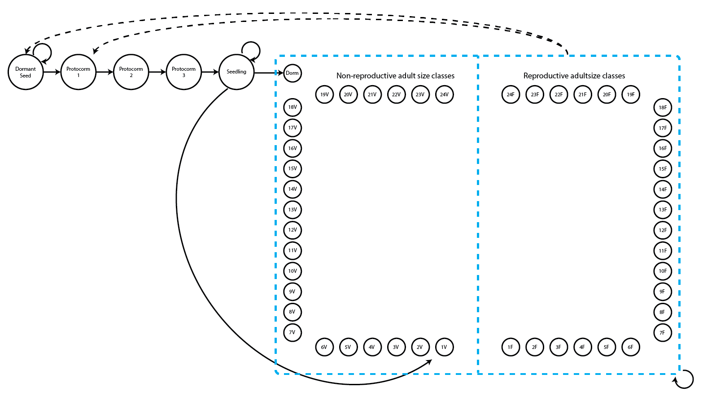
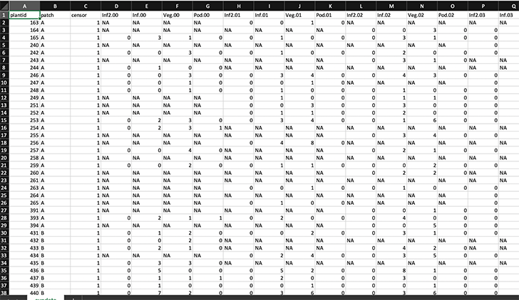
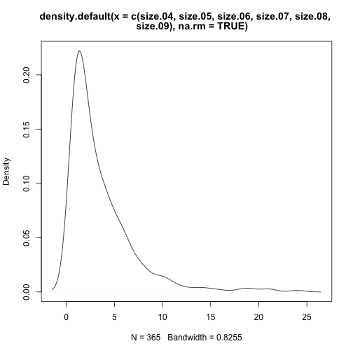
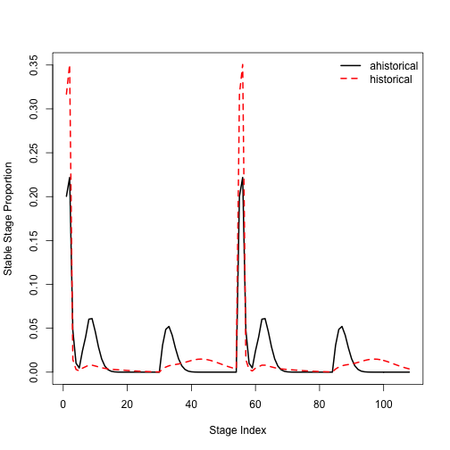

This document was built in Markdown in R 4.0.2, and covers package `lefko3` version 2.4.1.

## CASE STUDIES OF AMERICAN *Cypripedium candidum* POPULATION

### ORGANISM AND POPULATION

  <p style="text-indent: 20px">In this vignette, we will focus on dataset `cypdata`, which is a demographic dataset for a North American population of the white lady's slipper, *Cypripedium candidum*. This species is of conservation concern, and the population is located within a state nature preserve located in northeastern Illinois, USA. The population was monitored annually from 2004 to 2009, with two monitoring sessions per year. More information about this population and its characteristics is given in Shefferson et al. [-@shefferson_estimating_2001] and Shefferson et al. [-@shefferson_predicting_2017].</p>
  
  <p style="text-indent: 20px">Population matrix projection modeling requires an appropriate life history model showing how all stages and transitions are related. The figure below shows a very general life history model detailing these relationships in *Cypripedium candidum*. The first stage of life is a dormant seed stage, although an individual may germinate in the year following seed production. The first germinated stage is a protocorm, which is an underground, mycoheterotrophic stage unique to the families Orchidaceae and Pyrolaceae. There are three years of protocorm stages, followed by a seedling stage, and finally a set of stages that comprise the size-classified adult portion of life. The figure shows 49 such stages, each for a different number of stems and one of two reproductive statuses. These stages may be compressed for different circumstances (more on this later).</p>
  
</img>

  <p style="text-indent: 20px">We can see a variety of transitions within this figure. The juvenile stages have fairly simple transitions. New recruits may enter the population directly from germination of a seed produced the previous year, in which case they start in the protocorm 1 stage, or they may begin as dormant seed. Dormant seed may remain dormant, die, or germinate into the protocorm 1 stage. Protocorms exist for up to 3 years, yielding the protocorm 1, 2, and 3 stages, without any possibility of staying within each of these stages for more than a single year. Protocorm 3 leads to a seedling stage, in which the plant may persist for many years before becoming mature. Here, maturity does not really refer to reproduction *per se*, but rather to a morphology indistinguishable from a reproductive plant except for the lack of a flower. The first mature stage is usually either vegetative dormancy (dorm), during which time the plant does not sprout, or a small, non-flowering adult (1V). Once in this portion of the life history, the plant may transition among 49 mature stages, including vegetative dormancy, 1-24 shoots without flowers, or 1-24 shoots with at least one flower.</p>
  
  <p style="text-indent: 20px">The horizontal dataset `cypdata`, and the ahistorical vertical dataset `cypvert` which is the same as `cypdata` but is structured differently, both include only data for the adult stages, and so later we will need to set juvenile transitions to constants.</p>
  
### ANALYSES WITH *CYPRIPEDIUM* DATA

  <p style="text-indent: 20px">We will analyze these data in two different ways to illustrate the utility of package `lefko3`:</p> 
  
  1) through the estimation of **raw MPMs** using a simplified life history; and
  
  2) through the estimation of **function-based MPMs** using a count-based size metric and the general life history model shown above.
  
  
### Analysis 1. Raw matrix estimation

  <p style="text-indent: 20px">In this example, we will create raw matrices with these data. Here, we use the term 'raw' to refer to the fact that we will estimate matrix elements as exact proportions of individuals surviving and transitioning to different stages. This requires us to develop a life history model that is both biologically realistic, and numerically parsimonious. The former requirement means that stages need to be defined in biologically meaningful ways, while the latter requirement means that we need to design our life stages in such a way that most years include some individuals in each stage. We also need to consider the fact that very low numbers of stages appear to result in biased matrix analyses, so we want to make sure that we have at least 7 stages in the final model [@salguero-gomez_matrix_2010].</p>

#### Step 1a. Data characterization and reorganization (horizontal file)

  <p style="text-indent: 20px">First let's wipe the memory, load `lefko3`, and then load the data.</p>

```r
rm(list=ls(all=TRUE))

library(lefko3)
data(cypdata)

summary(cypdata)
#>     plantid       patch      censor     Inf2.04       Inf.04           Veg.04           Pod.04       Inf2.05            Inf.05      
#>  Min.   : 164.0   A:23   Min.   :1   Min.   :0    Min.   :0.0000   Min.   : 0.000   Min.   :0.0   Min.   :0.00000   Min.   : 0.000  
#>  1st Qu.: 265.0   B:35   1st Qu.:1   1st Qu.:0    1st Qu.:0.0000   1st Qu.: 1.000   1st Qu.:0.0   1st Qu.:0.00000   1st Qu.: 0.000  
#>  Median : 455.0   C:19   Median :1   Median :0    Median :0.0000   Median : 2.000   Median :0.0   Median :0.00000   Median : 0.000  
#>  Mean   : 669.1          Mean   :1   Mean   :0    Mean   :0.6923   Mean   : 2.923   Mean   :0.2   Mean   :0.04478   Mean   : 1.537  
#>  3rd Qu.: 829.0          3rd Qu.:1   3rd Qu.:0    3rd Qu.:1.0000   3rd Qu.: 4.000   3rd Qu.:0.0   3rd Qu.:0.00000   3rd Qu.: 2.000  
#>  Max.   :1560.0          Max.   :1   Max.   :0    Max.   :8.0000   Max.   :12.000   Max.   :3.0   Max.   :1.00000   Max.   :18.000  
#>                                      NA's   :12   NA's   :12       NA's   :12       NA's   :12    NA's   :10        NA's   :10      
#>      Veg.05          Pod.05          Inf2.06       Inf.06            Veg.06           Pod.06          Inf2.07      Inf.07      
#>  Min.   :0.000   Min.   :0.0000   Min.   :0    Min.   : 0.0000   Min.   : 0.000   Min.   :0.0000   Min.   :0   Min.   :0.0000  
#>  1st Qu.:1.000   1st Qu.:0.0000   1st Qu.:0    1st Qu.: 0.0000   1st Qu.: 1.000   1st Qu.:0.0000   1st Qu.:0   1st Qu.:0.0000  
#>  Median :1.000   Median :0.0000   Median :0    Median : 0.0000   Median : 2.000   Median :0.0000   Median :0   Median :0.0000  
#>  Mean   :2.134   Mean   :0.6567   Mean   :0    Mean   : 0.9016   Mean   : 2.213   Mean   :0.3934   Mean   :0   Mean   :0.6271  
#>  3rd Qu.:3.000   3rd Qu.:1.0000   3rd Qu.:0    3rd Qu.: 1.0000   3rd Qu.: 3.000   3rd Qu.:0.0000   3rd Qu.:0   3rd Qu.:1.0000  
#>  Max.   :9.000   Max.   :7.0000   Max.   :0    Max.   :18.0000   Max.   :13.000   Max.   :4.0000   Max.   :0   Max.   :7.0000  
#>  NA's   :10      NA's   :10       NA's   :16   NA's   :16        NA's   :16       NA's   :16                   NA's   :18      
#>      Veg.07           Pod.07          Inf2.08       Inf.08            Veg.08          Pod.08          Inf2.09       Inf.09      
#>  Min.   : 0.000   Min.   :0.0000   Min.   :0    Min.   : 0.0000   Min.   : 0.00   Min.   :0.0000   Min.   :0    Min.   : 0.000  
#>  1st Qu.: 1.000   1st Qu.:0.0000   1st Qu.:0    1st Qu.: 0.0000   1st Qu.: 1.00   1st Qu.:0.0000   1st Qu.:0    1st Qu.: 0.000  
#>  Median : 2.000   Median :0.0000   Median :0    Median : 0.0000   Median : 2.00   Median :0.0000   Median :0    Median : 1.000  
#>  Mean   : 2.627   Mean   :0.0678   Mean   :0    Mean   : 0.8868   Mean   : 2.83   Mean   :0.1509   Mean   :0    Mean   : 1.833  
#>  3rd Qu.: 4.000   3rd Qu.:0.0000   3rd Qu.:0    3rd Qu.: 1.0000   3rd Qu.: 4.00   3rd Qu.:0.0000   3rd Qu.:0    3rd Qu.: 2.000  
#>  Max.   :13.000   Max.   :1.0000   Max.   :0    Max.   :11.0000   Max.   :13.00   Max.   :2.0000   Max.   :0    Max.   :11.000  
#>  NA's   :18       NA's   :18       NA's   :24   NA's   :24        NA's   :24      NA's   :24       NA's   :17   NA's   :17      
#>      Veg.09           Pod.09     
#>  Min.   : 0.000   Min.   :0.000  
#>  1st Qu.: 1.000   1st Qu.:0.000  
#>  Median : 1.000   Median :1.000  
#>  Mean   : 2.233   Mean   :1.133  
#>  3rd Qu.: 3.000   3rd Qu.:1.000  
#>  Max.   :10.000   Max.   :8.000  
#>  NA's   :17       NA's   :17
```

  <p style="text-indent: 20px">The dataset that we have provided is organized in horizontal format, meaning that rows correspond to unique individuals and columns correspond to state in particular years. Looking at the original Excel spreadsheet (below), you will note a repeating pattern in the names of the columns. Package `lefko3` includes functions to handle data in horizontal format, as well as functions to handle vertically formatted data (i.e. data for individuals is broken up across rows, where each row is a unique combination of individual and year in time *t*).</p>

</img>

  <p style="text-indent: 20px">In this dataset, there are 77 individuals, so there are 77 rows with data (not counting the header). There are 27 columns. Note the the first 3 columns are variables giving identifying information about each individual, with each individual's data entirely restricted to one row. This is followed by a number of sets of 4 columns, each named `Inf2.XX`, `Inf.XX`, `Veg.XX`, and `Pod.XX`. The XX in each case corresponds to a specific year, which are organized consecutively. Thus, columns 4-7 refer to year 04 (short for 2004), columns 8-11 refer to year 05, columns 12-15 refer to year 06, columns 16-19 refer to year 07, columns 20-23 refer to year 08, and columns 24-27 refer to year 09. To properly conduct this exercise, we need to know the exact number of years used, which is six years here (includes all years from 2004 to 2009). Note that each year MUST utilize exactly the same number and pattern of columns. Also note that this package also includes dataset `cypvert`, which is the same dataset but set in ahistorical vertical format.</p>

  <p style="text-indent: 20px">Now we will move on to the assessment of size. The full sizes of individuals are actually the sums of columns (representing sprouts) within years. We will take these sums, and then assess the distribution of individual sizes across years. We will look at all years and look for general patterns and abnormalities.</p>

```r
size.04 <- cypdata$Inf2.04 + cypdata$Inf.04 + cypdata$Veg.04
size.05 <- cypdata$Inf2.05 + cypdata$Inf.05 + cypdata$Veg.05
size.06 <- cypdata$Inf2.06 + cypdata$Inf.06 + cypdata$Veg.06
size.07 <- cypdata$Inf2.07 + cypdata$Inf.07 + cypdata$Veg.07
size.08 <- cypdata$Inf2.08 + cypdata$Inf.08 + cypdata$Veg.08
size.09 <- cypdata$Inf2.09 + cypdata$Inf.09 + cypdata$Veg.09

summary(c(size.04, size.05, size.06, size.07, size.08, size.09))
#>    Min. 1st Qu.  Median    Mean 3rd Qu.    Max.    NA's 
#>   1.000   1.000   2.000   3.581   5.000  24.000      97
```

The minimum size noted is 1, while the maximum is 24. There are 97 NAs, which includes cases in which plants were not alive as well as cases in which plants were vegetatively dormant. In the latter case, the individual is alive but not observable, which can be interpreted as an aboveground size of 0. Let's quickly plot the size distribution of sprouting individuals.

```r
plot(density(c(size.04, size.05, size.06, size.07, size.08, size.09), 
             na.rm = TRUE))
```



  <p style="text-indent: 20px">This exercise gives us a reasonable idea of size classes to use for adults. We will have a dormant class (size = 0 shoots), extra small class (1 shoot), small class (2-3 shoots), medium class (4-5 shoots), large class (6-10 shoots), and extra large class (>10 shoots). Let's define a `stageframe` that shows this.</p>

```r
sizevector <- c(0, 0, 0, 0, 0, 0, 1, 2.5, 4.5, 8, 17.5)
stagevector <- c("SD", "P1", "P2", "P3", "SL", "D", "XSm", "Sm", "Md", "Lg", "XLg")
repvector <- c(0, 0, 0, 0, 0, 0, 1, 1, 1, 1, 1)
obsvector <- c(0, 0, 0, 0, 0, 0, 1, 1, 1, 1, 1)
matvector <- c(0, 0, 0, 0, 0, 1, 1, 1, 1, 1, 1)
immvector <- c(0, 1, 1, 1, 1, 0, 0, 0, 0, 0, 0)
propvector <- c(1, 0, 0, 0, 0, 0, 0, 0, 0, 0, 0)
indataset <- c(0, 0, 0, 0, 0, 1, 1, 1, 1, 1, 1)
binvec <- c(0, 0, 0, 0, 0, 0.5, 0.5, 1, 1, 2.5, 7)

cypframe_raw <- sf_create(sizes = sizevector, stagenames = stagevector, 
                      repstatus = repvector, obsstatus = obsvector, 
                      matstatus = matvector, propstatus = propvector, 
                      immstatus = immvector, indataset = indataset, 
                      binhalfwidth = binvec)
```

  <p style="text-indent: 20px">Now we will add some comments to the stageframe for our later use in interpretation.</p>

```r
cypframe_raw$comments[(cypframe_raw$stagenames == "SD")] <- "Dormant seed"
cypframe_raw$comments[(cypframe_raw$stagenames == "P1")] <- "1st yr protocorm"
cypframe_raw$comments[(cypframe_raw$stagenames == "P2")] <- "2nd yr protocorm"
cypframe_raw$comments[(cypframe_raw$stagenames == "P3")] <- "3rd yr protocorm"
cypframe_raw$comments[(cypframe_raw$stagenames == "SL")] <- "Seedling"
cypframe_raw$comments[(cypframe_raw$stagenames == "D")] <- "Dormant adult"
cypframe_raw$comments[(cypframe_raw$stagenames == "XSm")] <- "Extra small adult (1 shoot)"
cypframe_raw$comments[(cypframe_raw$stagenames == "Sm")] <- "Small adult (2-3 shoots)"
cypframe_raw$comments[(cypframe_raw$stagenames == "Md")] <- "Medium adult (4-5 shoots)"
cypframe_raw$comments[(cypframe_raw$stagenames == "Lg")] <- "Large adult (6-10 shoots)"
cypframe_raw$comments[(cypframe_raw$stagenames == "XLg")] <- "Extra large adult (>10 shoots)"
```

  <p style="text-indent: 20px">Type `cypframe_raw` at the R prompt to see what this structure looks like.</p>
  
  <p style="text-indent: 20px">Next we will create the vertical dataset. Note that because we are lumping reproductive and non-reproductive individuals into the non-dormant adult classes, we need to set `NRasRep = TRUE`. Otherwise, `verticalize3()` will attempt to use the reproductive status of individuals in classification, and will fail due to the presence of non-reproductive adults. We also need to set `NAas0 = TRUE` to make sure that NA values in size are turned into 0 entries where necessary, and so aid in the assignment of the vegetative dormancy stage.</p>

```r
cypraw_v1 <- verticalize3(data = cypdata, noyears = 6, firstyear = 2004, 
                         patchidcol = "patch", individcol = "plantid", 
                         blocksize = 4, size1col = "Inf2.04", size2col = "Inf.04", 
                         size3col = "Veg.04", repstr1col = "Inf.04", 
                         repstr2col = "Inf2.04", fec1col = "Pod.04", 
                         stageassign = cypframe_raw, stagesize = "sizeadded", 
                         NAas0 = TRUE, NRasRep = TRUE)

summary(cypraw_v1)
#>      rowid       popid  patchid   individ              year2        firstseen       lastseen        obsage       obslifespan   
#>  Min.   : 1.00   :320   A: 93   Length:320         Min.   :2004   Min.   :2004   Min.   :2004   Min.   :0.000   Min.   :0.000  
#>  1st Qu.:21.00          B:154   Class :character   1st Qu.:2005   1st Qu.:2004   1st Qu.:2009   1st Qu.:1.000   1st Qu.:5.000  
#>  Median :37.50          C: 73   Mode  :character   Median :2006   Median :2004   Median :2009   Median :2.000   Median :5.000  
#>  Mean   :38.45                                     Mean   :2006   Mean   :2004   Mean   :2009   Mean   :1.853   Mean   :4.556  
#>  3rd Qu.:56.00                                     3rd Qu.:2007   3rd Qu.:2004   3rd Qu.:2009   3rd Qu.:3.000   3rd Qu.:5.000  
#>  Max.   :77.00                                     Max.   :2008   Max.   :2008   Max.   :2009   Max.   :4.000   Max.   :5.000  
#>      sizea1             sizeb1            sizec1       size1added        repstra1          repstrb1            feca1       
#>  Min.   :0.000000   Min.   : 0.0000   Min.   : 0.0   Min.   : 0.000   Min.   : 0.0000   Min.   :0.000000   Min.   :0.0000  
#>  1st Qu.:0.000000   1st Qu.: 0.0000   1st Qu.: 0.0   1st Qu.: 0.000   1st Qu.: 0.0000   1st Qu.:0.000000   1st Qu.:0.0000  
#>  Median :0.000000   Median : 0.0000   Median : 1.0   Median : 2.000   Median : 0.0000   Median :0.000000   Median :0.0000  
#>  Mean   :0.009375   Mean   : 0.7469   Mean   : 1.9   Mean   : 2.656   Mean   : 0.7469   Mean   :0.009375   Mean   :0.2656  
#>  3rd Qu.:0.000000   3rd Qu.: 1.0000   3rd Qu.: 3.0   3rd Qu.: 4.000   3rd Qu.: 1.0000   3rd Qu.:0.000000   3rd Qu.:0.0000  
#>  Max.   :1.000000   Max.   :18.0000   Max.   :13.0   Max.   :21.000   Max.   :18.0000   Max.   :1.000000   Max.   :7.0000  
#>    juvgiven1   obsstatus1       repstatus1       fecstatus1       matstatus1         alive1          stage1         
#>  Min.   :0   Min.   :0.0000   Min.   :0.0000   Min.   :0.0000   Min.   :0.0000   Min.   :0.0000   Length:320        
#>  1st Qu.:0   1st Qu.:0.0000   1st Qu.:0.0000   1st Qu.:0.0000   1st Qu.:1.0000   1st Qu.:1.0000   Class :character  
#>  Median :0   Median :1.0000   Median :0.0000   Median :0.0000   Median :1.0000   Median :1.0000   Mode  :character  
#>  Mean   :0   Mean   :0.7469   Mean   :0.2875   Mean   :0.1344   Mean   :0.7688   Mean   :0.7688                     
#>  3rd Qu.:0   3rd Qu.:1.0000   3rd Qu.:1.0000   3rd Qu.:0.0000   3rd Qu.:1.0000   3rd Qu.:1.0000                     
#>  Max.   :0   Max.   :1.0000   Max.   :1.0000   Max.   :1.0000   Max.   :1.0000   Max.   :1.0000                     
#>   stage1index         sizea2             sizeb2            sizec2         size2added        repstra2          repstrb2       
#>  Min.   : 0.000   Min.   :0.000000   Min.   : 0.0000   Min.   : 0.000   Min.   : 0.000   Min.   : 0.0000   Min.   :0.000000  
#>  1st Qu.: 6.000   1st Qu.:0.000000   1st Qu.: 0.0000   1st Qu.: 1.000   1st Qu.: 1.000   1st Qu.: 0.0000   1st Qu.:0.000000  
#>  Median : 8.000   Median :0.000000   Median : 0.0000   Median : 2.000   Median : 2.000   Median : 0.0000   Median :0.000000  
#>  Mean   : 6.309   Mean   :0.009375   Mean   : 0.8969   Mean   : 2.416   Mean   : 3.322   Mean   : 0.8969   Mean   :0.009375  
#>  3rd Qu.: 9.000   3rd Qu.:0.000000   3rd Qu.: 1.0000   3rd Qu.: 3.000   3rd Qu.: 4.000   3rd Qu.: 1.0000   3rd Qu.:0.000000  
#>  Max.   :11.000   Max.   :1.000000   Max.   :18.0000   Max.   :13.000   Max.   :24.000   Max.   :18.0000   Max.   :1.000000  
#>      feca2          juvgiven2   obsstatus2       repstatus2       fecstatus2       matstatus2     alive2     stage2         
#>  Min.   :0.0000   Min.   :0   Min.   :0.0000   Min.   :0.0000   Min.   :0.0000   Min.   :1    Min.   :1   Length:320        
#>  1st Qu.:0.0000   1st Qu.:0   1st Qu.:1.0000   1st Qu.:0.0000   1st Qu.:0.0000   1st Qu.:1    1st Qu.:1   Class :character  
#>  Median :0.0000   Median :0   Median :1.0000   Median :0.0000   Median :0.0000   Median :1    Median :1   Mode  :character  
#>  Mean   :0.2906   Mean   :0   Mean   :0.9531   Mean   :0.3688   Mean   :0.1562   Mean   :1    Mean   :1                     
#>  3rd Qu.:0.0000   3rd Qu.:0   3rd Qu.:1.0000   3rd Qu.:1.0000   3rd Qu.:0.0000   3rd Qu.:1    3rd Qu.:1                     
#>  Max.   :7.0000   Max.   :0   Max.   :1.0000   Max.   :1.0000   Max.   :1.0000   Max.   :1    Max.   :1                     
#>   stage2index         sizea3             sizeb3           sizec3         size3added        repstra3         repstrb3       
#>  Min.   : 6.000   Min.   :0.000000   Min.   : 0.000   Min.   : 0.000   Min.   : 0.000   Min.   : 0.000   Min.   :0.000000  
#>  1st Qu.: 7.000   1st Qu.:0.000000   1st Qu.: 0.000   1st Qu.: 1.000   1st Qu.: 1.000   1st Qu.: 0.000   1st Qu.:0.000000  
#>  Median : 8.000   Median :0.000000   Median : 0.000   Median : 1.000   Median : 2.000   Median : 0.000   Median :0.000000  
#>  Mean   : 8.125   Mean   :0.009375   Mean   : 1.069   Mean   : 2.209   Mean   : 3.288   Mean   : 1.069   Mean   :0.009375  
#>  3rd Qu.: 9.000   3rd Qu.:0.000000   3rd Qu.: 1.000   3rd Qu.: 3.000   3rd Qu.: 4.000   3rd Qu.: 1.000   3rd Qu.:0.000000  
#>  Max.   :11.000   Max.   :1.000000   Max.   :18.000   Max.   :13.000   Max.   :24.000   Max.   :18.000   Max.   :1.000000  
#>      feca3          juvgiven3   obsstatus3    repstatus3    fecstatus3       matstatus3     alive3          stage3         
#>  Min.   :0.0000   Min.   :0   Min.   :0.0   Min.   :0.0   Min.   :0.0000   Min.   :1    Min.   :0.0000   Length:320        
#>  1st Qu.:0.0000   1st Qu.:0   1st Qu.:1.0   1st Qu.:0.0   1st Qu.:0.0000   1st Qu.:1    1st Qu.:1.0000   Class :character  
#>  Median :0.0000   Median :0   Median :1.0   Median :0.0   Median :0.0000   Median :1    Median :1.0000   Mode  :character  
#>  Mean   :0.4562   Mean   :0   Mean   :0.9   Mean   :0.4   Mean   :0.2219   Mean   :1    Mean   :0.9469                     
#>  3rd Qu.:0.0000   3rd Qu.:0   3rd Qu.:1.0   3rd Qu.:1.0   3rd Qu.:0.0000   3rd Qu.:1    3rd Qu.:1.0000                     
#>  Max.   :8.0000   Max.   :0   Max.   :1.0   Max.   :1.0   Max.   :1.0000   Max.   :1    Max.   :1.0000                     
#>   stage3index    
#>  Min.   : 0.000  
#>  1st Qu.: 7.000  
#>  Median : 8.000  
#>  Mean   : 7.744  
#>  3rd Qu.: 9.000  
#>  Max.   :11.000
dim(cypraw_v1)
#> [1] 320  54
```

#### Step 1b. Data characterization and reorganization (vertical file)

  <p style="text-indent: 20px">We may also wish to see how to proceed if our original dataset is already in vertical, but ahistorical, format. Here, we see such a situation and use the `historicalize3()` function. First, let's load the ahistorical vertical raw data file.</p>

```r
data(cypvert)

summary(cypvert)
#>     plantid          patch               censor      year2          Inf2.2             Inf.2            Veg.2       
#>  Min.   : 164.0   Length:331         Min.   :1   Min.   :2004   Min.   :0.000000   Min.   : 0.000   Min.   : 0.000  
#>  1st Qu.: 391.0   Class :character   1st Qu.:1   1st Qu.:2005   1st Qu.:0.000000   1st Qu.: 0.000   1st Qu.: 1.000  
#>  Median : 454.0   Mode  :character   Median :1   Median :2006   Median :0.000000   Median : 0.000   Median : 2.000  
#>  Mean   : 662.8                      Mean   :1   Mean   :2006   Mean   :0.009646   Mean   : 0.941   Mean   : 2.534  
#>  3rd Qu.: 664.0                      3rd Qu.:1   3rd Qu.:2007   3rd Qu.:0.000000   3rd Qu.: 1.000   3rd Qu.: 3.000  
#>  Max.   :1560.0                      Max.   :1   Max.   :2008   Max.   :1.000000   Max.   :18.000   Max.   :13.000  
#>                                                                 NA's   :20         NA's   :26       NA's   :26      
#>      Pod.2            Inf2.3             Inf.3            Veg.3           Pod.3       
#>  Min.   :0.0000   Min.   :0.000000   Min.   : 0.000   Min.   : 0.00   Min.   :0.0000  
#>  1st Qu.:0.0000   1st Qu.:0.000000   1st Qu.: 0.000   1st Qu.: 1.00   1st Qu.:0.0000  
#>  Median :0.0000   Median :0.000000   Median : 0.000   Median : 1.00   Median :0.0000  
#>  Mean   :0.3049   Mean   :0.009804   Mean   : 1.173   Mean   : 2.39   Mean   :0.4933  
#>  3rd Qu.:0.0000   3rd Qu.:0.000000   3rd Qu.: 1.000   3rd Qu.: 3.00   3rd Qu.:0.0000  
#>  Max.   :7.0000   Max.   :1.000000   Max.   :18.000   Max.   :13.00   Max.   :8.0000  
#>  NA's   :26       NA's   :25         NA's   :31       NA's   :31      NA's   :31
```

And let's also look at its dimensions.

```r
dim(cypvert)
#> [1] 331  12
```
  
  <p style="text-indent: 20px">This dataset is longer and narrower, with more rows and fewer columns. This is because we now split data for each individual across multiple columns. After the three columns of identifying information, a single column designates time in year *t*, given as `year2`. This dataset then includes columns showing indiviual state in pairs of consecutive years corresponding to times *t* and *t*+1. State in time *t*-1 is not presented because this is an ahistorical dataset. Fortunately, this dataset includes the `plantid` variable, which is an individual identity term and must be supplied for conversion. The `historicalize3()` function can use individual identity variables to reorganize datasets into historical vertical format.</p>

```r
cypraw_v2 <- historicalize3(data = cypvert, patchidcol = "patch", individcol = "plantid",
                           year2col = "year2", sizea2col = "Inf2.2", sizea3col = "Inf2.3",
                           sizeb2col = "Inf.2", sizeb3col = "Inf.3", sizec2col = "Veg.2",
                           sizec3col = "Veg.3", repstra2col = "Inf2.2", repstra3col = "Inf2.3",
                           repstrb2col = "Inf.2", repstrb3col = "Inf.3", feca2col = "Pod.2",
                           feca3col = "Pod.3", repstrrel = 2, stageassign = cypframe_raw,
                           stagesize = "sizeadded", censorcol = "censor", censor = FALSE,
                           NAas0 = TRUE, NRasRep = TRUE, reduce = TRUE)
summary(cypraw_v2)
#>      rowid           popid             patchid            individ              year2        firstseen       lastseen   
#>  Min.   :  0.00   Length:320         Length:320         Length:320         Min.   :2004   Min.   :2004   Min.   :2004  
#>  1st Qu.: 82.75   Class :character   Class :character   Class :character   1st Qu.:2005   1st Qu.:2004   1st Qu.:2009  
#>  Median :162.50   Mode  :character   Mode  :character   Mode  :character   Median :2006   Median :2004   Median :2009  
#>  Mean   :163.70                                                            Mean   :2006   Mean   :2004   Mean   :2009  
#>  3rd Qu.:245.25                                                            3rd Qu.:2007   3rd Qu.:2004   3rd Qu.:2009  
#>  Max.   :330.00                                                            Max.   :2008   Max.   :2008   Max.   :2009  
#>      obsage       obslifespan        sizea1             sizeb1            sizec1       size1added        repstra1       
#>  Min.   :0.000   Min.   :0.000   Min.   :0.000000   Min.   : 0.0000   Min.   : 0.0   Min.   : 0.000   Min.   :0.000000  
#>  1st Qu.:1.000   1st Qu.:5.000   1st Qu.:0.000000   1st Qu.: 0.0000   1st Qu.: 0.0   1st Qu.: 0.000   1st Qu.:0.000000  
#>  Median :2.000   Median :5.000   Median :0.000000   Median : 0.0000   Median : 1.0   Median : 2.000   Median :0.000000  
#>  Mean   :1.853   Mean   :4.556   Mean   :0.009375   Mean   : 0.7469   Mean   : 1.9   Mean   : 2.656   Mean   :0.009375  
#>  3rd Qu.:3.000   3rd Qu.:5.000   3rd Qu.:0.000000   3rd Qu.: 1.0000   3rd Qu.: 3.0   3rd Qu.: 4.000   3rd Qu.:0.000000  
#>  Max.   :4.000   Max.   :5.000   Max.   :1.000000   Max.   :18.0000   Max.   :13.0   Max.   :21.000   Max.   :1.000000  
#>     repstrb1           feca1          juvgiven1   obsstatus1       repstatus1       fecstatus1       matstatus1         alive1      
#>  Min.   : 0.0000   Min.   :0.0000   Min.   :0   Min.   :0.0000   Min.   :0.0000   Min.   :0.0000   Min.   :0.0000   Min.   :0.0000  
#>  1st Qu.: 0.0000   1st Qu.:0.0000   1st Qu.:0   1st Qu.:0.0000   1st Qu.:0.0000   1st Qu.:0.0000   1st Qu.:1.0000   1st Qu.:1.0000  
#>  Median : 0.0000   Median :0.0000   Median :0   Median :1.0000   Median :0.0000   Median :0.0000   Median :1.0000   Median :1.0000  
#>  Mean   : 0.7469   Mean   :0.2656   Mean   :0   Mean   :0.7469   Mean   :0.2875   Mean   :0.1344   Mean   :0.7688   Mean   :0.7688  
#>  3rd Qu.: 1.0000   3rd Qu.:0.0000   3rd Qu.:0   3rd Qu.:1.0000   3rd Qu.:1.0000   3rd Qu.:0.0000   3rd Qu.:1.0000   3rd Qu.:1.0000  
#>  Max.   :18.0000   Max.   :7.0000   Max.   :0   Max.   :1.0000   Max.   :1.0000   Max.   :1.0000   Max.   :1.0000   Max.   :1.0000  
#>     stage1           stage1index         sizea2             sizeb2            sizec2         size2added        repstra2       
#>  Length:320         Min.   : 0.000   Min.   :0.000000   Min.   : 0.0000   Min.   : 0.000   Min.   : 0.000   Min.   :0.000000  
#>  Class :character   1st Qu.: 6.000   1st Qu.:0.000000   1st Qu.: 0.0000   1st Qu.: 1.000   1st Qu.: 1.000   1st Qu.:0.000000  
#>  Mode  :character   Median : 8.000   Median :0.000000   Median : 0.0000   Median : 2.000   Median : 2.000   Median :0.000000  
#>                     Mean   : 6.309   Mean   :0.009375   Mean   : 0.8969   Mean   : 2.416   Mean   : 3.322   Mean   :0.009375  
#>                     3rd Qu.: 9.000   3rd Qu.:0.000000   3rd Qu.: 1.0000   3rd Qu.: 3.000   3rd Qu.: 4.000   3rd Qu.:0.000000  
#>                     Max.   :11.000   Max.   :1.000000   Max.   :18.0000   Max.   :13.000   Max.   :24.000   Max.   :1.000000  
#>     repstrb2           feca2          juvgiven2   obsstatus2       repstatus2       fecstatus2       matstatus2     alive2 
#>  Min.   : 0.0000   Min.   :0.0000   Min.   :0   Min.   :0.0000   Min.   :0.0000   Min.   :0.0000   Min.   :1    Min.   :1  
#>  1st Qu.: 0.0000   1st Qu.:0.0000   1st Qu.:0   1st Qu.:1.0000   1st Qu.:0.0000   1st Qu.:0.0000   1st Qu.:1    1st Qu.:1  
#>  Median : 0.0000   Median :0.0000   Median :0   Median :1.0000   Median :0.0000   Median :0.0000   Median :1    Median :1  
#>  Mean   : 0.8969   Mean   :0.2906   Mean   :0   Mean   :0.9531   Mean   :0.3688   Mean   :0.1562   Mean   :1    Mean   :1  
#>  3rd Qu.: 1.0000   3rd Qu.:0.0000   3rd Qu.:0   3rd Qu.:1.0000   3rd Qu.:1.0000   3rd Qu.:0.0000   3rd Qu.:1    3rd Qu.:1  
#>  Max.   :18.0000   Max.   :7.0000   Max.   :0   Max.   :1.0000   Max.   :1.0000   Max.   :1.0000   Max.   :1    Max.   :1  
#>     stage2           stage2index         sizea3             sizeb3           sizec3         size3added        repstra3       
#>  Length:320         Min.   : 6.000   Min.   :0.000000   Min.   : 0.000   Min.   : 0.000   Min.   : 0.000   Min.   :0.000000  
#>  Class :character   1st Qu.: 7.000   1st Qu.:0.000000   1st Qu.: 0.000   1st Qu.: 1.000   1st Qu.: 1.000   1st Qu.:0.000000  
#>  Mode  :character   Median : 8.000   Median :0.000000   Median : 0.000   Median : 1.000   Median : 2.000   Median :0.000000  
#>                     Mean   : 8.125   Mean   :0.009375   Mean   : 1.069   Mean   : 2.209   Mean   : 3.288   Mean   :0.009375  
#>                     3rd Qu.: 9.000   3rd Qu.:0.000000   3rd Qu.: 1.000   3rd Qu.: 3.000   3rd Qu.: 4.000   3rd Qu.:0.000000  
#>                     Max.   :11.000   Max.   :1.000000   Max.   :18.000   Max.   :13.000   Max.   :24.000   Max.   :1.000000  
#>     repstrb3          feca3          juvgiven3   obsstatus3    repstatus3    fecstatus3       matstatus3     alive3      
#>  Min.   : 0.000   Min.   :0.0000   Min.   :0   Min.   :0.0   Min.   :0.0   Min.   :0.0000   Min.   :1    Min.   :0.0000  
#>  1st Qu.: 0.000   1st Qu.:0.0000   1st Qu.:0   1st Qu.:1.0   1st Qu.:0.0   1st Qu.:0.0000   1st Qu.:1    1st Qu.:1.0000  
#>  Median : 0.000   Median :0.0000   Median :0   Median :1.0   Median :0.0   Median :0.0000   Median :1    Median :1.0000  
#>  Mean   : 1.069   Mean   :0.4562   Mean   :0   Mean   :0.9   Mean   :0.4   Mean   :0.2219   Mean   :1    Mean   :0.9469  
#>  3rd Qu.: 1.000   3rd Qu.:0.0000   3rd Qu.:0   3rd Qu.:1.0   3rd Qu.:1.0   3rd Qu.:0.0000   3rd Qu.:1    3rd Qu.:1.0000  
#>  Max.   :18.000   Max.   :8.0000   Max.   :0   Max.   :1.0   Max.   :1.0   Max.   :1.0000   Max.   :1    Max.   :1.0000  
#>     stage3           stage3index    
#>  Length:320         Min.   : 0.000  
#>  Class :character   1st Qu.: 7.000  
#>  Mode  :character   Median : 8.000  
#>                     Mean   : 7.744  
#>                     3rd Qu.: 9.000  
#>                     Max.   :11.000
```

  <p style="text-indent: 20px">We can compare the dimensions of these datasets.</p>

```r
dim(cypraw_v1)
#> [1] 320  54
dim(cypraw_v2)
#> [1] 320  54
```

The lengths of the datasets are the same in terms of rows and columns, and the variables and data are the same although the order of the columns and rows might not match.

#### Step 2. Provide supplemental information for matrix estimation

  <p style="text-indent: 20px">For our next step, we need to create a **reproductive matrix**, which tells R not only which stages are reproductive, but which stages they lead to the reproduction of, and at what level. This matrix is mostly composed of 0s, but fecundity is noted as non-zero entries equal to a scalar multiplier to the full fecundity estimated by R. This matrix has as many rows and columns as the number of stages described in the stageframe for this dataset, and the rows and columns refer to these stages in the same order as in the stageframe. In many ways, it looks like a nearly empty population matrix, but notes the per-individual mean modifiers on fecundity for each stage that actually reproduces. Here, we first create a 0 matrix with dimensions equal to the number of rows in `cypframe_raw`. Then we modify elements corresponding to fecundity by dividing fecundity evenly between dormant seeds (row 1) and germinating seeds (row 2).</p>

```r
rep_cyp_raw <- matrix(0, 11, 11)
rep_cyp_raw[1:2,7:11] <- 0.5
```

  <p style="text-indent: 20px">Next we will provide some given transitions. In this case, we are providing the seed dormancy probability and germination rate, which in this case are provided as transitions from the dormant seed stage to another year of seed dormancy or to a first-year protocorm, respectively. We are also providing the survival-transition probabilities between different year protocorm stages (P1, P2, and P3), to the seedling stage (SL), and from the seedling stage to some of the adult stages (XSm, Sm, and D). Let's start with the ahistorical case.</p>

```r
cypover2r <- overwrite(stage3 = c("SD", "P1", "P2", "P3", "SL", "SL", "D", "XSm", "Sm"),
                       stage2 = c("SD", "SD", "P1", "P2", "P3", "SL", "SL", "SL", "SL"),
                       eststage3 = c(NA, NA, NA, NA, NA, NA, "D", "XSm", "Sm"),
                       eststage2 = c(NA, NA, NA, NA, NA, NA, "XSm", "XSm", "XSm"),
                       givenrate = c(0.1, 0.2, 0.2, 0.2, 0.25, 0.1, NA, NA, NA),
                       type = c("S", "S", "S", "S", "S", "S", "S", "S", "S"))
```

  <p style="text-indent: 20px">This overwrite table shows us that we have survival-transition probabilities (`type = "S"`), that the given transitions are ahistorical, and particularly outlines probabilities for transitions that we cannot estimate with our dataset, which in this case involve the immature stages of life. While six of these survival-transitions are given in the `givenrate` column, we also mark 3 of them as survival-transitions that we wish to use other estimates as proxies for. This is indicated via the `eststageX` columns, which have entries corresponding the stages to use as proxies (note that the `givenrate` entries are NA for these cases).</p>

  <p style="text-indent: 20px">And now the historical case. Here we need to show the states in time step *t*-1 for this to work properly. Because of the extra time step, we will use the short-hand term `"rep"` to code for reproductive stages leading to the seeds and first-year protocorms that must survive to the next year.</p>

```r
cypover3r <- overwrite(stage3 = c("SD", "SD", "P1", "P1", "P2", "P3", "SL", "SL", 
                       "SL", "D", "XSm", "Sm", "D", "XSm", "Sm"), stage2 = c("SD", 
                       "SD", "SD", "SD", "P1", "P2", "P3", "SL", "SL", "SL", "SL", 
                       "SL", "SL", "SL", "SL"), stage1 = c("SD", "rep", "SD", "rep", 
                       "SD", "P1", "P2", "P3", "SL", "P3", "P3", "P3", "SL", "SL", 
                       "SL"), eststage3 = c(NA, NA, NA, NA, NA, NA, NA, NA, NA, "D", 
                       "XSm", "Sm", "D", "XSm", "Sm"), eststage2 = c(NA, NA, NA, NA, 
                       NA, NA, NA, NA, NA, "XSm", "XSm", "XSm", "XSm", "XSm", "XSm"),
                       eststage1 = c(NA, NA, NA, NA, NA, NA, NA, NA, NA, "XSm", 
                       "XSm", "XSm", "XSm", "XSm", "XSm"), givenrate = c(0.1, 0.1, 
                       0.2, 0.2, 0.2, 0.2, 0.25, 0.1, 0.1, NA, NA, NA, NA, NA, NA),
                       type = c("S", "S", "S", "S", "S", "S", "S", "S", "S", "S", 
                       "S", "S", "S", "S", "S"))
```

  <p style="text-indent: 20px">Type `cypover3r` at the prompt to note the increased dimensions here - there are 15 total transitions incorporated into this overwrite table, compared to 9 for the ahistorical version.</p>
  
  <p style="text-indent: 20px">Now we are read to create some matrices!</p>

#### Step 3. Estimate matrices

  <p style="text-indent: 20px">We will begin with the creation of a set of ahistorical matrices for the *Cypripedium candidum* dataset. This should not take terribly long. The `rlefko2` function was created to deal with the construction of standard ahistorical matrices using raw data. Matrices may strongly differ, particularly if the demographic dataset is somewhat sparse. This is because there may not be enough individuals per year to encounter all possible transitions, leading to seemingly random shifts in the location of non-zero elements within matrices across time. We strongly advise readers to build life history models that reflect the sample size that they are working with to prevent this issue from causing odd results in MPM analysis.</p>

```r
cypmatrix2r <- rlefko2(data = cypraw_v1, stageframe = cypframe_raw, year = "all", 
                       patch = "all", stages = c("stage3", "stage2"),
                       size = c("size3added", "size2added"), 
                       repmatrix = rep_cyp_raw, overwrite = cypover2r, 
                       yearcol = "year2", patchcol = "patchid", 
                       indivcol = "individ")
```

  <p style="text-indent: 20px">The input for the `rlefko2()` function includes `year = "all"`, but can be set to focus on any set of years included within the data. Package `lefko3` includes a great deal of flexibility here, and can estimate many matrices covering all of the populations, patches, and years occurring in a specific dataset. The function-based matrix approach in the next section will showcase some more of this flexibility.</p>

  <p style="text-indent: 20px">The output from this analysis is a `lefkoMat` object, which is a list object with the following elements:</p>
  
  **A**: a list of full population projection matrices, in order of population, patch, and year
  
  **U**: a list of matrices showing only survival-transition elements, in the same order as A
  
  **F**: a list of matrices showing only fecundity elements, in the same order as A
  
  **hstages**: a data frame showing the order of paired stages (given if matrices are historical, otherwise NA)
  
  **ahstages**: this is the stageframe used in analysis, with stages reordered and edited as they occur in the matrix
  
  **labels**: a table showing the order of matrices, according to population, patch, and year
  
  **matrixqc**: a short vector used in `summary` statements to describe the overall quality of each matrix
  
  **dataqc**: a short vector used in `summary` statements to describe key sampling aspects of the dataset
  
  
  <p style="text-indent: 20px">Objects of class `lefkoMat` have their own `summary` statements, and we can use this to understand more about this particular object.</p>

```r
summary(cypmatrix2r)
#> 
#> This lefkoMat object contains 15 matrices.
#> 
#> Each matrix is a square matrix with 11 rows and columns, and a total of 121 elements.
#> A total of 280 survival transitions were estimated, with 18.6666666666667 per matrix.
#> A total of 66 fecundity transitions were estimated, with 4.4 per matrix.
#> 
#> The dataset contains a total of 74 unique individuals and 320 unique transitions.
#> NULL
```

  <p style="text-indent: 20px">We start off learning that 15 matrices were estimated, and we learn the dimensionality of those matrices. Of note here is the output telling us how many elements were actually estimated, both overall and per matrix, and the number of individuals and transitions the matrices are based on. Matrices are often overparameterized in population ecology, meaning that the number of elements estimated is quite high given the length of the data. It is typical for population ecologists to consider the total number of transitions in a dataset as a measure of the statistical power of a matrix, but the number of individuals used is just as important because each transition that an individual experiences is dependent on the other transitions that it also experiences. Indeed, this is the fundamental point that led to the development of historical matrices and of this package - the assumption that the status of an individual in the next time step is dependent only on its current state is too simplistic and leads to pseudoreplication. So, this output can be very helpful to understand the degree to which estimated matrices might be overparameterized or pseudoreplicated.</p>
  
  <p style="text-indent: 20px">Let's look at a sample matrix here.</p>

```r
cypmatrix2r$A[[1]]
#>       [,1] [,2] [,3] [,4]      [,5] [,6]      [,7] [,8] [,9] [,10] [,11]
#>  [1,]  0.1  0.0  0.0 0.00 0.0000000    0 0.0000000  0.1  0.5   0.0     0
#>  [2,]  0.2  0.0  0.0 0.00 0.0000000    0 0.0000000  0.1  0.5   0.0     0
#>  [3,]  0.0  0.2  0.0 0.00 0.0000000    0 0.0000000  0.0  0.0   0.0     0
#>  [4,]  0.0  0.0  0.2 0.00 0.0000000    0 0.0000000  0.0  0.0   0.0     0
#>  [5,]  0.0  0.0  0.0 0.25 0.1000000    0 0.0000000  0.0  0.0   0.0     0
#>  [6,]  0.0  0.0  0.0 0.00 0.0000000    0 0.0000000  0.0  0.0   0.0     0
#>  [7,]  0.0  0.0  0.0 0.00 0.6363636    0 0.6363636  0.2  0.0   0.0     0
#>  [8,]  0.0  0.0  0.0 0.00 0.2727273    0 0.2727273  0.6  0.5   0.0     0
#>  [9,]  0.0  0.0  0.0 0.00 0.0000000    0 0.0000000  0.0  0.5   0.5     0
#> [10,]  0.0  0.0  0.0 0.00 0.0000000    0 0.0000000  0.2  0.0   0.5     0
#> [11,]  0.0  0.0  0.0 0.00 0.0000000    0 0.0000000  0.0  0.0   0.0     0
```

The reader will note that although this is an ahistorical matrix, it is predominantly composed of 0 elements. This is a result of the sparseness of the data, and will likely lead to different elements shifting between 0 and positive elements across time.

  <p style="text-indent: 20px">Now we will create some historical matrices. Historical matrix construction parses the data much more finely across many more stages than ahistorical matrix construction, so historical matrices are even more likely to differ strongly across time, particularly as the number of individuals in a dataset decreases. Let's see what these matrices look like.</p>

```r
cypmatrix3r <- rlefko3(data = cypraw_v1, stageframe = cypframe_raw, year = "all", 
                       patch = "all", stages = c("stage3", "stage2", "stage1"), 
                       size = c("size3added", "size2added", "size1added"), 
                       repmatrix = rep_cyp_raw, overwrite = cypover3r, 
                       yearcol = "year2", patchcol = "patchid", indivcol = "individ")

summary(cypmatrix3r)
#> 
#> This lefkoMat object contains 12 matrices.
#> 
#> Each matrix is a square matrix with 121 rows and columns, and a total of 14641 elements.
#> A total of 433 survival transitions were estimated, with 36.0833333333333 per matrix.
#> A total of 70 fecundity transitions were estimated, with 5.83333333333333 per matrix.
#> 
#> The dataset contains a total of 74 unique individuals and 320 unique transitions.
#> NULL
```

  <p style="text-indent: 20px">There are at least two things to note here. First, there are 3 fewer matrices here than in the ahistorical case. There are 3 patches that we are estimating matrices for, and 6 years of data for each patch, leading to 5 possible ahistorical time transitions and 15 possible ahistorical matrices. Since historical matrices require 3 years of transitions, that means that only 4 historical transitions are possible per patch, leading to 12 total historical matrices. Second, the dimensionality of the matrices is the square of the dimensions of the ahistorical matrices. This leads to vastly more matrix elements within each matrix, although it turns out that most of these matrix elements are structural 0s because they reflect impossible transitions. Indeed, in this case, although there are 14641 elements in each matrix, on average only 41.917 are actually estimated at being greater than 0.</p>
  
  <p style="text-indent: 20px">Let's look at the first matrix, corresponding to the transition from 2004 and 2005 to 2006 in the first patch. Because this is a huge matrix, we will only look at the top corner, followed by a middle section.</p>

```r
cypmatrix3r$A[[1]][1:25,1:10]
#>       [,1] [,2] [,3] [,4] [,5] [,6] [,7] [,8] [,9] [,10]
#>  [1,]  0.1  0.0    0    0    0    0    0    0    0     0
#>  [2,]  0.2  0.0    0    0    0    0    0    0    0     0
#>  [3,]  0.0  0.0    0    0    0    0    0    0    0     0
#>  [4,]  0.0  0.0    0    0    0    0    0    0    0     0
#>  [5,]  0.0  0.0    0    0    0    0    0    0    0     0
#>  [6,]  0.0  0.0    0    0    0    0    0    0    0     0
#>  [7,]  0.0  0.0    0    0    0    0    0    0    0     0
#>  [8,]  0.0  0.0    0    0    0    0    0    0    0     0
#>  [9,]  0.0  0.0    0    0    0    0    0    0    0     0
#> [10,]  0.0  0.0    0    0    0    0    0    0    0     0
#> [11,]  0.0  0.0    0    0    0    0    0    0    0     0
#> [12,]  0.0  0.0    0    0    0    0    0    0    0     0
#> [13,]  0.0  0.0    0    0    0    0    0    0    0     0
#> [14,]  0.0  0.2    0    0    0    0    0    0    0     0
#> [15,]  0.0  0.0    0    0    0    0    0    0    0     0
#> [16,]  0.0  0.0    0    0    0    0    0    0    0     0
#> [17,]  0.0  0.0    0    0    0    0    0    0    0     0
#> [18,]  0.0  0.0    0    0    0    0    0    0    0     0
#> [19,]  0.0  0.0    0    0    0    0    0    0    0     0
#> [20,]  0.0  0.0    0    0    0    0    0    0    0     0
#> [21,]  0.0  0.0    0    0    0    0    0    0    0     0
#> [22,]  0.0  0.0    0    0    0    0    0    0    0     0
#> [23,]  0.0  0.0    0    0    0    0    0    0    0     0
#> [24,]  0.0  0.0    0    0    0    0    0    0    0     0
#> [25,]  0.0  0.0    0    0    0    0    0    0    0     0
cypmatrix3r$A[[1]][66:90,73:81]
#>             [,1]      [,2] [,3] [,4] [,5] [,6] [,7] [,8] [,9]
#>  [1,] 0.00000000 0.0000000    0    0    0    0    0    0    0
#>  [2,] 0.07142857 0.0000000    0    0    0    0    0    0    0
#>  [3,] 0.07142857 0.0000000    0    0    0    0    0    0    0
#>  [4,] 0.00000000 0.0000000    0    0    0    0    0    0    0
#>  [5,] 0.00000000 0.0000000    0    0    0    0    0    0    0
#>  [6,] 0.00000000 0.0000000    0    0    0    0    0    0    0
#>  [7,] 0.14285714 0.0000000    0    0    0    0    0    0    0
#>  [8,] 0.71428571 0.0000000    0    0    0    0    0    0    0
#>  [9,] 0.00000000 0.0000000    0    0    0    0    0    0    0
#> [10,] 0.00000000 0.0000000    0    0    0    0    0    0    0
#> [11,] 0.00000000 0.0000000    0    0    0    0    0    0    0
#> [12,] 0.00000000 0.0000000    0    0    0    0    0    0    0
#> [13,] 0.00000000 0.3333333    0    0    0    0    0    0    0
#> [14,] 0.00000000 0.3333333    0    0    0    0    0    0    0
#> [15,] 0.00000000 0.0000000    0    0    0    0    0    0    0
#> [16,] 0.00000000 0.0000000    0    0    0    0    0    0    0
#> [17,] 0.00000000 0.0000000    0    0    0    0    0    0    0
#> [18,] 0.00000000 0.0000000    0    0    0    0    0    0    0
#> [19,] 0.00000000 0.6666667    0    0    0    0    0    0    0
#> [20,] 0.00000000 0.3333333    0    0    0    0    0    0    0
#> [21,] 0.00000000 0.0000000    0    0    0    0    0    0    0
#> [22,] 0.00000000 0.0000000    0    0    0    0    0    0    0
#> [23,] 0.00000000 0.0000000    0    0    0    0    0    0    0
#> [24,] 0.00000000 0.0000000    0    0    0    0    0    0    0
#> [25,] 0.00000000 0.0000000    0    0    0    0    0    0    0
```
The full matrix is not shown here, but we can focus on portions of it if we wish. These matrices may also be exported to Excel or another spreadsheet program to look over in detail.

  <p style="text-indent: 20px">Next we will create a mean ahistorical matrix using the `lmean()` function.</p>

```r
cypr2mean <- lmean(cypmatrix2r)
cypr2mean$A[[4]]
#>       [,1] [,2] [,3] [,4]       [,5]       [,6]        [,7]       [,8]       [,9]      [,10]      [,11]
#>  [1,]  0.1  0.0  0.0 0.00 0.00000000 0.00000000 0.007870370 0.07174603 0.18898148 0.29238095 0.46666667
#>  [2,]  0.2  0.0  0.0 0.00 0.00000000 0.00000000 0.007870370 0.07174603 0.18898148 0.29238095 0.46666667
#>  [3,]  0.0  0.2  0.0 0.00 0.00000000 0.00000000 0.000000000 0.00000000 0.00000000 0.00000000 0.00000000
#>  [4,]  0.0  0.0  0.2 0.00 0.00000000 0.00000000 0.000000000 0.00000000 0.00000000 0.00000000 0.00000000
#>  [5,]  0.0  0.0  0.0 0.25 0.10000000 0.00000000 0.000000000 0.00000000 0.00000000 0.00000000 0.00000000
#>  [6,]  0.0  0.0  0.0 0.00 0.06725589 0.02222222 0.067255892 0.02814815 0.01944444 0.00000000 0.00000000
#>  [7,]  0.0  0.0  0.0 0.00 0.51974507 0.21111111 0.519745070 0.22907407 0.06944444 0.06666667 0.00000000
#>  [8,]  0.0  0.0  0.0 0.00 0.25473785 0.15555556 0.254737855 0.40314815 0.19611111 0.18222222 0.02222222
#>  [9,]  0.0  0.0  0.0 0.00 0.00000000 0.05555556 0.007407407 0.21351852 0.48814815 0.16793651 0.00000000
#> [10,]  0.0  0.0  0.0 0.00 0.00000000 0.00000000 0.037037037 0.06500000 0.22685185 0.54349206 0.08888889
#> [11,]  0.0  0.0  0.0 0.00 0.00000000 0.02222222 0.000000000 0.00000000 0.00000000 0.03968254 0.48888889
writeLines("\nColumn sums (survival probabilities) for grand arithmetic mean matrix")
#> 
#> Column sums (survival probabilities) for grand arithmetic mean matrix
summary(colSums(cypr2mean$U[[4]]))
#>    Min. 1st Qu.  Median    Mean 3rd Qu.    Max. 
#>  0.2000  0.2750  0.6000  0.6167  0.9403  1.0000
```
  
The column sums represent the survival probabilities of stages, and so can be used for error-checking purposes. Here, all values look to be within the realm of possibility.

  <p style="text-indent: 20px">And now the historical grand mean matrix, with a peek at a middle portion with some non-zero values.</p>

```r
cypr3mean <- lmean(cypmatrix3r)
cypr3mean$A[[4]][66:90,73:80]
#>              [,1]       [,2] [,3] [,4] [,5] [,6] [,7] [,8]
#>  [1,] 0.000000000 0.00000000    0    0    0    0    0    0
#>  [2,] 0.005952381 0.00000000    0    0    0    0    0    0
#>  [3,] 0.005952381 0.00000000    0    0    0    0    0    0
#>  [4,] 0.000000000 0.00000000    0    0    0    0    0    0
#>  [5,] 0.000000000 0.00000000    0    0    0    0    0    0
#>  [6,] 0.000000000 0.00000000    0    0    0    0    0    0
#>  [7,] 0.136904762 0.00000000    0    0    0    0    0    0
#>  [8,] 0.537301587 0.00000000    0    0    0    0    0    0
#>  [9,] 0.225000000 0.00000000    0    0    0    0    0    0
#> [10,] 0.000000000 0.00000000    0    0    0    0    0    0
#> [11,] 0.000000000 0.00000000    0    0    0    0    0    0
#> [12,] 0.000000000 0.00000000    0    0    0    0    0    0
#> [13,] 0.000000000 0.02777778    0    0    0    0    0    0
#> [14,] 0.000000000 0.02777778    0    0    0    0    0    0
#> [15,] 0.000000000 0.00000000    0    0    0    0    0    0
#> [16,] 0.000000000 0.00000000    0    0    0    0    0    0
#> [17,] 0.000000000 0.00000000    0    0    0    0    0    0
#> [18,] 0.000000000 0.00000000    0    0    0    0    0    0
#> [19,] 0.000000000 0.30138889    0    0    0    0    0    0
#> [20,] 0.000000000 0.09861111    0    0    0    0    0    0
#> [21,] 0.000000000 0.10000000    0    0    0    0    0    0
#> [22,] 0.000000000 0.02777778    0    0    0    0    0    0
#> [23,] 0.000000000 0.00000000    0    0    0    0    0    0
#> [24,] 0.000000000 0.00000000    0    0    0    0    0    0
#> [25,] 0.000000000 0.00000000    0    0    0    0    0    0
```

Do not fear the prevalence of 0s in this matrix - this is normal, both because many elements are structural 0s and so cannot equal anything else, and because this is a raw matrix, meaning that transitions that do not actually occur in the dataset cannot equal anything other than 0.

  <p style="text-indent: 20px">To understand the dominance of structural 0s in the historical case, let's take a look at the `hstages` object associated with this mean matrix.</p>

```r
cypr3mean$hstages
#>     stcod3 stcod2 stage3 stage2n
#> 1       SD     SD      1       1
#> 2       P1     SD      2       1
#> 3       P2     SD      3       1
#> 4       P3     SD      4       1
#> 5       SL     SD      5       1
#> 6        D     SD      6       1
#> 7      XSm     SD      7       1
#> 8       Sm     SD      8       1
#> 9       Md     SD      9       1
#> 10      Lg     SD     10       1
#> 11     XLg     SD     11       1
#> 13      SD     P1      1       2
#> 14      P1     P1      2       2
#> 15      P2     P1      3       2
#> 16      P3     P1      4       2
#> 17      SL     P1      5       2
#> 18       D     P1      6       2
#> 19     XSm     P1      7       2
#> 20      Sm     P1      8       2
#> 21      Md     P1      9       2
#> 22      Lg     P1     10       2
#> 23     XLg     P1     11       2
#> 25      SD     P2      1       3
#> 26      P1     P2      2       3
#> 27      P2     P2      3       3
#> 28      P3     P2      4       3
#> 29      SL     P2      5       3
#> 30       D     P2      6       3
#> 31     XSm     P2      7       3
#> 32      Sm     P2      8       3
#> 33      Md     P2      9       3
#> 34      Lg     P2     10       3
#> 35     XLg     P2     11       3
#> 37      SD     P3      1       4
#> 38      P1     P3      2       4
#> 39      P2     P3      3       4
#> 40      P3     P3      4       4
#> 41      SL     P3      5       4
#> 42       D     P3      6       4
#> 43     XSm     P3      7       4
#> 44      Sm     P3      8       4
#> 45      Md     P3      9       4
#> 46      Lg     P3     10       4
#> 47     XLg     P3     11       4
#> 49      SD     SL      1       5
#> 50      P1     SL      2       5
#> 51      P2     SL      3       5
#> 52      P3     SL      4       5
#> 53      SL     SL      5       5
#> 54       D     SL      6       5
#> 55     XSm     SL      7       5
#> 56      Sm     SL      8       5
#> 57      Md     SL      9       5
#> 58      Lg     SL     10       5
#> 59     XLg     SL     11       5
#> 61      SD      D      1       6
#> 62      P1      D      2       6
#> 63      P2      D      3       6
#> 64      P3      D      4       6
#> 65      SL      D      5       6
#> 66       D      D      6       6
#> 67     XSm      D      7       6
#> 68      Sm      D      8       6
#> 69      Md      D      9       6
#> 70      Lg      D     10       6
#> 71     XLg      D     11       6
#> 73      SD    XSm      1       7
#> 74      P1    XSm      2       7
#> 75      P2    XSm      3       7
#> 76      P3    XSm      4       7
#> 77      SL    XSm      5       7
#> 78       D    XSm      6       7
#> 79     XSm    XSm      7       7
#> 80      Sm    XSm      8       7
#> 81      Md    XSm      9       7
#> 82      Lg    XSm     10       7
#> 83     XLg    XSm     11       7
#> 85      SD     Sm      1       8
#> 86      P1     Sm      2       8
#> 87      P2     Sm      3       8
#> 88      P3     Sm      4       8
#> 89      SL     Sm      5       8
#> 90       D     Sm      6       8
#> 91     XSm     Sm      7       8
#> 92      Sm     Sm      8       8
#> 93      Md     Sm      9       8
#> 94      Lg     Sm     10       8
#> 95     XLg     Sm     11       8
#> 97      SD     Md      1       9
#> 98      P1     Md      2       9
#> 99      P2     Md      3       9
#> 100     P3     Md      4       9
#> 101     SL     Md      5       9
#> 102      D     Md      6       9
#> 103    XSm     Md      7       9
#> 104     Sm     Md      8       9
#> 105     Md     Md      9       9
#> 106     Lg     Md     10       9
#> 107    XLg     Md     11       9
#> 109     SD     Lg      1      10
#> 110     P1     Lg      2      10
#> 111     P2     Lg      3      10
#> 112     P3     Lg      4      10
#> 113     SL     Lg      5      10
#> 114      D     Lg      6      10
#> 115    XSm     Lg      7      10
#> 116     Sm     Lg      8      10
#> 117     Md     Lg      9      10
#> 118     Lg     Lg     10      10
#> 119    XLg     Lg     11      10
#> 121     SD    XLg      1      11
#> 122     P1    XLg      2      11
#> 123     P2    XLg      3      11
#> 124     P3    XLg      4      11
#> 125     SL    XLg      5      11
#> 126      D    XLg      6      11
#> 127    XSm    XLg      7      11
#> 128     Sm    XLg      8      11
#> 129     Md    XLg      9      11
#> 130     Lg    XLg     10      11
#> 131    XLg    XLg     11      11
```
There are 121 pairs of ahistorical stages, and these pairs correspond to the rows and columns of the historical matrices output by `rlefko3` in this case. The pairs are interpreted so that matrix columns represent the states of the individual in times *t*-1 and *t*, and matrix rows represent states in times *t* and *t*+1. For an element in the matrix to contain a number other than 0, it must represent the same stage at time *t* in both the column stage pairs and the row stage pairs. The element [1, 1], for example, represents the transition probability from dormant seed at times *t*-1 and *t* (column pair) to times *t* and *t*+1 (row pair) - the time *t* stages match, and so this element is possible. However, element [1, 2] represents the transition probability from seed in time *t*-1 and protocorm 1 in time *t* (column pair), to dormant seed in time *t* and in time *t*+1 (row pair). Clearly [1, 2] is a structural 0 because it is impossible for an individual to be both a protocorm 1 and a dormant seed in time *t*!

  <p style="text-indent: 20px">Error-checking is more difficult with historical matrices because they are typically one or two orders of magnitude bigger than their ahistorical counterparts. Take a look at the column sums here to see the difficulty.</p>

```r
colSums(cypr3mean$U[[4]])
#>   [1] 0.30000000 0.20000000 0.00000000 0.00000000 0.00000000 0.00000000 0.00000000 0.00000000 0.00000000 0.00000000 0.00000000
#>  [12] 0.00000000 0.00000000 0.20000000 0.00000000 0.00000000 0.00000000 0.00000000 0.00000000 0.00000000 0.00000000 0.00000000
#>  [23] 0.00000000 0.00000000 0.00000000 0.25000000 0.00000000 0.00000000 0.00000000 0.00000000 0.00000000 0.00000000 0.00000000
#>  [34] 0.00000000 0.00000000 0.00000000 0.00000000 0.99920635 0.00000000 0.00000000 0.00000000 0.00000000 0.00000000 0.00000000
#>  [45] 0.00000000 0.00000000 0.00000000 0.00000000 0.99920635 0.00000000 0.00000000 0.00000000 0.00000000 0.00000000 0.00000000
#>  [56] 0.00000000 0.00000000 0.00000000 0.00000000 0.00000000 0.08333333 0.16666667 0.16666667 0.00000000 0.00000000 0.08333333
#>  [67] 0.30000000 0.00000000 0.00000000 0.00000000 0.00000000 0.50000000 0.89920635 0.52777778 0.08333333 0.25000000 0.00000000
#>  [78] 0.30000000 0.00000000 0.00000000 0.00000000 0.00000000 0.16666667 0.77500000 0.88888889 0.50000000 0.41666667 0.00000000
#>  [89] 0.30000000 0.00000000 0.00000000 0.00000000 0.00000000 0.16666667 0.25000000 0.50000000 0.75000000 0.50000000 0.00000000
#> [100] 0.30000000 0.00000000 0.00000000 0.00000000 0.00000000 0.00000000 0.08333333 0.41666667 0.50000000 0.83333333 0.08333333
#> [111] 0.30000000 0.00000000 0.00000000 0.00000000 0.00000000 0.00000000 0.00000000 0.08333333 0.00000000 0.16666667 0.58333333
```

While not too bad here, other historical matrices often have many more than 100 columns (some historical matrices used in Shefferson et al. [-@shefferson_life_2014] had dimensions of over 2500 x 2500!). In these cases we can assess the distribution of survival estimates for historical stages, which is given as the set of column sums in the survival-transition matrix, as below.

```r
summary(colSums(cypr3mean$U[[4]]))
#>    Min. 1st Qu.  Median    Mean 3rd Qu.    Max. 
#>  0.0000  0.0000  0.0000  0.1229  0.1667  0.9992
```

As long as all of the numbers above are between 0 and 1, then all is probably well. Fine-scale error-checking would require outputting the matrix into a spreadsheet and assessing it using the `hstages` output as a guide to what the elements refer to.

#### Step 4. Analyses

  <p style="text-indent: 20px">Now let's estimate the deterministic population growth rate in each case. We will start by looking at the annual population growth rate estimated from the ahistorical analyses, followed by the population growth rate associated with the mean matrix from that analysis. First the annual ahistorical matrices.</p>

```r
lambda3(cypmatrix2r)
#>    pop patch year2    lambda
#> 1   NA     A  2004 0.9797491
#> 2   NA     A  2005 1.0000000
#> 3   NA     A  2006 1.0000000
#> 4   NA     A  2007 1.0000000
#> 5   NA     A  2008 1.0000000
#> 6   NA     B  2004 0.8971203
#> 7   NA     B  2005 0.8597354
#> 8   NA     B  2006 1.0000000
#> 9   NA     B  2007 1.0015005
#> 10  NA     B  2008 1.0015924
#> 11  NA     C  2004 1.0000000
#> 12  NA     C  2005 1.0000000
#> 13  NA     C  2006 1.0000000
#> 14  NA     C  2007 1.0000000
#> 15  NA     C  2008 1.0022277
```

Now the ahistorical mean matrices.

```r
lambda3(cypr2mean)
#>   pop patch    lambda
#> 1   1     A 0.8987428
#> 2   1     B 0.9271072
#> 3   1     C 0.9584473
#> 4   1   All 0.9322154
```

  <p style="text-indent: 20px">And we will finish by looking at the same numbers for the historical analyses. First the annual matrices.</p>

```r
lambda3(cypmatrix3r)
#>    pop patch year2    lambda
#> 1   NA     A  2005 0.7142857
#> 2   NA     A  2006 1.0000000
#> 3   NA     A  2007 1.0000000
#> 4   NA     A  2008 1.0000000
#> 5   NA     B  2005 0.6666667
#> 6   NA     B  2006 1.0000000
#> 7   NA     B  2007 1.0000000
#> 8   NA     B  2008 1.0000000
#> 9   NA     C  2005 1.0000000
#> 10  NA     C  2006 1.0000000
#> 11  NA     C  2007 1.0000000
#> 12  NA     C  2008 1.0000000
```

Now the mean historical matrices.

```r
lambda3(cypr3mean)
#>   pop patch    lambda
#> 1   1     A 0.7802134
#> 2   1     B 0.7601081
#> 3   1     C 1.0000000
#> 4   1   All 0.6905696
```

  <p style="text-indent: 20px">Readers will likely observe both that there are fewer lambda estimates in the historical case, and that the mean lambda is substantially lower. First, because there are 6 years of data, there are three ahistorical transitions possible for estimation: year 1 to 2, year 2 to 3, and year 3 to 4. However, in the historical case, only two are possible: from years 1 and 2 to years 2 and 3, and from years 2 and 3 to years 3 and 4. Second, historical matrices integrate temporal autocorrelation in vital rates in ways that ahistorical matrices generally cannot, and these autocorrelations are likely to be most strongly impacted by trade-offs operating across years [@shefferson_longitudinal_2010]. One particularly common such trade-off is the cost of growth: an individual that grows a great deal in one time step due to great environmental conditions in that year might pay a large cost of survival, growth, or reproduction in the next if those environmental conditions deteriorate [@shefferson_life_2014]. While we do not argue that the drop in lambda is due to this specific trade-off, we do argue that this lambda is likely to be more realistic than the higher lambda estimated in the ahistorical case. In this case, of course, there is a third issue, which is that some of the prevalence of 0s in both ahistorical and historical matrices will be due to to sparseness of the data. This may be one additional reason accounting for the rather dramatic drop in lambda associated with the historical case, which is substantially lower than the ahistorical lambda. In this circumstance, the function-based matrix approach is more likely to yield a realistic understanding of population dynamics.</p>

  <p style="text-indent: 20px">We can also take a peek at the stable stage distributions, as follows for the ahistorical case:</p>

```r
stablestage3(cypr2mean)
#>    matrix new_stage_id orig_stage_id original_size     ss_prop
#> 1       1            1            SD           0.0 0.090086445
#> 2       1            2            P1           0.0 0.100110043
#> 3       1            3            P2           0.0 0.022277815
#> 4       1            4            P3           0.0 0.004957528
#> 5       1            5            SL           0.0 0.001551689
#> 6       1            6             D           0.0 0.030672287
#> 7       1            7           XSm           1.0 0.250958266
#> 8       1            8            Sm           2.5 0.288826942
#> 9       1            9            Md           4.5 0.101404954
#> 10      1           10            Lg           8.0 0.109154031
#> 11      1           11           XLg          17.5 0.000000000
#> 12      2            1            SD           0.0 0.150380663
#> 13      2            2            P1           0.0 0.166601086
#> 14      2            3            P2           0.0 0.035939965
#> 15      2            4            P3           0.0 0.007753142
#> 16      2            5            SL           0.0 0.002343458
#> 17      2            6             D           0.0 0.026976534
#> 18      2            7           XSm           1.0 0.166531424
#> 19      2            8            Sm           2.5 0.197430361
#> 20      2            9            Md           4.5 0.094014287
#> 21      2           10            Lg           8.0 0.110532460
#> 22      2           11           XLg          17.5 0.041496621
#> 23      3            1            SD           0.0 0.085687444
#> 24      3            2            P1           0.0 0.094627663
#> 25      3            3            P2           0.0 0.019746034
#> 26      3            4            P3           0.0 0.004120426
#> 27      3            5            SL           0.0 0.001199976
#> 28      3            6             D           0.0 0.020198583
#> 29      3            7           XSm           1.0 0.178596479
#> 30      3            8            Sm           2.5 0.182594254
#> 31      3            9            Md           4.5 0.221185202
#> 32      3           10            Lg           8.0 0.192043939
#> 33      3           11           XLg          17.5 0.000000000
#> 34      4            1            SD           0.0 0.114863922
#> 35      4            2            P1           0.0 0.127185515
#> 36      4            3            P2           0.0 0.027286707
#> 37      4            4            P3           0.0 0.005854168
#> 38      4            5            SL           0.0 0.001758599
#> 39      4            6             D           0.0 0.022896061
#> 40      4            7           XSm           1.0 0.177140967
#> 41      4            8            Sm           2.5 0.202955002
#> 42      4            9            Md           4.5 0.158934388
#> 43      4           10            Lg           8.0 0.146833753
#> 44      4           11           XLg          17.5 0.014290918
```

Note that stable stage distributions sum to 1.0 within matrices. Since there are 4 matrices, one for each patch plus one grand mean matrix, the overall sum of `ss_prop` is actually 4.0, and stable stage proportions can be compared both across patches and with the grand mean.

  <p style="text-indent: 20px">We can do this for the historical case as well, but need to bear in mind that the distribution is in paired stages, and so can take some effort to interpret properly. We can look first at the paired stage distribution. Let's see the summary and first 6 entries.</p>

```r
cypr3ss <- stablestage3(cypr3mean)
summary(cypr3ss$hist)
#>      matrix     orig_stage_id_2    orig_stage_id_1    new_stage_id_2 new_stage_id_1    ss_prop         
#>  Min.   :1.00   Length:484         Length:484         Min.   : 1     Min.   : 1     Min.   :0.0000000  
#>  1st Qu.:1.75   Class :character   Class :character   1st Qu.: 3     1st Qu.: 3     1st Qu.:0.0000000  
#>  Median :2.50   Mode  :character   Mode  :character   Median : 6     Median : 6     Median :0.0000000  
#>  Mean   :2.50                                         Mean   : 6     Mean   : 6     Mean   :0.0082645  
#>  3rd Qu.:3.25                                         3rd Qu.: 9     3rd Qu.: 9     3rd Qu.:0.0000993  
#>  Max.   :4.00                                         Max.   :11     Max.   :11     Max.   :0.5272108
head(cypr3ss$hist)
#>   matrix orig_stage_id_2 orig_stage_id_1 new_stage_id_2 new_stage_id_1     ss_prop
#> 1      1              SD              SD              1              1 0.003050271
#> 2      1              P1              SD              2              1 0.006100494
#> 3      1              P2              SD              3              1 0.000000000
#> 4      1              P3              SD              4              1 0.000000000
#> 5      1              SL              SD              5              1 0.000000000
#> 6      1               D              SD              6              1 0.000000000
```

And we can look at the resulting life history stable stage distribution associated with the historical case.

```r
cypr3ss$ahist
#>    matrix new_stage_id      ss_prop
#> 1       1            1 2.379854e-02
#> 2       1            2 2.684876e-02
#> 3       1            3 1.563826e-03
#> 4       1            4 4.008742e-04
#> 5       1            5 1.473429e-04
#> 6       1            6 5.788298e-02
#> 7       1            7 4.959796e-01
#> 8       1            8 3.586663e-01
#> 9       1            9 3.177424e-02
#> 10      1           10 2.937527e-03
#> 11      1           11 0.000000e+00
#> 12      2            1 9.318592e-02
#> 13      2            2 1.054455e-01
#> 14      2            3 6.451476e-03
#> 15      2            4 1.697509e-03
#> 16      2            5 6.428958e-04
#> 17      2            6 8.094207e-02
#> 18      2            7 2.526051e-01
#> 19      2            8 3.396093e-01
#> 20      2            9 3.708910e-02
#> 21      2           10 5.183615e-02
#> 22      2           11 3.049495e-02
#> 23      3            1 2.196712e-01
#> 24      3            2 2.416383e-01
#> 25      3            3 8.786830e-03
#> 26      3            4 1.757378e-03
#> 27      3            5 4.881206e-04
#> 28      3            6 6.102256e-05
#> 29      3            7 2.237294e-04
#> 30      3            8 1.627069e-04
#> 31      3            9 0.000000e+00
#> 32      3           10 0.000000e+00
#> 33      3           11 5.272108e-01
#> 34      4            1 6.531807e-02
#> 35      4            2 7.477667e-02
#> 36      4            3 5.478718e-03
#> 37      4            4 1.586710e-03
#> 38      4            5 6.717144e-04
#> 39      4            6 6.775417e-02
#> 40      4            7 4.030441e-01
#> 41      4            8 2.412360e-01
#> 42      4            9 9.331095e-02
#> 43      4           10 4.550447e-02
#> 44      4           11 1.318437e-03
```

  <p style="text-indent: 20px">These values are considerably different from those of the purely ahistorical stable stage distribution. Indeed, here seeds and protocorms are a much smaller part of the stable stage structure, while dormant, extra small, and small adults are a much larger component. It seems that individual history has a strong impact here.</p>

  <p style="text-indent: 20px">Let's look at the reproductive values next. First, the ahistorical case.</p>

```r
repvalue3(cypr2mean)
#>    matrix new_stage_id orig_stage_id original_size left_vector  rep_value
#> 1       1            1            SD           0.0   0.0009519   1.000000
#> 2       1            2            P1           0.0   0.0038017   3.993802
#> 3       1            3            P2           0.0   0.0170837  17.946948
#> 4       1            4            P3           0.0   0.0767694  80.648598
#> 5       1            5            SL           0.0   0.2759837 289.929299
#> 6       1            6             D           0.0   0.1482217 155.711419
#> 7       1            7           XSm           1.0   0.2453421 257.739363
#> 8       1            8            Sm           2.5   0.3080061 323.569808
#> 9       1            9            Md           4.5   0.5208306 547.148440
#> 10      1           10            Lg           8.0   0.6850822 719.699758
#> 11      1           11           XLg          17.5   0.0000000   0.000000
#> 12      2            1            SD           0.0   0.0010488   1.000000
#> 13      2            2            P1           0.0   0.0043375   4.135679
#> 14      2            3            P2           0.0   0.0201066  19.171053
#> 15      2            4            P3           0.0   0.0932049  88.868135
#> 16      2            5            SL           0.0   0.3456437 329.561117
#> 17      2            6             D           0.0   0.2944790 280.777079
#> 18      2            7           XSm           1.0   0.3422177 326.294527
#> 19      2            8            Sm           2.5   0.3685795 351.429729
#> 20      2            9            Md           4.5   0.4707782 448.873188
#> 21      2           10            Lg           8.0   0.4694970 447.651602
#> 22      2           11           XLg          17.5   0.2994627 285.528890
#> 23      3            1            SD           0.0  -0.0007440   1.000000
#> 24      3            2            P1           0.0  -0.0031934   4.292204
#> 25      3            3            P2           0.0  -0.0153034  20.569086
#> 26      3            4            P3           0.0  -0.0733375  98.571909
#> 27      3            5            SL           0.0  -0.2811606 377.904032
#> 28      3            6             D           0.0  -0.0676645  90.946909
#> 29      3            7           XSm           1.0  -0.2771724 372.543548
#> 30      3            8            Sm           2.5  -0.3684914 495.284140
#> 31      3            9            Md           4.5  -0.3713565 499.135081
#> 32      3           10            Lg           8.0  -0.3644041 489.790457
#> 33      3           11           XLg          17.5  -0.6537893 878.749059
#> 34      4            1            SD           0.0  -0.0010778   1.000000
#> 35      4            2            P1           0.0  -0.0044846   4.160883
#> 36      4            3            P2           0.0  -0.0209032  19.394322
#> 37      4            4            P3           0.0  -0.0974312  90.398219
#> 38      4            5            SL           0.0  -0.3633076 337.082576
#> 39      4            6             D           0.0  -0.1878108 174.253850
#> 40      4            7           XSm           1.0  -0.3481196 322.990907
#> 41      4            8            Sm           2.5  -0.4270481 396.222026
#> 42      4            9            Md           4.5  -0.5070395 470.439321
#> 43      4           10            Lg           8.0  -0.4960627 460.254871
#> 44      4           11           XLg          17.5  -0.1267242 117.576730
```

  <p style="text-indent: 20px">Now the historical case, beginning with the stage pair distribution. We will first look at the summary.</p>

```r
cypr3rv <- repvalue3(cypr3mean)
summary(cypr3rv$hist)
#>      matrix     orig_stage_id_2    orig_stage_id_1    new_stage_id_2 new_stage_id_1  left_vector          rep_value      
#>  Min.   :1.00   Length:484         Length:484         Min.   : 1     Min.   : 1     Min.   :-0.526461   Min.   : 0.0000  
#>  1st Qu.:1.75   Class :character   Class :character   1st Qu.: 3     1st Qu.: 3     1st Qu.: 0.000000   1st Qu.: 0.0000  
#>  Median :2.50   Mode  :character   Mode  :character   Median : 6     Median : 6     Median : 0.000000   Median : 0.0000  
#>  Mean   :2.50                                         Mean   : 6     Mean   : 6     Mean   : 0.009113   Mean   : 0.1993  
#>  3rd Qu.:3.25                                         3rd Qu.: 9     3rd Qu.: 9     3rd Qu.: 0.000000   3rd Qu.: 0.0000  
#>  Max.   :4.00                                         Max.   :11     Max.   :11     Max.   : 1.000000   Max.   :27.4853
```

Now the first 6 rows.

```r
head(cypr3rv$hist)
#>   matrix orig_stage_id_2 orig_stage_id_1 new_stage_id_2 new_stage_id_1 left_vector rep_value
#> 1      1              SD              SD              1              1           0         0
#> 2      1              P1              SD              2              1           0         0
#> 3      1              P2              SD              3              1           0         0
#> 4      1              P3              SD              4              1           0         0
#> 5      1              SL              SD              5              1           0         0
#> 6      1               D              SD              6              1           0         0
```

And now the life history stage distribution associated with the historical case.

```r
cypr3rv$ahist
#>    matrix new_stage_id  rep_value
#> 1       1            1 0.00000000
#> 2       1            2 0.00000000
#> 3       1            3 0.00000000
#> 4       1            4 0.00000000
#> 5       1            5 0.00000000
#> 6       1            6 1.00000000
#> 7       1            7 4.50820670
#> 8       1            8 9.00665665
#> 9       1            9 0.62262738
#> 10      1           10 0.06191126
#> 11      1           11 0.00000000
#> 12      2            1 0.00000000
#> 13      2            2 0.00000000
#> 14      2            3 0.00000000
#> 15      2            4 0.00000000
#> 16      2            5 0.00000000
#> 17      2            6 1.00000000
#> 18      2            7 3.01769489
#> 19      2            8 3.89076562
#> 20      2            9 0.88263319
#> 21      2           10 1.12685210
#> 22      2           11 0.02573586
#> 23      3            1 0.00000000
#> 24      3            2 0.00000000
#> 25      3            3 0.00000000
#> 26      3            4 0.00000000
#> 27      3            5 0.00000000
#> 28      3            6 0.00000000
#> 29      3            7 0.00000000
#> 30      3            8 0.00000000
#> 31      3            9 0.00000000
#> 32      3           10 0.00000000
#> 33      3           11 1.00000000
#> 34      4            1 0.00000000
#> 35      4            2 0.00000000
#> 36      4            3 0.00000000
#> 37      4            4 0.00000000
#> 38      4            5 0.00000000
#> 39      4            6 1.00000000
#> 40      4            7 6.65350295
#> 41      4            8 4.54396094
#> 42      4            9 1.35618862
#> 43      4           10 0.78090011
#> 44      4           11 0.01447138
```

  <p style="text-indent: 20px">The reproductive values of juveniles stages have essentially dropped to 0, leaving only the adult stages, starting from the dormant stage. So, indeed, we see dramatically different reproductive values here.</p>

  <p style="text-indent: 20px">Now on to function-based matrices!</p>


### Analysis 2. Function-based MPM estimation

### Step 1. Data characterization and reorganization

  <p style="text-indent: 20px">Before we go further, we need to describe the life history characterizing the dataset and matching it to our analyses properly with a `stageframe` for our *Cypripedium candidum* dataset. This stageframe will be different from the one that we created for the raw matrix example. Since this analysis will be function-based, we will include all possible size classes here. If constructing raw matrices, as in the previous example, all sizes that occur in the dataset need to be accounted for in a way that is both natural and parsimonious with respect to transition estimation. If constructing function-based matrices, such as IPMs, then representative sizes at systematic increments will be satisfactory. Since size is count-based in the *Cypripedium candidum* case, we will use all numbers of stems that might occur from 0 to the maximum in the dataset, representing the life history diagram shown in the beginning of this chapter.</p>

```r
sizevector <- c(0, 0, 0, 0, 0, seq(from = 0, t = 24), seq(from = 1, to = 24))
stagevector <- c("SD", "P1", "P2", "P3", "SL", "D", "V1", "V2", "V3", "V4", "V5", 
                 "V6", "V7", "V8", "V9", "V10", "V11", "V12", "V13", "V14", "V15", 
                 "V16", "V17", "V18", "V19", "V20", "V21", "V22", "V23", "V24", 
                 "F1", "F2", "F3", "F4", "F5", "F6", "F7", "F8", "F9", "F10", 
                 "F11", "F12", "F13", "F14", "F15", "F16", "F17", "F18", "F19", 
                 "F20", "F21", "F22", "F23", "F24")
repvector <- c(0, 0, 0, 0, 0, rep(0, 25), rep(1, 24))
obsvector <- c(0, 0, 0, 0, 0, 0, rep(1, 48))
matvector <- c(0, 0, 0, 0, 0, rep(1, 49))
immvector <- c(0, 1, 1, 1, 1, rep(0, 49))
propvector <- c(1, rep(0, 53))
indataset <- c(0, 0, 0, 0, 0, rep(1, 49))

cypframe <- sf_create(sizes = sizevector, stagenames = stagevector, 
                      repstatus = repvector, obsstatus = obsvector, 
                      matstatus = matvector, propstatus = propvector, 
                      immstatus = immvector, indataset = indataset)
```
  
  <p style="text-indent: 20px">A close look at the output object, `cypframe`, shows a data frame that includes in order for each stage: the stage's name, the associated size, its reproductive status, its status as an observable stage, its status as a propagule stage, its status as an immature stage, its status as a mature stage, whether it occurs in the dataset, the half-width of a size class bin, the minima and maxima of size class bins, the centroid of the size class bin, the full size class bin width, and comments. Stage names and combinations of characteristics must be unique to prevent estimation errors, and the comments field may be edited to include any information deemed pertinent. We may edit the comments field as below.</p>

```r
cypframe$comments[(cypframe$stagenames == "SD")] <- "Dormant seed"
cypframe$comments[(cypframe$stagenames == "P1")] <- "1st yr protocorm"
cypframe$comments[(cypframe$stagenames == "P2")] <- "2nd yr protocorm"
cypframe$comments[(cypframe$stagenames == "P3")] <- "3rd yr protocorm"
cypframe$comments[(cypframe$stagenames == "SL")] <- "Seedling"
cypframe$comments[(cypframe$stagenames == "D")] <- "Dormant mature"
cypframe$comments[(cypframe$stagenames == "V1")] <- "Non-reproductive mature individual with 1 stem"
cypframe$comments[(cypframe$stagenames == "V2")] <- "Non-reproductive mature individual with 2 stems"
cypframe$comments[(cypframe$stagenames == "V3")] <- "Non-reproductive mature individual with 3 stems"
cypframe$comments[(cypframe$stagenames == "V4")] <- "Non-reproductive mature individual with 4 stems"
cypframe$comments[(cypframe$stagenames == "V5")] <- "Non-reproductive mature individual with 5 stems"
cypframe$comments[(cypframe$stagenames == "V6")] <- "Non-reproductive mature individual with 6 stems"
cypframe$comments[(cypframe$stagenames == "V7")] <- "Non-reproductive mature individual with 7 stems"
cypframe$comments[(cypframe$stagenames == "V8")] <- "Non-reproductive mature individual with 8 stems"
cypframe$comments[(cypframe$stagenames == "V9")] <- "Non-reproductive mature individual with 9 stems"
cypframe$comments[(cypframe$stagenames == "V10")] <- "Non-reproductive mature individual with 10 stems"
cypframe$comments[(cypframe$stagenames == "V11")] <- "Non-reproductive mature individual with 11 stems"
cypframe$comments[(cypframe$stagenames == "V12")] <- "Non-reproductive mature individual with 12 stems"
cypframe$comments[(cypframe$stagenames == "V13")] <- "Non-reproductive mature individual with 13 stems"
cypframe$comments[(cypframe$stagenames == "V14")] <- "Non-reproductive mature individual with 14 stems"
cypframe$comments[(cypframe$stagenames == "V15")] <- "Non-reproductive mature individual with 15 stems"
cypframe$comments[(cypframe$stagenames == "V16")] <- "Non-reproductive mature individual with 16 stems"
cypframe$comments[(cypframe$stagenames == "V17")] <- "Non-reproductive mature individual with 17 stems"
cypframe$comments[(cypframe$stagenames == "V18")] <- "Non-reproductive mature individual with 18 stems"
cypframe$comments[(cypframe$stagenames == "V19")] <- "Non-reproductive mature individual with 19 stems"
cypframe$comments[(cypframe$stagenames == "V20")] <- "Non-reproductive mature individual with 20 stems"
cypframe$comments[(cypframe$stagenames == "V21")] <- "Non-reproductive mature individual with 21 stems"
cypframe$comments[(cypframe$stagenames == "V22")] <- "Non-reproductive mature individual with 22 stems"
cypframe$comments[(cypframe$stagenames == "V23")] <- "Non-reproductive mature individual with 23 stems"
cypframe$comments[(cypframe$stagenames == "V24")] <- "Non-reproductive mature individual with 24 stems"
cypframe$comments[(cypframe$stagenames == "F1")] <- "Flowering mature individual with 1 stem"
cypframe$comments[(cypframe$stagenames == "F2")] <- "Flowering mature individual with 2 stems"
cypframe$comments[(cypframe$stagenames == "F3")] <- "Flowering mature individual with 3 stems"
cypframe$comments[(cypframe$stagenames == "F4")] <- "Flowering mature individual with 4 stems"
cypframe$comments[(cypframe$stagenames == "F5")] <- "Flowering mature individual with 5 stems"
cypframe$comments[(cypframe$stagenames == "F6")] <- "Flowering mature individual with 6 stems"
cypframe$comments[(cypframe$stagenames == "F7")] <- "Flowering mature individual with 7 stems"
cypframe$comments[(cypframe$stagenames == "F8")] <- "Flowering mature individual with 8 stems"
cypframe$comments[(cypframe$stagenames == "F9")] <- "Flowering mature individual with 9 stems"
cypframe$comments[(cypframe$stagenames == "F10")] <- "Flowering mature individual with 10 stems"
cypframe$comments[(cypframe$stagenames == "F11")] <- "Flowering mature individual with 11 stems"
cypframe$comments[(cypframe$stagenames == "F12")] <- "Flowering mature individual with 12 stems"
cypframe$comments[(cypframe$stagenames == "F13")] <- "Flowering mature individual with 13 stems"
cypframe$comments[(cypframe$stagenames == "F14")] <- "Flowering mature individual with 14 stems"
cypframe$comments[(cypframe$stagenames == "F15")] <- "Flowering mature individual with 15 stems"
cypframe$comments[(cypframe$stagenames == "F16")] <- "Flowering mature individual with 16 stems"
cypframe$comments[(cypframe$stagenames == "F17")] <- "Flowering mature individual with 17 stems"
cypframe$comments[(cypframe$stagenames == "F18")] <- "Flowering mature individual with 18 stems"
cypframe$comments[(cypframe$stagenames == "F19")] <- "Flowering mature individual with 19 stems"
cypframe$comments[(cypframe$stagenames == "F20")] <- "Flowering mature individual with 20 stems"
cypframe$comments[(cypframe$stagenames == "F21")] <- "Flowering mature individual with 21 stems"
cypframe$comments[(cypframe$stagenames == "F22")] <- "Flowering mature individual with 22 stems"
cypframe$comments[(cypframe$stagenames == "F23")] <- "Flowering mature individual with 23 stems"
cypframe$comments[(cypframe$stagenames == "F24")] <- "Flowering mature individual with 24 stems"
```

  <p style="text-indent: 20px">Now we may transform our vertical dataset into a historically-formatted vertical file. The resulting dataset will have each individual's observed life history broken up into states corresponding to three consecutive years per row, with plant identity marked in each row. To handle this, we use the `verticalize3()` function, as below.</p>

```r
vertdata <- verticalize3(data = cypdata, noyears = 6, firstyear = 2004, 
                         patchidcol = "patch", individcol = "plantid", 
                         blocksize = 4, size1col = "Inf2.04", size2col = "Inf.04", 
                         size3col = "Veg.04", repstr1col = "Inf.04", 
                         fec1col = "Pod.04", stageassign = cypframe, 
                         stagesize = "sizeadded", NAas0 = TRUE)

summary(vertdata)
#>      rowid       popid  patchid   individ              year2        firstseen       lastseen        obsage       obslifespan   
#>  Min.   : 1.00   :320   A: 93   Length:320         Min.   :2004   Min.   :2004   Min.   :2004   Min.   :0.000   Min.   :0.000  
#>  1st Qu.:21.00          B:154   Class :character   1st Qu.:2005   1st Qu.:2004   1st Qu.:2009   1st Qu.:1.000   1st Qu.:5.000  
#>  Median :37.50          C: 73   Mode  :character   Median :2006   Median :2004   Median :2009   Median :2.000   Median :5.000  
#>  Mean   :38.45                                     Mean   :2006   Mean   :2004   Mean   :2009   Mean   :1.853   Mean   :4.556  
#>  3rd Qu.:56.00                                     3rd Qu.:2007   3rd Qu.:2004   3rd Qu.:2009   3rd Qu.:3.000   3rd Qu.:5.000  
#>  Max.   :77.00                                     Max.   :2008   Max.   :2008   Max.   :2009   Max.   :4.000   Max.   :5.000  
#>      sizea1             sizeb1            sizec1       size1added        repstra1           feca1          juvgiven1
#>  Min.   :0.000000   Min.   : 0.0000   Min.   : 0.0   Min.   : 0.000   Min.   : 0.0000   Min.   :0.0000   Min.   :0  
#>  1st Qu.:0.000000   1st Qu.: 0.0000   1st Qu.: 0.0   1st Qu.: 0.000   1st Qu.: 0.0000   1st Qu.:0.0000   1st Qu.:0  
#>  Median :0.000000   Median : 0.0000   Median : 1.0   Median : 2.000   Median : 0.0000   Median :0.0000   Median :0  
#>  Mean   :0.009375   Mean   : 0.7469   Mean   : 1.9   Mean   : 2.656   Mean   : 0.7469   Mean   :0.2656   Mean   :0  
#>  3rd Qu.:0.000000   3rd Qu.: 1.0000   3rd Qu.: 3.0   3rd Qu.: 4.000   3rd Qu.: 1.0000   3rd Qu.:0.0000   3rd Qu.:0  
#>  Max.   :1.000000   Max.   :18.0000   Max.   :13.0   Max.   :21.000   Max.   :18.0000   Max.   :7.0000   Max.   :0  
#>    obsstatus1       repstatus1       fecstatus1       matstatus1         alive1          stage1           stage1index   
#>  Min.   :0.0000   Min.   :0.0000   Min.   :0.0000   Min.   :0.0000   Min.   :0.0000   Length:320         Min.   : 0.00  
#>  1st Qu.:0.0000   1st Qu.:0.0000   1st Qu.:0.0000   1st Qu.:1.0000   1st Qu.:1.0000   Class :character   1st Qu.: 6.00  
#>  Median :1.0000   Median :0.0000   Median :0.0000   Median :1.0000   Median :1.0000   Mode  :character   Median : 8.00  
#>  Mean   :0.7469   Mean   :0.2875   Mean   :0.1344   Mean   :0.7688   Mean   :0.7688                      Mean   :14.17  
#>  3rd Qu.:1.0000   3rd Qu.:1.0000   3rd Qu.:0.0000   3rd Qu.:1.0000   3rd Qu.:1.0000                      3rd Qu.:31.00  
#>  Max.   :1.0000   Max.   :1.0000   Max.   :1.0000   Max.   :1.0000   Max.   :1.0000                      Max.   :51.00  
#>      sizea2             sizeb2            sizec2         size2added        repstra2           feca2          juvgiven2
#>  Min.   :0.000000   Min.   : 0.0000   Min.   : 0.000   Min.   : 0.000   Min.   : 0.0000   Min.   :0.0000   Min.   :0  
#>  1st Qu.:0.000000   1st Qu.: 0.0000   1st Qu.: 1.000   1st Qu.: 1.000   1st Qu.: 0.0000   1st Qu.:0.0000   1st Qu.:0  
#>  Median :0.000000   Median : 0.0000   Median : 2.000   Median : 2.000   Median : 0.0000   Median :0.0000   Median :0  
#>  Mean   :0.009375   Mean   : 0.8969   Mean   : 2.416   Mean   : 3.322   Mean   : 0.8969   Mean   :0.2906   Mean   :0  
#>  3rd Qu.:0.000000   3rd Qu.: 1.0000   3rd Qu.: 3.000   3rd Qu.: 4.000   3rd Qu.: 1.0000   3rd Qu.:0.0000   3rd Qu.:0  
#>  Max.   :1.000000   Max.   :18.0000   Max.   :13.000   Max.   :24.000   Max.   :18.0000   Max.   :7.0000   Max.   :0  
#>    obsstatus2       repstatus2       fecstatus2       matstatus2     alive2     stage2           stage2index        sizea3        
#>  Min.   :0.0000   Min.   :0.0000   Min.   :0.0000   Min.   :1    Min.   :1   Length:320         Min.   : 6.00   Min.   :0.000000  
#>  1st Qu.:1.0000   1st Qu.:0.0000   1st Qu.:0.0000   1st Qu.:1    1st Qu.:1   Class :character   1st Qu.: 7.00   1st Qu.:0.000000  
#>  Median :1.0000   Median :0.0000   Median :0.0000   Median :1    Median :1   Mode  :character   Median :10.00   Median :0.000000  
#>  Mean   :0.9531   Mean   :0.3688   Mean   :0.1562   Mean   :1    Mean   :1                      Mean   :18.17   Mean   :0.009375  
#>  3rd Qu.:1.0000   3rd Qu.:1.0000   3rd Qu.:0.0000   3rd Qu.:1    3rd Qu.:1                      3rd Qu.:32.00   3rd Qu.:0.000000  
#>  Max.   :1.0000   Max.   :1.0000   Max.   :1.0000   Max.   :1    Max.   :1                      Max.   :54.00   Max.   :1.000000  
#>      sizeb3           sizec3         size3added        repstra3          feca3          juvgiven3   obsstatus3    repstatus3 
#>  Min.   : 0.000   Min.   : 0.000   Min.   : 0.000   Min.   : 0.000   Min.   :0.0000   Min.   :0   Min.   :0.0   Min.   :0.0  
#>  1st Qu.: 0.000   1st Qu.: 1.000   1st Qu.: 1.000   1st Qu.: 0.000   1st Qu.:0.0000   1st Qu.:0   1st Qu.:1.0   1st Qu.:0.0  
#>  Median : 0.000   Median : 1.000   Median : 2.000   Median : 0.000   Median :0.0000   Median :0   Median :1.0   Median :0.0  
#>  Mean   : 1.069   Mean   : 2.209   Mean   : 3.288   Mean   : 1.069   Mean   :0.4562   Mean   :0   Mean   :0.9   Mean   :0.4  
#>  3rd Qu.: 1.000   3rd Qu.: 3.000   3rd Qu.: 4.000   3rd Qu.: 1.000   3rd Qu.:0.0000   3rd Qu.:0   3rd Qu.:1.0   3rd Qu.:1.0  
#>  Max.   :18.000   Max.   :13.000   Max.   :24.000   Max.   :18.000   Max.   :8.0000   Max.   :0   Max.   :1.0   Max.   :1.0  
#>    fecstatus3       matstatus3     alive3          stage3           stage3index   
#>  Min.   :0.0000   Min.   :1    Min.   :0.0000   Length:320         Min.   : 0.00  
#>  1st Qu.:0.0000   1st Qu.:1    1st Qu.:1.0000   Class :character   1st Qu.: 7.00  
#>  Median :0.0000   Median :1    Median :1.0000   Mode  :character   Median :10.00  
#>  Mean   :0.2219   Mean   :1    Mean   :0.9469                      Mean   :18.57  
#>  3rd Qu.:0.0000   3rd Qu.:1    3rd Qu.:1.0000                      3rd Qu.:33.00  
#>  Max.   :1.0000   Max.   :1    Max.   :1.0000                      Max.   :54.00
dim(vertdata)
#> [1] 320  51
```
  
  <p style="text-indent: 20px">In the above code, we described the input dataset in a way that allows R to reorganize it appropriately. For the reorganization to proceed properly, the input dataset needs to be arranged in blocks of columns for each year, with variables in the same order every year. The output dataset includes a number of summary variables, but the data is essentially broken down into groups of three consecutive monitoring occasions each (time *t*+1, *t*, and *t*-1, corresponding to `year3`, `year2`, and `year1` in the output, respectively), with individuals spread across multiple rows. The output dataset is further limited to those entries in which the individual is alive in time *t* (`year2`), meaning that all rows in which an individual is dead or not yet recruited in time *t* are dropped. Thus, we have 320 rows of data and 51 variables.</p>

  <p style="text-indent: 20px">This reorganized dataset includes a set of interesting terms, the `sizeadded` group of three variables. These are sums of the size variables for each time. So, `size1added` is calculated as `sizea1 + sizeb1 + sizec1`. This may or may not be sensical depending on the dataset. In this particular dataset, the full size of the individual in each time step is this sum, because `Veg` gives the number of non-reproductive stems, `Inf` gives the number of single-flowered inflorescences, and `Inf2` gives the number of double-flowered inflorescences per plant per time-step (an inflorescence takes a single stem, and no inflorescence has more than two flowers). Since size is given by the total number of shoots in this example, we will use the `sizeadded` group of variables to code individual size in our analyses.</p>

### Step 2. Provide supplemental information for matrix estimation

  <p style="text-indent: 20px">The next steps involve the creation of a reproduction matrix and an `overwrite` data frame. These are optional, and only need to be set if the life history of the organism calls for it. The reproduction matrix tells where where fecundity rates need to be set, and at what level. *Cypripedium candidum* produces seeds that germinate by the following growing season (stage P1, or a first year protocorm), or that remain dormant for the next year (stage SD). In the following matrix, we detail that the fecundity of each reproductive stage needs to be split into two between each of these output stages. The actual split places 50% of the fecundity of a stage into each category of recruit, where the full fecundity is estimated by linear models that we will create.</p>

```r
rep.assumptions <- matrix(0, 54, 54)
rep.assumptions[1:2,31:54] <- 0.5
```

  <p style="text-indent: 20px">Next we create a data frame that outlines transitions that cannot be estimated from the data set and need to be set by other means. For this task, we will use the `overwrite` function. The function will handle two kinds of given transitions:</p>
  
  1) transitions that will be set to specific probabilities or rates that we specify, and 
  
  2) transitions that will be set to the values of other transitions that are to be estimated and will serve as proxies.
  
  <p style="text-indent: 20px">Here is an example for the *Cypripedium candidum* analysis. Note that each row refers to a specific transition, and there are codes for 17 given transitions. Most of these transitions are set to specific probabilities, but 8 are transitions that will be set to other, estimated transitions (these are the non-NA transitions in `eststage` set below). Also notice that the proxy transitions used in this case are a little different from the raw matrix case. Based on the literature, the proxies for entry into the adult classes are transitions from dormancy, as below. However, in the raw dataset, dormancy is not common enough to use as an effective proxy in raw matrix creation. Hence, we can use different proxies for function-based matrix estimation than for raw matrix estimation. We also use `rep` to code for all reproductive stages where necessary.</p>

```r
cypover <- overwrite(stage3 = c("SD", "SD", "P1", "P1", "P2", "P3", "SL", "SL", "SL", "D", "V1", "V2", "V3", "D", "V1", "V2", "V3"), 
                     stage2 = c("SD", "SD", "SD", "SD", "P1", "P2", "P3", "SL", "SL", "SL", "SL", "SL", "SL", "SL", "SL", "SL", "SL"), 
                     stage1 = c("SD", "rep", "SD", "rep", "SD", "P1", "P2", "P3", "SL", "P3", "P3", "P3", "P3", "SL", "SL", "SL", "SL"), 
                     eststage3 = c(NA, NA, NA, NA, NA, NA, NA, NA, NA, "D", "V1", "V2", "V3", "D", "V1", "V2", "V3"), 
                     eststage2 = c(NA, NA, NA, NA, NA, NA, NA, NA, NA, "D", "D", "D", "D", "D", "D", "D", "D"), 
                     eststage1 = c(NA, NA, NA, NA, NA, NA, NA, NA, NA, "D", "D", "D", "D", "D", "D", "D", "D"), 
                     givenrate = c(0.1, 0.1, 0.2, 0.2, 0.2, 0.2, 0.25, 0.4, 0.4, NA, NA, NA, NA, NA, NA, NA, NA), 
                     type = c("S", "S", "S", "S", "S", "S", "S", "S", "S", "S", "S", "S", "S", "S", "S", "S", "S"))
```

  <p style="text-indent: 20px">We can now proceed with matrix estimation!</p>


### Step 3. Develop models of demographic parameters

  <p style="text-indent: 20px">Matrix creation can proceed either as raw matrix creation, as initially outlined in Ehrlén [-@ehrlen_dynamics_2000], or via the creation of function-based matrices, in many ways equivalent to complex integral projection models per Ellner and Rees [-@ellner_integral_2006] and as further described in the non-Gaussian case in Shefferson et al. [-@shefferson_life_2014]. In the raw MPM case, no vital rate models are estimated. In the function-based MPM case, vital rates are first analyzed via linear or non-linear models of the raw demographic dataset, and functions are created that estimate these vital rates according the inputs given. Matrices are then estimated using these functions, as opposed to the raw data.</p>
  
  <p style="text-indent: 20px">Package `lefko3` estimates up to nine different sets of vital rates:</p>
  
  1. **Survival probability**, which is the probability of surviving in time step *t* to time step *t*+1, given that the individual is in some stage *j*. In `lefko3`, this parameter may be modeled as a function of size, reproductive status, patch, year, and individual identity. This parameter is required in all function-based matrices.
  
  2. **Observation probability**, which is an optional parameter denoting the probability of observation in time step *t*+1 of an individual in stage *k* given survival from time *t* to time *t*+1. This parameter is only used when at least one stage is technically unobservable. For example, some plants are capable of vegetative dormancy, in which case they are alive but do not necessarily sprout in all years. In these cases, the probability of sprouting can be estimated as the observation probability. Note that this probability does NOT refer to observer effort, and so should ONLY be used when some stages are completely unobservable or when size is a count variable and a size of 0 is possible. In `lefko3`, this parameter may be modeled as a function of size, reproductive status, patch, year, and individual identity.
  
  3. **Size transition probability**, which is the probability of becoming size *k* in time step *t*+1 assuming survival from time *t* to time step *t*+1 and observation in that time. In `lefko3`, this parameter may be modeled as a function of size, reproductive status, patch, year, and individual identity. This parameter is required in all function-based size-classified matrices.
  
  4. **Reproduction probability**, which is an optional parameter denoting the probability of reproducing in time step *t*+1 given survival from time *t* to time *t*+1, and observation in that time. Note that this should be used to separate breeding from non-breeding mature stages. If all adult stages are potentially reproductive, then this parameter is not needed. In `lefko3`, this parameter may be modeled as a function of size, reproductive status, patch, year, and individual identity.
  
  5. **Fecundity rate**, which is the rate of successful production of offspring in time *t* by individuals alive, observable, and reproductive in that time, and the survival of those offspring into time *t*+1 in whatever juvenile class is possible. Thus, fecundity rate would be in terms of seedlings produced if seeds are not capable of dormancy. In `lefko3`, this parameter may be modeled as a function of size, reproductive status, patch, year, and individual identity. This parameter is required in all function-based matrices.

  6. **Juvenile survival probability**, which is the probability of surviving from juvenile stage *j* in time step *t* to a mature stage in time step *t*+1. In `lefko3`, this parameter may be modeled as a function of patch, year, and individual identity.
  
  7. **Juvenile observation probability**, which is a parameter denoting the probability of observation in time step *t*+1 of an individual in mature stage *k* given survival from a juvenile stage in time *t* to time *t*+1. In `lefko3`, this parameter may be modeled as a function of patch, year, and individual identity, and all other caveats noted in (2) above apply.
  
  8. **Juvenile size transition probability**, which is the probability of becoming mature size *k* in time step *t*+1 assuming survival from juvenile stage *j* in time *t* to time step *t*+1 and observation in that time. In `lefko3`, this parameter may be modeled as a function of patch, year, and individual identity.
  
  9. **Juvenile reproduction probability**, which is a parameter denoting the probability of reproducing in mature stage *k* in time step *t*+1 given survival from juvenile stage *j* in time *t* to time *t*+1, and observation in that time. In `lefko3`, this parameter may be modeled as a function of patch, year, and individual identity, and all other caveats in (4) apply.

All models require data, and so analyses of datasets that do not include the fates of juveniles should not attempt to estimate juvenile-associated rates and probabilities. Please see chapter 1 for further information.

  <p style="text-indent: 20px">Prior to vital rate estimation, a number of key decisions need to be made regarding the assumptions underlying the vital rates, and their relationships with the factors under investigation. These decisions include the **general modeling strategy**, and the **size and fecundity distributions**.</p>
  
#### Step 3a. General modeling strategy

  <p style="text-indent: 20px">Most function-based matrices, whether integral projection models or otherwise, use either a generalized linear modeling (GLM) strategy, or a generalized linear mixed modeling (GLMM) strategy. The former is more common because of its simplicity, but the latter is theoretically more correct because it allows a correction for pseudoreplication of individuals and a more realistic handling of time and space. The difference between the two with regards to vital rate modeling is strongly related to assumptions regarding the individual and the nature of spatiotemporal variation in vital rates.</p>
  
  <p style="text-indent: 20px">In both cases, the underlying dataset utilized is a vertical dataset. Here, each row of data gives the state of the individual in either two consecutive time steps (the ahistorical case), or three consecutive time steps (the historical case). Under a GLM framework, time step is a fixed categorical variable, and individual identity is ignored. Using time step as a fixed categorical variable implies that the monitoring occasions worked with are the only time steps for which inference is wanted. Thus, it would not be correct to infer future population dynamics after 2009 for a dataset collected between 2004 and 2009, if year is treated as fixed. Ignoring individual identity treats all transitions as independent, even though data originating from the same sampled individual is clearly not independent. This leads to pseudoreplication, which is observable in demographic modeling as higher significance of terms, and more significant terms, in modeling.</p>
  
  <p style="text-indent: 20px">Under a GLMM framework, both time step and individual identity can be treated as random categorical terms. This has two major implications. First, both time step and individuals can be assumed to be random samples from a broader population of time steps and individuals for which we want to make inferences. Thus, sampled years represent a greater universe of years for which inference can be made, and so their associated coefficients are assumed to come from a normal distribution with mean = 0. Second, treating individual as a random categorical term eliminates the pseudoreplication that is inherent in the GLM approach to vital rate estimation when individuals are monitored potentially many times. Additionally, patch may be considered random, in which case it is assumed to have been sampled from all possible spaces that the species might occupy. We encourage researchers to use the GLMM approach in their demographic work, but we have also included easy-to-use GLM functionality, since many will find the GLM approach particularly useful in cases where mixed modeling breaks down.</p>
  
#### Step 3b. Size and fecundity distributions

  <p style="text-indent: 20px">Once a general approach is decided upon, the next step is to decide the underlying distributions. The probabilities of survival, observation, and reproductive status are automatically set to the binomial distribution, and this cannot be altered. However, the probability of size transition and fecundity rate can be set to the Gaussian, Poisson, or negative binomial distributions. In general, if size or fecundity rate is a continuous variable (i.e., not an integer or count variable), then it should be set to the Gaussian distribution. In contrast, if size or fecundity rate is a count, then it should be set to the Poisson distribution. The negative binomial distribution is also provided in cases where the Poisson distribution's assumptions, such as the mean equaling the variance, are clearly broken. We do not encourage the use of the negative binomial except in such extreme cases, as the extra parameters estimated for the negative binomial distribution reduce the power of the modeling exercises conducted.</p>
  
  <p style="text-indent: 20px">Neither the Poisson nor the negative binomial distribution handle 0s. We do not include zero-inflated versions of these distributions because such distributions are technically incorrect, or theoretically sloppy. If 0s occur within the dataset, then the best option is to utilize the probability of observation or the probability of reproduction as vital rates that will also be modeled. This will allow the 0s to be analyzed within these binomial models, and leave the non-zero values for rate estimation under the Poisson or negative binomial distributions. If 0s still exist after doing this, then it is likely that some individuals assigned to visible classes are likely not observable, size class might be determined logarithmically, or reproductive classes are not really entirely reproductive. Further exploration of the dataset should yield the correct answer, and help the user to develop a proper strategy.</p>
  
#### Step 3c. Model building and selection

  <p style="text-indent: 20px">In *lefko3*, the `modelsearch` function is the main workhorse function that conducts vital rate estimation. Here, we will create a full suite of vital rate models for the *Cypripedium candidum* dataset. Before proceeding, we need to decide on the linear model building strategy, the correct vital rates to model, the proper statistical distributions for estimated vital rates, the proper parameterizations for each vital rate, and the strategy for determination of the best-fit models.</p>
  
  <p style="text-indent: 20px">First, the building strategy. In most cases, the best procedure will be through linear mixed models in which monitoring occasion and individual identity are random terms. We set monitoring occasion as random because we wish to make inferences for the population as a whole and not restrict ourselves to inference only for the years monitored (i.e. our distribution of years sampled is itself a sample of the population in time). We set individual identity to random because we do not wish to pseudoreplicate, since not doing so will result in the assumption that each row in our vertical dataset is statistically independent of all other rows. Thus, we will use `approach = "lme4"` in the parameterization for `modelsearch`, and keep the defaults for `year.as.random`, `indiv`, and `year`, which are set to the default output for whether monitoring occasion is a random or fixed term (random by default), which variable corresponds to individual identity (`individ` by default), and which variable corresponds to time *t*(`year2` by default).</p>
  
  <p style="text-indent: 20px">The mixed modeling approach is usually better, particularly because of its elimination of pseudoreplication. However, a mixed modeling strategy results in lower statistical power and a greater time used in estimating models. `lefko3` users wishing to use a standard generalized linear modeling strategy can set `approach = "glm"`. In this case, individual identity is not used and all observed transitions are treated as independent.</p>
  
  <p style="text-indent: 20px">Second, the correct vital rates to model. The function `modelsearch()` estimates up to 9 sets of linear models:</p>
  
  1) survival probability from time *t* to time *t*+1,
  
  2) observation probability in time *t*+1 assuming survival until that time, 
  
  3) size in time *t*+1 assuming survival and observation in that time, 
  
  4) reproduction status in time *t*+1 assuming survival and observation until that time,
  
  5) fecundity rate assuming survival in time *t* and observation and reproduction in time *t*+1 (mature only),
  
  6) juvenile survival probability from time *t* to time *t*+1,
  
  7) juvenile observation probability in time *t*+1 assuming survival until that time, 
  
  8) juveile size in time *t*+1 assuming survival and observation in that time, and
  
  9) reproduction status in time *t*+1 assuming survival and observation until that time of a juvenile in time *t* that is becoming mature in time *t*+1.
  
  <p style="text-indent: 20px">The default settings for `modelsearch` involve the estimation of 1) survival probability, 3) size distribution, and 5) fecundity, which are the minimum required for a full projection matrix. Observation probability (option `obs` in `vitalrates`) should only be included when a life history stage or size exists that cannot be observed. For example, in the case of a plant with vegetative dormancy, the observation probability can be thought of as the sprouting probability, which is a biologically meaningful vital rate [@shefferson_estimating_2001]. Further, reproduction status (option `repst` in `vitalrates`) should only be modeled if size classification should be stratified by the ability to reproduce, as when 0 fecundity occurs within the dataset. In this latter case, we can imagine that reproductive and non-reproductive individuals of each size class might theoretically exist, and we wish to parameterize transitions allowing individuals to be reproductive or non-reproductive. Since *Cypripedium candidum* is capable of long bouts of vegetative dormancy, since we wish to stratify the population into reproductive and non-reproductive adults, and since we have no juvenile data, we will set `vitalrates = c("surv", "obs", "size", "repst", "fec")`.</p>
  
  <p style="text-indent: 20px">Third, we need to set the proper statistical distributions for each parameter. Survival probability, observation probability, and reproductive status (a probability) are all modeled as binomial variables, and this cannot be changed. In the case of *Cypripedium*, size was measured as the number of stems and so is a count variable. Likewise, fecundity is actually estimated as the number of fruits produced per plant, and so is also a count variable. Thus, we will use the Poisson distribution for both variables.</p>
  
  <p style="text-indent: 20px">Users of `lefko3` who wish to use a Poisson or negative binomial distribution should note that 0s are not allowed, because zero-inflated models are essentially conditional models with different statistical properties at 0 than elsewhere. The `modelsearch` function will subset the dataset used to parameterize size and fecundity to only rows without zeroes in time *t*+1. If size is potentially 0, then consider using observation probability to catch the probability of becoming size 0 vs. other observable sizes.</p>
  
  <p style="text-indent: 20px">Fourth, we need the proper model parameterizations for each vital rate, using the `suite` option. The default, `suite = "main"`, under the mixed model setting (`approach = "lme4"`) is for `modelsearch` to estimate a global model that includes sizes in times *t* and *t*-1, and reproductive status in times *t* and *t*-1, as fixed factors, with individual identity and time *t* set as random terms in a mixed model framework using R package `lme4` [@bates_fitting_2015]. However, setting `suite = "full"` will yield a global model that also includes all two-way interactions. We will set to the latter.  The default under the GLM setting (`approach = "glm"`) makes time *t* a fixed term and drops individual identity from consideration. The global model under `suite = "full"` then includes all fixed factors noted before, plus time *t* and all two-way interactions with it. To eliminate all interactions from the model and only analyze main effects, use `suite = "main"`. If the population is not stratified by reproductive status, then `suite = "size"` will eliminate reproductive status terms and use all others in the global model. If size is not important, then `suite = "rep"` will eliminate size but keep reproductive status and all other terms. Finally, `suite = "cons"` will result in a global model in which both reproductive status and size are not considered.</p>
  
  <p style="text-indent: 20px">Fifth, and finally, we need to determine the proper strategy for determination of the best-fit model. Model building proceeds through the `dredge` function in package `MuMIn` [@barton_mumin_2014]. Each model has a resulting AICc value. The default setting in `lefko3` (`bestfit = "AICc&k"`) will compare all models within 2.0 AICc units of the model with &DeltaAICc=0, and choose the one with the lowest degrees of freedom. This approach is generally better than the alternative, which simply uses the model with &DeltaAICc=0 (`bestfit = "AICc"`), as all models within 2.0 AICc units of that model are equally parsimonious and so fewer degrees of freedom result from fewer parameters estimated [@burnham_model_2002].</p>
  
  <p style="text-indent: 20px">In the model building exercise below, we will use the `suite = "full"` option to run all main effects and their two-way interactions.</p>

```r
cypmodels3 <- modelsearch(vertdata, historical = TRUE, approach = "lme4", 
                          vitalrates = c("surv", "obs", "size", "repst", "fec"), 
                          sizedist = "poisson", fecdist = "poisson", suite = "full", 
                          size = c("size3added", "size2added", "size1added"),
                          quiet = TRUE)
#> Warning in modelsearch(vertdata, historical = TRUE, approach = "lme4", vitalrates = c("surv", : WARNING: Fecundity in time t cannot be Poisson-distributed and include 0s. Will develop fecundity models excluding all 0s. Consider adding a reproductive status variable to absorb 0 values.
#> 
#> Developing global model of survival probability...
#> Warning in checkConv(attr(opt, "derivs"), opt$par, ctrl = control$checkConv, : unable to evaluate scaled gradient
#> Warning in checkConv(attr(opt, "derivs"), opt$par, ctrl = control$checkConv, : Model failed to converge: degenerate Hessian with 1
#> negative eigenvalues
#> 
#> Developing global model of observation probability...
#> Warning in checkConv(attr(opt, "derivs"), opt$par, ctrl = control$checkConv, : Model failed to converge with max|grad| = 0.0224568
#> (tol = 0.002, component 1)
#> 
#> Developing global model of size (Poisson)...
#> Warning in checkConv(attr(opt, "derivs"), opt$par, ctrl = control$checkConv, : Model failed to converge with max|grad| = 0.0181959
#> (tol = 0.002, component 1)
#> Warning in checkConv(attr(opt, "derivs"), opt$par, ctrl = control$checkConv, : Model is nearly unidentifiable: very large eigenvalue
#>  - Rescale variables?
#> 
#> Developing global model of the probability of reproduction...
#> Warning in checkConv(attr(opt, "derivs"), opt$par, ctrl = control$checkConv, : Model failed to converge with max|grad| = 0.00594957
#> (tol = 0.002, component 1)
#> 
#> Developing global model of fecundity (Poisson)...
#> fixed-effect model matrix is rank deficient so dropping 4 columns / coefficients
#> boundary (singular) fit: see ?isSingular
#> 
#> All global models developed.
#> 
#> 
#> Commencing dredge of survival probability...
#> 
#> 
#> Commencing dredge of observation probability...
#> 
#> 
#> Commencing dredge of size...
#> 
#> 
#> Commencing dredge of reproduction probability...
#> 
#> 
#> Commencing dredge of fecundity...
#> 
#> 
#> Finished dredging all vital rates.
```

  <p style="text-indent: 20px">As `modelsearch` works, it produces a good amount of text to allow the user to understand what is going on. It is entirely possible, and actually quite likely, that many warning messages will appear, and these may be of use to users in understanding their data and how well it conforms to their analytical assumptions. We have silenced this with the `quiet = TRUE` option, but we encourage users to allow the function to run unsilenced, in case of modeling problems. Please read the documentation for functions `lm`, `lmer`, `glm`, `glmer`, `glmmTMB`, and `dredge` for further information on the sources of problems in such models.</p>
  
  <p style="text-indent: 20px">Once done, we can summarize the output with the `summary()` function.</p>

```r
summary(cypmodels3)
#> This LefkoMod object includes 5 linear models.
#> Best-fit model criterion used: AICc&k
#> 
#> ────────────────────────────────────────────────────────────────────────────────
#> Survival model:
#> Generalized linear mixed model fit by maximum likelihood (Laplace Approximation) ['glmerMod']
#>  Family: binomial  ( logit )
#> Formula: alive3 ~ size2added + (1 | individ) + (1 | year2)
#>    Data: surv.data
#>      AIC      BIC   logLik deviance df.resid 
#> 128.1324 143.2057 -60.0662 120.1324      316 
#> Random effects:
#>  Groups  Name        Std.Dev.
#>  individ (Intercept) 1.198371
#>  year2   (Intercept) 0.008826
#> Number of obs: 320, groups:  individ, 74; year2, 5
#> Fixed Effects:
#> (Intercept)   size2added  
#>      2.0352       0.6344  
#> convergence code 0; 0 optimizer warnings; 1 lme4 warnings 
#> 
#> ────────────────────────────────────────
#> 
#> Observation model:
#> Generalized linear mixed model fit by maximum likelihood (Laplace Approximation) ['glmerMod']
#>  Family: binomial  ( logit )
#> Formula: obsstatus3 ~ size2added + (1 | individ) + (1 | year2)
#>    Data: obs.data
#>      AIC      BIC   logLik deviance df.resid 
#> 118.2567 133.1117 -55.1284 110.2567      299 
#> Random effects:
#>  Groups  Name        Std.Dev. 
#>  individ (Intercept) 1.078e-05
#>  year2   (Intercept) 8.776e-01
#> Number of obs: 303, groups:  individ, 70; year2, 5
#> Fixed Effects:
#> (Intercept)   size2added  
#>      2.4904       0.3134  
#> convergence code 0; 0 optimizer warnings; 1 lme4 warnings 
#> 
#> ────────────────────────────────────────
#> 
#> Size model:
#> Generalized linear mixed model fit by maximum likelihood (Laplace Approximation) ['glmerMod']
#>  Family: poisson  ( log )
#> Formula: size3added ~ repstatus1 + repstatus2 + size1added + size2added +  
#>     (1 | individ) + (1 | year2) + repstatus1:repstatus2 + size1added:size2added
#>    Data: size.data
#>       AIC       BIC    logLik  deviance  df.resid 
#> 1081.6019 1114.5685 -531.8009 1063.6019       279 
#> Random effects:
#>  Groups  Name        Std.Dev.
#>  individ (Intercept) 0.06104 
#>  year2   (Intercept) 0.19627 
#> Number of obs: 288, groups:  individ, 70; year2, 5
#> Fixed Effects:
#>           (Intercept)             repstatus1             repstatus2             size1added             size2added  
#>              0.213180               0.278914               0.255853               0.131366               0.153437  
#> repstatus1:repstatus2  size1added:size2added  
#>             -0.368506              -0.008696  
#> convergence code 0; 0 optimizer warnings; 2 lme4 warnings 
#> 
#> ────────────────────────────────────────
#> 
#> Reproductive status model:
#> Generalized linear mixed model fit by maximum likelihood (Laplace Approximation) ['glmerMod']
#>  Family: binomial  ( logit )
#> Formula: repstatus3 ~ repstatus2 + size2added + (1 | individ) + (1 | year2)
#>    Data: repst.data
#>       AIC       BIC    logLik  deviance  df.resid 
#>  333.6176  351.9324 -161.8088  323.6176       283 
#> Random effects:
#>  Groups  Name        Std.Dev.
#>  individ (Intercept) 0.1829  
#>  year2   (Intercept) 0.6250  
#> Number of obs: 288, groups:  individ, 70; year2, 5
#> Fixed Effects:
#> (Intercept)   repstatus2   size2added  
#>     -1.4630       1.6457       0.1715  
#> 
#> ────────────────────────────────────────
#> 
#> Fecundity model:
#> Generalized linear mixed model fit by maximum likelihood (Laplace Approximation) ['glmerMod']
#>  Family: poisson  ( log )
#> Formula: feca2 ~ size2added + (1 | individ) + (1 | year2)
#>    Data: fec.data
#>      AIC      BIC   logLik deviance df.resid 
#> 156.8531 164.5012 -74.4266 148.8531       46 
#> Random effects:
#>  Groups  Name        Std.Dev.
#>  individ (Intercept) 0.000   
#>  year2   (Intercept) 0.172   
#> Number of obs: 50, groups:  individ, 26; year2, 5
#> Fixed Effects:
#> (Intercept)   size2added  
#>     0.21931      0.04429  
#> convergence code 0; 0 optimizer warnings; 1 lme4 warnings 
#> 
#> ────────────────────────────────────────────────────────────────────────────────
#> Juvenile survival model:
#> [1] 1
#> 
#> ────────────────────────────────────────
#> 
#> Juvenile observation model:
#> [1] 1
#> 
#> ────────────────────────────────────────
#> 
#> Juvenile size model:
#> [1] 1
#> 
#> ────────────────────────────────────────
#> 
#> Juvenile reproduction model:
#> [1] 1
#> 
#> 
#> ────────────────────────────────────────────────────────────────────────────────
#> 
#> Number of models in survival table:113
#> 
#> Number of models in observation table:113
#> 
#> Number of models in size table:113
#> 
#> Number of models in reproduction status table:113
#> 
#> Number of models in fecundity table:113
#> 
#> Number of models in juvenile survival table: 1
#> 
#> Number of models in juvenile observation table: 1
#> 
#> Number of models in juvenile size table: 1
#> 
#> Number of models in juvenile reproduction table: 1
#> 
#> 
#> ────────────────────────────────────────────────────────────────────────────────
#> 
#> General model parameter names (column 1), and specific names used in these models (column 2):
#>    mainparams modelparams
#> 1       year2       year2
#> 2     individ     individ
#> 3       patch        <NA>
#> 4       surv3      alive3
#> 5        obs3  obsstatus3
#> 6       size3  size3added
#> 7      repst3  repstatus3
#> 8        fec3       feca3
#> 9        fec2       feca2
#> 10      size2  size2added
#> 11      size1  size1added
#> 12     repst2  repstatus2
#> 13     repst1  repstatus1
#> 14        age        <NA>
#> 
#> 
#> ────────────────────────────────────────────────────────────────────────────────
#> 
#> Quality control:
#> 
#> Survival estimated with 74 individuals and 320 individual transitions.
#> Observation estimated with 70 individuals and 303 individual transitions.
#> Size estimated with 70 individuals and 288 individual transitions.
#> Reproductive status estimated with 70 individuals and 288 individual transitions.
#> Fecundity estimated with 26 individuals and 50 individual transitions.
#> Juvenile survival not estimated.
#> Juvenile observation probability not estimated.
#> Juvenile size transition not estimated.
#> Juvenile reproduction probability not estimated.
#> NULL
```

  <p style="text-indent: 20px">The `summary` function gives us a great deal of information about all of the models, but also hides a number of more technical details. For example, the complete model selection tables are actually included in the `modelsearch` output, and users can see these by calling them directly, as below.</p>

```r
cypmodels3$survival_table
#> Global model call: lme4::glmer(formula = alive3 ~ size1added + size2added + repstatus1 + 
#>     repstatus2 + size1added:size2added + repstatus1:repstatus2 + 
#>     size1added:repstatus1 + size2added:repstatus2 + size1added:repstatus2 + 
#>     size2added:repstatus1 + (1 | individ) + (1 | year2), data = surv.data, 
#>     family = "binomial")
#> ---
#> Model selection table 
#>      (Int)      rp1      rp2     sz1    sz2 rp1:rp2 rp1:sz1  rp1:sz2 rp2:sz1    rp2:sz2    sz1:sz2 df  logLik used.criterion delta
#> 9    2.035                           0.6344                                                         4 -60.066          128.3  0.00
#> 11   2.006           0.54530         0.5899                                                         5 -59.773          129.7  1.48
#> 13   1.538                   0.18620 0.5185                                                         5 -59.781          129.8  1.49
#> 10   1.984  0.31570                  0.6240                                                         5 -59.967          130.1  1.87
#> 28   2.063 -0.42760 -0.13110         0.5712   46.86                                                 7 -58.039          130.4  2.18
#> 74   2.149 -0.77080                  0.5004                  0.81440                                6 -59.407          131.1  2.82
#> 15   1.505           0.41530 0.18280 0.4824                                                         6 -59.578          131.4  3.17
#> 46   2.042 -1.70300          0.03281 0.5542          1.0750                                         7 -58.546          131.5  3.19
#> 12   1.972  0.25460  0.51660         0.5866                                                         6 -59.712          131.7  3.43
#> 525  1.453                   0.23930 0.5678                                             -0.0242500  6 -59.745          131.8  3.50
#> 267  1.995           0.78850         0.6308                                  -1.289e-01             6 -59.748          131.8  3.50
#> 14   1.535  0.04577          0.18200 0.5183                                                         6 -59.779          131.8  3.57
#> 64   2.193 -2.84700 -0.13030 0.03240 0.5207  177.70  1.2890                                         9 -56.623          131.8  3.57
#> 92   2.161 -0.97690 -0.09133         0.5074   66.09          0.43230                                8 -57.864          132.2  3.93
#> 32   1.642 -0.62310 -0.13560 0.16720 0.4722   32.02                                                 8 -57.910          132.3  4.02
#> 284  1.999 -0.42880  0.16980         0.6194   78.38                          -1.665e-01             8 -57.991          132.4  4.18
#> 160  1.446 -0.80970  0.49640 0.35650 0.4784   29.29                  -0.5133                        9 -57.022          132.6  4.37
#> 76   2.126 -0.74500  0.43350         0.4772                  0.75490                                7 -59.228          132.8  4.56
#> 143  1.381           0.81620 0.27590 0.4952                          -0.2702                        7 -59.333          133.0  4.76
#> 78   1.696 -0.78060          0.15700 0.4225                  0.66390                                7 -59.333          133.0  4.77
#> 48   2.026 -1.76500  0.47790 0.03383 0.5183          1.0770                                         8 -58.336          133.1  4.87
#> 110  2.112 -2.41400          0.04005 0.5037          1.0360  0.64910                                8 -58.346          133.2  4.89
#> 192  1.900 -2.52000  0.32410 0.18860 0.5129   50.38  1.0710          -0.3320                       10 -56.289          133.3  5.03
#> 527  1.425           0.41160 0.23320 0.5288                                             -0.0227300  7 -59.546          133.5  5.19
#> 271  1.467           0.58300 0.18440 0.5106                                  -9.563e-02             7 -59.561          133.5  5.22
#> 16   1.507 -0.05451  0.42620 0.18760 0.4815                                                         7 -59.575          133.5  5.25
#> 558  1.939 -1.68300          0.08893 0.6019          1.0560                             -0.0228800  8 -58.524          133.5  5.25
#> 268  1.950  0.27080  0.78520         0.6328                                  -1.433e-01             7 -59.680          133.7  5.46
#> 526  1.451  0.04333          0.23500 0.5673                                             -0.0240900  7 -59.743          133.8  5.59
#> 96   1.988 -1.04200 -0.09154 0.13020 0.4754   67.43          0.37210                                9 -57.649          133.9  5.62
#> 576  2.101 -2.79200 -0.13630 0.07266 0.5484   97.03  1.2560                             -0.0149300 10 -56.614          133.9  5.68
#> 128  2.161 -2.75000 -0.13640 0.03317 0.5258   42.13  1.3190 -0.12630                               10 -56.618          133.9  5.69
#> 320  2.155 -2.80900 -0.07868 0.03570 0.5256  165.40  1.2730                  -2.738e-02            10 -56.623          134.0  5.70
#> 544  1.524 -0.63140 -0.14680 0.24430 0.5409   27.76                                     -0.0345200  9 -57.852          134.3  6.02
#> 348  2.123 -0.93650  0.04907         0.5338   48.18          0.40450         -7.679e-02             9 -57.855          134.3  6.03
#> 288  1.596 -0.62030  0.08667 0.16430 0.5111   30.28                          -1.275e-01             9 -57.877          134.3  6.08
#> 80   1.951 -0.83530  0.42180 0.13510 0.4415                  0.70600                                8 -59.007          134.5  6.22
#> 5    2.203                   0.42320                                                                4 -63.249          134.6  6.36
#> 224  1.483 -0.98140  0.49340 0.34520 0.4569   50.44          0.16060 -0.4970                       10 -56.997          134.7  6.45
#> 672  1.444 -0.80970  0.49510 0.35750 0.4797   34.46                  -0.5125            -0.0005682 10 -57.022          134.8  6.50
#> 416  1.445 -0.80970  0.49780 0.35650 0.4788   32.07                  -0.5131 -9.739e-04            10 -57.022          134.8  6.50
#> 332  2.060 -0.73950  0.75970         0.5324                  0.75240         -1.819e-01             8 -59.169          134.8  6.54
#> 176  1.523 -1.75600  0.97530 0.20890 0.4554          1.0470          -0.4025                        9 -58.111          134.8  6.54
#> 590  1.546 -0.84910          0.26430 0.5043                  0.69230                    -0.0454200  8 -59.216          134.9  6.64
#> 56   2.765 -3.14600  0.26410 0.22520          20.36  1.3760                                         8 -59.221          134.9  6.65
#> 112  2.082 -2.34100  0.40920 0.04015 0.4795          1.0320  0.55050                                9 -58.191          135.0  6.70
#> 7    2.034           0.80290 0.40000                                                                5 -62.393          135.0  6.72
#> 655  1.362           0.80260 0.28700 0.5080                          -0.2618            -0.0063460  8 -59.330          135.1  6.86
#> 144  1.382 -0.02074  0.82000 0.27750 0.4949                          -0.2698                        8 -59.332          135.1  6.87
#> 399  1.376           0.83470 0.27570 0.4990                          -0.2679 -1.284e-02             8 -59.332          135.1  6.87
#> 304  1.959 -1.75900  0.76360 0.03397 0.5650          1.0790                  -1.612e-01             9 -58.292          135.2  6.90
#> 560  1.938 -1.75500  0.46630 0.07946 0.5562          1.0650                             -0.0183300  9 -58.319          135.2  6.96
#> 622  2.007 -2.34200          0.09586 0.5482          0.9903  0.63580                    -0.0208800  9 -58.327          135.2  6.98
#> 448  1.937 -2.55200  0.20510 0.18990 0.4885   21.69  1.0830          -0.3451  7.605e-02            11 -56.280          135.4  7.16
#> 256  1.890 -2.44700  0.31890 0.18750 0.5216   30.99  1.1140 -0.13040 -0.3329                       11 -56.282          135.4  7.16
#> 704  1.921 -2.52600  0.33430 0.17940 0.5019   74.17  1.0740          -0.3395             0.0051220 11 -56.288          135.4  7.17
#> 783  1.401           0.55540 0.22940 0.5477                                  -8.203e-02 -0.0200800  8 -59.533          135.5  7.27
#> 528  1.427 -0.05600  0.42280 0.23850 0.5282                                             -0.0228700  8 -59.543          135.5  7.29
#> 272  1.470 -0.04976  0.59090 0.18880 0.5094                                  -9.440e-02             8 -59.558          135.6  7.32
#> 152  1.913 -0.93410  0.95620 0.65090          20.14                  -0.6027                        8 -59.560          135.6  7.32
#> 24   2.154 -0.69120  0.25110 0.39910          18.80                                                 7 -60.686          135.7  7.47
#> 608  1.834 -1.11300 -0.09707 0.24060 0.5457   23.46          0.40290                    -0.0405500 10 -57.568          135.8  7.59
#>      weight
#> 9     0.134
#> 11    0.064
#> 13    0.063
#> 10    0.053
#> 28    0.045
#> 74    0.033
#> 15    0.027
#> 46    0.027
#> 12    0.024
#> 525   0.023
#> 267   0.023
#> 14    0.022
#> 64    0.022
#> 92    0.019
#> 32    0.018
#> 284   0.017
#> 160   0.015
#> 76    0.014
#> 143   0.012
#> 78    0.012
#> 48    0.012
#> 110   0.012
#> 192   0.011
#> 527   0.010
#> 271   0.010
#> 16    0.010
#> 558   0.010
#> 268   0.009
#> 526   0.008
#> 96    0.008
#> 576   0.008
#> 128   0.008
#> 320   0.008
#> 544   0.007
#> 348   0.007
#> 288   0.006
#> 80    0.006
#> 5     0.006
#> 224   0.005
#> 672   0.005
#> 416   0.005
#> 332   0.005
#> 176   0.005
#> 590   0.005
#> 56    0.005
#> 112   0.005
#> 7     0.005
#> 655   0.004
#> 144   0.004
#> 399   0.004
#> 304   0.004
#> 560   0.004
#> 622   0.004
#> 448   0.004
#> 256   0.004
#> 704   0.004
#> 783   0.004
#> 528   0.003
#> 272   0.003
#> 152   0.003
#> 24    0.003
#> 608   0.003
#>  [ reached getOption("max.print") -- omitted 51 rows ]
#> Models ranked by used.criterion(x) 
#> Random terms (all models): 
#> '1 | individ', '1 | year2'
```

  <p style="text-indent: 20px">Before moving on, we note that the models created above are actually only usable for the construction of historical models. For comparison, we may wish to estimate ahistorical models. In that case, we also need linear models in which the global models tested do not include state at time *t*-1. Here, we produce these models.</p>

```r
cypmodels2 <- modelsearch(vertdata, historical = FALSE, approach = "lme4", 
                          vitalrates = c("surv", "obs", "size", "repst", "fec"), 
                          sizedist = "poisson", fecdist = "poisson", suite = "full", 
                          size = c("size3added", "size2added"))
#> Warning in modelsearch(vertdata, historical = FALSE, approach = "lme4", : WARNING: Fecundity in time t cannot be Poisson-distributed and include 0s. Will develop fecundity models excluding all 0s. Consider adding a reproductive status variable to absorb 0 values.
#> 
#> Developing global model of survival probability...
#> Warning in checkConv(attr(opt, "derivs"), opt$par, ctrl = control$checkConv, : Model failed to converge with max|grad| = 0.0330459
#> (tol = 0.002, component 1)
#> 
#> Developing global model of observation probability...
#> 
#> 
#> Developing global model of size (Poisson)...
#> 
#> 
#> Developing global model of the probability of reproduction...
#> 
#> 
#> Developing global model of fecundity (Poisson)...
#> fixed-effect model matrix is rank deficient so dropping 2 columns / coefficients
#> boundary (singular) fit: see ?isSingular
#> 
#> All global models developed.
#> 
#> 
#> Commencing dredge of survival probability...
#> Fixed term is "(Intercept)"
#> boundary (singular) fit: see ?isSingular
#> boundary (singular) fit: see ?isSingular
#> Warning in checkConv(attr(opt, "derivs"), opt$par, ctrl = control$checkConv, : Model failed to converge with max|grad| = 0.0268733
#> (tol = 0.002, component 1)
#> boundary (singular) fit: see ?isSingular
#> Warning in checkConv(attr(opt, "derivs"), opt$par, ctrl = control$checkConv, : Model failed to converge with max|grad| = 0.0330462
#> (tol = 0.002, component 1)
#> 
#> Commencing dredge of observation probability...
#> Fixed term is "(Intercept)"
#> boundary (singular) fit: see ?isSingular
#> 
#> Commencing dredge of size...
#> Fixed term is "(Intercept)"
#> 
#> Commencing dredge of reproduction probability...
#> Fixed term is "(Intercept)"
#> 
#> Commencing dredge of fecundity...
#> Fixed term is "(Intercept)"
#> boundary (singular) fit: see ?isSingular
#> fixed-effect model matrix is rank deficient so dropping 1 column / coefficient
#> boundary (singular) fit: see ?isSingular
#> boundary (singular) fit: see ?isSingular
#> fixed-effect model matrix is rank deficient so dropping 1 column / coefficient
#> boundary (singular) fit: see ?isSingular
#> fixed-effect model matrix is rank deficient so dropping 2 columns / coefficients
#> boundary (singular) fit: see ?isSingular
#> 
#> Finished dredging all vital rates.
#> Warning in checkConv(attr(opt, "derivs"), opt$par, ctrl = control$checkConv, : Model failed to converge with max|grad| = 0.0268733
#> (tol = 0.002, component 1)
#> boundary (singular) fit: see ?isSingular
#> boundary (singular) fit: see ?isSingular
summary(cypmodels2)
#> This LefkoMod object includes 5 linear models.
#> Best-fit model criterion used: AICc&k
#> 
#> ────────────────────────────────────────────────────────────────────────────────
#> Survival model:
#> Generalized linear mixed model fit by maximum likelihood (Laplace Approximation) ['glmerMod']
#>  Family: binomial  ( logit )
#> Formula: alive3 ~ size2added + (1 | individ) + (1 | year2)
#>    Data: surv.data
#>      AIC      BIC   logLik deviance df.resid 
#> 128.1324 143.2057 -60.0662 120.1324      316 
#> Random effects:
#>  Groups  Name        Std.Dev.
#>  individ (Intercept) 1.198371
#>  year2   (Intercept) 0.008826
#> Number of obs: 320, groups:  individ, 74; year2, 5
#> Fixed Effects:
#> (Intercept)   size2added  
#>      2.0352       0.6344  
#> convergence code 0; 0 optimizer warnings; 1 lme4 warnings 
#> 
#> ────────────────────────────────────────
#> 
#> Observation model:
#> Generalized linear mixed model fit by maximum likelihood (Laplace Approximation) ['glmerMod']
#>  Family: binomial  ( logit )
#> Formula: obsstatus3 ~ size2added + (1 | individ) + (1 | year2)
#>    Data: obs.data
#>      AIC      BIC   logLik deviance df.resid 
#> 118.2567 133.1117 -55.1284 110.2567      299 
#> Random effects:
#>  Groups  Name        Std.Dev. 
#>  individ (Intercept) 1.078e-05
#>  year2   (Intercept) 8.776e-01
#> Number of obs: 303, groups:  individ, 70; year2, 5
#> Fixed Effects:
#> (Intercept)   size2added  
#>      2.4904       0.3134  
#> convergence code 0; 0 optimizer warnings; 1 lme4 warnings 
#> 
#> ────────────────────────────────────────
#> 
#> Size model:
#> Generalized linear mixed model fit by maximum likelihood (Laplace Approximation) ['glmerMod']
#>  Family: poisson  ( log )
#> Formula: size3added ~ size2added + (1 | individ) + (1 | year2)
#>    Data: size.data
#>       AIC       BIC    logLik  deviance  df.resid 
#> 1115.3617 1130.0135 -553.6808 1107.3617       284 
#> Random effects:
#>  Groups  Name        Std.Dev.
#>  individ (Intercept) 0.55311 
#>  year2   (Intercept) 0.09895 
#> Number of obs: 288, groups:  individ, 70; year2, 5
#> Fixed Effects:
#> (Intercept)   size2added  
#>     0.83893      0.04244  
#> 
#> ────────────────────────────────────────
#> 
#> Reproductive status model:
#> Generalized linear mixed model fit by maximum likelihood (Laplace Approximation) ['glmerMod']
#>  Family: binomial  ( logit )
#> Formula: repstatus3 ~ repstatus2 + size2added + (1 | individ) + (1 | year2)
#>    Data: repst.data
#>       AIC       BIC    logLik  deviance  df.resid 
#>  333.6176  351.9324 -161.8088  323.6176       283 
#> Random effects:
#>  Groups  Name        Std.Dev.
#>  individ (Intercept) 0.1829  
#>  year2   (Intercept) 0.6250  
#> Number of obs: 288, groups:  individ, 70; year2, 5
#> Fixed Effects:
#> (Intercept)   repstatus2   size2added  
#>     -1.4630       1.6457       0.1715  
#> 
#> ────────────────────────────────────────
#> 
#> Fecundity model:
#> Generalized linear mixed model fit by maximum likelihood (Laplace Approximation) ['glmerMod']
#>  Family: poisson  ( log )
#> Formula: feca2 ~ size2added + (1 | individ) + (1 | year2)
#>    Data: fec.data
#>      AIC      BIC   logLik deviance df.resid 
#> 156.8531 164.5012 -74.4266 148.8531       46 
#> Random effects:
#>  Groups  Name        Std.Dev.
#>  individ (Intercept) 0.000   
#>  year2   (Intercept) 0.172   
#> Number of obs: 50, groups:  individ, 26; year2, 5
#> Fixed Effects:
#> (Intercept)   size2added  
#>     0.21931      0.04429  
#> convergence code 0; 0 optimizer warnings; 1 lme4 warnings 
#> 
#> ────────────────────────────────────────────────────────────────────────────────
#> Juvenile survival model:
#> [1] 1
#> 
#> ────────────────────────────────────────
#> 
#> Juvenile observation model:
#> [1] 1
#> 
#> ────────────────────────────────────────
#> 
#> Juvenile size model:
#> [1] 1
#> 
#> ────────────────────────────────────────
#> 
#> Juvenile reproduction model:
#> [1] 1
#> 
#> 
#> ────────────────────────────────────────────────────────────────────────────────
#> 
#> Number of models in survival table:5
#> 
#> Number of models in observation table:5
#> 
#> Number of models in size table:5
#> 
#> Number of models in reproduction status table:5
#> 
#> Number of models in fecundity table:5
#> 
#> Number of models in juvenile survival table: 1
#> 
#> Number of models in juvenile observation table: 1
#> 
#> Number of models in juvenile size table: 1
#> 
#> Number of models in juvenile reproduction table: 1
#> 
#> 
#> ────────────────────────────────────────────────────────────────────────────────
#> 
#> General model parameter names (column 1), and specific names used in these models (column 2):
#>    mainparams modelparams
#> 1       year2       year2
#> 2     individ     individ
#> 3       patch        <NA>
#> 4       surv3      alive3
#> 5        obs3  obsstatus3
#> 6       size3  size3added
#> 7      repst3  repstatus3
#> 8        fec3       feca3
#> 9        fec2       feca2
#> 10      size2  size2added
#> 11      size1        <NA>
#> 12     repst2  repstatus2
#> 13     repst1        <NA>
#> 14        age        <NA>
#> 
#> 
#> ────────────────────────────────────────────────────────────────────────────────
#> 
#> Quality control:
#> 
#> Survival estimated with 74 individuals and 320 individual transitions.
#> Observation estimated with 70 individuals and 303 individual transitions.
#> Size estimated with 70 individuals and 288 individual transitions.
#> Reproductive status estimated with 70 individuals and 288 individual transitions.
#> Fecundity estimated with 26 individuals and 50 individual transitions.
#> Juvenile survival not estimated.
#> Juvenile observation probability not estimated.
#> Juvenile size transition not estimated.
#> Juvenile reproduction probability not estimated.
#> NULL
```

  <p style="text-indent: 20px">Fewer models were estimated per dredge, since fewer parameters were tested in the global models (size and reproductive status in time *t*-1 were not included). So, the best-fit models should look a little bit different. However, a more thorough comparison will show that many of the best-fit models are similar between historical and ahistorical analysis - indeed, size appears to be the only major vital rate to differ. This is not guaranteed - in this case, it may be that the relatively small number of years and small overall sample size leaves too little power to find an impact of historical status on most vital rates.</p>
  
### Step 4. Projection matrix creation

  <p style="text-indent: 20px">Now we will create population function-based matrices for each year of the study. Function-based matrices have quickly been taking over in population ecology, probably because of their ability to parse out interesting trends and influential factors picked up by the linear modeling of vital rates. Let's first create a set of ahistorical matrices.</p>

```r
cypmatrix2 <- flefko2(stageframe = cypframe, repmatrix = rep.assumptions, 
                      modelsuite = cypmodels2, overwrite = cypover, 
                      data = vertdata, year.as.random = TRUE)

summary(cypmatrix2)
#> 
#> This lefkoMat object contains 5 matrices.
#> 
#> Each matrix is a square matrix with 54 rows and columns, and a total of 2916 elements.
#> A total of 12055 survival transitions were estimated, with 2411 per matrix.
#> A total of 240 fecundity transitions were estimated, with 48 per matrix.
#> 
#> Vital rate modeling quality control:
#> 
#> Survival estimated with 74 individuals and 320 individual transitions.
#> Observation estimated with 70 individuals and 303 individual transitions.
#> Size estimated with 70 individuals and 288 individual transitions.
#> Reproductive status estimated with 70 individuals and 288 individual transitions.
#> Fecundity estimated with 26 individuals and 50 individual transitions.
#> Juvenile survival estimated with 0 individuals and 0 individual transitions.
#> Juvenile observation estimated with 0 individuals and 0 individual transitions.
#> Juvenile size estimated with 0 individuals and 0 individual transitions.
#> Juvenile reproductive status estimated with 0 individuals and 0 individual transitions.
#> NULL
```
  <p style="text-indent: 20px">A quick glance at the summary output will highlight that many more elements are estimated for function-based matrices than for raw matrices. In raw matrices, elements associated with transitions from specific stages are only estimated when individuals actually exist within those particular stages. In function-based matrices, in contrast, the linear models estimated allow the estimation of all elements that are theoretically possible (i.e. only structural 0s are not estimated). Let's take a look at an example matrix, but only on the top corner to deal with its size.</p>

```r
cypmatrix2$A[[1]][1:25, 1:8]
#>       [,1] [,2] [,3] [,4]      [,5]         [,6]         [,7]         [,8]
#>  [1,]  0.1  0.0  0.0 0.00 0.0000000 0.000000e+00 0.000000e+00 0.000000e+00
#>  [2,]  0.2  0.0  0.0 0.00 0.0000000 0.000000e+00 0.000000e+00 0.000000e+00
#>  [3,]  0.0  0.2  0.0 0.00 0.0000000 0.000000e+00 0.000000e+00 0.000000e+00
#>  [4,]  0.0  0.0  0.2 0.00 0.0000000 0.000000e+00 0.000000e+00 0.000000e+00
#>  [5,]  0.0  0.0  0.0 0.25 0.4000000 0.000000e+00 0.000000e+00 0.000000e+00
#>  [6,]  0.0  0.0  0.0 0.00 0.0470198 4.701980e-02 3.686912e-02 2.809353e-02
#>  [7,]  0.0  0.0  0.0 0.00 0.1005861 1.005861e-01 9.518446e-02 8.657188e-02
#>  [8,]  0.0  0.0  0.0 0.00 0.1491217 1.491217e-01 1.472311e-01 1.397142e-01
#>  [9,]  0.0  0.0  0.0 0.00 0.1473848 1.473848e-01 1.518244e-01 1.503187e-01
#> [10,]  0.0  0.0  0.0 0.00 0.0000000 1.092511e-01 1.174208e-01 1.212961e-01
#> [11,]  0.0  0.0  0.0 0.00 0.0000000 6.478714e-02 7.265046e-02 7.830160e-02
#> [12,]  0.0  0.0  0.0 0.00 0.0000000 3.201626e-02 3.745851e-02 4.212240e-02
#> [13,]  0.0  0.0  0.0 0.00 0.0000000 1.356143e-02 1.655449e-02 1.942267e-02
#> [14,]  0.0  0.0  0.0 0.00 0.0000000 5.026303e-03 6.401611e-03 7.836328e-03
#> [15,]  0.0  0.0  0.0 0.00 0.0000000 1.655919e-03 2.200443e-03 2.810372e-03
#> [16,]  0.0  0.0  0.0 0.00 0.0000000 4.909895e-04 6.807280e-04 9.071051e-04
#> [17,]  0.0  0.0  0.0 0.00 0.0000000 1.323465e-04 1.914451e-04 2.661697e-04
#> [18,]  0.0  0.0  0.0 0.00 0.0000000 3.270125e-05 4.935447e-05 7.159310e-05
#> [19,]  0.0  0.0  0.0 0.00 0.0000000 7.458545e-06 1.174482e-05 1.777549e-05
#> [20,]  0.0  0.0  0.0 0.00 0.0000000 1.579644e-06 2.595266e-06 4.098145e-06
#> [21,]  0.0  0.0  0.0 0.00 0.0000000 3.122489e-07 5.352467e-07 8.818400e-07
#> [22,]  0.0  0.0  0.0 0.00 0.0000000 5.786473e-08 1.034898e-07 1.778949e-07
#> [23,]  0.0  0.0  0.0 0.00 0.0000000 1.009248e-08 1.883267e-08 3.377601e-08
#> [24,]  0.0  0.0  0.0 0.00 0.0000000 1.662488e-09 3.236703e-09 6.056610e-09
#> [25,]  0.0  0.0  0.0 0.00 0.0000000 2.594407e-10 5.270024e-10 1.028892e-09
```
The matrix is overwhelmingly composed of non-zero elements, unlike in the raw matrix case.

  <p style="text-indent: 20px">Next, we will create a set of historical Lefkovitch matrices.</p>

```r
cypmatrix3 <- flefko3(stageframe = cypframe, repmatrix = rep.assumptions, 
                      modelsuite = cypmodels3, overwrite = cypover, 
                      data = vertdata, yearcol = "year2", year.as.random = TRUE)

summary(cypmatrix3)
#> 
#> This lefkoMat object contains 5 matrices.
#> 
#> Each matrix is a square matrix with 2916 rows and columns, and a total of 8503056 elements.
#> A total of 588560 survival transitions were estimated, with 117712 per matrix.
#> A total of 12960 fecundity transitions were estimated, with 2592 per matrix.
#> 
#> Vital rate modeling quality control:
#> 
#> Survival estimated with 74 individuals and 320 individual transitions.
#> Observation estimated with 70 individuals and 303 individual transitions.
#> Size estimated with 70 individuals and 288 individual transitions.
#> Reproductive status estimated with 70 individuals and 288 individual transitions.
#> Fecundity estimated with 26 individuals and 50 individual transitions.
#> Juvenile survival estimated with 0 individuals and 0 individual transitions.
#> Juvenile observation estimated with 0 individuals and 0 individual transitions.
#> Juvenile size estimated with 0 individuals and 0 individual transitions.
#> Juvenile reproductive status estimated with 0 individuals and 0 individual transitions.
#> NULL
```

Once again, we see many more elements estimated (over 8.5 million, in comparison to 2916 in the ahistorical case), and many more rows and columns (54 rows and columns in the ahistorical case, and 54<sup>2</sup> = 2916 rows and columns in the historical case). However, the dominance of structural 0s in historical matrices still yields matrices that are mostly composed of 0s. In this case, with only 120,300 elements estimated per matrix, only 1.4% of elements are non-zero (the equivalent percentage for the ahistorical case is 84.2%). A quick glance at one matrix will show that. We will focus on only one small section of that matrix.

```r
cypmatrix3$A[[1]][2001:2050,2036:2045]
#>               [,1] [,2] [,3] [,4] [,5] [,6] [,7] [,8] [,9] [,10]
#>  [1,] 0.000000e+00    0    0    0    0    0    0    0    0     0
#>  [2,] 0.000000e+00    0    0    0    0    0    0    0    0     0
#>  [3,] 0.000000e+00    0    0    0    0    0    0    0    0     0
#>  [4,] 4.551147e-03    0    0    0    0    0    0    0    0     0
#>  [5,] 3.218126e-05    0    0    0    0    0    0    0    0     0
#>  [6,] 1.743992e-04    0    0    0    0    0    0    0    0     0
#>  [7,] 6.300788e-04    0    0    0    0    0    0    0    0     0
#>  [8,] 1.707287e-03    0    0    0    0    0    0    0    0     0
#>  [9,] 3.700905e-03    0    0    0    0    0    0    0    0     0
#> [10,] 6.685414e-03    0    0    0    0    0    0    0    0     0
#> [11,] 1.035146e-02    0    0    0    0    0    0    0    0     0
#> [12,] 1.402437e-02    0    0    0    0    0    0    0    0     0
#> [13,] 1.688933e-02    0    0    0    0    0    0    0    0     0
#> [14,] 1.830560e-02    0    0    0    0    0    0    0    0     0
#> [15,] 1.803694e-02    0    0    0    0    0    0    0    0     0
#> [16,] 1.629120e-02    0    0    0    0    0    0    0    0     0
#> [17,] 1.358255e-02    0    0    0    0    0    0    0    0     0
#> [18,] 1.051538e-02    0    0    0    0    0    0    0    0     0
#> [19,] 7.598101e-03    0    0    0    0    0    0    0    0     0
#> [20,] 5.147029e-03    0    0    0    0    0    0    0    0     0
#> [21,] 3.281552e-03    0    0    0    0    0    0    0    0     0
#> [22,] 1.975961e-03    0    0    0    0    0    0    0    0     0
#> [23,] 1.127188e-03    0    0    0    0    0    0    0    0     0
#> [24,] 6.108545e-04    0    0    0    0    0    0    0    0     0
#> [25,] 3.152754e-04    0    0    0    0    0    0    0    0     0
#> [26,] 1.553241e-04    0    0    0    0    0    0    0    0     0
#> [27,] 7.319520e-05    0    0    0    0    0    0    0    0     0
#> [28,] 3.305544e-05    0    0    0    0    0    0    0    0     0
#> [29,] 1.794150e-04    0    0    0    0    0    0    0    0     0
#> [30,] 9.723000e-04    0    0    0    0    0    0    0    0     0
#> [31,] 3.512777e-03    0    0    0    0    0    0    0    0     0
#> [32,] 9.518361e-03    0    0    0    0    0    0    0    0     0
#> [33,] 2.063306e-02    0    0    0    0    0    0    0    0     0
#> [34,] 3.727211e-02    0    0    0    0    0    0    0    0     0
#> [35,] 5.771085e-02    0    0    0    0    0    0    0    0     0
#> [36,] 7.818781e-02    0    0    0    0    0    0    0    0     0
#> [37,] 9.416035e-02    0    0    0    0    0    0    0    0     0
#> [38,] 1.020563e-01    0    0    0    0    0    0    0    0     0
#> [39,] 1.005584e-01    0    0    0    0    0    0    0    0     0
#> [40,] 9.082571e-02    0    0    0    0    0    0    0    0     0
#> [41,] 7.572460e-02    0    0    0    0    0    0    0    0     0
#> [42,] 5.862468e-02    0    0    0    0    0    0    0    0     0
#> [43,] 4.236047e-02    0    0    0    0    0    0    0    0     0
#> [44,] 2.869540e-02    0    0    0    0    0    0    0    0     0
#> [45,] 1.829511e-02    0    0    0    0    0    0    0    0     0
#> [46,] 1.101626e-02    0    0    0    0    0    0    0    0     0
#> [47,] 6.284228e-03    0    0    0    0    0    0    0    0     0
#> [48,] 3.405599e-03    0    0    0    0    0    0    0    0     0
#> [49,] 1.757704e-03    0    0    0    0    0    0    0    0     0
#> [50,] 8.659535e-04    0    0    0    0    0    0    0    0     0
```

  <p style="text-indent: 20px">Now let's estimate some mean matrices. First the ahistorical matrices.</p>

```r
tmeans2r <- lmean(cypmatrix2)
```

And now the historical mean.

```r
tmeans3r <- lmean(cypmatrix3)
```

### Step 5. Analyses

  <p style="text-indent: 20px">Let's now conduct some quick population analyses. First, we can estimate the deterministic growth rate for these means. First the ahistorical case.</p>

```r
lambda3(tmeans2r)
#>   pop patch    lambda
#> 1   1     1 0.9340693
#> 2   1   All 0.9340693
```

Now the historical case.

```r
lambda3(tmeans3r)
#>   pop patch    lambda
#> 1   1     1 0.9402755
#> 2   1   All 0.9402755
```

  <p style="text-indent: 20px">We find that the historical lambda is similar to the ahistorical lambda, much more so than in the raw case, which were strongly influenced by the lack of data yielding many constituent 0 elements. It is likely that the function-based approach is more accurate, given the ability of this style of analysis to pick out the underlying statistical patterns occurring in a dataset.</p>
  
  <p style="text-indent: 20px">Now let's take a look at the stable stage distributions. First the ahistorical case, with summary.</p>

```r
tm2ss <- stablestage3(tmeans2r)
summary(tm2ss)
#>      matrix     new_stage_id  orig_stage_id      original_size      ss_prop         
#>  Min.   :1.0   Min.   : 1.0   Length:108         Min.   : 0.00   Min.   :0.0000000  
#>  1st Qu.:1.0   1st Qu.:14.0   Class :character   1st Qu.: 4.00   1st Qu.:0.0000000  
#>  Median :1.5   Median :27.5   Mode  :character   Median :11.00   Median :0.0001122  
#>  Mean   :1.5   Mean   :27.5                      Mean   :11.11   Mean   :0.0185185  
#>  3rd Qu.:2.0   3rd Qu.:41.0                      3rd Qu.:18.00   3rd Qu.:0.0242063  
#>  Max.   :2.0   Max.   :54.0                      Max.   :24.00   Max.   :0.2218350
```

Now the first 6 rows.

```r
head(tm2ss)
#>   matrix new_stage_id orig_stage_id original_size     ss_prop
#> 1      1            1            SD             0 0.200382335
#> 2      1            2            P1             0 0.221834946
#> 3      1            3            P2             0 0.047498619
#> 4      1            4            P3             0 0.010170263
#> 5      1            5            SL             0 0.004760743
#> 6      1            6             D             0 0.024206305
```

  <p style="text-indent: 20px">Next, the historical case. We will skip the historical stage-pair distributions and look directly at the predicted distributions of ahistorical stages.</p>

```r
tm3ss <- stablestage3(tmeans3r)
summary(tm3ss$ahist)
#>      matrix     new_stage_id     ss_prop         
#>  Min.   :1.0   Min.   : 1.0   Min.   :0.0002656  
#>  1st Qu.:1.0   1st Qu.:14.0   1st Qu.:0.0024404  
#>  Median :1.5   Median :27.5   Median :0.0058648  
#>  Mean   :1.5   Mean   :27.5   Mean   :0.0185185  
#>  3rd Qu.:2.0   3rd Qu.:41.0   3rd Qu.:0.0109285  
#>  Max.   :2.0   Max.   :54.0   Max.   :0.3505795
```

And the first 6 rows.

```r
head(tm3ss$ahist)
#>   matrix new_stage_id     ss_prop
#> 1      1            1 0.316878846
#> 2      1            2 0.350579476
#> 3      1            3 0.014336494
#> 4      1            4 0.003049428
#> 5      1            5 0.001411052
#> 6      1            6 0.004509755
```

Overall, these look like fairly large shifts. For comparison, we can try graphing these together.

```r
plot(tm2ss$ss_prop, ylab = "Stable Stage Proportion", xlab = "Stage Index", ylim = c(0, 0.35), type = "l", lty = 1, lwd = 2)
lines(tm3ss$ahist[,3], col = "red", lty = 2, lwd = 2)
legend("topright", c("ahistorical", "historical"), lty = c(1, 2), col = c("black", "red"), lwd = 2, bty = "n")
```



Although the two generally agree in terms of overall shape, there is nonetheless evidence of some disagreement. We leave it to the reader to interpret these differences.

  <p style="text-indent: 20px">Finally, let's take a peek at the reproductive values associated with both ahistorical and historical approaches. First, the ahistorical set.</p>

```r
repvalue3(tmeans2r)
#>     matrix new_stage_id orig_stage_id original_size left_vector rep_value
#> 1        1            1            SD             0 -0.00033799   1.00000
#> 2        1            2            P1             0 -0.00140953   4.17033
#> 3        1            3            P2             0 -0.00658297  19.47682
#> 4        1            4            P3             0 -0.03074477  90.96355
#> 5        1            5            SL             0 -0.11487099 339.86506
#> 6        1            6             D             0 -0.11391302 337.03074
#> 7        1            7            V1             1 -0.12178377 360.31767
#> 8        1            8            V2             2 -0.12694223 375.57984
#> 9        1            9            V3             3 -0.13039721 385.80198
#> 10       1           10            V4             4 -0.13283677 393.01982
#> 11       1           11            V5             5 -0.13467960 398.47214
#> 12       1           12            V6             6 -0.13616667 402.87189
#> 13       1           13            V7             7 -0.13743329 406.61940
#> 14       1           14            V8             8 -0.13855492 409.93793
#> 15       1           15            V9             9 -0.13957402 412.95311
#> 16       1           16           V10            10 -0.14051504 415.73727
#> 17       1           17           V11            11 -0.14139269 418.33394
#> 18       1           18           V12            12 -0.14221638 420.77097
#> 19       1           19           V13            13 -0.14299268 423.06778
#> 20       1           20           V14            14 -0.14372661 425.23924
#> 21       1           21           V15            15 -0.14442236 427.29773
#> 22       1           22           V16            16 -0.14508366 429.25430
#> 23       1           23           V17            17 -0.14571395 431.11912
#> 24       1           24           V18            18 -0.14631654 432.90198
#> 25       1           25           V19            19 -0.14689456 434.61215
#> 26       1           26           V20            20 -0.14745103 436.25856
#> 27       1           27           V21            21 -0.14798880 437.84964
#> 28       1           28           V22            22 -0.14851060 439.39347
#> 29       1           29           V23            23 -0.14901896 440.89754
#> 30       1           30           V24            24 -0.14951622 442.36877
#> 31       1           31            F1             1 -0.12364413 365.82186
#> 32       1           32            F2             2 -0.12891404 381.41377
#> 33       1           33            F3             3 -0.13246616 391.92331
#> 34       1           34            F4             4 -0.13499080 399.39288
#> 35       1           35            F5             5 -0.13690852 405.06678
#> 36       1           36            F6             6 -0.13846182 409.66248
#> 37       1           37            F7             7 -0.13978740 413.58443
#> 38       1           38            F8             8 -0.14096207 417.05988
#> 39       1           39            F9             9 -0.14202973 420.21873
#> 40       1           40           F10            10 -0.14301632 423.13773
#> 41       1           41           F11            11 -0.14393808 425.86491
#> 42       1           42           F12            12 -0.14480598 428.43273
#> 43       1           43           F13            13 -0.14562810 430.86511
#> 44       1           44           F14            14 -0.14641089 433.18113
#> 45       1           45           F15            15 -0.14715982 435.39696
#> 46       1           46           F16            16 -0.14787976 437.52703
#> 47       1           47           F17            17 -0.14857515 439.58446
#> 48       1           48           F18            18 -0.14925007 441.58132
#> 49       1           49           F19            19 -0.14990828 443.52874
#> 50       1           50           F20            20 -0.15055327 445.43705
#> 51       1           51           F21            21 -0.15118828 447.31584
#> 52       1           52           F22            22 -0.15181626 449.17382
#> 53       1           53           F23            23 -0.15243992 451.01902
#> 54       1           54           F24            24 -0.15306173 452.85875
#> 55       2            1            SD             0 -0.00033799   1.00000
#> 56       2            2            P1             0 -0.00140953   4.17033
#> 57       2            3            P2             0 -0.00658297  19.47682
#> 58       2            4            P3             0 -0.03074477  90.96355
#> 59       2            5            SL             0 -0.11487099 339.86506
#> 60       2            6             D             0 -0.11391302 337.03074
#> 61       2            7            V1             1 -0.12178377 360.31767
#> 62       2            8            V2             2 -0.12694223 375.57984
#> 63       2            9            V3             3 -0.13039721 385.80198
#> 64       2           10            V4             4 -0.13283677 393.01982
#> 65       2           11            V5             5 -0.13467960 398.47214
#> 66       2           12            V6             6 -0.13616667 402.87189
#> 67       2           13            V7             7 -0.13743329 406.61940
#> 68       2           14            V8             8 -0.13855492 409.93793
#> 69       2           15            V9             9 -0.13957402 412.95311
#> 70       2           16           V10            10 -0.14051504 415.73727
#> 71       2           17           V11            11 -0.14139269 418.33394
#> 72       2           18           V12            12 -0.14221638 420.77097
#> 73       2           19           V13            13 -0.14299268 423.06778
#> 74       2           20           V14            14 -0.14372661 425.23924
#> 75       2           21           V15            15 -0.14442236 427.29773
#> 76       2           22           V16            16 -0.14508366 429.25430
#> 77       2           23           V17            17 -0.14571395 431.11912
#> 78       2           24           V18            18 -0.14631654 432.90198
#> 79       2           25           V19            19 -0.14689456 434.61215
#> 80       2           26           V20            20 -0.14745103 436.25856
#> 81       2           27           V21            21 -0.14798880 437.84964
#> 82       2           28           V22            22 -0.14851060 439.39347
#> 83       2           29           V23            23 -0.14901896 440.89754
#> 84       2           30           V24            24 -0.14951622 442.36877
#> 85       2           31            F1             1 -0.12364413 365.82186
#> 86       2           32            F2             2 -0.12891404 381.41377
#> 87       2           33            F3             3 -0.13246616 391.92331
#> 88       2           34            F4             4 -0.13499080 399.39288
#> 89       2           35            F5             5 -0.13690852 405.06678
#> 90       2           36            F6             6 -0.13846182 409.66248
#> 91       2           37            F7             7 -0.13978740 413.58443
#> 92       2           38            F8             8 -0.14096207 417.05988
#> 93       2           39            F9             9 -0.14202973 420.21873
#> 94       2           40           F10            10 -0.14301632 423.13773
#> 95       2           41           F11            11 -0.14393808 425.86491
#> 96       2           42           F12            12 -0.14480598 428.43273
#> 97       2           43           F13            13 -0.14562810 430.86511
#> 98       2           44           F14            14 -0.14641089 433.18113
#> 99       2           45           F15            15 -0.14715982 435.39696
#> 100      2           46           F16            16 -0.14787976 437.52703
#> 101      2           47           F17            17 -0.14857515 439.58446
#> 102      2           48           F18            18 -0.14925007 441.58132
#> 103      2           49           F19            19 -0.14990828 443.52874
#> 104      2           50           F20            20 -0.15055327 445.43705
#> 105      2           51           F21            21 -0.15118828 447.31584
#> 106      2           52           F22            22 -0.15181626 449.17382
#> 107      2           53           F23            23 -0.15243992 451.01902
#> 108      2           54           F24            24 -0.15306173 452.85875
```

  <p style="text-indent: 20px">And let's compare these to the historical case.</p>

```r
repvalue3(tmeans3r)$ahist
#>     matrix new_stage_id rep_value
#> 1        1            1 0.0000000
#> 2        1            2 0.0000000
#> 3        1            3 0.0000000
#> 4        1            4 0.0000000
#> 5        1            5 0.0000000
#> 6        1            6 1.0000000
#> 7        1            7 1.0287216
#> 8        1            8 1.2670493
#> 9        1            9 1.4956913
#> 10       1           10 1.7118454
#> 11       1           11 1.8823501
#> 12       1           12 2.0075933
#> 13       1           13 2.0755266
#> 14       1           14 2.0858746
#> 15       1           15 2.0503803
#> 16       1           16 1.9865872
#> 17       1           17 1.9108634
#> 18       1           18 1.8346158
#> 19       1           19 1.7637341
#> 20       1           20 1.6994371
#> 21       1           21 1.6394923
#> 22       1           22 1.5794988
#> 23       1           23 1.5145488
#> 24       1           24 1.4409561
#> 25       1           25 1.3576012
#> 26       1           26 1.2660711
#> 27       1           27 1.1698245
#> 28       1           28 1.0725369
#> 29       1           29 0.9775710
#> 30       1           30 0.8874787
#> 31       1           31 1.3170539
#> 32       1           32 1.5345303
#> 33       1           33 1.7305726
#> 34       1           34 1.8901602
#> 35       1           35 1.9961538
#> 36       1           36 2.0400334
#> 37       1           37 2.0302295
#> 38       1           38 1.9875242
#> 39       1           39 1.9330062
#> 40       1           40 1.8805272
#> 41       1           41 1.8362361
#> 42       1           42 1.8011194
#> 43       1           43 1.7733487
#> 44       1           44 1.7496780
#> 45       1           45 1.7262167
#> 46       1           46 1.6990211
#> 47       1           47 1.6646931
#> 48       1           48 1.6209415
#> 49       1           49 1.5668857
#> 50       1           50 1.5030193
#> 51       1           51 1.4308332
#> 52       1           52 1.3523171
#> 53       1           53 1.2695159
#> 54       1           54 1.1842318
#> 55       2            1 0.0000000
#> 56       2            2 0.0000000
#> 57       2            3 0.0000000
#> 58       2            4 0.0000000
#> 59       2            5 0.0000000
#> 60       2            6 1.0000000
#> 61       2            7 1.0287216
#> 62       2            8 1.2670493
#> 63       2            9 1.4956913
#> 64       2           10 1.7118454
#> 65       2           11 1.8823501
#> 66       2           12 2.0075933
#> 67       2           13 2.0755266
#> 68       2           14 2.0858746
#> 69       2           15 2.0503803
#> 70       2           16 1.9865872
#> 71       2           17 1.9108634
#> 72       2           18 1.8346158
#> 73       2           19 1.7637341
#> 74       2           20 1.6994371
#> 75       2           21 1.6394923
#> 76       2           22 1.5794988
#> 77       2           23 1.5145488
#> 78       2           24 1.4409561
#> 79       2           25 1.3576012
#> 80       2           26 1.2660711
#> 81       2           27 1.1698245
#> 82       2           28 1.0725369
#> 83       2           29 0.9775710
#> 84       2           30 0.8874787
#> 85       2           31 1.3170539
#> 86       2           32 1.5345303
#> 87       2           33 1.7305726
#> 88       2           34 1.8901602
#> 89       2           35 1.9961538
#> 90       2           36 2.0400334
#> 91       2           37 2.0302295
#> 92       2           38 1.9875242
#> 93       2           39 1.9330062
#> 94       2           40 1.8805272
#> 95       2           41 1.8362361
#> 96       2           42 1.8011194
#> 97       2           43 1.7733487
#> 98       2           44 1.7496780
#> 99       2           45 1.7262167
#> 100      2           46 1.6990211
#> 101      2           47 1.6646931
#> 102      2           48 1.6209415
#> 103      2           49 1.5668857
#> 104      2           50 1.5030193
#> 105      2           51 1.4308332
#> 106      2           52 1.3523171
#> 107      2           53 1.2695159
#> 108      2           54 1.1842318
```

  <p style="text-indent: 20px">Note that the historical case predicts a greater importance of small adults and lesser importance of large adults than the ahistorical matrix does. Interesting results in need of further study!</p>

## Acknowledgements

  The project resulting in this package and this tutorial was funded by Grant-In-Aid 19H03298 from the Japan Society for the Promotion of Science.
  
  
## Literature cited

<div id="refs"></div>
